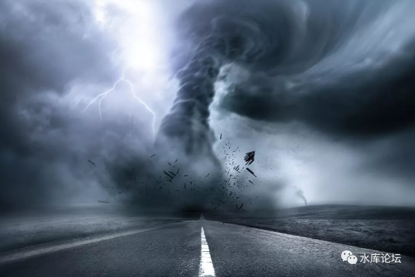
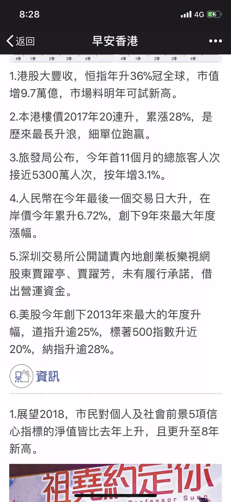
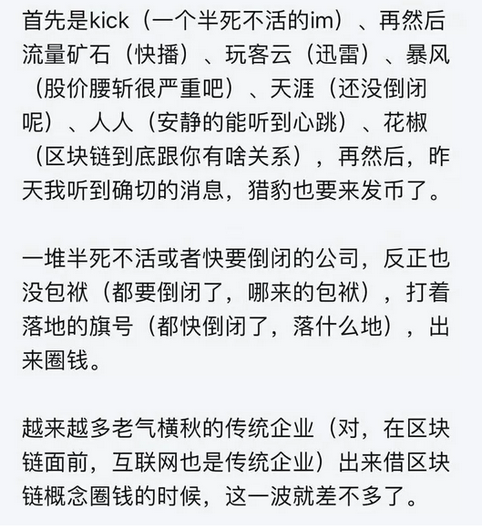
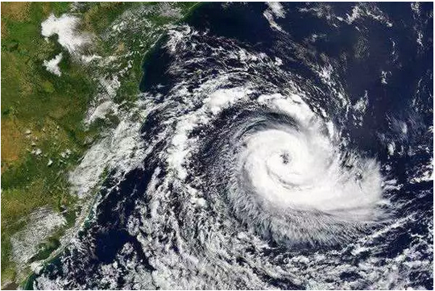
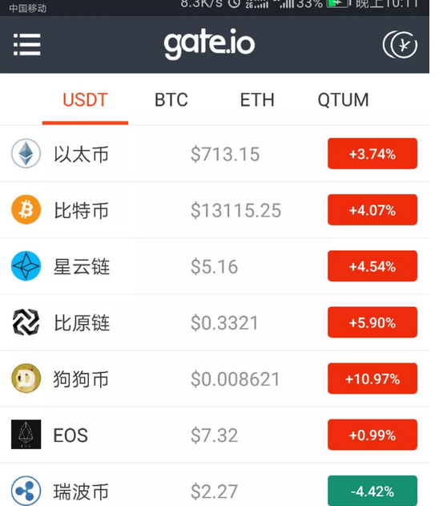
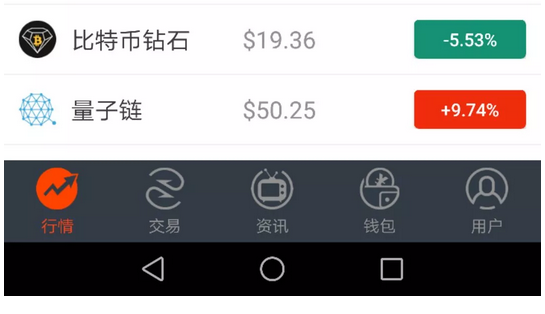
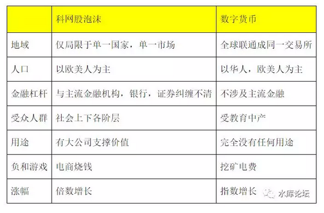

# 新一轮大型金融风暴酝酿中 \#D06

yevon\_ou [水库论坛](/) 2018-01-07

新一轮大型金融风暴酝酿中 ~\#D06~
================================

很多年以后，你会疑惑。

你怎么会花那么多钱，买了一个空纹。

 

 

一）不吉

 

2018.1.1，很遗憾新年的第一天，用这样的标题和题材。

 

在国际金融史上，08从来都是一个不吉利的数字。

1998年，发生了"亚洲金融风暴"。

2008年，著名的"次贷危机"。

1988年，咳咳，不提也罢。

 

对于这样10年一次的"金融风暴"，很多人紫微算恒，纷纷预测2018不吉。

但是更多的人，却是在思索。

"哪里，哪里会出问题"。

"我们整个的金融系统，哪儿环节最脆弱，最容易崩断"。

 

 

是房地产泡沫么。过去十六年，京沪楼市涨了十六倍。

巨大的财富效应，令人目眩。

同时，"仇家"也不少。分分钟都有人盼楼市破产。

如果"房地产崩盘"，场面肯定比今天的焰火晚会还要壮丽。大快人心。

是股市崩盘么。

前二次的"金融风暴"，都和股市有关。

股市尤其容易产生庞氏泡沫。一次是正股，一次是衍生品。

 

目前港股，美股，纳指，都已经创了新高。企业的股价，涨得比赢利基本面更快。

在审慎人士眼里，股指也是可疑的。 

如果让我猜的话，危险从来不在"看得见"的地方。

在人类栽过跟头，审慎谨慎，伤疤还痛的地方，更多并不是风险。

 

今天我们要说的"泡沫"，比股市，楼市，曾经发生过的泡沫。

还要多1000倍。

 

 

 

二）赌博

 

想起写这篇文章，是因为今天晚上看到了这样的报导。

+-----------------------------------------------------------------------+
| A：天涯钻二期一夜就卖完了，大家怎么看？                               |
|                                                                       |
| B：几年后象比特币一样啊                                               |
|                                                                       |
| C：看谁最后接盘                                                       |
|                                                                       |
| D：公司员工自娱自乐吧。谁会买这种？我是不信                           |
|                                                                       |
| E：这符合986的风格，游戏+社交+金融，BBS这种模式已经老得不成样子了，至少天涯还在努力尝试。 |
|                                                                       |
|                                                                       |
| A：不是自娱自乐。近千万真金白银啊。区块链概念。                       |
|                                                                       |
| F：互联网大佬最近都在转型区块链了，产品要跟上时代                     |
|                                                                       |
| G：2100W了，加起来。不过我认为是一群赌徒参加的恶炒。我买了100元的，算支持公司 |
|                                                                       |
|                                                                       |
| E：天涯最开始就是个股市论坛，现在看来似乎回到了七点。                 |
|                                                                       |
| G：我看了买的人，90%以上的销售额，80%以上的购买者，都是当天注册的。不是自己人。 |
|                                                                       |
|                                                                       |
| G：但这个类ICO，看后面政府监管会不会介入吧。                          |
|                                                                       |
| F：主要是被玩币的买去了。币现在是稀缺资源                             |
|                                                                       |
| G：昨天热卖的真正原因，全部是币圈的人在玩                             |
|                                                                       |
| F：其实这也可以理解为企业发行的新型股票，只是监管还没有正式出台。     |
|                                                                       |
| H：我是不是该去买一批，过几年后再回去看看                             |
+-----------------------------------------------------------------------+

 

很多人或许不明白，这里面的故事和道理，让我来解释一下。

 

2017.10月，中国政府宣布禁止一切BTC的交易，同时把"山寨币"宣定为违法。

已有的山寨币，停止运营。

已发行的山寨币，原额退回给申购人。

 

应该说，中央政府这个决策，是非常英明，而且及时的。

当时涉及的金额并不大，全中国的ICO市场，大约仅仅才20亿人民币左右。李笑来占据了最大的份额，卖了2亿美金。

 

 

ICO风波事件过去之后，监管层本以为高枕无忧了。

可是在夹缝中，还冒出来一颗小草。

迅雷公司的"迅雷币"。

 

迅雷币，对外宣传，并不是"代币"。

在对外的宣传中，它是用于购买迅雷公司服务的，可以用于加速网络下载，支付服务器报酬等应用。

 

而在实际操作中，迅雷币踏出最关键一步："证券化"。

迅雷币是可以交易的。

 

或者说，我付了钱，你可以把迅雷币划给我。

在之前，中国政府对所有"游戏代币"的要求，例如腾讯Q币，中国政府的要求是"单向交易"。

Q币可以交易，但只能卖回给腾讯。

玩家A和玩家B之间，是不可以Q币结算的。

 

一旦产生了交易，或者学术点，我们称之为"证券化"，于是天下大乱。

只要证券化，你就可以炒。

 

当敏感的庄家，嗅到了这里面的腥味之后，立刻就有大资金杀入。

迅雷币，从最初的0.1元一个，一小时之内涨到0.8元，然后再涨到8元/个。

此后，甚至更涨到了30元，100元一个。

 

可以当证券，有"涨幅"，于是就有了赚钱效应。

就会有更多的人炒。

中国散户，不在乎你是什么。只要你能涨。

迅雷币迅速地涨到了300元一个。

 

短短几周时间，数千倍令人目眩的涨幅。

而这一切的背后，只有二个字："投机"。

 

 

如果你关心社会新闻的话，你会发现迅雷"总部"，和迅雷"数字事业部"，前一阵子发生了扯皮。

因为总部的老人，忧心忡忡。非常担心触碰法律红线。

 

而对于数字事业部的人来说，则是一个月，赚到了迅雷以前十年的钱。

如此巨大利益在手，又怎么舍得服软。

 

 

好了，现在我们说回"天涯币"。

天涯币是什么。天涯币是第二个"迅雷币"。

 

明面上，天涯币是用于"购买"天涯社区的各种服务，是一种代币。

但其实资金"迅猛"扑进去，哪一个来为了在天涯BBS发帖的。

还不都是冲着涨停板，敢死队去的。

 

许你做初一，难道不许我做十五么。有样学样。

三）数字货币狂潮

 

我说这些例子的原因，是一个巨大的"副热带高气压中心"，俗称台风，正在逼近。

你可以看见气旋已经凝结，风力二十八级。现在还在南太平洋海域，预期十五天之后登陆。 

什么叫做泡沫，例如现在的BAT，阿里有接近四千亿美金市值，是中国市值最高的公司。超过了工商银行。

 

阿里是不是泡沫，不全是。

因为阿里本身还是有很多业务的，例如淘宝网，例如阿里影业，阿里飞猪。

股价不便宜，但不全是泡沫。

 

又譬如说沙特阿美。沙特阿美石油公司目前正谋求上市，将成为全世界最大的上市公司。业界估值在1.5万亿美元附近。

这是一笔天文数字，但其背后，是沙特阿拉伯的石油储备。

作为全世界最大的能源心脏，它也是值这笔钱的。

 

 

2001年的"科网股"泡沫为什么破灭，因为他们并没有创造价值。

当时，随便找一家公司，挂个".com"的招牌，股价就可以轻易地无限上涨。

boo.com，tom.com，Netscape.com，这些都曾经有过千亿美金市值。

而他们事后证明，什么业务也没有做出来过。

 

 

今天我们金融市场，最大的泡沫，最大的台风气旋是什么。

是数字货币泡沫

 

这个泡沫是如此巨大，如此目眩，花了短短一年的时间，就走完了别人五年的历程（暴涨30倍）。

 

而且和".com"公司一样，打开这要命的5700亿市值，你仔细观察里面。

5700亿美金市值，价值有什么。

什么也没有。 

四）第一代先驱

 

目前的"数字货币"市场，混淆了一个概念。

"区块链"是一个很有前途的技术，区块链的本质是"防伪技术"。第一次，人类构建了一个不怕篡改的金融系统。

 

但是，比特币≠区块链

 

就好比1995年，人们疯狂地讨论互联网。

互联网是一个很有前途的技术，也的确极大改变了人类社会。

但是Yahoo.com≠互联网。

 

1995年，人们疯狂地买入Yahoo，把雅虎的股价炒到无限高。

这是没有道理的。

他虽然是第一个互联网领军网站。但它不代表互联网。

（Yahoo.com最终倒闭）

 

事实也证明，".com"技术走到后来其实是一条死路。

互联网发展到今天，最大的商机，全部都基础于"移动互联网"。

移动互联网的入口，是App。

今天要是问你，微信的"网址"是多少。没有任何人答得上来的。

 

从2018年回过头来看，当年的".com"简直就是一场笑料。

当年所有的Dot Com公司，无论是上到Yahoo.com，中到Sina.com，Sohu.com

下到HongKong.com，China.com这种野鸡网站。

全部都是垃圾。

 

 

同样道理，如果你站在2035年之后，回过头来看。则今天所有的数字货币，无论是BTC，BCH，ETH，LTC，全部都是垃圾。

 

比特币虽然是"前驱"，是全世界第一个"区块链"应用。

但比特币的技术非常非常落后。

可以称为"第一代数字货币"。

 

 

人类的科学技术，是飞速向前发展的。可以预见到，20年以后，"区块链"普及应用时，所使用的，肯定不是这种原始而且简陋的"第一代软件"。

 

互联网1995年迄今，23年。互联网会永存。

但今天使用的，是微信，滴滴和头条。

这些东西，都和简陋的"www网站"没什么关联。

 

 

虽然币圈的人，念念叨叨"人类财富向虚拟货币转移"。

互联网这么惊天动地的大发明，耗时23年，目前改变世界多少。

即使要转移，也是转移到第三代，第四代数字技术上去。

而不是你简陋的第一代比特币。

 

1981年版的"鸡票"，现在都有1000W枚存世。永远不会再次印刷。

许多年前的价格，就要300元/枚

可是，又哪里有人给你出货呢。

 

 

五）酝酿中的雷暴

 

比特币一文不值。

真实价值： \$1.

 

可以把几兆位数码，激光雕刻在木雕上。旅游景点卖给游客。

人类未来要使用区块链"防伪网络"，绝不可能是比特币技术。而是第四代，第五代技术。.Com过气公司。

 

 

我们来看这个表格。相对于"数字货币泡沫"，我们更关心的是另一件事：

政府会不会救市

 

政府"救市"这件事，重要，很重要，很重要。

一旦救市，美联储一定进入大量的"降息"周期。

同时QE补药，泉头大放水。银根宽松。

地产必然暴涨。

 

我们纵观历史，每一次"金融危机"，"次贷危机"。

对于地产并不是坏事，反而是极大的利好。

因为败的是你的局。

而四万亿刺激，获利的是地产。

 

 

2018年，我们看得到一场"风暴"在酝酿。太平洋上空，二十八级台风。

-   山寨币风波越演越烈，更多人被卷进

-   比特币总市值越来越大，逐渐超出庄家掌控范围

-   每年19亿美金，电费净消耗

 

这些因素，共同决定了比特币泡沫，是肯定要破灭的。关于这点，我们是没有疑问的。

我们有疑问的是，政府会不会救市？

 

历年历次金融风暴，首先要看，有没有撼动"主流"金融机构。

中国政府的核心利益，银行是社会百业运转的枢纽。银行业绝不能垮台，或者混乱。

如果银行被深深牵扯进去，就一定要救市了。

 

另外一方面，OTCBTC其实是一个广泛的，全球性的场外交易市场。

"各人自扫门前雪"，既然不是中国，美国，一个国家的事。出手干预的情况就更少。

 

如果2018山寨币，跳楼了几十个人，政府不救市。

那么我们预想中的"四万亿"就不存在了。

 

 

第三个步骤，则是要看"受害人"。

在中国，最大的政治正确，最最强势的"政治团体"，其实是无耻老太。

80岁老太往办公地门口一趟。

拉个条幅，满地打滚，那真是让人拜服。

 

而"数字货币"庞氏骗局的受害者，绝大多数都是中产白领。

有头有脸，由自诩社会精英的程序猿为主。

他们会闹的概率，无限降低一百倍。

 

 

想到此处，我们实在对中国政府封禁国内一切ICO，钦佩敬佩得五体投地。

-   我都宣布这事是非法了。

-   你非得要削尖脑袋，偷渡出海，跑到外国交易所去买卖。

-   亏到了倾家荡产，你总不好意思找我中国政府，要求受害人赔偿了吧！

 

 

 

（yevon\_ou\@163.com，2017年12月31日夜）
