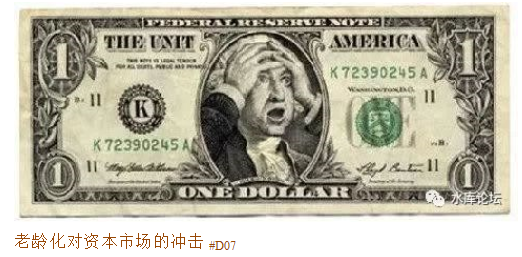
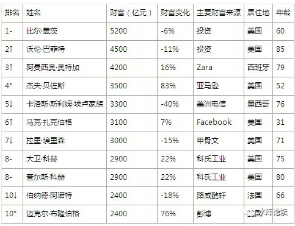
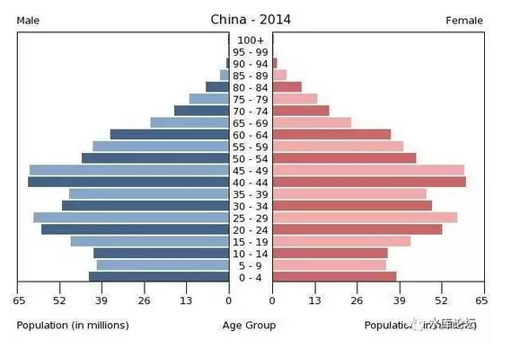

# 老龄化对资本市场的冲击 \#D07

yevon\_ou [水库论坛](/) 2018-02-07

\#1510，\#1500不群发。可在"菜单---最新五篇"获取。

 

对于资本市场而言，老龄化是个炸弹。

谁碰谁死。

 

 

一）宏观掠夺

 

今天，我们来讲一个"宏观掠夺"方面的概念。

 

如果你翻一下"社会学家"的呼吁，常常有左翼媒体大声疾呼，"我们的世界，怎么会变成这样子的"。

在今天整个人类世界，全球最富裕的10个人，大概相当于最穷的35%（20亿人）的全部财富总和。 

有学者大声质问，怎么回事。

如此巨大的财富，是怎样汇聚到少数人手中去的。

他们是通过何种方式，赚取这么多钱的。

这里面的秘密，叫做"宏观掠夺"。

 

 

"微观掠夺"，许多人都明白。你走在马路上，遇见一个小流氓，掏出弹簧刀。拿走你钱包里的2000元钱。

这是再明显不过的"抢劫罪"。每一个人都知道它是有害的，警察要管管。

 

但是我们整个社会的财富转移，最主要靠"宏观掠夺"。

几份文件，几项管制。

宏观掠夺牵涉到了数百亿，上万亿的财富"转移"。却只有相当智慧的人，才能看出其中的门道。

 

 

 

二）养老金系统

 

我们举一个最简单的例子："养老金"系统。

养老金系统，又称"养老保险"。取"社会保险"的蕴意。保险的纸面意义，乃互帮互助。

意外和概率的功效，社会平均之后，短命的帮助长寿的。

 

 

养老金系统，主要有二种模式。

1）个人账户

2）社会统筹。所有人按工资比例征税，但最终"社保"发放，却相差无几。

 

显然，第二种模式，社保更类似于一种"税收"。收入高的人是吃亏的。

全世界各国，有的采取第一种。有的采取第二种。中国目前采取第二种。

出于众所皆知的原因，俺们就不展开了。

 

 

骗局的核心在于，第一种模式，"个人账户"其实也是骗局吃亏的。

这就需要很深的理解和知识了。

 

 

我们以邻近的Hong Kong为例，香港在港督时代，是没有"养老金"制度的。

2000年12月1日，香港不顾财经界专家的重重反对，以微弱优势通过了"强积金"条例。

 

香港的强积金，从雇员的工资中扣除7%，雇主支付7%，合计14%。

这14%，是放在"个人账户"的。

个人可以指定账户里的资金，购买股票，债券，基金，理财产品。

自行选择心水股票，并负担股票涨跌风险。

 

 

可见，香港的"强积金"制度，比中国的"社保充公"，再交给腐败的老鼠仓基金经理运作，是先进许多倍的。

香港秉承了"自由主义"精神，投资者自负盈亏。在"强制储蓄"的同时，最大限度保持了股票市场的有效性。这点是值得学习的。

 

骗术在哪里呢："时间"。

美国人在1950s，"二战"结束后的一代人，被称为Baby boom.

大战结束了，活下来的人也觉得劫后余生。

既然历经生死，就不那么白左。肚子疼也不矫情，女人生育率大增。

Baby Boom十八年，生育率几乎翻了一倍。

 

 

但是金融市场是老练的，Baby Boom直接决定了"宏观模型"。

人类在22\~60岁的阶段，是劳动力。是净储蓄。是收入\>消费的阶段。

三十岁以后，踏上骨干岗位，更是一年可以赚几十万。

 

但人类同时也在为"退休"做准备。

65岁之后，人类开始取出积蓄。消费\>收入，你开始卖资产。

 

表现在金融市场。年龄高度关乎牛熊。

-   有几十年时间，你拼命地买进资产

-   有几十年时间，你拼命地卖出资产

 

 

以1955年为平均，到2000年时，Baby Boom 45岁。

2015年时，Baby Boom人均60岁。

 

整个1980\~2000年代，是美国股市的黄金年代。

"买盘踊跃"。

有太多30\~40岁的壮年人，他们正处于人生中最赚得动的时段。而他们需要为自己的退休生活做准备。

 

这大量的"买盘"，直接推高了美国股市，债市。

具体的表现是：

-   PE市盈率，平均增加一倍。

-   债券收益率，平均跌一半

不得了，不得了的事啊。这一倍一半，就是几十万亿美金啊！

 

 

但是，财富并没有增加。

公司，还是那个公司。

债券，还是这些利息。

从宏观的角度看，"实体经济"一分钱财富都没有增加。

 

当老人们开始抛售时，整个系统就会崩溃

 

2000年时，香港的财经界人士，激烈地反对"强积金"制度。

因为这很不公平。

香港，同样存在"人口柱形图"现象。

每一代人之间，Baby Boom的数目，并不是恒定的。人口潮来临：

 

-   当你买进资产时，所有人都在买进。价格特别高。

-   当你抛出资产时，所有人都在抛出。价格特别低。

 

 

金融市场的"回报"，在每一代人之间，都是不同的。

如果你有"强制储蓄"制度，则[人口少的那一代，就会特别受益]。

 

譬如2000年香港强制推行"强积金"时，立法会那群老头子，平均都有55\~60岁。手里全都囤积了一堆股票，就等着人来接盘。

当他们"立法"，要求所有人14%的工资，必须"强制储蓄"。这就相当于为股市圈进来了一大批买盘。

PCCW因此迎来了科网股泡沫。

 

你以为股票是市场价，其实在"大数据"眼里，你买进时就已经注定是盘剥。

 

 

老百姓想买股票，自己会权衡。价格合理，自然会"削减储蓄，增加投资"。

用得着你费心么。                                             

只有秉承奥派的自由，才能免于腐败。

这才叫"宏观掠夺"。

 

 

同样道理，目前"宏观模型"对于美国金融市场，是颇为悲观的。

因为Baby
Boom的一代人，就快要退休了。"退休"必然导致大规模"抛售"金融资产。

而"白左"们的孩子，生育率非常少。

 

下一代的白人，可能人口五成都不到。

考虑到平成废材一代人，失业率猛增，低欲望社会，圣母绿教泛滥。

"接盘侠"必然更加稀少。

  

财富并不守恒。

一张一弛，数十万亿的"宏观掠夺"。

 

 

 

三）上海资产市场

 

"老龄化"是金融市场的大炸弹，谁碰谁死。

 

任何一个市场，进入"老龄化"。资产价格表现一定不会好。

最理想的市场，是只有年轻人，一个老人都没有。那就只有"净买盘"。

如果"可投资"资产再少一点，价格能飚上天价。

 

 

突然想写这个话题，是因为上月我回了一趟上海。和几个家庭吃了一顿饭。感觉糟糕透了。

 

当一桌十四个人，白发苍苍，鸡皮鹤发，全桌人中，颤巍巍70岁以上老人，居然有7人。

占人口50%以上。

 

哥哥一边吃着日本和牛，沾一块象拔蚌，一边默数；

"这位要卖房子"

"那位要卖房子"

"这二位也要卖房子"......

 

 

逻辑是非常清晰的。资产是体，现金是面。

所谓"资产价格"，其实是一体二面，镜子互为表里的关系。

 

当一个系统中，老人太多，资产太多。

"工薪"收入太少，年轻人太少，无资产者太少。

则这个系统，真是非常危险的。

 

 

"资产"有使用价值。但大家心知肚明的，"资产"有时候也会偏离使用价值，而获得额外的溢价。

同样一支股票，公司没变。但股价可以在10\~30倍PE之间反复挪动。

这是为什么，无非是"供求关系"改变。

 

在上海的内部，也是"分区"的。

有的区，老龄化更严重一点。有的区，人口结构更衰败一点。

当一个区全部都是六七十岁的老人，它就无可救药。

 

 

上海是没落贵族。我们对上海的评价，"十里洋场"尤在，但是人口的急剧恶化，令人担忧。

表现在微观市场，目前这几位老克勒，经济实力犹在。吃着1000元/人的和牛，平均都有1000W以上的人均存款。

在目前的阶段，这些法租界老贵族，依然有足够的现金和体面，维系他们的生活。

 

 

但是，目光深邃，远望千里。

上海"老龄化"的问题不解决，隐患丛生。"老人"意味着抛盘，老人越多，抛盘越重。

你如果没有工薪性收入，最终会全是抛盘。

尽管衰败还需要很多年。

 

 

哦，我不是说老贵族们要卖洋房。

我的意思是，他们迟早要"卖资产"的。

即使要卖，也是按照股票\-\--字画\-\--房产的顺序，对不对。

 

 

 

（yevon\_ou\@163.com，2018年1月23日暮）
