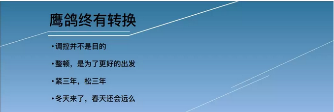

# 未来二年中国楼市整体判断\#D12
-----------------------------

yevon\_ou [[水库论坛]](/) 2018-08-27

**未来二年中国楼市整体判断 ~\#D12~**

 

根据8.26《功夫财经·炼金之夜》发言稿整理而成。有删减

 

各位功夫财经的朋友们，大家好。我是yevon\_ou。

很高兴大家今天来到《功夫财经·炼金之夜》，由我主讲第一讲。我今天的主题是《未来二年中国楼市整体判断》

 

首先，我们要用一个字，来形容中国目前的资产市场： 

"冬"，冬天的冬。

 

毫无疑问，目前中国的财经市场，正处于寒冷的冬天。凛冬将至，无论股票，债券，汇率，p2p，币圈，中小企业......放眼望去，几乎所有的金融大类别，日子都不怎么好过。Winter
is coming。

 

分析当前的金融市场，有一个词，是无论如何绕不过去的。那就是"鹰派"。

鹰派是财经监管的强硬派。其主要主张是：

-   收紧银根

-   严格监管

-   提高门槛

-   拒绝救济

 

在"鹰派"的主导下，市场资金利率是大大提高了。企业更加难以获得"现金"。

我们的股市跌跌不休。而且最重要的是："拒绝救济"。

政府会宁可看着股市下跌，在座各位的金融财产大幅缩水，也不出手救市。 

从经济学理论上讲，鹰派是不是故意和各位的"钱袋子"过不去呢？不是的。

 

理论上"鹰派"对于整个国家，是非常非常有益的。在整个财经周期中，也是必需的。 

-   减少投机者

-   减少食利者

-   压缩泡沫

-   勤练内功

 

当经济十分旺盛时，会产生大量的"投机者"。

譬如我们的花荣老师，算是股市"元老级大神"了。

大家购买了花荣老师《功夫财经App》的课程，功力大涨，股市牛市中，轻易就可以赚很多钱。

 

问题是，如果股市赚钱太容易的话，那还有谁肯认真工作呢？

 

如果楼市的价格高度确定，只涨不跌。则你只需要"买入"资产，就可以坐享资产升值。

如果我们整个社会"食利者"太多。那还有谁愿意辛勤工作呢？

 

 

这时候，就需要"鹰派"出场了。

"鹰派"的作用，是去除我们整个经济体系中的泡沫。

对一些"跟风投机"的小散，把他们扫扫出去，弄得破产。

 

这样，只剩下"最优质""最有效率"的企业和机构活下来。使得我们整个社会都更有秩序，强身健体。

 

好了，现在来到一个很有趣的话题："铁打的泡沫"。

 

"水库论坛"是讲房地产的。我在这一行，从业已经16年。

从我们有记忆起，谈论房地产，从来不是三个字"房地产"。

而是五个字："房地产泡沫"。

 

谈论房地产，几乎所有的媒体，评论小编，大伙众口一词"房地产泡沫，什么时候破灭"。

这搞得我们十分之郁闷。因为我们渐渐发现，这简直是一个"铁打的泡沫"。

 

"鹰派"统领。在全国范围之内，收缩银根，凛冬将至。

 

可是我们发现，被喊得"最凶"的房地产，在严冬之中，并没有陨落。

相反的，一些"寄予厚望"的投资产品，却露出了原形。

-   股市崩了

-   汇市6.84了

-   p2p崩了

-   币圈暴跌了

-   地方债危险了

-   中小企业也不滋润

 

昔日最口诛笔伐的房地产，却依然健康活得很好。 

 

房地产不仅仅是"铁打的泡沫"，如果我们细分，把市场分割来看；

 

在如此寒冷的冬天，甚至还有部分城市房地产，"升值"很不错。带来了可观的收益。

如图。我们把房地产分为"高价区，中价区，低价区"。

-   高价区，主要是北京上海。在"严控"的调控态势下，北上房产呈现小幅阴跌的态势。

-   中价区，武汉杭州成都郑州。这一批城市呈现"持稳"的态势。

-   低价区，主要指单价还在10000元左右，甚至不足万元的城市。主要是重庆，沈阳。

 

在过去一年中，"重庆，沈阳"的表现非常好。也给水库网友带来了丰厚的回报。

我们持续看好这二座城市的发展潜力。并预期未来一二年内，依然可以保持旺盛的势头。

 

 

目前，北京的房价100000/m，沈阳的房价，以水库关注的"恒大雅苑""恒大名都""恒大左岸"等项目而言，价位仅仅才8200\~8500.

也就是说，一套北京的老房子，可以换12套沈阳一手新房。

 

近期，北京\--山海关\--沈阳的高铁即将通车。

"北京\--沈阳"的通勤时间，将由原先的4.5小时，压缩到2.5小时左右。

这不仅将极大地压缩沈阳的心理距离。而且也方便了商贸往来。

 

更重要的是，随着"北京\--沈阳"的关系愈发紧密，我们有希望调低沈阳的"法制成本"。

阳光之下，一切阴影无所适从。如果沈阳的"法制成本"可以向北京靠拢的话，对于东三省经济，将会是一个巨大的利好。也会促进房价回归。

 

过去，因为北京"限购"。大量的购买力，被逼去了"环京"。

霸州，涿州，固安，香河，这些县市并没有大型的产业，也没有人口积聚。连摩天大楼都没有。

 

最佳环京城市，其实是沈阳。

沈阳才是环京之洼地啊。

言归正传，我们继续来看《未来二年的地产整体判断》。

今天的第二个关键字，是"春"。

 

冬天来了，春天还会远么。

鹰派之后，"鸽派"可冀。 

首先我们看到，"鹰派"并不是和各位的"钱袋子"过不去。

"调控"并不是目的。国家并不希望把各项金融资产打下去。

 

"调控"仅仅是一种手段，把经济体中，不合理的泡沫挤掉。

整顿，是为了更好的出发。

鹰三年，鸽三年，鹰鸽是不停地转换的。冬天哪怕再漫长，春天也会来临。

 

当春季来临，万物复苏之际，谁会收益？

 

无论直接、间接地放松，

地产都是受益者。

 

为什么，因为地产是"铁打的泡沫"。

 

虽然大家嘴上喊得凶，但是事实证明，"真金白银"拿钱出来考验的时候。

-   人们依然选择信赖房产，而不是囤积股票。

-   如果有更多的资金，继续买楼多过买股。

 

所以，地产在下一轮"经济宽松期"，复苏是大概率事件。涨幅也会更快。

 

还没有建仓的，抓紧了

 

大家都在盼"鹰鸽转换"。盼望着"紧缩"政策尽快过去，下一轮"刺激"经济政策尽早出台。

 

那么，"鹰鸽转换"大致会发生在哪一年？

我们今天演讲的主题稿是："未来二年地产整体判断"。因此我们回答说："二年"。

 

 

"嘘\~\~"台下嘘声一片。观众们纷纷表示不满意。

烂番茄，臭鸡蛋，空矿泉水瓶，可以扔上来了。

 

"老师，您净忽悠我们二年"。

"长二年，短二年，人生有多少个二年"。

"更精确一点行不行，更早一点行不行"。

 

好了，我们来看PPT： 

"一年"，一年可不可以？

答案是：有一定的希望，但还要看几个具体细节。

 

为了解释这个问题，我们首先看一些新闻。 

《[["史诗级"土拍黄了！这个省会8块地想卖130亿，结果1分钱没收到]](https://mp.weixin.qq.com/s?__biz=ODYzMzExMzQx&mid=2652745652&idx=1&sn=91d7fe90f0a76ac80dea6f10e25c58c8&scene=21#wechat_redirect)》

 

8月10日，山西省会太原，举办了8块土地的大型拍卖。

结果非常地出人意外。8块土地全部流派，一分钱也没有成交。

 

这条新闻，虽然在鲁罗大众中很少关注。

但却是对整个地产圈地震。 

过去的一二年中，"北上津"等城市，房价之所以可以被压制，是因为政府实施了"限价"。

 

南四环的金茂府，本来想申报卖12W，结果也仅仅批核了8W元。一些边角料甚至只有七字头。

一手卖便宜，压制着二手也涨不高。

 

"羊毛出在谁身上"？

购房者占了这么大的便宜，每平米-50000元。

2018年房价不太贵的代价，KFS被"转移支付"了几千亿。

 

但人都是很聪明的。"千做万做，亏本生意不做"。

你这回坑了KFS"限价"。下回人家就不和你玩了。

 

"限价"的直接后果，政俯信誉破产。以后"土地"就卖不动了。

天底下岂有只降房价，不降地价的道理。

 

 

我们看回这张表格。最初的时候，是剥削KFS，不为所动。

第二步，是剥削二手房房东，不为所动。

第三部，如果"限价"政策长期执行，则意味着土拍市场极度萧条，地卖不出去了

 

这就触犯了"地方政府"的利益。地方政府急了。

而不卖地是万万不可的。几十万张嘴等着吃饭呢。

 

"限价"政策，不可能长期执行。

 

总结一下，"限价"并不是长效机制。

真正的"长效机制"，有且仅有一种，就是"大规模增加土地供应"。

 

我们对于"限价"政策的预估，寿命仅仅只有一年。 

最新一轮的"调控"，之所以显得房价涨不快。

是因为用行政手段"限价"，强制性地把几千亿KFS资产，分给了购房民众。

 

但是这种"行政调控"是不持久的。

KFS感受不到"契约法制"精神，以后就不会拿地。大规模土地流拍，只会越来越频繁。

 

 

"限价"只会导致中长期的供应，越发减少。

楼市存在"补涨"行情。

关注地产，加仓地产，从今天开始。

 

最后，我们花点时间，介绍一下"水库论坛"目前正在关注的团购项目。

 

许老板正在冲击"中国首富"。

为了刷出销售额业绩，"恒大"集团发疯一样的肆意扩张。攻城掠池。

 

相应的，"恒大"的资金链，也是非常紧的。

有着比较大的"砍价空间"。

 

 

沈阳本身的基本面不错。东三省绝对的Top 1城市。

价格很低，足够安全。法制也有望改善。

 

目前水库和"恒大"系谈的三个团购项目，单价仅在8200\~8500左右。且成功砍价：

-   按二年分批，逐渐支付房款。好处是不限购。

-   或：一次性全款，额外拿个折扣

-   或：交六个月社保，满足限购要求。

 

单价8000多，"恒大"品牌，有地铁，有学区，配套成熟。

沈阳当地全套团队，地接辅助您完成交易手续。

专享无理由退房服务。

 

 

如果你感兴趣的话，可以加助理微信，深入了解一下。

  -----------------------------------
  
  -----------------------------------

 

 

 

（yevon\_ou\@163.com，2018年8月27日卯）
