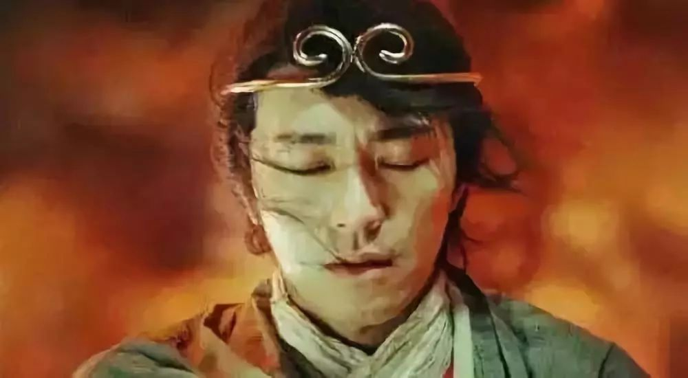
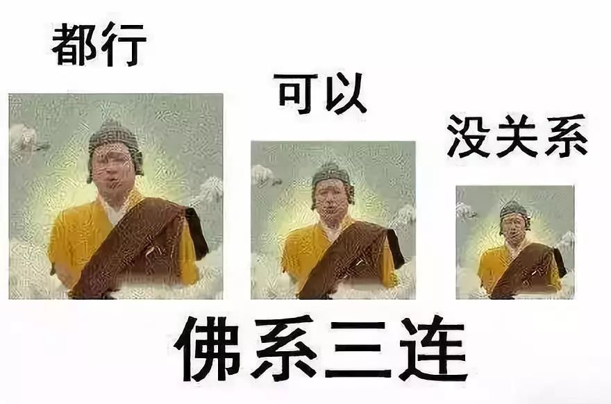
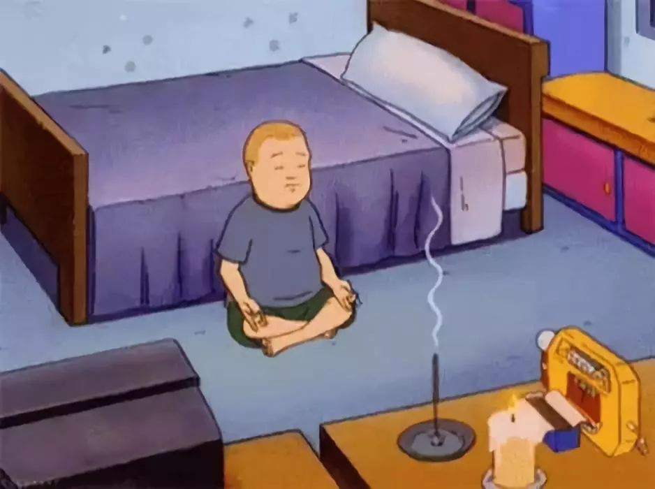
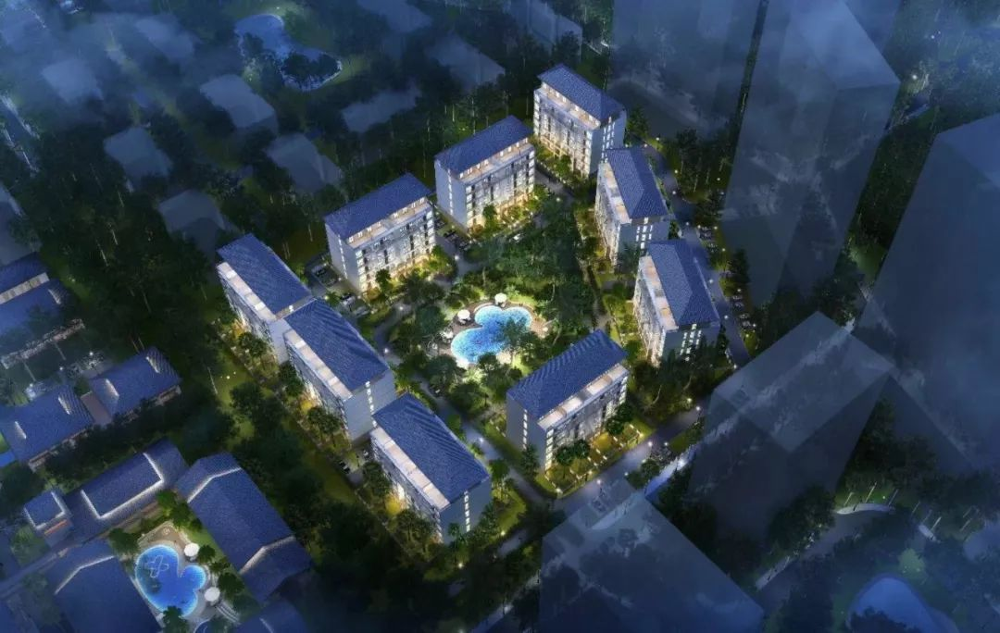
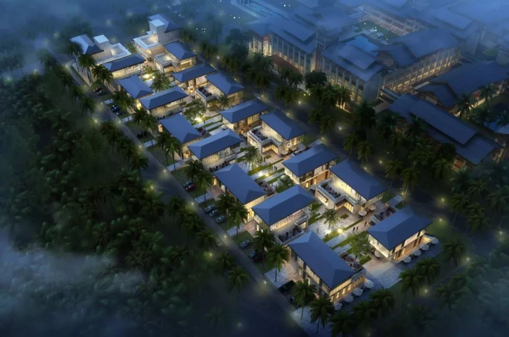
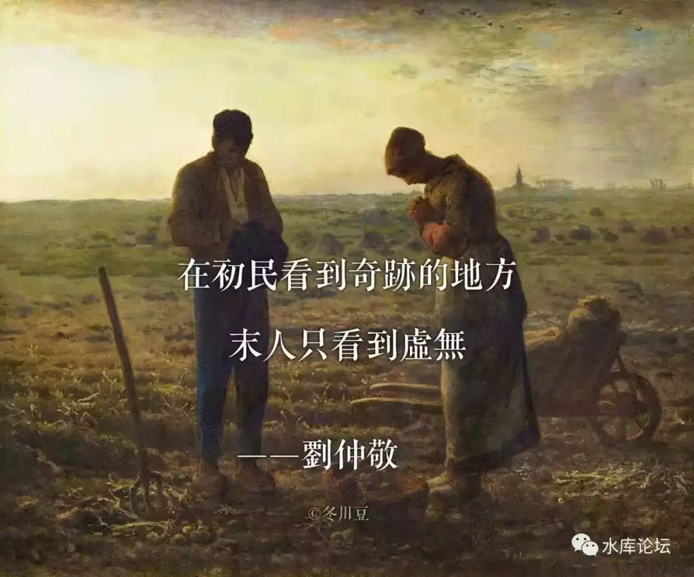

# 佛系少年还俗记 \#D14

yevon\_ou [水库线下](/) 2018-12-06

**佛系少年还俗记 ~\#D14~**

 

 

 

一）佛系

 

身为父母，有时候看着我的小孩，常常思考一个问题。

"教育孩子，最怕的是什么"。

"怎么样的孩子，这辈子算是毁了。朽木不可雕也"。

 

这个问题我反反复复想了很久，从最笨的，最贪婪的，最自私的，最不会写作业的......

俺可是有大神通的。小孩子再皮，再狡诈，再多的心眼，在成年人眼中，也翻不出五指山。

 

就象是谢烟客琢石中玉

"琢琢琢琢"迟早把你打磨得求死不能。

 

 

 

想来想去，我沉思思考很久。只有一种情况，是我无能为力的。即使以我的智慧，资源，财富，也无法挽回的孩子恶习。沉沦到底：

 

佛系，只有佛系是无可救药的

什么是佛系。佛系就是"低欲望社会"。就是没有欲望。

"呵呵，可以，没问题"。

 

你让他做作业吧，不做。

你让他找进修吧，不读。

你让他找工作吧，不干。

每天回家，把耳机往耳朵上一套，一个人躲进房间听音乐，打电动。

你即使把他电脑砸了，他也无所谓。

 

 

我从来不怕"小孩子"有欲望。有欲望没问题，有欲望的最好控制。

例如小朋友想看电影小马宝莉，没问题呀。你把作业做完。

作业做完，才可以吃糖果零食。

 

例如小朋友想去越野探险。没问题啊，你先考上大学。

考进北清复交的话，奖励一辆G55.

 

人只要有了欲望，他就有了漏洞。

在高手眼里看来，处处都是独孤九剑。

有欲望的人，如果再加以"理性"，可以谈交易条件。这简直就是世上最好的合作伙伴了。

 

 

真正令人抓狂的，是没有欲望。而且这个趋势，已经在社会和人群中蔓延开来了。

 

例如70后很多都是"奋斗逼"。公司用一个胡萝卜"升职加薪"吊住他们。

你想做高管么，你想买房子么。

只有在组织中唯唯诺诺，拍老板马匹，老板才会提拔你。你才会有光明的未来。

 

90后拍拍屁股，立马辞职走人。

 

90后直接甩手走人。什么996加班，不存在的！

你语重心长地和他说，"年轻人，要为未来而奋斗"。

人家直接搁挑子回家。戴个耳机，开始听音乐。宅在家里，每天吃二顿饭，生活简简单单，挺好的。

 

 

你说"买房子"吧。买房子这么重要的事，几乎每二三年，就是新一轮的价。

"年初不买房，一年又白忙"。

你把嘴唇都说烂掉了，论早奋斗的重要性。

可是人家只想住"棚户草屋"呢。他不想改善住宅，老子不买还不行么。

 

真正令人畏惧的，是不和你玩。

不玩就没有损失，也不会中你的剥削。

无欲，佛系就是无敌

 

 

 

 

二）国家和事业

 

如果把"佛系"的概念，推广到一个国家，或者公司事业时。

有时候我们会感到深深的无力感。

 

 

例如，前一阵子俺们的老大哥"乌鸦"，去USA逛了一圈回来了。

问他，对亚美利坚的感受如何，他摇头说"美国没救了"。

何出此言呢。因为美国人犯了一个最重的罪：藐视金钱

 

 

以前，美利坚是一个"金钱至上"的社会。

门童打赏二美金，他就会殷勤地帮你搬箱子。

打赏十美金，他就愿意帮你烫衣服。

打赏五十美金的话，哪怕远隔六个街区的古董雪茄，他也愿意冒雨跑一趟，帮你买回来。

 

 

但是现在的美国，"金钱"不那么好使了。

最简单的一点，"为了钱"而嫁人，这样的现象几乎绝迹了。拜金女郎濒危灭绝了。大伙都觉得日子过得很好，大富翁也没什么羡慕的。

 

再譬如说，"大企业家"亿万富翁，商界领袖，从来没象现在这样，缺乏社会地位过。

美国真正的明星，青年人的偶像，是篮球明星，音乐，LGBT人权斗士。

你细心耐心地花几十年，经营一盘生意。得到的不是别人尊敬，而是老古董般的嘲笑。

 

 

第三层面，"精英化"似乎也停止了。

在大公司里面，野心勃勃往上爬，排挤掉同僚和竞争对手，类似于"纸牌屋"的雄性男性，正在变得越来越少。

美国人普遍地认同"家庭和娱乐"更重要。放弃高级经理的职位，园丁烤咖啡炉，不再是一种羞耻，几十万美金高薪，似乎也并不值得追求。

 

几件事凑在一起呢，美国快完蛋了！

 

 

 

三）低欲望社会

 

"低欲望"社会是一种病，它会传染。所到之处，生产力被破坏得一塌糊涂。

 

-   日本是第一个牺牲者。

-   美国是第二个牺牲者。

-   欧洲是第三个牺牲者，尤其是法国。

-   中国也非常危险，深受恐吓。

 

 

水库的口号，是"赚钱的秘笈"。

我们整理出了一套办法，只要依照心法修炼，再加上一段时间的"负现金/负现金流"筋骨煎熬。

纸币通胀是大趋势，放水也是大趋势。总能凑上一波洪水行情，净资产便是翻翻。

  

但是我们在传播"水库手法"的同时，尤其是最近几年，我们越发地感受到，升阶的困难。

-   并不是赚钱更难了

-   而是想发财的人更少了。

 

你跟他说，看房二百套。他抬头"哦"地一声，面无表情继续低下头刷抖音。

你说要抢笋盘，机会难得。他懒洋洋地回复你"我觉得少赚点钱也挺好的，我们真的需要那么多钱吗"。

你说我们要象打鸡血一样，负重前行连续2N，10N。回头一看，跟随水库的信徒已经越来越少。

 

 

有时候我在想，不是我们的"手法"赚不到钱了。市场上处处都是商机，不乏四十年前的深圳，百废待兴的潜力。

我们真正缺乏的，是"金钱的魅力降低了"。

 

现在的人，不想赚钱了，不想发财了。

这个真是要命了！

 

 

如果我的孩子，将来沾染了"佛系传染病"。生儿如羊，不如生儿如狼。

软绵绵地象个绵羊一样，没有任何欲望，没有任何追求。

这才是五指山都没办法的事。

 

 

 

四）低欲望社会

 

这次水库在"西港"拿了一块地。这块地很好，价格也很便宜。

我们的心里面，象野草丛生一般，火辣辣地怎么都燃烧不满。

 

最重要的是，这是中国人少数机会，可以拿到大片的建住宅土地。

中国的地价多贵啊，贵到了吓死人。

京沪一片立锥之地，就要数百万人民币。

 

一亩地是667平米。而在西港这个项目中，按照目前批发价，你可以轻松购买20亩土地。

盖房子，可以盖一整幢楼。却只要京沪一套三房的价格。

每个人，都能圆KFS的梦。

 

不要去东南亚买房，买房都是坑子。

你要买地。

水库推荐的是买地。买地才是良心投资。回报率远远高于买房。

 

 

在我的设想中，如果我有20亩土地，首先我会拿15亩出来。进行商业开发。

  }
  ------------------------------------------------------------------------------------------------------------------------------------------------------------------------------------------------------------------------------------------------------------------------- --------------------------------------------------------------------------------------------------------------------------------------------------------------------------------------------------------------------------------------------------------------------------
  }

这些炫目的土建和设计，全部都可以外包。

有专业的施工队，设计院。而且都不贵。

 

 

剩下的5亩地，我想造一个宅子。 

《碧血剑》上册中，有一个章回，叫"逾墙搂处子"。

从那时起，哥哥对于中式大院，就有着深深的迷恋。

 

室，宅，院，府，城，宫。

我也想造一个这样的府，有大大的秋千。

秋千晃荡起来，可以遥远地看到墙外。伸出枝头的桃花和海棠花。

 

 

如果在中国，你可能永远没这样的机会。

中国的房子多贵啊，中国的土地多贵啊！

而且你有钱，你也不敢这样造。

 

因为这样造宅子，"僭越"了。

你是什么身份，你也配住这样的房子。

如此"稀缺"梦幻中的城堡，不是工薪族守得住的。县衙恶狼无处不在。

 

 

但是在"西港"这个地方，童话中的梦想却是可以实现的。

 

"西港"这个城市，就象是80年代的深圳。

而我们，就象当年的港商，台商。

毫无疑问，这是水库最近二年，看到最最"眼前一亮"的项目。

 

整个项目唯一的风险是："佛系少年"。

 

也就是我们带着你发财，推着你共建美好梦宅。

而你却还在低头刷抖音。"呵呵，都行，无所谓"。

眼睁睁地看着商机，土地，财富溜走。

如果你佛系，无欲无求，藐视金钱，甘于贫寒。那我们就真的一点办法也没有了。

 

 

-   "水库论坛"在西港拿了很大一块地。

-   因为土地太庞大，消化不下。因此分售一部分给水库网友。

-   20亩起，价格\~真不贵

 

有意向者，请联系水库助理：ZM19654321，微信私聊。

 

 

（yevon\_ou\@163.com，2018年12月6日晨）
