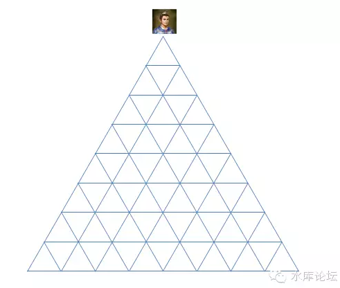
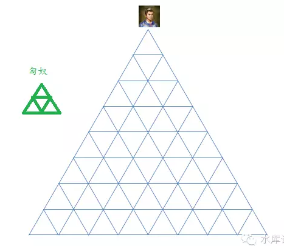
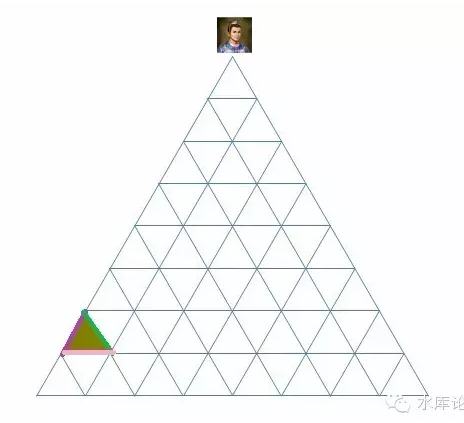
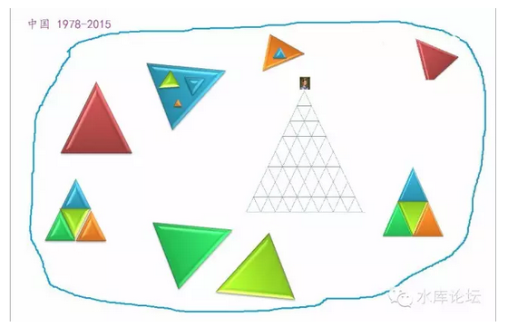

# 第五卷诸神的战争

一）神的战争

哪一种文明可以生存壮大，哪一种文明会消散灭亡。哪一个民族可以吃香喝辣，肆虐征服。哪一个民族只配做亡国奴，被人凌辱轮虐，奴隶作贱。

这是一个大问题，甚至是死生纠关的核心问题。

一个民族，从蛮荒中走来。

他首先选择一种秩序。然后采纳一种宗教，来为他的这个秩序"辩护"。并告诉人民日常的行为准则。

在宗教的基础上，再进一步演化出政府结构，商业结构，契约精神，民俗，道德，以及无数的历史故事。

西方学者在谈论历朝兴衰时，他们往往说，国力的起伏，往往对应着制度的好坏。优良的制度，才能让国家越来越强。所谓"制度经济学"。

而制度的选择，并不是天上掉下来的。而是全民族的共识。也就是说，有什么样的宗教观点，就会选择怎样的制度。是"民心所向"。所以西方学者说，所谓制度的竞争，其实是"意识形态"的竞争。其背后是神的影子。

在近代，我们可以清晰地看到，凡是信奉"基督教"的国家，都实现了繁荣和现代化。

而旧欧洲"天主教"国家，则发展速度远远慢于新教国家。无论西班牙还是巴西。

因为基督教信奉个人奋斗和思想解放。而天主教则是罗马教权和服从。论思想境界层次，基督教远远胜于天主教。

阿姨刘仲敬似乎是一个基督教徒。他唠唠叨叨地整天推销基督教，动不动就是"神的指示"。

居高临下，趾高气扬地说，仿佛Bible才是福音书。

于是一个中国人上去搧了二下："那为啥欧洲近代不行啦？"

二）稳定和效率

我们同意，神\-\--宗教\-\--制度\-\--国力，这个逻辑链。所谓文明的兴衰，无非诸神之战。

但我们不同意冬川豆的观点。也不认为基督教是最好的。

我们始终相信，在工业革命，在"欧洲五百年"兴起的背后，还有更深一层次的道理。更深层的规律，即第一卷所说的"社会组织秩序"。

接下来，我们将试图对几种文明秩序加以比较，看看哪个"神"更强力一点。

在这场比较中。我们有二个维度："稳定"和"效率"。

效率意味着国力。

一个越有效率的制度，意味着国力增长越快。如果运气不太坏的话，一般都能长成大帝国。

但是有些制度，并不能在原始社会使用。而一定要等科技树爬到一定高度。譬如"全民公决"这个大杀器。其出现的前提，是要有无线电。

稳定是另一个维度。但这里的"稳定"，指的并不是社会的稳定。而是统治者自己的利益。

"稳定"往往是和效率相冲突的。而历史上，统治者为了自己的权力宝座，一再扼杀社会的进步。此类事也是屡见不鲜的。譬如隔壁的三胖。

最简单的，从逻辑上讲，生产力导致生产关系重构。假如生产力极大发展，导致生产关系不适应了。

那统治者岂不是要从宝座上退下来。

可见，任何一个政权都是不欢迎社会变革，不欢迎社会进步的。

三）儒家的评价

由易而难。我们首先来看最熟悉的儒家。儒家是一个铁三角。

这个铁三角有几个问题：

1）他不能包容"体制外"的东西。

2）他不能市场化配置资源，效率很低。

我们先来看第一点。儒家是一个高纯度的，一插到底的铁三角。他不能包容任何杂物。

所谓"普天之下莫非王土，率土之滨莫非王臣"。

假设图中加入一个异体。譬如多个匈奴：

那就会产生非常严重的混乱：

-   匈奴遇见中原的官员，他等级应该如何排列。是比知县高，还是比知府低？

-   匈奴如果和中原发生纠纷。该如何处理。譬如边界茶马交易，一旦发生纠纷，该如何仲裁？

一般来说，汉人狡诈，做生意的结果，总是匈奴人吃亏的。所以匈奴人永远的不服气，总是哇呀呀地提着砍马刀跑过来。

这个时候，在儒学的框架内，他是完全无法解决"二个平等的政治实体"如何协商，这一高难度的课题的。

中国人一般采取的办法是：

1）把匈奴击垮，绿色三角不复存在。

2）将沟通来往降到最少。或仅限于少量的边境贸易。

读书人或许非常难以理解，中国为什么很喜欢搞"闭关锁国"的政策。

譬如宋代，就只有泉州作为通常口岸。

明清二代海禁，片帆不得入海。

晚清1839年前夕，只有广州作为通商口岸。而且只有广州"十三行"的子弟们被允许接触洋人。

闭关锁国，并不如后世所说的，为了逮捕明朝余孽。

闭关锁国，因为在朝廷士大夫的心目中。他们其实知道，"大食"商人，是一个伟大而且强大的文明。并不是中华文明的仆奴。

只不过朝廷上的大佬，实在没想好，该如何面对这一个"平起平坐的巨人"。

这事又不紧迫。

干脆将全国的对外接触，收缩到广州一个小口。一小批人感染外界受脓。

然后整个华夏帝国，就当这事没看见，自欺欺人好了。

这样的一套逻辑，在古代的几百年似乎是行之有效的。

可是等1840年英军炮舰最终敲开了沿海的城防，士大夫们就慌了。整个朝廷就混乱了。

因为从皇帝到馆阁，谁都没有经验该如何面对一个"平起平坐的巨人"。

而且这个巨人既不想毁灭你，你也无能毁灭他。他只想和你同时存在于这个世界上。

于是掀起了中国近代史的开始。

四）题外话

mao于1949年登基。在他可怜的脑子里，只受过为数不多的教育。

所以m并无力为中国构建一个新秩序。他所做的事情，只不过把从小生活的秩序，重新包装一下。

有人把m称为太祖。他的确是一个皇帝。而且整个共朝的组织架构，就是一个封建王朝。除了主席不能世袭，其他别无二样。

M的性格，心高气傲，刚硬强横。而且随着西方文明的传入，技术手段也获得了质的提升。

所以m构建了中国历史上前所未有的"体制内"。

随着"割资本主义尾巴"，m把全社会99.999%的行为，都归入体制内了。

其完成度，比所有王朝都高。

1971年m宣称"批林批孔"。其实真正懂儒学的人，一眼可以看出，这才是儒学在中国登峰造极的时刻。

因为全社会都在等级制内。

五）儒学的效率

评价一个秩序，至少有二个维度。"稳定"和"效率"。

儒家很稳定。可是效率就是渣。

1840年，当历史把中华民族重新抛入竞争中去，儒家的士大夫们，惊恐的发现自己制度就是渣。

1800-1840-1911，中国和西方列强的国力是不断拉开的。而不是越变越小。

1971也是中国最贫穷的岁月。

儒家的问题，是"资源无法配置"。

当代的经济学研究，基本已经接近终极定理。

所谓dT\>0，重商学派比重农学派要富裕四倍。即人类的财富中，25%由增加产量获得，75%由优化资源配置获得。

所以"优化资源配置"更重要。只要奉行市场经济，财富就会大量增加。如果不搞市场经济，就是隔壁三胖。

而儒家的结构，是和市场经济不兼容的。

如图，只要你集齐"紫色，绿色，粉色"三种资源。你就可以产生金矿。

可是在儒家的架构下，这三种资源的分布可能是：

你要的煤在山西，你要的铁在白云鄂博，你要的人在江西。

在"儒教"制度下，如果你想凑齐这三种资源。你需要发函给山西巡抚，江南西道和陕甘总督。

即使这些人不刁难你。这整整一圈的公文走下来。你也不用干活了。

儒家的制度产生于2500年前，当时的社会99%是种植业，识字人口不到0.1%，什么信息产业，O2O，P2P更是闻所未闻。

孔夫子设计的这套等级制，简单，清晰，文盲容易看懂。很适合当时的生产力水平。

可是今天，社会早已不是99%的种植业。原材料的自由配置，职业的自由配置，机器的自由配置，才是最最重要的事。

我们需要的是一种"适应"市场经济的制度。老朽的儒教被抛弃并不可惜。

"儒"是一种非常原始和低效的制度。应该被历史淘汰。

虽然我自己是儒学的大行家，可我依然不认为这2000年来无数的儒学典籍就此废纸，有什么可惜。

那些还在为儒学招魂，呼喊"中学西学各有千秋"的人，我不知道你们是何居心。

六）古代欧洲制度

古欧洲和中国是二个截然不同的文明。他们从"底层"规则开始就分道扬镳了。

AD476西罗马帝国灭亡之后的政治结构，大致可以用"封建制"来描述。

欧洲的国土，被划分为一个个大大小小的实体。伯爵领，子爵领，男爵领。他们彼此之间都是互不统属的个体。伯爵并不一定是Baron的上司。

在这种情况下，每一个封建领主Lord都可以自由选择自己的治理方案，经营耕耘自家的领地。所谓帮人打工三分力，维护自家的花园自然最为用心。

当二个政体彼此之间需要交流时，无论是贸易，修路，人口迁徙，海事商权，他们借助于一系列的"中间机构"。

于是就有了法庭，有了公民陪审团，有了海商法，有了契约，有了律师，有了保险，有了股份制。

欧洲人几乎是一开始就学会"打交道"的。欧洲文明从蒙昧期开始就有了法律和外交。

听起来很美好，是不是。可他还有一个至关重要的问题没有解决。

"仲裁"，如何解决仲裁争议。

如果是一个皮匠和一个裁缝之间，关于皮毛质量的争执，这件事情好办。他们可以召集大街上的缙绅，一起来做公平的公论。

实在不行，还能闹到领主老爷那里去。以老爷的意见为最终论断。

可是一个伯爵和一个侯爵起了争执，那该怎么办。

答案是没有办法，完全没有办法。

在欧洲这样"封封建"制度下，法皇德皇只不过是一个较大的地主。皇并不拥有额外的权利，也无法加以仲裁。

当伯爵领和侯爵领闹翻，侯爵领和公爵领闹翻，在他们之上再没有"更高"的权力。无法在三言二语之间摆平分配。

于是便只可以战争了。

你翻开欧洲史，那就是一部战争史。不仅仅欧洲人和异族打，法国人和德国打，而且德国内部也打。法国内乱内战更是没一刻停顿下来。

"三十年战争""百年战争"，欧洲的皇室债务可以达到岁入十倍以上。全都是被战争逼出来的。

如果说中国自AD618唐王朝建立以来，唐宋明清都是持续三四百年的大王朝，有长达200年以上的绝对和平。

而在欧洲历史中，你哪怕想找一段50年的和平都找不到。土地流淌尽了每一滴血。

"欧洲五百年"作者会说战争锻炼了欧洲人的战术精神，10倍岁入的债务，催生了欧洲最早的国债和金融市场。

这种凯恩斯主义的言论，还能更无耻一点么。

当人力物力全部都用于修碉堡，当年青的战士倒下在箭矢之下。这一些的人力物力，本来可以去干什么。

可以去开拓，可以去殖民，可以获得内陆十八省！

中华民族刚兴起的时候，只不过河南朝歌巴掌大的一块地方。此后欧洲人在打仗，中国人拓展到了山东。

欧洲人在打仗，中国人拓展到了湖北。

欧洲人在打仗，中国人拓展到了湖南。

欧洲人在打仗，中国人拓展到了广西。

欧洲人在打仗，中国人拓展到了云贵。

一般认为中华文明始发于商代，时间在BC1000年左右。也就是3000年左右历史。时间不仅远少于Babylon和埃及的6000年，哪怕和希腊文明比也短得多。

可是在同样的文明时间赛跑中，中国不仅弄出了15亿人口。而且"本土面积"也远比其他文明多得多。

为什么，因为你们在打仗的时候，中国人却在享有着长期的和平。

如果没有"工业革命"的大逆转的话，你可以看见，欧洲文明直到此处，他还是"全差"。

封建制的欧洲，既没有实现稳定，也没有实现效率。钱都花在战争上了。

想必你穷尽欧洲的古籍，一定可以翻到欧洲人慨叹："为何欧洲不能统一。宁为太平犬，不做乱世人"。

七）现代欧洲

随后，发生了工业革命。此时欧洲"小国林立"的政体，就显露优势了。

从"小国林立"，可以更容易地升级到"市场经济"。

其顺利和畅滑，简直好像CDMA升级到CDMA2000。

于是一个在2G时代不具竞争力的规则，就成了3G时代的王者。

我们一定要强调一点。欧洲的"独立政治实体"，是不断减少的。

当八世界查理曼大帝奠基欧洲时，全欧洲大约存在10000个政治实体。可是此后这个数量不断减少。

以后，虽然历代君王也封了很多"侯爵""伯爵"，可我们必需注意到，越到后期，这些爵位就越接近于"宫廷侯爵""宫廷伯爵"。

也就是说，你只在名义上拥有一个侯爵爵位和侯爵领。但事实上，你每天居住在首都和皇宫附近。

侯爵领对你来说只是一份固定的俸禄。你也完全不能和一位"实地侯爵"的滔天权势相比。

有一部分的史学家试图以"数学上统治"来加以解释。

当八世纪时，整个查理曼大帝的营帐里，差不多都是文盲。他们是优秀的军人，勇士，可是他们都不会数数。

统治一块巨大的领土，需要庞大的官僚机构。上下传递的公文，税赋和金币集中调拨到首都。

做这些事情，需要的是"文官"。需要的是大量受教育的知识分子。

而在当时欧洲，根本没有这样的识字阶层。

所以君王只能将领土细分。因为他管理不了。只能将领土分割成约200平方公里的一块一块（略小于宝山区）。这样一个骑士管一块土地。

听起来很不可思议是么。

1890年的时候，美国试图搞一次人口统计。政府的计划是每十年搞一次，这对政府运作，公共事务，军事警卫，都有非常大的价值。

可是底下政府办事人员汇报，"不行啊，老板，我们忙不过来"。

政府高官觉得很不可思议。就问，"你们现在在干什么"。

回答说："我们在做1880年的统计，5000万人口，哪怕仅仅是集中到系统里。到今天也没输入完成"。

于是美国政府招标企业家们设计一种机器。这种打孔的机器，至少能统计出最基本的人口数字，男女比例各多少。

这就是国际商用机器（IBM）的由来。

言归正传。欧洲的政治实体，一样是在不断减少的。

随着识字率的普及，乘法和代数的研究，政府的管理能力越来越强。

每一任君王，都试图将国土控制在他"能够控制"的最大范围。

所以小邦不断消灭。被吞并的多，而重新分封的少。

这样的局面，和我另一篇历史《三代之治》\[1\]局面何其相似。

如果一个政体，只有在原始社会，混沌未开的时候才能存在。此后不断被消灭，不断被自然界淘汰。

那我们就认为它是被淘汰的。

小国林立只有在欧洲混沌初开的时候才能存在。此后只有被消灭，再也不能复兴。

那我们就认为他是没有竞争力的。

而不是冬川豆老师所谓的"背弃了神的恩泽"。

欧洲的政治实体本身就在不断减少，由10000个减少到1860年普法战争之前的数百个。然后再减少到今天的约30个。

欧洲，正变得越来越象中国。竭力成为一个共同体国家，而不是相反。

然后，我们来框算一下，现代制度之下，欧洲的"效率"与"稳定"如何。

首先，欧洲是由图1，变成了图2：

德意志：

就贸易和安全来说，图2比图1还好。

因为图1中有十几个诸侯，每一个都有可能抢劫商队。而相比图2，在德国内部的国内贸易，既不要关税，被抢劫概率又低，商业是大大繁荣了。

我们不要忘了，铁血宰相俾斯麦花了一生心血所做的事，就是打通了德国的关税同盟。

通过大炮和宝剑，才强制使得德国凝聚成了一个整体。德国国内各邦的贸易，视同内贸，完全不用交关税。

这是多大的一件事啊，多不容易办成啊。为何在冬川豆老师的嘴里，就完全没有一点进步意义呢。

对于现代德国的仲裁机制呢。如何避免流血，战争，内战。

在一战之前，德国人用的是帝制。

在二战之后，德国人用的是民主制。"全民公决"。

正如我们所说的，全民公决和帝制，在政治伦理上是一样的，即作为"最终裁决者"。

我们重复要强调一点，民主制比儒制好。

1）在稳定方面，民主制一样很稳定。他的领导人虽然下台得比较快，可是下台后没有生命危险。

2）民主制创造财富效率远远超过儒制，因为市场经济。

八）太宗制

如果世界上只有二种制度的话，那么民主制远远超过儒制。

儒制的代表，是清朝的后70年，是隔壁金三胖，是太祖三十年。

和这些成绩相比，那民主制真是光辉灿烂。欧洲的政治家们得意地说：

"在1750\~1950年间，我们成功地实现了每年1%的增长"。

"在1950\~1980年间，我们成功地实现了每年2%的增长"。

如果不是一个怪胎的崛起，那估计全地球的人，都在唱民主的赞歌了。

1978年太宗开始改革开放，从此之后，中国把所有的经济学历史经验，全部都踩在了脚下。

我们看一下中国改革开放之后的政体。

"国有经济"这个等级制铁三角依然存在，但是多了很多独立实体"民营企业"。

这一段时间的中国，大致可以算一种混合型的"市场经济"。

既然是市场经济，这就令人奇怪了。为什么中国这种半吊子的"市场经济"，居然比全部市场经济的德国表现更好？

答案是：中国没有剥削。

什么，您再说一遍。

中国没有剥削，中国没有福利。

福利即剥削，剥削即福利。二者是同义词。

在研究各国各代的政体中，有一点是必须加以考虑的。那就是腐败。

我们之前贴的儒教图形，其实他是不对的。正确的应该修改。

如图，他的最上面一堆是灰色的。

"权利导致腐败，绝对的权力导致绝对的腐败"。这是诸多中国人都耳熟能详的一句话。

封建帝王有可能腐败。从而导致周围一个小圈子的无效能。他可以兴建华美的宫殿，酒池肉林，养妲己和妹喜，太监宦官一堆。

可是，在民主制度下，他同样有腐败。而且这腐败的图形是：

这个腐败的图像是惊人的。可以说，德意志36万平方公里，无一寸不腐败，无一地不腐败，深入骨髓，烂到根里。

"民主可以根治腐败"？哈哈哈。

我们看过大量柏杨的书籍，他对中国酱缸深恶痛绝。把希望全部寄托于民主制上。并一再强调"民主制下没有腐败"。

民主没有腐败？你以为部长收人家二瓶红酒50美金，黯然辞职，这就叫腐败？

太幼稚，拿衣服。

腐败是什么？

为什么腐败永远不能根除？

九) 腐败是什么

腐败是什么，99%的人没有想清楚。

水库论坛，有几篇定鼎之作。作为"体，用，术"的根本体纲。虽然水库是一个讲35岁亿万富翁的地方，对纯基础理论并没有太大的展开。

但其中一篇《政治学第一定律 \#70》还是希望各位有空看看。

人类社会想要获得物质财富，无非二种渠道：生产和抢劫。

99%人忽略了抢劫这件事。其实抢劫之道，是深埋在每一个人基因深处的。无论一个人受高等教育，无论一个人显露得彬彬君子，无论一个特蕾莎修女正义良善；抢劫之道，是深埋在你内心最最最深深深处的。

什么叫抢劫，你在马路上看见一个乞讨的小女孩，一把抢过她手里的馒头。

你去到草原上，拿走牧民们的羊羔，拿走农夫们的存粮，这叫抢劫。

我相信今时今日，在文明的今天，如此丧心病狂的事已经很少有人去做了。

可是，如果和你说，"让富人交45%的所得税，提高你的养老金"。你会不会毫不犹豫地投赞成票。

如果和你说，"医疗费不能涨价，挂号费比卖炊饼还便宜"。你会不会投赞成票。

如果和你说，"房东的房子不许卖给客户，只能**低价**卖给没房子的你"。你会不会投赞成欢呼票。

要知道，任何一项限购，都是抢劫。

因为你根本出不起价钱，或者你出的价钱，远远低于别人。所以才需要政府立法，强制把房子卖给你。

你这根本就是在"抢劫"售房房东。

任何一项政府立法，都是抢劫。只不过是"文"的抢劫。不象跑到草原上抱走牧民的小羊那么赤裸裸。

但金额和恶劣程度，只有更糟糕。

什么叫政治，政治就是[有组织的抢劫]。

政府并不是一个虚空中之物。政府是由一群群人组成的。所谓的"利益群体"。

每一项政策的出台，都是政治强势群体在抢劫政治弱势群体。

德国看似很文明，很民主。可是真正的"抢劫"，发生在德国下议院中。

随着一项又一项的政策出台。

"富人必须交45%所得税"。

"最低工资法"

"不得解雇法"

"金融业监管条例"

"第三方牌照监管条例"

"电信业牌照"

"广电总局关于不得播放穿越剧，不得安装电视盒子，小三不得有好下场的通知"。

"房产限购"

"限贷"

"强制性四险一金"

"IPO管理方法"

"沪港通监管方法"

这其中任何一项政策，其实都是抢劫。

一般是人为设置路障，从而给"查路障"的公务员，法学士，赚得盆满钵满。

德国为什么会腐败，堕落，崩坏。因为他的国家太腐败，邪恶太盛行，罪恶太慎重，人性太堕落。

整一群猪狗不如的索多玛神罚之处。

布尔费墨（中国）曾经说过。

独栽制好于民主制

君主制好于独栽制。

因为君主制，是一个家族的腐败，肆享抢劫权力。

独栽制，是一D腐败。

民主制，是全民腐败。

在美国，目前有9300万领食品券的垃圾黑鬼拉丁裔人群。

而中国，所谓腐败，只不过500个家庭。

无论如何，养活500个家庭，总要比养活93000000黑鬼拉丁裔要容易点。

当你兴高采烈地欢呼"加富人的税，填补穷人养老金"。

其实你根本没意识到，这是邪恶。是赤裸裸的抢劫。

是要遭天谴的。

德国人这种事干得多了，所以他们腐败低落。连1.2%的增长率都保持不了。

中国政体的真正优势，是"中国的政府无需对人民负责"。

你看清楚，是"无需"。

中国的政府不需要选票。中国的政客，无需要对选民负责。政党倨傲，不接受质责。

这样中国才能把"抢劫的权利"控制在500个家族手里。虽然这些家族非常非常的腐败，非常非常的堕落愚蠢。

但养活500家，至少比养活9300W黑人容易。

十）中国政体的不可持续性

魔鬼藏在每一个人的心里

\-\-\-\--yevon\_ou

魔鬼藏在每一个人的心里。不要否认，实事求是。

那些文质彬彬，师道尊严的中学教师们，其实心中充满了邪恶。只不过没有机会发泄出来。\[2\]

中国有七亿城市人口，约四亿中产阶级。当你看这一张张戴眼镜的斯文面孔，你以为这是"勤劳朴实的中国人民"，那你就大错特错了。

那是一群狼，恶狼。

每一个中国人，都时刻准备着，发出自己的吼声。要给教师加薪，要给公交车司机加薪，要给环卫工人加薪，要给交通警察加薪。要对内地三四线城市输血，要对低收入人群输血，要对孤寡老人输血，要对海军输血，要对边防战士输血，要对地质考察人员输血，要对林业工人输血，要对铁路工人输血............

这一张单子，可以无限制排下去。

中国目前，是强制以政治压制民意。但是你要知道，呼声是存在于每一个人心底的。如果有机会吼出来，几乎每一个人\~包括你爹，喝醉酒都会和你说他的政治主张。

你一定要记住，这些呼声，99.999%都是邪恶的。而不是正义的。

这些"民意"，99.999%都是邪恶的，而不是正义的。

99.999%的中国人，并没有如此崇高的精神。也没有深厚的学识。

他们所提出的，所诉求的，绝对不是"正义"，而是"特权"。

你爸喝醉酒提出的政治议案，绝对不会是追求社会公平。而是提高他这一个阶级的"利益"。譬如刘翔提出提高运动员待遇。

这绝对不是正义。而是抢劫。

全民民意，就是全民抢劫。天下大乱。

中国目前，是强制以政治压制民意。打个比方，就好比鸿钧炉压制着妖魔鬼怪。

但是，妖魔鬼怪总有一天会逃出来的。

魔鬼藏在每一个人的心里。每一个人都视图为自己争取更多的利益。99.999%的人，呼吁的是提高[本阶级]特权。

而没有多少中国人关心正义。

中国目前有一个强有力的政府。他强制压制着，压制着十亿人口心中的蠢蠢欲动。

为什么中国抢劫较少，频次较低，因为中国有抢劫权的仅限于500个家族。

而你掀开鸿钧炉，下面十亿张嘴巴，十亿双血红的眼睛，在血浓岩浆地狱中嚎叫着"我也要抢劫，给我抢劫的权力"。

这是极其可怕的一件事。压制导致愤怒。中国目前几乎每一方的政治势力都反对TG，这些人反对TG的主要原因，当然不是人类的文明与正义。而是愤怒"TG不与他们分享权力"。

中国人不憎恨特权，憎恨的是自己没有特权。

压制导致愤怒，压制得越久，全社会反对你的战线就越广泛。压强就越大。

魔鬼藏在每一个人心里，每一个人都有一颗渴望抢劫的心。所以[魔鬼永远无法被根除，抢劫永远无法被根除，腐败永远无法被根除]。

中国的崛起，得益于鸿钧炉对"妖魔鬼怪"的压制。而一旦高压锅开始漏气了，吃白食的人增加，中国效率速度就会极剧下降。

我们有幸身边有二个邻居。一个湾湾，印证了民主是全民腐败和混乱。

一个香港，当统治者试图分出一点权力分享时。就有了无数无数民粹苍蝇。

（未完待续）

\[1\]微信：水库论坛，编号\#F129

\[2\]参考阅读《你未必是人好,你只是没机会放荡》http://mp.weixin.qq.com/s?\_\_biz=MzA5MjEwMzAzOQ==&mid=209388475&idx=8&sn=ca1777896729cdcefec4bc430a46077b&scene=1&key=0acd51d81cb052bc41ae14cd4adfe04e7416b5c241db7a3a7282a896b3dbfbd5c56da70e345118c8f7511e72638b22e9&ascene=1&uin=NDkyMjg2OTM1&devicetype=webwx&version=70000001&pass\_ticket=z4NkI6Z5ZuhAkr2hh0MDpFnLIXDE0wrruCmJ%2FjX%2BX%2FuDwGh3IRbxL7wnl14fUxbi
