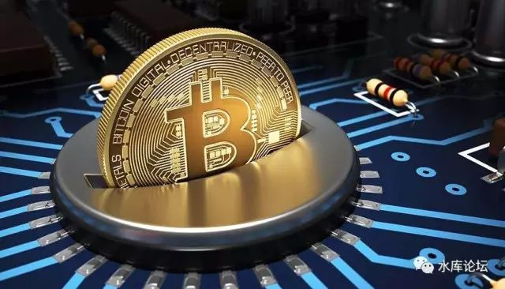
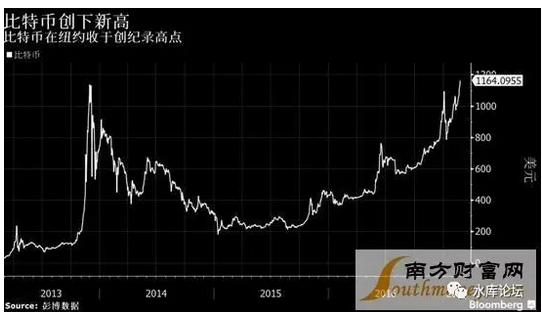
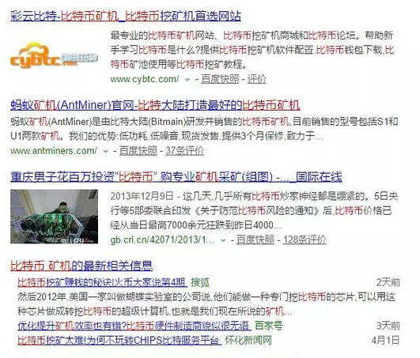
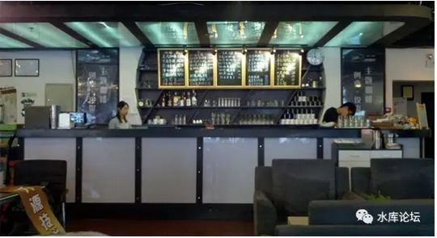
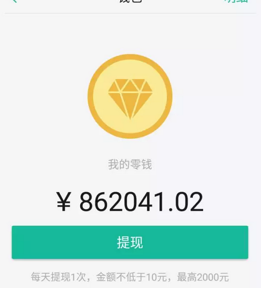

# 比特币值多少钱 \#F1000

原创： yevon\_ou [水库论坛](/)

**水库论坛**

微信号 Shuiku-net

功能介绍 科学尚未普及

2017-04-10

 比特币值多少钱 ~\#F1000~
============================================================================================================================================================================================================================================================================

 

本文根据2013.12.21《货币，铸币税及比特币》改写。有增删。[\[1\]]

 

 

比特币真实价值多少钱。

是象某些人说的，一文不值，纯粹彻底的庞氏骗局。

还是象某些人说，未来之星，明日希望之所在。

 

又或者是，你能不能给出Bitcon一个大致的估价。

哪怕说不出精确数值，能精确到数量级也好。

-   价值100\~1000元。

-   还是仅价值0.01\~0.1元。

 

目前国内对于比特币的分析，全部都是错误的。

 

 

 

一）山河血

 

首先我们回头看旧文《货币，铸币税及比特币》。

在旧文中，我们提出三个问题；

 

1）1937年国民党抗日，丢失一半国土，请问对货币有何影响。

2）1949年国民党退守台湾，仅剩一省之地。对货币有何影响

3）如果中国得到东海油田，对货币有何影响。

 

 

1937年抗日战争爆发。国军初战不利。连续丢失上海，南京等江南财赋之地。

大量的华夏衣冠，跟随国府内迁。直到建立西南联大，继续抗日。

 

请问，在丢失一半国土的情况下。你手中的"法币"购买力会如何变化。

假设日本人没有抢走你的"纸币"，常凯申也没有滥发纸币。

等你逃到西南时，你手里的100元，还是100元么。

 

 

答案是，哪怕常凯申不印钞。你的货币也贬值了。

大约还值原来的33元。

 

 

为什么呢。因为中国学生受的教育，是彻头彻尾的毒教育。

中国百姓理解的"货币学"，是彻头彻尾的误导。

中国教科书写的三大用途"价值尺度，交易媒介，财富储藏"，全部都是错误的。

 

 

纸币本身并没有价值。纸币印刷的100元，不代表它可以买100个苹果。

纸币的购买力，要视他背后的实物而定。

 

纸币更象是一种"酶"。投放在炉子里，促进交易反应的发生。

而"酶"需要投放多少克呢。取决于你交易量有多少。

 

 

所以当1937年，常凯申连续丢失掉平津，上海，南京，汉口等重大商贸中心城市之后。

"旧法币"可以应用的国土就非常少了。

如果你丢失2/3国土，你的"法币"就只剩下33元的购买力。

 

如果你31个省，输到最后，只剩下1个省逃命呢。

那你的货币，就只剩下3%的购买力。

 

 

 

二）铸币税

 

1937年，汪精卫出面组织伪政府。

伪政府做的第一件事，是宣布常凯申的"法币"在汪统区不可以使用。

而另行印发"伪币"。

 

请问，伪币的价值，利益，金铢该如何计算呢。

答案是，伪币可以在汪统区大约10个省交易，流通。

则伪币的"总市值"，大致就正比于这10个省。是10省商贸流通的一个比例函数。

 

 

从这里我们可以看出，一个国家，可以发行多少货币。其实是一个守恒量。

其总币值，正比于该国的GDP，或者正比于该国的商业GDP，若干倍数。

 

如果国土沦丧，"枪杆子"实际控制的地盘减少。则纸币对应的流通疆域立即缩小。

每一张纸币的含金量都下降。

 

 

所谓的"铸币税"，就是指枪杆子控制了几十万平方公里。

然后行政政权，一定会要求"辖区内"[发行自己的货币。而且只能够流通自己的货币。]

 

《中国人民银行法》第十六条规定，"中华人民共和国的法定货币是人民币"。

各位，凡是立为法律，都是大有深意。

每一句话，都有其背后重重叠叠的道理。

 

"人民币是唯一法定货币"，为什么要特意把这句话勾出来。

这保证了铸币税的唯一。

 

 

 

在罗湖，拱北都口岸。以前常常有港澳客人，吃一碗面，用港币付账。

此后，人民银行部门如临大敌。专门搞了几次专项排查行动。坚决制止此类行为。

 

为什么。吃一碗面几十元，为什么要如此大惊小怪。

问题就在于，"港币不能用于支付"。"人民币是中国境内唯一合法货币"。

货币的垄断和专一买卖，是一笔大生意。铸币税一定不能外流。

 

 

 

三）美利坚铸币税

 

说完了"每一个国家内政，都会制定自己的货币"，"铸币税是一种土地税"。

可是就全球范围，还有一样东西是管不了的。那就是"国际贸易"。

 

国际贸易用什么货币结算，这可是一笔大得漫天的利益啊。

一般而言，你可以按照1%来估算。

国际贸易，数以"十万亿美元"计算。用谁来结算，就是一笔巨款。

 

 

这个问题的答案，是ＵＳＤ．

美元如何成为霸权的，此事说来话长。布雷顿森林体系。

许多人都在喷美元的霸权地位，但是什么是"美元的霸权地位"，却含混说不清。

 

甚至上次吃饭还有一个小伙问我，"国际贸易结算都用USD，为什么美国就赚到实惠了呢"。

俺冷冷地瞅了他半响，"你做生意，会没有库存么"。

"你买卖东西，活期账户会没有余额么"。

"全世界的活期余额加起来呢，有多少钱"。

 

 

 

除了USD在"国际贸易"中的霸权外。

一些拉美小国，包括东南亚小国。因为其政治制度十分混乱，国内经济秩序一塌糊涂。

其地下经济，有大量的"美元结算"。

（你去缅甸，买串香蕉都用USD）

 

 

这种事，从字面上来讲，是被"缅甸政府"严令禁止的。

如果缅甸国内全部都用USD，相当于缅币没人使用。[\[2\]]

缅甸政府也就享受不到"滥发缅币"的好处。

 

 

但是，由于行政政府的管理不力。很多弱国，甚至连基层组织也拉不起来。

这笔钱就是流失掉了。

缅甸人用USD交易，"铸币税"就被美国人赚走了。

津巴布韦目前宣布7种外国货币，RMB也在其一。中国人表示欢迎。

 

 

 

四）比特币

 

好了，华丽丽的分割线。

\-\-\-\-\-\-\-\-\-\-\-\-\-\-\-\-\-\-\-\-\-\-\-\-\-\-\-\-\-\-\-\-\-\-\-\-\-\-\-\-\-\-\-\-\-\-\-\-\-\-\-\-\-\-\-\-\-\-\-\-\-\-- 

 

以上三个段落，都是《货币，铸币税及比特币》中的旧文。

大致讲述了"币值 = 货币使用范围 = 枪杆子控制范围"的道理。

 

 

常凯申如果抗战失利，31个省只剩下一个省。则他"发行的"货币就会无处可使用。形同废纸。

相反，1945年国军光复。"法币"使用的范围大大增加。则就会引发物资增加，通货紧缩。

 

 

 

而现在我们来看奇葩"比特币"。

比特币的走势，已经远远脱离了其创始人的初衷。远远脱离了其初始的目标。

 

比特币的创始人中本聪，其最初的设想，是想要设计一种货币"脱离中央政府的控制"。

-   比特币不会滥发纸币。

-   无法追踪

-   可以做到彻底匿名制。

 

全世界第一笔比特币的交易。是用10000比特币买了一个比萨。这笔钱，据说现已超过了\$10,000,000美元。

 

 

可是大家现在关心匿名消费么，不关心。

大家关心的，是这个：

 
又或者是这个：

 

 

 

你看一下周围，每一个人都在兴奋，热烈，血涌地讨论着；

-   "比特币跌破3000"

-   "比特币涨破5000"

-   "比特币冲破1000美金"

-   "比特币又创新高"

 

几乎每一个人，都在兴高采烈地商讨着Bitcon的走势。谈论着赚钱与波段。

 

面对这种情况，我只想大喝一声：

 

比特币今天可以买咖啡了么！

 

（全球第一家接受比特币的自动咖啡机。但问题是，没有散户持有比特币）[\[3\]]

当无数无数的人，热切讨论着"比特币"交易平台上，现在达到了多少价格。

涨跌起伏，扣人心弦。

 

我只想问你一句，比特币现在可以买比萨了么。

-   线下能支持比特币的商家有多少家

-   每年使用比特币交易结算，有多少金额

-   比特币有多少市值

 

 

目前，已挖矿的"比特币"，总市值已达到160亿美金。

可是，使用"比特币"交易结算的零售业行为。仍然无限接近于零。

 

 

 

比特币依然不能买比萨，买手机，买矿泉水。

由于比特币的创始人"中本聪"是一个隐形人。目前也没有任何机构，任何组织，在铺设比特币的"线下交易"。

 

你想象一下，Apple Pay舆论做得铺天盖地。挟果粉的脑残死忠。

到现在AP也不成气候。

而你的Bitcon Pay，要到什么时候才会有人使用。

 

 

要用蒋总统做比喻的话，目前就是常凯申手里只有一个省。

无钱无粮，GDP弱得可怜。

拿什么支持160亿美金的货币"总币值"。

 

 

一般而言，我们可以大致地取一个比例，1%

如果比特币市值160亿美金的话，那么比特币对应的这个生态圈"比特币帝国"；

所有以[比特币]交易结算的金额；

应该在16000亿美元左右。

 

每一年的买咖啡，买比萨，Amazon购物，地下市场买DVD，总交易金额16000亿美金左右。

 

请问，比特币所有的线下交易。现在有多少了。

比特币的真实价值应该是多少？

 

高估1000倍。

 

 

 

（yevon\_ou\@163.com，2017年4月10日午）

 

 

 

【公告】

 

昨天晚上手贱，发现腾讯出了一个"小密圈"。于是也建了一个。

到今天下午的结果：

 

我汗，擦擦擦。

问了下小密圈的CEO，大概目前算中国第一名了。

 

 

其实我也没想好"小密圈"是怎么用的。该如何经营。

但反正"Yevon\_ou出品，必属精品"。

良心出品，总是会对得起票价的。

 

 

按系统设定，最多可容纳1000名额。

精力有限，估计不会搞第二个圈了。

昨天晚上第一批1000元/年。

此后每增加50人，增加100元。目前是2500元/年。

 

有意者请扫码；

 

 

 

[\[1\]]《货币，铸币税及比特币》http://115.159.211.105/forum.php?mod=viewthread&tid=17963

[\[2\]] 1 USD=1350 MMK

[\[3\]]《深度介绍比特币-车库咖啡见闻》http://www.8btc.com/bitcoin-foundation
