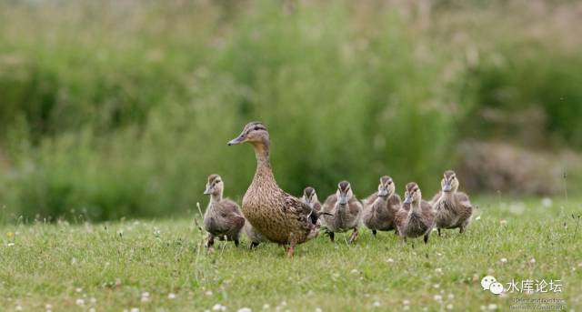
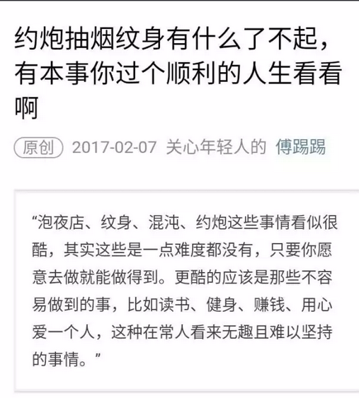

# 中国真的有那么强大么 \#F1010

原创： yevon\_ou [水库论坛](/)

**水库论坛**

微信号 Shuiku-net

功能介绍 科学尚未普及

2017-04-15

 中国真的有那么强大么 ~\#F1010~
=============================================================================================================================================================================================================================================================================

 

转当你放弃买房子，你会发现自己钱还很多；

当你放弃结婚，你会发现自己时间用不完；

当你放弃生小孩，你不只钱跟时间都很多，连健康都嫌多。

 

 

 

一）花钱

 

很多年以前，我就在思考一个问题。为什么我总是没有钱。

 

哦，我是说在游戏里。

采了很多矿。俺转手造了一个电厂，又造了一个雷达，最后还建了一个研究所。

坦克呢，没钱造。

 

不是说我没钱。而是说钱赚得很多，花得更快。

哪怕赚再多的晶石。游戏开局也是不够花的。有太多太多的建筑需要建造，有太多太多的科技需要升级。

 

 

但是，你不花钱可以么。象个守财奴老财一样，把所有的金币都攥在手里。

答案是不可以。

因为这些建筑，是你必须要造的。雷达，电厂，都是基地必不可少的物件。

你上手不升级，后期就被人暴打。

 

**所以，其实不是我的收入低，而是我的固定基础建设太大。**

 

 

同样道理，如果我们观察现在27岁的年轻人。我们发现，他们可以很清晰地分为二类人群。

-   一类潇洒得象神仙一样

-   一类穷得象狗一样

 
对于第一类的人，他们不是在珠穆朗玛峰，就是在南迦巴瓦峰。

戴着酷酷的太阳眼镜，和女驴客混帐。

 

他们的爱好，是摄影，音乐，诗和远方。

他们似乎有永远花不完的钱。

最重要的是，他们似乎有永远花不完的时间。

 

 

而第二类人，穷得象狗一样。

第二类人，关心的是北京五环外的房价，关心CPI指数，煎饼果子又涨了一元。

关心公司里的马屁精，白骨精。升职加薪斗黑锅。

 

对于第二类人，钱包永远是瘪的。

要吃饭，要还房贷。要抚养80岁的老娘，三岁的娃娃。

要买车，买尿布，买理财，买保险。支撑起一整个中产阶级的家庭。

 

 

对于第二类人群，什么"登山"，"骑行"，"西藏洗涤心灵"。

这么文青的事，早在上一个世代就已经扔到脑后了。

诗集，扉页蒙尘。许多年未曾打开。

理想，潜伏于心底。

 

**为什么，为什么，生活要过得如此苦瘪。**

**最奇特的是，这二类人，还有可能是同事。工资收入也差不多。**

** **

 

 

二）积累

 

转当你放弃买房子，你会发现自己钱还很多；

当你放弃结婚，你会发现自己时间用不完；

当你放弃生小孩，你不只钱跟时间都很多，连健康都嫌多。

 

 

二类人，哪怕他们是同事。收入也都是20000元/月。

第一类人，吃光用光花光，20000元/月纯消费。日子自然潇洒。

第二类人，供楼供车养小孩。10000元/月纯消费。当然苦瘪。

 

每月只花8000，6000的那些奇葩。

俺就暂先不提了。

 

 

钱去哪里了。供楼供车供学费，存钱定投养老金。

凡是[有积累]的日子，必然会过得更加痛苦。

 

 

天底下的事，一定要有经济学常识。

我常嘲笑冬川豆《阿姨学》狗屁不如。就是他根本不懂取舍的价值。

 

当你在玩的时候，别人在干什么。

当别人的爹在拼的时候，你爹在干什么。

当别人的爷爷在拼的时候，你的爷爷在干什么。

 

 

当我们仔细把这条"逻辑"链条细细研究下去，深入对比下去。才发现远不是这么一回事。

那些"活得象狗"一样的人，才是生存竞争的赢家。才是真正"酷"的人。

 

这个道理，就和我游戏开局"造电厂，造雷达"。

还是胡乱挥霍，浪费钱，原理是一样的。

 
 

那些看似很酷，看似很炫的事情。

其实一点难度也没有。

 

骑行西藏，诗和远方。已经越来越沦落为"职场失意者"的代名词。[\[1\]]

如果一个人辞职三个月，去追求"个人价值"。那么他几乎一定是露瑟屌丝。

 

（分享一篇非常好的文章。链接在这里：\[2\]）

 

 

三）中国的国力

 

如果说前二节，还仅仅是老生常谈。大家都知道的事。

那我们想问的，其实是第三节。

 

放大到一个国家的层面，少生孩子算什么！

 

 

众所周知，过去的40年，是改革开放的四十年。是中国飞速崛起的40年。

是中国国力急剧增长，社会积累急剧增长；

GDP飞速发展的四十年。

 

中国的GDP增速，长期保持在+8%以上。

四十年时候，从一个落后的农业国。一跃成为全球最大的工业基地。

 

这无疑是一件极其伟大的成就。也圆了鸦片战争之后，"中华民族的伟大复兴"九代人梦寐以求的追求。

 

 

 

可是，我们要接着问一句，孩子呢！

一个四十岁的丁克家庭，有500万存款。难道真的比一个四十岁的家庭，有三个孩子，50W存款，更加富裕么。

 

一对40岁的丁克家庭，心无旁骛。可以在科研，事业，加班上，做出非常大的成就。每月存款花不完。

可是一对40岁的普通家庭，带三个孩子。忙得焦头烂额。工作效率肯定不如丁克。

难道丁克才是胜利者么 :@ :@

 

当我们统计GDP时，我们有把人力资源生产算进去么

 

 

 

"人力资源"产品有多贵。

有一种说法，京沪任何一个小孩，相当于一辆T-99主战坦克。[\[3\]]

 

当一个小孩子受精。从怀孕，生产，育婴嫂，胎教；

小学，中学，大学，兴趣班。

每一个小孩，就是一部不断烧钱的机器。

 

 

对于最普通最普通的家庭，一年5W元成本都是打不住的。

稍微体面的中产家庭，至少就是10W/年起。

富豪家庭，一年几十万都可以砸。

而这样一种"没有产出"的过程，要一直持续到22岁。

 

从0到22岁大学毕业。小孩子从"会计"角度。都是净消耗的。

没有任何产出。

半大小子，吃穷老子。抚养一个孩子的开支，足以使中产家庭财富大大削弱。至少少一半。

 

 

 

好了，现在问题来了。

中国真的有象他炫耀的那么强大么？

 

在过去四十年中，我们至少"少生产"了1亿胎儿。

社会上的资源，因此不用生产尿布，奶粉。浪费婴幼儿教师人力。

人的父母们，可以有更多的时间加班工作。

 

我们把这些"人力，物力"转而投放在"工农业"，创造了中国崛起，创造了工业化的奇迹。创造了GDP
+8%的奇迹。

 

 

可是，真的要计算的话。难道"人力资源"不是产出么。

现在平空多1亿婴儿出来，中国需要消耗掉多少资源。

 

假设每个孩子22年花费220W。

一亿婴儿培养成人。整个社会要消耗掉220万亿。

相当于中国三年的GDP。

 

把这220万亿算进成本。中国的"增长"还有那么炫目么。

GDP还有每年+8%么。

 

 

我们常常说，"污染"减分GDP。绝不能走先污染，后治理的道路。

通过对生态水源的破坏，掠夺性地发展高污染行业。这个GDP要扣掉污染的损耗。

 

那么，"人力"的损失呢。

如果我们少生了1亿人口。在孩子身上少花了220万亿的抚养费。

那么我们的GDP，是不是掺水的呢。

 

 

 

四）结语

 

一位美国政治家曾经说过，"当我们崛起时，我们投资于未来，为婴儿尿布付费"。

"当我们走下坡路时，我们为欠债付账。为老人医疗费买单"。

 

我一直认为，目前的"全球国力"评估系统有bug。

强国未必那么强。

弱国未必那么弱。

 

 

一对夫妻，如果40岁的时候坚持丁克。全心全意投身于科学。那是可以有非常大产出的。

笑话俗称："提高人口质量，降低人口数量"。

 

但这样的发展模式，是断子绝孙的。是在透支未来的收获。

一对40岁的科研骨干。他们该干什么，他们就该回家，关起门来尽快生娃。

削减工作和加班的时间。

带孩子，教孩子，养孩子。

 

 

当之前中华民族极度恐惧，被世界列强虐，几乎"开除球籍"的时候。

当日本人打进来，快成亡国奴的时候。

我们极度恐惧，所以寻求"偏方"。愿意放弃一切，只求国力的尽快长大。

 

但是，现在时代和环境已经不同了。

整个民族的博弈政策，必须发生非常大的转变。

人口才是长线投资。而且人口远远比你想象的贵，用人口出兵不划算。

 

 

孩子才是万世不易的财富。

"娃本位"才是真正的强国。

 

 

 

（yevon\_ou\@163.com，2017年4月15日午）[\[4\]]

 

 

 

 

\[1\]参阅《屌丝的伟大，和伟大的屌丝》http://115.159.211.105/forum.php?mod=viewthread&tid=19719

\[2\]《约炮抽烟纹身有什么了不起，有本事你过个顺利的人生看看啊》https://mp.weixin.qq.com/s?\_\_biz=MjM5NjMxMDYwMQ==&mid=2651944727&idx=1&sn=d8cc7beb38f72c782cf12e489bb30a81&chksm=bd0eec318a7965279fead0ae6c698436ffccba1fc27a1cbecabbb4c708d82e51c3b9eb76c547&mpshare=1&scene=1&srcid=0415GUsbCWrHP0rPQUAAIGzx&pass\_ticket=cKpBY38bK0HRMfETU3K0N42Dg5xWrXEWab8%2B9tYicZ%2FKZcu7uYxJAsVllnbWjU5p\#rd，想起了七月和安生

\[3\] T99售价约480W元人民币。

\[4\]参考阅读《[降低人口质量，提高人口数量](http://mp.weixin.qq.com/s?__biz=MzAxNTMxMTc0MA==&mid=2651014601&idx=1&sn=3f23506d4914bdfdc33f676614f9e3d4&scene=21#wechat_redirect)》http://115.159.211.105/forum.php?mod=viewthread&tid=37322
