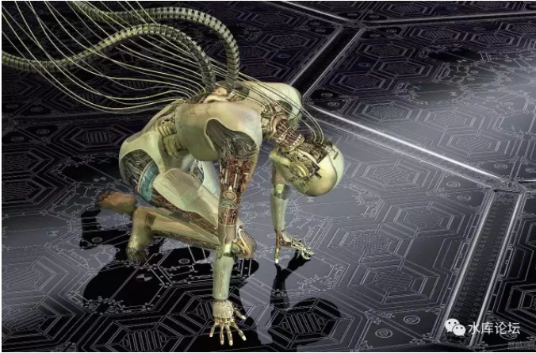
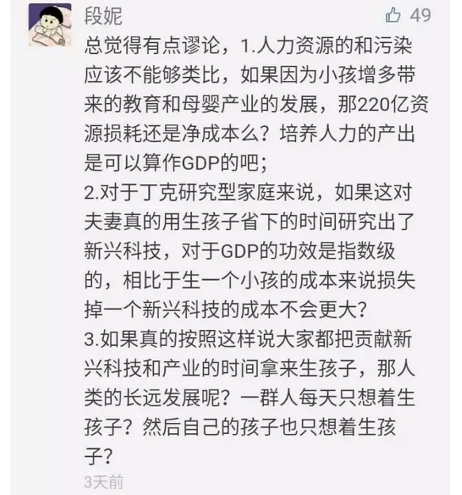
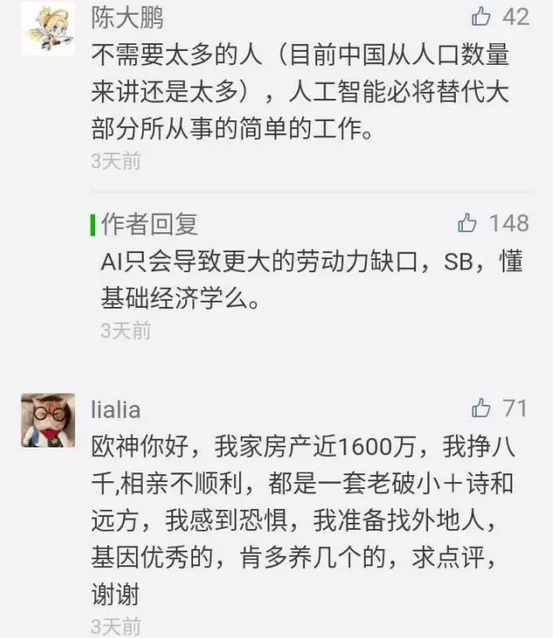
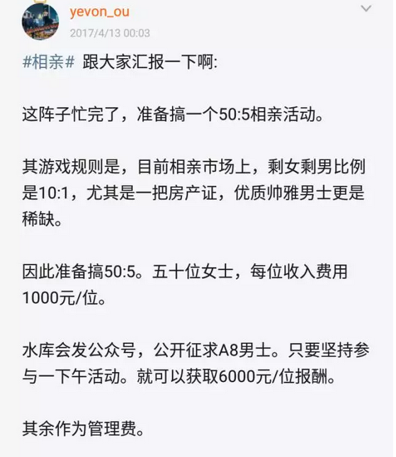
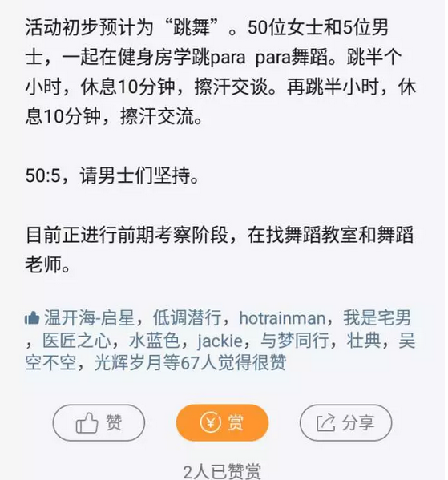

# AI会导致失业潮么 \#F1020

yevon\_ou [水库论坛](/) 2017-04-19

 

**AI会导致失业潮么 ~\#F1020~**
==============================

 

民智未开，国运未启

 

一）前言

昨天写了《[中国真的有那么强大么](http://mp.weixin.qq.com/s?__biz=MzAxNTMxMTc0MA==&mid=2651015737&idx=1&sn=205e10e92778e5e3f233e647d1b79bbe&chksm=80721c2ab705953c246dd310d3158746aa4f53e3a814fcb61653a8b8bc98aa344a84cd67e05e&scene=21#wechat_redirect)》\#F1010，然后后台就被900条留言淹没了。

综观网友们的留言，发现中国人还是很愚昧的。

尤其是长期的"毒教育"，以及秀相十年，奸细遗毒无穷。民众的素质，处于非常低的水准。

 

 

就总体而言，网友们的留言，主要集中在二个问题。

1）生了一亿婴儿，就会带动一亿消费。无论是买尿布，买奶粉，上幼师，童车童装。这些难道不是"拉动内需"呢。

 

原文中说的，"少生1亿婴儿，中国节约220万亿GDP，用于快速发展国力"。网友们认为不存在。

对此，我们的回答是，大大的二个字："SB"

 

 

看什么看，说的就是你。我点名的啊。

凡是在原帖中留言的，一个个都勾出来，全是SB。

你20年的教育基本算是读歪掉了。

培养了一个废品。

 

大声地喊出SB，是武德的开始。

 

 

2）许多网友留言，AI人工智能的大时代即将来临。

AI之后，机器人会取代90%的低端劳动力。以至于虫流爆兵毫无意义。

 

如果依然追求数量的话，会导致大量的失业人口。

并且有网友为失业狂潮忧心重重。

 

 

且不说AI本身就是一个大泡泡。目前的"人工智能"简直就是一场耻辱。基于穷举的傻算法，专门忽悠比他们更傻的投资人的。

哪怕是AI成熟了。"AI"导致失业的说法，依然是错误的。违背了最基本的经济学原理。

 

本篇将深入解释这二个谬误。

 

二）拉动内需

 

 

首先我们看第一个问题。如果多生1亿婴儿，会不会带来额外GDP。

许多小白立刻说："会"。

 

你看，婴儿尿布产业。婴儿奶嘴产业。

看护产业。母婴医疗产业。

乃至于幼教，培训，初中小学，钢琴绘画音乐培训。

甚至房地产，三房四房大户型也会更热销一点。

这些都是"产业"，都是实业。童装销售增加了，GDP怎么不增加。

 

 

好，很好，Good Question。

经济学是世界上最高深的学问。经济学家就问你一句话："童装工厂，之前干嘛去了"。

 

 

你说生产1亿件童装，可以带来大量的"童装GDP"。这话是没错。

可是，之前呢。

之前生产童装的这些人力，物力，机器设备，他们干嘛去了。

 

 

你说，幼儿培训，钢琴教师，奥数教师，带来了大量的就业岗位。

每年光ToysR的玩具，堆积如山。

好，很好。请问这些人力，物力，塑料，之前干嘛去了。

 

 

 

事实的真相呢。

这些人力，物力，原本是40岁的科研骨干白领。

原本是外企资深白骨精。

原本是炼钢厂，造船业，石油业的劳动力。

 

你玩《帝国时代》，多造一个农民，就要少造一个骑兵。

 

当全社会要"抚养"1亿婴儿时，就不可避免要从劳动人口中抽掉时间，人力。

需要大量30岁的外企白领，回家去生孩子。孵产假。

需要大量的炼钢计划，造船计划，纺织计划："延后，降效，取消"

 

 

母婴产业从来不能创造GDP。

在她们创造220万亿GDP的同时，她们摧毁的炼钢业造船业，超过440万亿。

你只看到了220，没看到-440 [\[1\]]

 

简直和白左圣母一副德性。

 

 

三）凯恩斯主义

这一套东西，就是所谓的"凯恩斯"主义。

凯恩斯最著名的，是"破窗理论"。

 

 

所谓"破窗理论"，指经济停滞不前，社会就业岗位稀缺的时候。

凯恩斯拿起一块石头，"砰"把玻璃窗砸碎了。

 

窗户碎了，需要维修。

维修需要工人。玻璃需要原料。

难保还需要黄沙，水泥，硅胶。这样一来，上下游产业都被拉动了。

 

 

哈耶克知道"破窗理论"之后，气得浑身发抖。

他只问一句话，"那些工人，之前干嘛去了"。

 

你说修玻璃窗。带动了玻璃技工。

那么这个工人，之前在干嘛。

 

事实的真相是，那个工人，之前很可能是一个油漆工，泥水匠，或者木工。

因为被拉过来给你修玻璃。他减少了油漆面积，贴瓷砖面积，吊柜工期。

 

这是生产力的净损失。

而且因为熟练度的问题，损失的GDP，比玻璃的GDP还要大。

 

 

从来不存在内需拉动GDP

从来不存在内需拉动GDP

从来不存在内需拉动GDP

 

 

"拉动内需"这句话，是从秀相时代开始说起的。

其背后的实质，是中国发展太迅速，开始强大了。

西方列强亡我之心不死。

 

所以他们派了很多间谍，很多奸细。

潜伏进来，来给我们喂食"毒品"。

 

什么"增加消费拉动GDP"，荒谬绝伦！

一个以消费驱动的民族，必然是灭种亡国的。

以消费驱动的GDP，是不可持续的！

 

 

大道至简。你玩《帝国时代》，被人砍死五个农民。

是好事，还是坏事。

怎么换凯恩斯主义，就糊涂了。

 

四）AI 

首先不谈今天的AI，纯粹是个大忽悠。

刚刚达到"细胞级"的智慧，连"昆虫级"都需要一整代人去奋斗。

基于穷举的算法，不是人工智能。

具体可参见《[Master不是人工智能](http://mp.weixin.qq.com/s?__biz=MzAxNTMxMTc0MA==&mid=2651015400&idx=1&sn=e6301505f6c7a5309fa322c70c044256&chksm=80721efbb70597ed17e6b91af608740610fc9dddf9d919d68d9b56fcdbc03613709ba2c38d07&scene=21#wechat_redirect)》

 

 

我们说的是，哪怕AI达到相当高的程度。机器人相当于20岁民工的智慧。

则整个社会的"就业岗位"，非但不会缩减。反而会大大大增加。

这是最基本的经济学原理。

 

大学教授反驳，大学教授是SB

院士反驳，院士是SB

没有例外

 

 

为了理解这个概念，我们首先举一个最熟悉接触的东西："电脑"。

在1980年之前，全中国可以说是：完全没有电脑的。

 

当电脑业开始兴起时，很多人忧心重重。

许许多多"低技能"的工作岗位，都会被电脑取代。

最基本的，例如会计，统计，出版业，电报业，甚至ICBC一级一级的数据中心。

 

 

 

而事实的结果呢，37年以后。

时至2017年，电脑使得就业岗位"减少"了，还是"增加"了。

 

电脑的确"消灭"了大量低技能的工种。例如会计的人手，减少了9/10都不止。

超市核查库存，只需要用RFID扫一扫就行了。

盘帐都不用做，数据直接汇总到总部。

 

 

可是，IT行业也创造了许多就业岗位。最典型的是"程序员"。

每一段自动运行的程序背后，都有程序员的影子。

很多人会说，程序员的人数，抵不上会计被裁的人数。

 

别急，我还没说完。

你想象一下，《王者荣耀》创造了多少就业岗位！

 

截至上一期的财务报表，《王者荣耀》创造了86亿的收入。

按照8.6万的年薪，他可以养活10W员工。

更重要的是，这些岗位全部都是新的。

 

 

 

不仅仅王者荣耀是新的，连"微信"也是新的。

在IT业产生之前，人们根本不知道：人与人之间，还可以5:5组队，一起打王者荣耀。

 

也不知道，手机上装个微信，居然可以这么好玩。

微信还可以衍生出许多许多的玩法。例如"小密圈"。

真正的"Job"，诞生于这些"新行业"。

当IT革命发生之前，我们不知道会有《王者荣耀》。

到微信革命发生之前，我们不知道会有"小密圈"。

 

而等到AI人工智能革命之后，一定有新的玩意。

 

 

五）数量的证明

除此之外，奥派经济学还可以严格地证明："科技革命之后，新岗位一定多于旧岗位"。

Job是净增加。

 

 

为什么，因为基于"归根溯源"的理解。所有的"工作"，其实都在和人的"闲暇"做斗争。

你完全可以半夜23:00还在路边摆馄饨摊。手冻得开裂。为了多赚30元/小时的工资。

 

你为什么不去了。呸，哥哥每个月20000元的工资。

你让我去多赚30元。

 

所以，这[每一个"工作岗位"，其实都是和人的"闲暇"做斗争。]

如果一个民族天性喜爱劳动，延误闲暇。则就业岗位就会大大增加。

 

象《速度与激情8》里面，哈瓦那居民宁可天天唱歌跳舞。拉美人就是不喜欢工作。

那你就要把工资开到很高很高。才能招揽员工。

 

而工业革命，电脑革命，AI革命，意味着什么呢。

意味着生产力大大增加！

 

如果你23:00出去，吹一个小时寒风。可以赚30元。多半人宁可躲在家里睡觉。他们不认为这是一个Job
Opportunity。

可是，工作一个小时，赚300元呢。

赚3000元呢

赚30000元呢

赚300000元呢

 

 

科技越是发达，人类只需要很小的劳动，就可以赚到一周生活所需。

这个时候，"就业"的吸引力是大大增加的。

也就是Job Opportunity越来越多。

 

 

奥派曾经有非常讽刺的一句话形容;

"农业时代，绝对没有任何机器人，抢你的工作"

"农业时代，就业机会很多么"

"白领岗位=0"

 

 

六）结语

我看了《[中国真的有那么强大么](http://mp.weixin.qq.com/s?__biz=MzAxNTMxMTc0MA==&mid=2651015737&idx=1&sn=205e10e92778e5e3f233e647d1b79bbe&chksm=80721c2ab705953c246dd310d3158746aa4f53e3a814fcb61653a8b8bc98aa344a84cd67e05e&scene=21#wechat_redirect)》\#F1010，就知道民智未开，素质低下。

这是绝大的讽刺。因为那篇文章，讲的本来就是《[降低人口质量，提高人口数量](http://mp.weixin.qq.com/s?__biz=MzAxNTMxMTc0MA==&mid=2651014601&idx=1&sn=3f23506d4914bdfdc33f676614f9e3d4&scene=21#wechat_redirect)》。

 

目前的中产阶级家庭妇女，已经处于非常危险的悬崖口。

对于京沪的中产阶级家庭主妇，她们特别喜欢教小孩学钢琴，学芭蕾，学娼妓之道。[\[2\]] 累得筋疲力尽。

 

俺说句难听点的话，就凭你的本事，你也教不出高素质龙凤。

 

所谓"提高人口素质"；

数量是肯定下降了，质量不见得提高。

100%的露瑟，中产阶级失败者。

 

 

 

我其实想告诉各位妈妈，你们在子女身上的"钢琴""芭蕾"，是一种边际收益非常低的行为。

耗尽了家庭的钱财，投资于低回报，甚至负回报的项目。

 

就好比凤变冰，每套房子只能做一次。

你要是一套房子翻新十七八次，回报率是很低的。

你要生很多个小孩。你才会持久有"高回报"的项目。不要盲目地让孩子去上幼教。

 

 

苦心培养出一个废才，不是悲剧么。

 

 

 

（yevon\_ou\@163.com，2017年4月18日午）

 

 

 

 
经济学家薛兆丰开通"得到"专栏，每天十分钟，以"音频+图文"的方式讲授经济学原理，欢迎关注订阅。  

 

 

 

 

 

 

 

 

 

 

\[1\] 正确的说法应该是：母婴行业一直到22岁，开始产生正向GDP。因为婴儿们大学毕业，开始工作。（消耗尿布永远是负-GDP）

\[2\] 见《[论娼妓，芭蕾，暴政与征服](http://mp.weixin.qq.com/s?__biz=MzAxNTMxMTc0MA==&mid=208528829&idx=1&sn=c64de8b46c112e438bbab0877f48f1ae&scene=21#wechat_redirect)》
