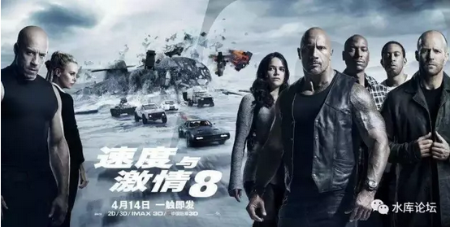
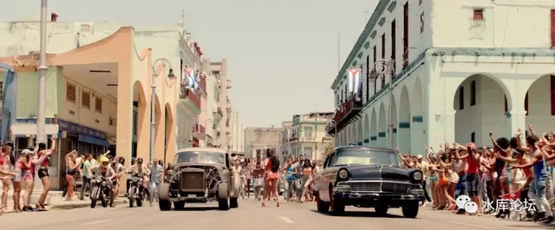

# 美国大片加速走向屌丝化 \#F1030

原创： yevon\_ou [水库论坛](/) 2017-04-24

美国大片加速走向屌丝化 ~\#F1030~
================================

楼市调控风声高压，我们继续讲风花雪月

续《每逢佳节倍孤单》\#F220

 

 

你看的是电影，我看的是Marketing。

 

 

一）铜臭

 

一个象我这样的人，活着真心没什么乐趣。

 

前二天去看了《速8》，电影院里砰砰磅磅，我在那里忍受弱智剧情。

你看的是飞车特技。而我看的，却是背后marketing企划点子。

觉得十分有趣，不如写一篇。

 

 

 

一个象我这样的人，活着真心没什么乐趣。

很多事情一旦看清了底层。雪蛤就变成了输卵管，兴奋就变成了多巴胺。[\[1\]]

 

《电影工业》的实质是什么。你以为是文艺，大错特错。

电影工业的实质，是商业。

 

电影被誉为"第七艺术"。名字上叫艺术，其实却是投资上亿美金，耗资巨大的一门生意。

一个人打赏\$2给路边乞丐，可以叫艺术。可是利益大到上亿美金，就一定是生意了。

 

 

按照Marketing的原理，任何一部电影开拍之前，一定要解决几件事。

1）拍给谁看。谁是目标票房，人数有多少，购买力有多少

2）他们喜欢怎样的故事

3）因而喜欢哪个明星 [\[2\]]

 

好莱坞是一门大生意，从市场调研，到主题确定，到筹款融资，1/3的活在影片开拍之前就已经做完。

当剧本最终确定时，影片的命运已经有了框架。导演反而关系不大。

 

就好比现代战争，总参谋部会把一切都算计好。

战场上团长，师长的发挥。反而是不可依靠的。

 

（电影《太空旅客》的剧本，可以堆满一堵墙）

作为一种"逆向工程"，Marketing的专业人员，可以从影片的拍摄，反向推算出导演的意图。

毕竟，天下熙熙皆为利往。任何一个举措，都是为了利润最大化。反常则必有妖。

 

好比一个媒婆上门，给你女儿介绍男朋友。

如果媒婆说小伙很帅，则他必然没有房子！

如果媒婆不说小伙很帅，且慢，这不意味他有房子
==\>意味着他既没有房子，长得又很丑！ 

 

 

二）黑骑士

 

别人看的是电影，我看的是Marketing

\-\-\-\-\-- yevon\_ou

 

最近几年的电影，第一次让我震惊的是《星球大战7：原力觉醒》

俺看了足足半个小时，一直没有看懂。

等到我看懂了，直接从沙发上跌摔下来。

 

 

《星球大战7》的特点，它的主角是一个黑人。

不仅仅是黑人，而且是一个黑人小混混。

 

 

俺在电影院里看电影，一直都没看明白。

眼看这个黑人的戏份越来越多，越来越多。

故事都围绕着他发展，到最后练级成长。

 

俺看了半天，猛然明白，"哎呀，这个黑人不是配角，他就是男主角"。

一下子从凳子上摔跌了下来。

好莱坞居然选了一个黑人做"星战"男主角，美帝真的快完蛋了。

 

 

整个1970年代，美国最辉煌的年代。"星战片"主角都是白人，男性。

黑人即使有角色，往往也是配角。引出故事的主线轴，篇幅不会太大。

而芬恩的戏份超过半小时以后，俺猛然醒悟《星球大战7》的主角是一个黑人！

最后还要Kiss白人女主角的。

 

 

制片公司为什么会选用一个黑人，而且还是很丑的黑人做男主角呢。

这绝对不可能是"你等会"之类的笑话误差。[\[3\]]

 

 

制片公司如此主角级的转变。其背后是观众的转变，是美国人口的转变。

有怎样的观众，就有怎样的电影主角。

 

电影其实是一面镜子。它反射出了观众的人口口味。

 

 

你如果看南非的电视频道。

南非的"爱情连续剧"无一例外，都是白女爱上黑男。

而且爱得死去活来，爱得放弃自尊。爱得倒追又犯贱，简直哈巴狗如韩剧"欧巴"倒追花店小妹可比。

 

每次我看到电视机里，黑人小哥问白女；

"你爱我么"

"你是真的爱我么"。

俺就忍不住想吐。

 

 

同样道理，《星球大战7》为什么要选一个厚嘴唇的黑人做男一号。

而且故事的设定，芬恩最初是一个底层小兵，[怯懦逃避]的小逃兵。无意被"历史的车轮"推到了英雄的位置。

 

因为观众喜欢这样的调调。

电影，是一面镜子。它其实反映的观众的内心。

你想看怎样的故事，就会有怎样的电影。

电影并不是第九艺术，电影就是票房。

 

 

在全世界所有的电影之中，永远都是富家女爱上穷小子。《泰坦尼克》才会有10亿票房。

在所有的韩剧之中，永远都是欧巴爱上"前台小妹"---------因为MBC的收视率目标就是底层白领女性。只有她们才有时间一天看6小时电视剧。

 

哪怕你骂，老掉牙的套路。

再过10年还得这样拍。

 

 

 

三）速8

 

同样道理，我们来看《速8》的故事情节。

 

《速8》不仅仅是屌丝电影，而且还是低幼龄屌丝电影。

20岁的《喜羊羊和灰太狼》

 

 

整部电影概括下来，可以称为；

 

"一群不愿意工作没有收入的社会边缘份子，幻想成为大盗通缉犯获得特赦一夜之间成为拯救地球人类的大英雄"。

 

主角是观众的内心投影

 

所有的起点YY文，写的都是作者自己。

 

 

 

主角是观众的内心投影。观众会不知不觉把自己内心代入，并且在看电影的过程中，获得人生圆满，功成名就，美人爱情。

用Marketing的眼光看《速8》，速8的定位和最匹配的美国观影人群，他们应该是：

 

1）懒散，厌恶工作

 

在哈瓦那岛上，多珀毫不犹豫拒绝了塞弗的邀请。台词堪称经典；

 

"工作，我不工作"

"谁也别想要求我工作"

 

考虑到《速8》的主要观众是黑人裔和拉丁裔的底层。这句话简直说到他们心里去了。他们要的，就是这种游手好闲，又感觉很"酷"的古惑仔风度。

 

 

2）游手好闲，惹事生非

 

 

单单地说你"混混"，无疑是一件很伤人，很羞辱的事情。

观影屌丝们也获不得High感。

于是导演又设计了一场戏。在"量身定做"的场景，让多珀成为英雄，排除万难。

 

 

多珀会什么呢，他只会飙车。除了飙车什么也不能。

于是导演设计了一场戏。有了冲突，冲突对方的黑老大，非得要求以"飙车决胜负"。[\[4\]]

 

飙车的过程，自然是惊险万分的。什么喷火，逆行。

男主角最后一定是无恙的。接受群众的眼球，欢呼，万众拥护。

 

场景的合理性呢。

你一辈子能遇上一次"飙车解决"的事件就不错了。

你还是没有收入。

 

 

3）哥们义气

 

穿插了一段古惑仔最喜欢的"背叛"和"哥们义气"，按下不表。

 

 

 

4）屌丝心态

 

屌丝心态的第三个问题，是把一切看都太容易。

编故事编不圆。逻辑链断得如小孩子过家家。

 

每一个"前台少女"心中都怀着憧憬的梦。都梦想王思聪，大公司继承人超帅欧巴会看上你，而且被你各种虐。

你的心目中，充斥着不切实际的"浪漫"期盼。

对于怎样实现浪漫，却是一无所知。

 

 

影片放映到一个小时，僵尸车队出现时，我终于确定自己看的是一部"科幻片"了。

而不是"文艺片"。更不是"动作片"。

拜托，请不要这样侮辱观众智商好么。

 

在电影中，"僵尸车队"的整齐洪流很有创意。特效也做得不错。

但问题是，4S店里，根本没有Wifi信号呀。

 

 

你破密码如家常便饭，我忍了。

"自动驾驶"根本没到实用阶段，我也忍了。

这么多车队横冲直撞，居然没撞死小狗小猫，我还是忍了。

可是4S店里没有Wifi啊。停车场也没有Wifi啊。

 

你连信号都没有，你怎么操纵的车队。

 

 

5）屌丝心态II

 

如果说，操纵4S车位，还算是初步夸大的话。

最后一场核潜艇的戏，直接把我看吐了。

 

各位，你们见过"不需要维护，不需要预热，一个远程指令就可以启动"的核潜艇么。

一艘典型的6000吨位舰艇，需要的人力资源，二战时期要500人，此后一路不断自动化。到今天还需要150人。

 

真的不能再少了。每一个人力的砍掉，都意味着战斗力的巨大提升。

您如果真的可以造出"零"人驾驶，不需要大副二副三副维护的潜艇。

您怎么不把它停到北冰洋去，直接威胁美洲。

 

 

更搞笑的，是多珀开启电磁枪，直接冲进海军基地的场景。

您见过不需要人下车，在驾驶途中就可以全程完成的任务么。

您以为是跑酷抢金币么。

 

你看着多珀按一下电磁枪，大门放下。然后有一根建设非常好的高速车道，没有任何障碍物。只要你急速开车就行。

这里跨过一个路障，那里甩开二辆跟车。

背后水泥桥梁哗啦啦地跨下来。

 

是不是有一种似曾相似的感觉。好熟悉啊。

没错，我硬盘里就有一个。

赛车游戏啊！

 

您是不是把电影当成电竞来拍了。最后一段基地追逐之夸张，之不合理，简直和高度简化版的任天堂游戏一样。

当当当，吃几个金币。

当当当，坐在车上就可以拯救世界。

 

 

我想吐槽的，不是这部弱智的电影。

我想吐槽的，是弱智的美洲观众。

 

《速8》在中国口碑不佳，中国观众纷纷抱怨，侮辱智商。

但好莱坞导演不是笨蛋。这部电影，是专门针对最大的市场，也就是北美市场，进行专门优化的。

Marketing永远是最贴近观众口味的。[\[5\]]

 

我想问的是，北美市场，已经堕落成这样子了么。

已经从智商85，堕落到观众平均智商65了么。

 

 

《星球大战7：原力觉醒》里面，男主角是一个黑人。

因为北美的人口趋势已经倾斜。尤其是15\~20岁最重要的电影观众人群中，拉美裔和黑人的比例大幅增加。

 

他们喜欢男主角是黑人。最好智商也不太高，学习成绩也不好，是个底层小混混逆袭。

这样才最有成就感。[\[6\]]

 

 

《速度与激情8》里面，天平进一步倾斜。

不仅仅《速8》个几个主角，都是黑人拉美裔。无工作，游手好闲，通缉枉法。

 

而且最后一段"潜艇戏"，突破了下限。

反向解析工程，让人感觉[北美观众们]不仅"渣"，而且"弱"。

智商介于蜥蜴和鲷鱼之间。

 

 

当然，你可以说"看电影人口"仅仅是国土人口一个子集。

电影工业表现出来的社会衰败气象，不代表美利坚的全部。

"见微知著"误差极大。Blablabla............

但你还是不能否认。"好莱坞"开始全面拉美化。

 

 

 

四）结语

 

最后，贴一段视频。

https://v.qq.com/x/page/j0375fczxjq.html

这是2016年大年夜"超级碗"晚会，碧昂斯、火星哥和酷玩乐队三大巨星一起登台。

 

 

 

那一年的春晚特别难看。被誉为"史上最表忠心的春晚"。

豆瓣评论0.9分（满分10分）

 

恰好美国"超级碗"也是决赛，于是微博上就爆了。

无数的大V，交口盛赞"中美文化差距"。碧昂斯热舞，跺脚几乎把地面都踢烂了。

 

 

但其实以Markeing的观点看，这段"超级碗"的视频。是问题极大的。

槽点太多，我就不分析了。

您可以试着看一下。

 

 

 

（yevon\_ou\@163.com，2017年4月23日午）

 

 

以下是广告，广告，广告！感谢衣食父母

 

  --------------------------------------------------------------------------------------------------------------------------------------------------------------------------------------------------------------------------------------------------------------------------------------------------------------------------------------------------------
  春意盎然的4月，我与良苍地产有过一次密切接触，他们以客户需求为导向，以专业---服务---满意为经营风格，与瑞安、万科、金辉、龙湖等知名地产商合作，并对市场进行精确的调研和优质楼盘推荐，还安排了一次比较不错的专业地产投资顾问进行机场接送和全程陪看，我觉得公司运营理念、服务都很不错，值得推荐！在此，我留下他们客服的微信号a17317968656，pl13916603587。
  --------------------------------------------------------------------------------------------------------------------------------------------------------------------------------------------------------------------------------------------------------------------------------------------------------------------------------------------------------

 

 

[\[1\]]因为实在受不了电影工业，所以我自己写了剧本《拜金女郎》

[\[2\]]影院学生一窝蜂去奔"男主角，女主角"也是不对的。他们不如细分析影片需要哪些角色，有哪些特色脸谱人物。细分市场或许更容易获得出境。

[\[3\]]有人嘲笑李登晖怎么会上台了。编了个段子说问蒋径国"谁来做接班人"。经国说"你等会"，于是就咽气了。

[\[4\]]让我想起了某些炫舞团屌丝写的YY文。任何江湖冲突，都以炫舞来对决。

[\[5\]]《为什么《速8》在中国火了，在北美却大幅退步？》https://www.huxiu.com/article/191098.html

注：这并不影响《速8》《星7》是专门为北美市场优化的事实。

[\[6\]]看《泰坦尼克》感动的，男的都是屌丝，女的都是蠢货（纯理论上讲）。
