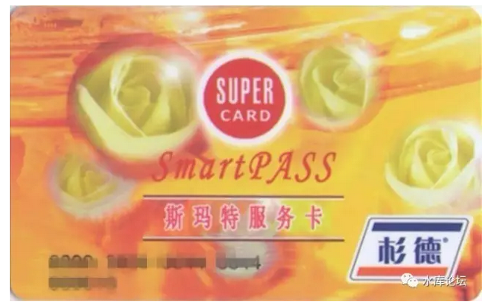
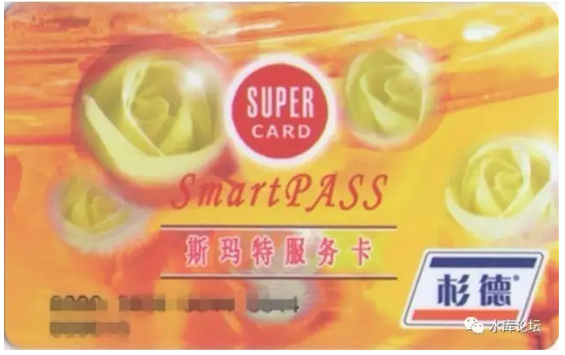

# Smartpass的赢利模式 \#F1070

原创： yevon\_ou [水库论坛](/) 2017-05-04

Smartpass的赢利模式 ~\#F1070~
=========================================================================================================================

 

彩蛋在最后一句

 

 

一）前言

 

前二天有人问我，采棉花和榨糖，是完美互补的行业。

-   采摘棉花主要在夏季，七八月份。

-   甘蔗榨糖主要是冬季，十二月一月。

如果一个人，夏天打工新疆摘棉花，冬天打工广西榨糖。那么真是完美。

 

同样道理，泳装批发和羽绒服批发。

年货烟花爆竹，新学生"九·一"套装，也是完美的搭配。

 

那么问题来了。和炒房最匹配的，是什么行业。

哥哥毫不犹豫，立即回答："预付费卡"类。

 

 

小密圈的朋友不依不饶，继续追问。"预付费卡"是什么行业。

靠什么赚钱。

赢利模式如何。

哎呀呀，你不知道呀。"预付费卡"可是一门大生意。里面的门道可多了。

 
欠稿太多，挖坑要填。

各位一直催着"Smartpass卡赢利模式分析"。

正巧前二天俺老娘，花2000元在文峰办了一张5折的白金卡。心血来潮，不妨就此事分析。

 

呵呵，你知道文峰的赢利模式么。

 

 

 

二）赚钱

 

话说前二天准备给幼儿园老师送礼。唤财务拿来了二张"斯玛特"卡。

俺接过来一看，面值500元。但其实却是480元的。

财务解释说，拿来的时候渠道费用10元，押金10元，凭卡可退。

俺反正也不在乎，反正都是送老师的。

 

 

付费卡这种东西，看似平平无奇。都是一张卡片。

储值500元，面值也是500元。平白多兜了一个圈子。

要它何用。

 

但是从Marketing的职业病，深度分析下去。这里面赚钱的机会可真不少。慢慢道来。

 

1）售价差异

500元买的卡，实际面值只有490元。卡销售方有时候是不足额给你的。这个问题不是太大。

 

 

2）利息差额

有一件事情一定要想清楚。斯玛特卡拿到手，并不是马上消费的！

一张卡的消费链条，其实是很长的。

 

从公司财务去统一采购，到发到我的手里。

我再等幼儿园家长会，塞在老师手里。

老师往往也抽屉一扔，过一阵子才想去消费。甚至有看见厚厚麻麻一叠几百张卡，不知道用到猴年马月。

 

一张"斯玛特卡"的平均生存周期有多长。我没有确切数据。

但乐观的估算，可认为有6\~12个月。

 

 

各位，买卡的钱，是第一天就给现金的！

而商户12个月之后，才有消费的指令传回来。才有结算需求。

这里面账怎么算，至少有6%的息差。

这是一笔巨大的利益。

 

 

3）余额损耗

 

第三个问题，也是绝大多数外行人忽略的问题。

你一张卡用到什么时候用废掉的。

 

一张500元的卡，你随身带在身上。有机会就用，有场合就用。

但你很有可能，没有把它的余额用到0.

 

对于绝大多数的人来说，我断言说，如果这张卡的余额低于2.5元。

一元几角几分，你就不会再随身带在身上。

 

 

而且你到超市购物，饭店吃饭。一本正经地掏出十张卡，一本笔记簿。

照着笔记本上的记录；

"第一张卡刷1.27元"

"第二张卡刷2.58元"

.........

.........

"第九张卡刷0.46元"

"第十张卡，哎哟，让我先查查余额多少元"

 

如果你这样做的话，营业员会给你怎样的白眼。

如果你不幸正巧请女生吃饭的话，女生会给你怎样的白眼。

 

 

余额损耗，一定有。平均可假设为2.5元。

或者卡面值的0.5%

 

 

3）押金损耗

 

按照手册说明，斯玛特卡含有10元押金。

不过这个押金，要刷出来，可真的不容易。

 

自从俺宅旁边的emart韩国超市关掉了以后，我就再也找不到任何一家可以接受"斯玛特底卡回收"的商户。

无论是肯德基，新亚大包，都只能消费，不收底卡。

 

 

如果你要"彻底销卡"拿回10元押金的话。

请你跑一趟田林钦州路办事总部。

可是，谁又会吃饱了撑的。花一个小时和汽油交通费，去退10元钱？

 

 

所以这个"不退押金"的比例还很高的。

押金10元，占500元的2%

假设一半的人不退押金，直接扔垃圾桶。商家收获又是1%

 

 

4）遗失损耗

 

第四个损耗，才是大头。即"遗失损耗"。

 

薛兆丰曾经有一道题目。"你有10元人民币，想分给尽量多的人。请问如何操作最省时省力"

答案是："烧掉"

世面上流通的货币少了，自然每一个人手里现金都升值。

 

 

对于商家而言，他是"逆向"的。每一张Smartpass卡的遗失，对商家来说都是净收入。

我们永远有"磕磕碰碰"遗失的东西，很有可能哪张卡掉在门缝里，就再也找不到。

剩下三四十元余额，卡被折断了。

老太太塞米缸里。

贪官被抓。几千张卡涅灭在历史长河里。

商家卖给你面值是500，可是实际是用不足500的。

 

谁知道你埋在地底下，藏在夹缝里，卡车翻车沉船掉海。

只要是有价票据，你不去提现，就是商家赚了。

"票据业"极大的一块利润，来自于遗失。

 

 

 

在历史上，欧洲有许多家银行，纯粹是靠"遗弃"起家的。

你在银行开了一个秘密户口，存了很多现金有价证券。承诺凭印信来取。

可是此后这户人家可能就绝嗣了，可能就没有继承人了。

毒枭被枪毙了。

哪怕是平民家庭，你父母的存折，你确认每一家银行都知道？

 

对外，银行可以宣称，他们是完美无瑕的声誉。

哪怕150年以后，只要有人拿到印章，找到遗失的密码，一样可以打开银行秘密的账户。

而在实际情况中，这笔钱相当于永远也不要还了。

 

"遗失"的金额巨大。我个人估计，至少1%不止。

 

 

 

5）避税

 

顺便说一句，如果你单单看Smartpass的财报，他的赢利是不高的。每年也就几亿的样子。

但是这个公司非常值钱，完全不可以以利润来计算。

 

因为"遗失"所造成的"隐性收入"，是完全不体现在资产负债表上的。

在资产负债表上，它永远是"预付账款"。

如果卖掉了100万张，就是5亿元的"预付账款"。

 

 

从会计上讲，这是欠客户的钱。

只要客户拿Smartpass去消费，账单就会雪花片般的飞过来。这钱是要花出去的。

依财务审慎原理，不可以确立为利润。

 

而在实际操作中呢，1%的卡片是永久遗失，1%的押金是永久荒废，0.5%的余额是永久废弃的。

这笔钱是再也不会有债主，再也不会有人向你索要的。

 

管理层对这个"统计概率"现状心知肚明。

但是谁也不会捅破。

因为不用交企业所得税。

 

绝对的现金Cow。

 

 

6）商户手续费

 

第六笔利润，是问商户收的手续费。

吃完上家吃下家。

 

怎么不可以问商户收费呢。

目前我们在饭店吃饭刷卡，无论刷的借记卡，信用卡，二维码，商家都是要付手续费给支付系统的。

一般是0.6%左右。

 

对此的解释，是电子化交易减少了现金假钞，加快了收银速度。

省去了收市之后，现金盘点结算的人力。

而且每月可以定期反馈大数据报表。

 

总而言之，"商家手续费"是一定收得到的。

只要你刷我的卡，就额外再收你0.6%

 

 

 

7）商户推广费

 

有一些更恶劣的卡，它甚至可以收二道手续费。例如什么"中粮月饼卡"，它只能在中粮的官网使用。任何东西比市场价贵+20%

这种卡只要它能强行发得出去，就稳赚20%，完全是官商。

 

 

对于斯玛特卡，虽然它的消费范围更大一点，但依然不是万能的。不是银联标准卡。

于是公司就可以收"推广费"。

斯玛特卡拿到手，通常他会给你一本小册子。官网上也会有目录。在哪些商户可以消费。

哪些商户还可以"凭卡打折"。

注册关注之后，定期给你推送Coupon信息。

 

 

这个"竞价排名"依然是要收费的。

给商家刊登了Coupon广告，怎么可能不收商家DM费呢。

 

 

 

8）账期

 

第八笔收费，是账期。

 

今天客人来到店里，刷卡买了二件衣服。难道你就可以马上收到现金么。

太洋，太拿衣服了。

"结算机构"完全可以卡你。再卡你90天账期，180天账期。

 

 

9）报销

 

斯玛特卡有这么多"擦油水"的地方。为什么企业还要去买它。

还要拿来当福利发给员工呢。

因为从税务上讲，斯玛特卡还可以"避税"。

 

 

如果企业直接发500元给员工，那就属于"工薪性"收入。必须按照工资档级缴纳所得税。

可是企业发500元"斯玛特"卡，他可以归类并入"行政成本"。

 

企业一次性购买10000张斯玛特卡，性质等价于去Home
Depot购买储值卡，去B&Q购买储值卡，等价于采购预付款。

买办公用品，公事公办。完全可以入成本。

Smartpass发票是买卡当天开的，发票抬头是公司。

 

 

职工持"斯玛特卡"去买东西，不得另开发票。

钱已经付过了，您只不过提货回家。（哦，说错了，应该是提回公司）

 

你要搞清楚，Smartpass等预付费卡，起源于1960年代的法国。

这是有深刻历史原因的！

 

 

 

三）结语

 

我们把这些利益累加起来：

 

销售折扣：  0%

利息：        4%

余额：        0.5%

押金：        1%

遗失：        1%

避税：        0.2%

刷卡费：    0.6%

推广费：    0.2%

账期：        0.2%

报销：        0%

\-\-\-\-\-\-\-\-\-\-\-\-\-\-\-\-\-\-\-\-\-\-\-\-\-\-\-\--

合计：        7.7%

 

 

如果500元面值，在这个城市卖掉100W张，5亿的销售额。则至少有7.7%的毛利润。

从这些细孔中产生。

 

好了，坐坐住，现在我们继续说一个终极的大杀器：

"做这么大的生意，你的本金几乎为零"。

 

 

 

《二鬼子汉奸李富贵》里面有一个段子。李富贵最赚钱的，其实是他的银元生意。

银元的利很薄，就是把散碎银子收进来。融炼炉子粹去杂质，然后用机器压成墨西哥鹰洋。

 

但是"银元压铸业"他周转快呀。《二鬼子汉奸李富贵》眼睛都红了。收进来的是钱，放出去的也是钱。

-   没有库存

-   一天周转一千遍。

 

 

"预付费卡"也是这样一个行业。收进来是钱，放出去也是钱。一天周边1000遍。

每张卡还有7.7%的毛利率。

简直就是印钞机啊！

 

 

直到政府闲不住的手，蠢蠢欲动伸进来。

于是，一切终止。

 

 

 

（yevon\_ou\@163.com，2017年5月3日晚）
