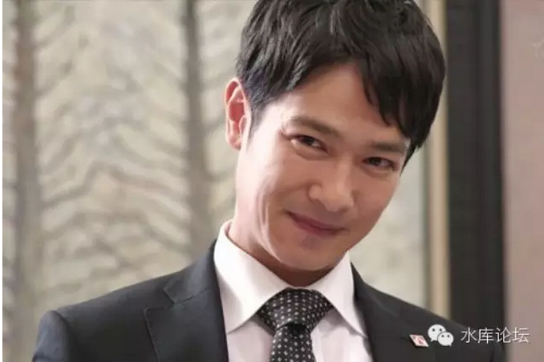

# 日本没有少数派 \#F110

yevon\_ou [水库论坛](/) 2015-11-18

日本没有少数派 F110
===============================================================================================================

这二天《半泽直树》的讨论颇为热烈，chenzq55写了许多赞美日本的话。我是懒得理他，要反驳的话，可以从上到头皮都剥下来。

今天下午，本来想写一篇"管理学"有关的文章，后来想了，这篇写了，多半也是给俺LP删除的下场。

没有什么可写的话题，来剥日本人的皮吧。

一）一八四零

1840年的时候，没有一个中国人怀疑，中国拥有全世界最好的制度。

"君君臣臣父父子子"，三纲五常，天地方圆都可以在儒家学派的范畴内找到解释。内圣外王，理学和心学的发展也达到了顶峰。

英国人懂什么，一群蛮夷。在官方的文书上，英国人最初的翻译是(口英)𠸄咭唎，意思是西人不识王法，与禽兽无异。所以一律加上口字。当然，同样的受害者，还有（口法）𠵽㘕哂。

当道光皇帝和他的大臣们，听到英国Victoria女王年方十八，尚未婚配。而且其国历史上有过三任女王，不由得哈哈大笑。纷纷说到："西人愚昧，不知道其国已几易其手"。

皇权是严格地遵循男性血统的。象一国政治如此混乱，不由得被清朝皇帝们大大地看不起。在满清朝廷的眼中，"英国政治"充满了谬误，犯了无数个错误，当然在错误的道路上越走越远。

后来的结果呢，不说大家也都知道了。被英国人打得满地找牙。

二）日本人

1840年的时候，没有一个中国人怀疑，中国拥有全世界最好的制度。

我们相信政治应该是这样的。忠君爱国，志士成仁。"学成文武艺，货于帝王家"。

朝为田舍郎，暮登天子堂

臣闻天下大义，当混为一

当1840年，中国人看待远洋船渡而来的英国人时，眼光是这样的，一群蛮夷。他们既奉行着错误的政治制度，又做着禽兽猪狗不如的行径。士大夫还没有商人有政治地位。如此倒行逆施，又企能长久？

1840年时，"完美"的中国人看待英国人时，是充满了挑错和鄙视的。其态度，就和《半泽直树》看待2013年的中国人差不多。

什么，差不多？

是的，在"完美"的日本人眼中，他们拥有着全世界"最好"的制度。严谨，求是，坚韧，忠诚，诚信、在五德俱全的日本人眼中，荒唐混乱的中国人简直浑身上下充满着错误。

和身满虱子的不列颠海盗也没什么二样。

好吧，那就让我们打得日本人满地找牙吧。

三）国制之殇

说到中国历史，一直有二个谜。

一个谜是，工业革命为何未发生在中国。宋代之际，中国的生产力就已经远远超过欧洲。1750年之际，当英国开始制造蒸汽机，中国仍拥有比英国更好的技术和工人。

第二个谜是，当工业革命传至亚洲时，中国的反应为何如此慢。

在所有国度中，日本是最幸运的。他们几乎在第一时间就摆脱了儒学的传统，"脱亚入欧"明治维新飞快地就成为了世界工业强国。

在所有国家中，学中国学得最象，其官僚系统最腐朽无可救药的垃圾娘炮国家，是韩国。可是棒子现在也腾飞了。

只有中国，历经洋务运动，戊戌变法.........换了四个政体三个政权，耗了140年，一直到一九七八改革开放，才稍微看见了一线巨龙的曙光。

为什么，为什么当时1840年中国拥有全亚洲最好的人力资本，最多的受教育民众，最广泛的道路灌溉船坞等基础设施，最悠久的城市与缙绅自治传统，但是，最终中国却是最慢的一个。

为什么，这是《半泽直树》们该说的话。

四）完善

我们的答案很简单，因为中国太"完善"。

用历史教科书的说法，是"高度集中的中央集权"。中国的皇权已经长得太大，太宽，无所不在。

日本的西南夷，可以自由地和荷兰人做贸易。可以从荷兰进口武器，可以试点荷兰的社会管理体制，安装荷兰的机器。~【注1】~

但在1840年的中国王朝，这些事是绝对不允许的。

1840年的中国王朝，皇帝统治着一切。既不允许你尝试新的体制，也不允许你进口新的机器，不允许开电报局，同人馆，不允许办报纸文字狱。对海外的贸易，被严格地限制在广州"十三行"的手中。除此之外，片帆不得入海。

在1840年的中国，如果你想出头，你只有读八股考科举一条路。除此之外，经商，务农，分分钟被贪官恶霸搞死。

读书，你则只能依附于朝廷。并且分同乡，同榜，同科，束成一股股派系，在政治上党争不息。

换言之，"体制"的力量太强。

1840年的满清中国，"体制"无所不在。做什么事都要经过体制，只有体制内才能飞黄腾达。日本的丰田，铃木，基本是靠民间的力量自发成长起来的。而中国则没有这个可能。

【注1】：著名的"铁枪的故事"，就是指鹿儿岛岛主卖掉了女儿，换回了荷兰人第一台蒸汽机。

五）半泽

看《半泽直树》这部片子，我们看到的不是希望和坚韧，而是恐怖。

如果用一句话形容《半泽直树》里面的日本社会，则是织网社会，体制力量无所不在。

在日本，你首先要读一所像样的大学，然后要进一家像样的公司。

我们可以看见，半泽这种算是课长级骨干人物，但却是住在公司的集体宿舍。

看到这一节时，我们看到的不是关怀，而是恐惧。

住集体宿舍，如果公司刁难你，不让你住了怎么办。

住集体宿舍，如果你被降职外放，工资下降怎么办。

住集体宿舍，如果你得罪了上司，给你穿小鞋怎么办。

在日本的社会中，"半泽"这类人工资十分低，以至于他们不能获得人身意义上的独立。

铅笔社说，没有财产权就没有人权。

经历过中国旧历史的人都知道，人民公社里的大队长，会怎样对待你。

当居委会干部掌握了分配房屋权力后，他会怎样刁难你。

80年代最初的那批人，他们咬牙狠心下海，公家不给你租房怎么办？

日本的"一元"势力太强大。每一个日本人踏上社会，首先要读一个大学，没有庆兴社的学长们关怀，以后你在职场中几乎就没有战友。

这和中国封建社会"同榜，同乡"又有什么区别。

进了日本公司以后，公司又有太大的权力，他既控制着你的工资，又控制着你的宿舍，最关键的你还不能跳槽。

在片中，曾有一段渡真利忍想跳槽去欧美的外资银行。因为任何一家日本银行，一只会重用自己培养的人，二不会录用叛徒。

经历过中国国有企业的人都知道，在这样的制度下，进棉纺厂就棉纺厂做一辈子，进纺织厂就纺织厂做一辈子，哪还会有什么前途，哪还会有什么创新。

看《半泽直树》只能让人看得窒息。在这样的一个社会中，"体制"的力量太太强大。每个人只能想方设法，在体制中找到一个螺丝钉的位置，然后你就一辈子不能移动。

美国是一个开放的社会，一个人前一分钟是个家庭主妇，下一分钟就可以去应聘电视主播，再过一阵子可以去做体育经理人。

在美国，存在一个职业经理人阶层。IBM的高级经理，明天可以去Intel上班，后天可以去Cisco上班。

所以美国经济，永远都充满了创新，21世纪领导世界的发明基本上都出在美国。每一份资源都可以重新配置，而且人们拼搏充满了希望，充满了士气。

至于日本，片子中戏剧性的设计了半泽的领导浅野是个贪污犯，所以一扳即倒。

但他如果不是个贪污犯呢。

如果他仅仅是老朽昏庸，保守糊涂，"齐心服侍山大王"呢。

我们设想一下，现实生活中，半泽的老板并不是一个贪污犯，他仅仅是个庸官。

无论什么样的业务，他总是说"有风险，有风险，再想想"。

无论什么样的创新，他总是说"不妥，太新，有风险"。

任人唯亲，官僚拖沓，简直就是个生产力的破坏器。但是，但是，他绝对不贪污！

对于这样的领导，欧美制度很容易辞职了事，可是半泽他们怎么办？

天天服侍着一个猪一样的领导，而且这样的工作你要做一辈子，一辈子没有别的拐弯，没有别的出路。

你还别惊讶。

真的现实生活企业界，绝对的黑，绝对的白都是很少的。更多的是灰色。

也就是说，猪头领导是占99%的。

他并没有错，任何新业务都有风险的。所以你无法从公司内部制度上扳倒他。但这样一个老朽昏庸的白痴，是多伤害士气的你知道么。

日本企业无法克服这样的顽疾。

所以日本企业一塌糊涂。

日本的体制太强大，太完善，就象1840年的中国。

六）日本沉没

政治信仰的腐败，是最大的腐败。

体制的腐败，是最大的腐败。

大清朝并不缺乏勇士，在面对面投掷炸弹的游戏中，僧格林沁的骑兵震惊了英军，无法想象这是人类军队能够承受的牺牲。

但是总体而言，清朝输掉了这场战争，而且毫无阻滞的沉沦到底。

日本人不缺努力勤奋工作的半泽们。

但日本的制度有问题。

半泽越是努力的工作，越是维护这个体制，越是"神圣，尊重，坚守"这个体制，他们在错误的道路上走得越远。从第一集老头子哭着跪下坚持手工，我就知道这个民族完了，越是坚持越是完蛋。

当半泽在公司里上班时，事实上并没有力量可以约束他的高层领导为所欲为。如果他不受贿，事实上半泽并不能扳倒任何一个。

在社会层面，日本的产经关系不受约束。《半泽》剧中，任何日本的公司，离开了银行的合作，都很难生存和发展。而银行本身挑剔的目光，就形成了一种筛选和垄断。

相反的，如果看多韩剧，无论《朱丽叶的男朋友》《钱的战争》，韩国的地下，有一股非常大的力量私债业。这股民间的力量支撑，使韩国经济有更多的活力。

而在中国，温州地区，高利贷非常盛行。民间集资以及走私，吃撑起了福建，广东等大省的经济。

我将这篇文章取名叫做"日本没有少数派"，并不是指的日本政坛上没有反对党。

事实上，正如美国人嘲讽的，民主党和共和党，其实这是同一个党。无论谁的上台，小渊和小泽的政见也是差不多的。

我们真正在意的，其实是体制之外"草根"的力量。

美国天天强调的，美国需要的"草根"的活血。只有体制外的血统，才能修正和改良体制的腐朽。

美国一直强调他是一个多元化的国家，尤其关注"草根"出头的机会。这是一个全方位的系统工程。他包括到；

-   普通人有没有体制外生存的机会

-   普通人有没有体制外创业的机会

-   普通人有没有体制外借力的机会

-   普通人有没有体制外转为主流的机会

以上这些机会日本都没有，日本就是个"一元"社会。至少有一事我是千万确认的，在日本，是不会产生"水库论坛"，不会产生水库这批人的。

去死吧，日本陆沉。后清帝国万万岁。

（yevon\_ou\@yahoo.com，2013年10月4日晚）
