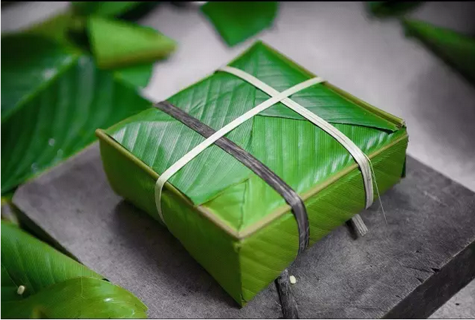
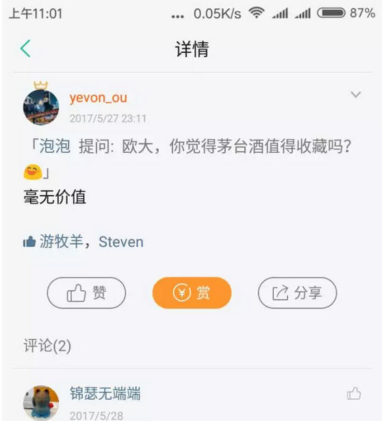
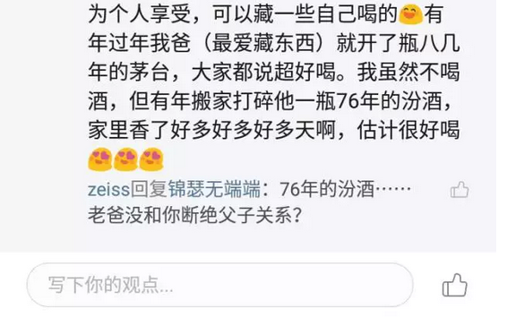
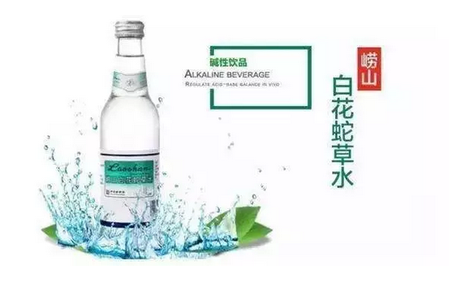
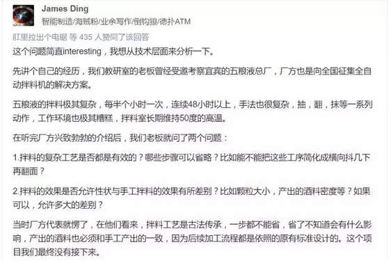
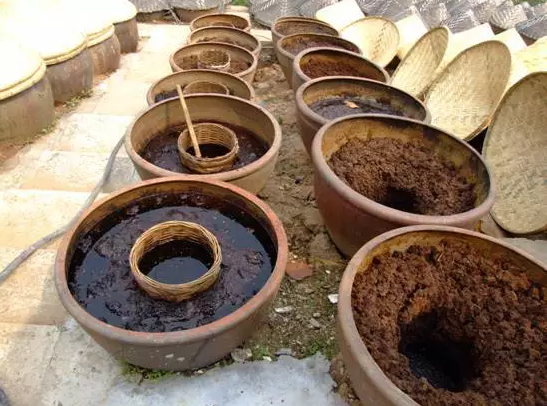
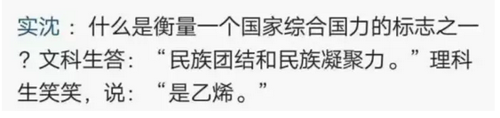

# 从包粽子机说起 \#F1120

原创： yevon\_ou [水库论坛](/) 2017-05-31

从包粽子机说起 ~\#F1120~
====================================================================================================================

你有神功，我有科学

 

 

一）前言

 

睡眠不佳，昨天深夜翻知乎，发现一个帖子《如何评价今年端午五芳斋花 1000
万征集裹粽机器人？》[\[1\]]

 

最精彩的回复是这段：

 

职业病又犯了，见到Marketing手痒，不如我来展开一下。

按照序列的话，本篇归类Marketing，属于企业管理。排在《老婆喊我组装自行车》~\#F390~后面。

 

 

水库系列编号，分二大组

1）\#数字，楼市知识

2）\#F，番外篇。

 

 

番外篇最初是一些随笔，生活中的杂文。

所以\#F惯例是不推送的。[\[2\]]

 

很多人留言问，《[Smartpass的赢利模式](http://mp.weixin.qq.com/s?__biz=MzAxNTMxMTc0MA==&mid=2651015802&idx=1&sn=441c75b9602c99b79ae873a671abbc4d&chksm=80721c69b705957f847e7dd4ec93a368f59fc4128ed684fec9e421ae4ff09d2d2f4bdfb7cfde&scene=21#wechat_redirect)》这种文章和楼市有什么关系。

亲，那是\#F编号。

天南海北，随笔杂文。心绪偶得，想到哪里写哪里。

 

 

不过最近几个月，\#F群发的越来越频繁了。

其背后，还是商业力量在推动。

这么好的文章，没人看太可惜了。

咳咳咳，其实我是说，目前广告多得接不过来。打开眼球都是钱啊\~\~\~

 

 

 

二）茅台

 

言归正传，我们来讲机器的事情。

前二天，有人在小密圈问了我一个茅台的问题。

 

 

我的观点极为明确：垃圾

没有任何价值。

我不是说茅台的股票是垃圾，我是说，茅台酒作为瓶装酒本身。垃圾，没有任何价值。

 

 

为什么，因为茅台其实是一件"70年没有改进"的商品。

茅台今天还能卖，无非是一些情结。

一些遗老遗少的品牌还没有死光掉。

作为产品本身，茅台是没有任何竞争力的。

 

 

茅台迄今，到2017的所有生产工艺，生产流程，依然几乎和1949年没有太大差别。

选料，发酵，酿制，勾兑，冷链，都没有太大的进步。

 

 

众所周知，中国有一瓶著名的饮料，叫做"崂山白花蛇草水"。

 

 

这瓶水之所以如此有名，被列为"五毒汁"第一名。因为它被发明于上世纪60年代。

在那个时代，中国极端贫穷，极端落后，物资都很贫乏。商业文明更是无从谈起。

所以产品也难喝得要命。

 

 

比蛇草水还要再早20年。茅台由"公私合营"成义，荣和，恒兴三家酒厂合并而来。

穷乡僻壤，有什么商业文明，有什么锦衣玉食，有什么针对消费者的优化？

 

高鹗续写红楼梦，四十回不换雪水。惹人耻笑。

茅台酒何德何能，能知道现代贵族的喜好？

 

 

一个极度贫穷的省份，一群没出过村镇的农民，一群没见过世面的作坊。

凭什么你就相信"匠人精神"呢。

凭什么你就相信"绝顶高手"呢。

 

 

大象工会有一篇文章《哪里才是产出工匠精神的最佳环境》[\[3\]]建议看看。

奥派推荐一篇《工匠精神不如市场经济》[\[4\]]，你更应该去看一看。

 

 

 

三）你有科学，我有神功

 

让我们再回看一下，卷初的主题；

 

 

 

大家都知道，我是Marketing科班生出身的。

中国人一件T恤，只能卖1美金。法国人一件T恤，可以卖100美金。

中国再怎么努力，只能在产业链的"低端"挣扎。

这其中的核心竞争力差异，其实是"营销"。

 

框架胜于勤奋。

框架和模式的不对，就是碾压性的降维攻击。就是马克沁重机枪，对刀枪骑兵。[\[5\]]

 

对于"茅台制酒"这个话题，让我从一个科班生的角度讲一讲。

如果你是西方国家的Marketing，那你会"[怎样经营一家公司](http://mp.weixin.qq.com/s?__biz=MzAxNTMxMTc0MA==&mid=2651015452&idx=1&sn=9f67ba46a10ee946df23a310d9e79ae8&chksm=80721f0fb7059619a4fbe6afbe0afa21ab0b7b9798534c5732057c759aa672ea9f974732569b&scene=21#wechat_redirect)"。

 

 

白酒的香味，主要是：醇类、酯类、酸类、醛酮类化合物、缩醛类、芳香族化合物、含氮化台物和呋喃化合物等。　

醇类除乙醇外，最主要的是异戊醇、异丁醇和正丙醇。

酸类主要是乳酸、乙酸、丁酸和己酸。

醛酮类化合物包括乙醛、2，3-丁二酮和3-羟基丁酮等。缩醛类
乙缩醛含量最多。4-乙基愈创木酚、苯甲醛．香草醛和酪醇等芳香族化台物

 

 

但是，万变不离其宗。人类加工物质世界的物理化学方法，无法就是：蒸馏，萃取，过滤，蒸发，冷凝，冷轧............

 

许许多多的手法，看似复杂。其实完成的都是最基础的物理工作。

譬如将拌料混合，其实就是把味道混在一起。

翻料，让更多接触空气，日光。

抹：增加表面积，增加干湿度。

 

 

**目前餐饮界最流行的，是把零下-196度的液氮机搬到厨房。**

**\
**

**天呐，那是什么东西。中餐师傅问？**

 

 

中国古人的千百年"劳动实践"中，他们逐渐总结出一套酿酒的办法。

但是这些"土"办法，未必科学。

很多技法，在搞清楚了其科学原理之后，完全可以机器操作。

很多技法，在搞清楚了核心物料之后。完全可以只添加一位主料，而避免杂质污染。

 

 

在电影《红高粱》里面，酿酒厂怎么也酿不出好酒。于是姜文就在酒里撒尿，意外地酒味大增。

但是学了高中化学之后，大家都知道，这是需要添加"凝固剂"。

今时今日，难道你还希望买到喝"含尿"的酒吗。

还是说某些"祖传秘方"。蜘蛛，蟾蜍，都敢往里面加。

 

 

 

 

著名的"厦门古法酱油"事件 [\[6\]]。

CCAV《舌尖上的中国2》。

 

一群"国学党"坚持要以200年前的古老工艺"古法"酿制酱油。

但其实，这种露天暴晒的方法，会积累很多灰尘，鸟粪，苍蝇的寄生虫卵繁殖。

不建议食用。

 

 

 

对于西方[现代化]的酒厂来说，他们首先要做的是"逆向工程"。

红酒的主要成分是丹宁。则消费者喜欢怎样的丹宁，"高中浅"三个市场比例各多少，是市场调研部门要做的事。

在这个基础上，逆向倒推，生产工艺要如何展开，才能保留"尽量多""均衡""清淡"的丹宁含量。并选择工艺路径。

 

在这个基础上，再进一步倒推；

"能否用机器取代人力"

"能否加快频率，并发流程，使得供货周期缩短"。

"能否复用SKU，中间产品，削减库存成本"。

 

 

这其中的每一步，都是微不足道的一小步。但是每一步都在削减着成本，提高效率。

一间现代化的酒厂，看似岁月无毁。其实在Marketing的操刀之下，他每一天都在进步。每一天都在改良机械手，每一天都在研发新配方。

 

靠蒙是不行的。对于"我们正在做什么"，"我们为什么要这样做"，一定要有清晰的想法。

整个产品，一定是掌握在你手心的。而不是祖宗黑匣子。[\[7\]]

 

 

 

而茅台呢，茅台在干什么。

"为什么需要蒸"

"不知道"

"为什么需要抹"

"不知道"

"为什么需要抽，翻，晒"

"不知道"

 

"那你们知道什么"。

"我们只知道，这配方是祖宗传下来的。名牌啊"。

"配方一寸都不能改"

"过去70年，我们是这样做的。未来70年，我们还是这样做"。

 

 

茅台是一家没有"Marketing"的公司。所谓"行尸走肉"，百年老店就是国营官僚化的代名词。

科学是管理的前提。如果"研磨"的原理解决不了，你凭什么把50度的高温车间降下来。

"减员减效，以人为本"都是一句空话。

没有科学，你学习再多精神也是白浪费的。

 

 

 

中华民族曾经是一个很NB的民族，"尼布楚"战役，康熙皇帝用刀马骑射，和俄国人的火枪打了平手。

 

到了1800年英国特使朝拜乾隆皇帝，依然认为中国科技实力不错。

可是到了1840年鸦片战争，已经把你摁在地上揍了。

1861年火烧圆明园。

 

1894年，哪怕后起之秀，日本海军都打得北洋全军覆没。

1901年，八国联军虐北京。已经是排山倒海，完全不可阻挡。

 

 

为什么，因为Marketing的精神是"Continuous Improvement"。

每一天都在改良，每一天都在进步。

 

框架重于勤奋。现代企业架构，是适合于"不断改良"的。

而传统企业，根本没有"产品原理"的概念。根本无法改良。

 

当年美国学者深入蛮荒，拿到一个16世纪的印第安人陶瓷，和一个19世纪的印第安人陶瓷。

二者完全一样，三百年来竟没有任何进步。

忍不住流泪满面："这样的民族，你不灭亡谁灭亡"。

 

 

 

四）结语

 

世界是向前进步的。

 

当前美国股票市场，市值最大的是Google，Apple。

最热门的是Alpha Go，AR，VR

 

回到中国市场，你和我说最高估值倍数的是"贵州茅台"。

深以为耻，深以为耻！

 

 

 

茅台是什么，在我看来就是一家老朽臃肿的"国营酒厂"。

他的产品，已经高度落后于时代。无论香味，口感，杀菌，健康，包装，都属粗糙简陋。

拿到国际市场上，那是一点竞争力也没有。

 

 

现代综合格斗MMA经过几十年的不断改良，战斗力越来越强。

科学方法论，从每一个环节，一点一滴地提升着训练效果。

 

而太极拳茅台这种东西，就象是巫术。

几十年时间，没有竞争，没有改良。大家[互相吹捧]，一起说是武林宗师。

一旦对决，被人啪啪啪揍得脸象猪头。

 

 

 

我不想中国再来一次鸦片战争。

不想再来一次天朝大国。长枪大刀对抗飞机坦克。

 

所以我在这里要喊一句：

 

快改革吧，都腐烂透了

 

 

 

（最后祝大家粽子节快乐）

 

 

 

（yevon\_ou\@163.com，2017年5月31日午）[\[8\]]

 

 

 

[\[1\]]《如何评价今年端午五芳斋花 1000 万征集裹粽机器人？》https://www.zhihu.com/question/58809930/answer/163191937

[\[2\]]按微信规则，不曾推送的文章，没有URL链接。因为在"目录"中很多文章是灰色的。

回复\#F编号，可获取文章。例如\#F129，跳出《三代之治》。

[\[3\]]《哪里才是产出工匠精神的最佳环境》http://mt.sohu.com/20170426/n490726802.shtml

[\[4\]]《工匠精神不如市场经济》http://finance.ifeng.com/a/20170515/15375811\_0.shtml

[\[5\]]《人类现代武装力量所构筑的防线对大量丧尸种群是否有效？》https://www.zhihu.com/question/58472303/answer/157647160

[\[6\]]《晋江82岁"守缸人" 60年"酱"心坚持以古法酿造酱油》http://mt.sohu.com/20160515/n449537576.shtml

[\[7\]]中国人买发动机。也一定要"逆向破解"。把所有的原理和工序都吃透，这样才可以国产化，并进一步改良产品。

[\[8\]] http://shuiku.net近期不断受GFW干扰。请大家把书签栏改为：http://115.159.211.105
