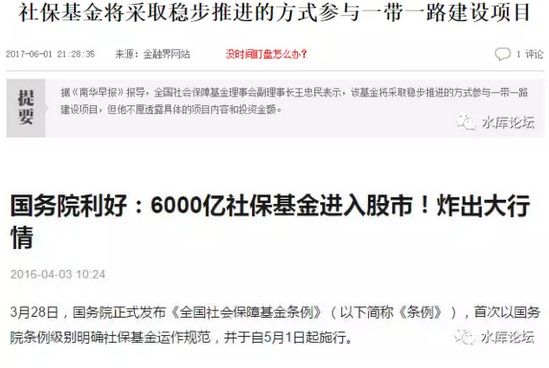
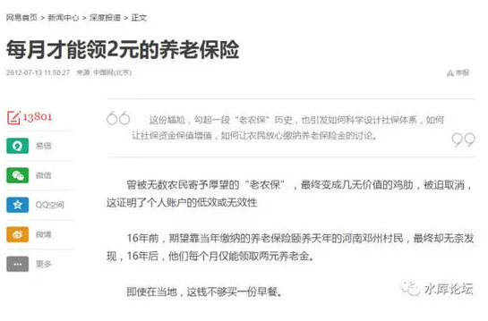
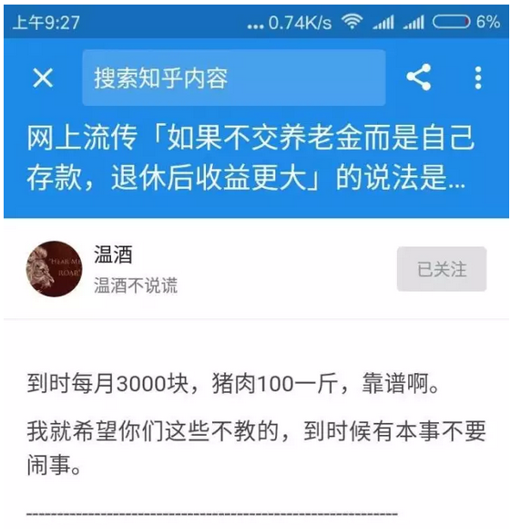
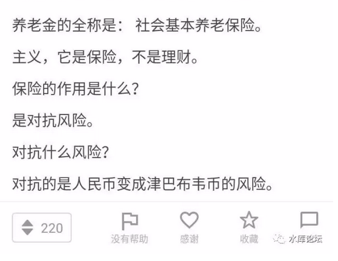

# +--------------------------+------------------+
| 从"术"的层面，商业保险好 | 运营更有效率     |
+==========================+==================+
| 从"用"的层面，社保好。   | 白赚国家便宜     |
+--------------------------+------------------+
| 从"体"的层面，商业保险好 | > 印钞机祸国殃民 |
+--------------------------+------------------+

 

 

 

一）社保黑洞

 

前二天，在知乎看了一个帖子：\[1\]

 

网上流传「如果不交养老金而是自己存款，退休后收益更大」的说法是否属实？

 

这个话题值得一说。社保好，还是商业保险好。

因为具体的答案，十分复杂。要从"体，用，术"三个角度展开。

否定之否定。一般人不容易厘清。

 

 

首先我们从"金钱"的角度，从"术"的角度。

作为一家保险公司，作为一个基金，"社保基金"的管理运作水平如何。

我们的回答是：渣，超级渣

 

 

虽然说，社保基金内部，可能聚拢了中国"学历"最高的各科博士。

进入社保基金任职，也是公务员系统极难的考核。

可国企就是国企。搞不好的。

 

社保基金机构臃肿，行政费用浩大。人事扯皮。观念陈旧。

对新科技，新产业的发展，研究严重不足。

 

过去十年，如果刨去财政部划拨的"原始股"。则社保基金账面"投资回报率"。甚至还跑不赢银行定存。

 

 

 

更为严重的是，作为十三亿国民的大管家。你时不时地看见类似新闻报道。烦恼搞得你心脏病骤发。

 

 

 

 

社保基金是一块大肥肉。

理论上来说，社保基金掌管着十三亿人民的养老钱。

是受人民的委托，代替人民投资理财。

责任重中之重。

 

可是实际操作中，稍微有一些社会常识的人都知道。

"人民"的看家狗，通常是看不牢的。

社保基金是一块无主的大肥肉。数万亿的资金，谁都希望挪用"一点点"来完成自己的指令目标。

ATM和取款机。

 

 

 

接着我们再来看一个新闻。

 

 

 

这个就是社保基金的下场！！

这个故事，说的是河南省邓州市。

金庸小说《神雕侠侣》曾有说到邓州，是襄阳的前沿门户。

 

"老农保"是邓州市地方政府搞的"社保"。

通过把农民联合起来，互助互保，以保险公司大数化的方式运作。

连续投保了16年。

最后农民们可以拿到的是：每个月2元钱。

 

每个月2元钱。

每个月2元钱。

每个月2元钱。

 

不是200，不是2000，不是美金，您看清楚了，就是￥2元/月。

2元人民币。

可以买一个烧饼

可以买半碗米饭。

 

 

 

"社保"运行效率之差，是所有人都心知肚明的。

有人说，换一个"基金经理"，谋取更高的管理回报。

问题是，效率又能高多少呢。

对于数万亿的盘子，你根本找不到"对手盘"。回报率哪怕高1%都了不起了。

 

更根本一点说。"投资"的实质，来自于强劲的金融市场。

以中国A股的孱弱本质，荒漠土壤。就算股神来了，又能赚多少回报呢。

 

 

 

二）奥派的抨击

 

按照中国目前的法规，"四金"之中的社保，公司缴纳20%，个人缴纳8%，合计28%

以六千元工资为例，￥1680四分之一的收入，被社保强制收走。

 

因为恐惧N年之后，社保基金把我们的养老钱，败坏到每个月只能领2元。

奥派长期以来，对"社保制度"进行了严厉的抨击。

 

 

 

概括来说，奥派的抨击，可以划分二层境界。

第一级层面，类似于香港的"强积金"。

 

其核心思想是，"强制储蓄"是必须的。免得月光日空。

但是，100%都是私人账户，不要国家账户。

 

 

香港的理念是，"国营"是腐败的。

谁也不知道几万亿的"社保基金"，大盖子揭开，里面有多少贪污和腐败。

 

因此"养老金"这种事，完全可以中产阶级市民自己管。

不需要政府来管。

 

 

香港"强积金"，雇主出7%，员工出7%，合计14%。

每个人，都有一个"特殊户口"。该账户内的钱，只可以滚动投资。但不到60岁不可以取出来。

 

你可以自由选择自己钟意的基金经理。

一支基金，如果表现不佳，长期亏损。则飞快地被投资者们抛弃。

保持了"基金管理者"之间的竞争，杜绝腐败。

 

更不可能有"挪用"投资ydyl等行为。

 

 

 

"自由"的第二级层面，更为精妙。

因为"强积金"制度，依然是非常地不公平。

 

不公平之处在于，"人口"并不是每一个年龄段平均分布的。

美国有所谓Baby Boom，在战后一代人之间，生育率几乎翻倍。

 

Baby Boom冲击之下，当他们年轻之时，婴儿潮集中买股票，股价就会被扯高。

当他们年老退休之时，会集中抛股票。股价会被压低。

 

这是顺着人口数量的"周期性波动"。

相当于Baby
Boom一代，人为地在股票市场[被打闷棍]。回报会降低。

数以几万亿的财富代际转移。

 

美国推出401K账户的时候，精明的议员们立刻炸锅了。

Anglo-Saxon的顶层精英们，是极其可怕的物种。

人家一眼就看穿了其中的利益和骗局。

 

真正的自由主义者倡导的"养老金制度"。

连"储蓄""消费"都不要强制。

某些年份，就不适合买股票。就适合你去吃光，用光。

 

 

 

三）血酬社保

 

以上种种"经济学"分析，智慧交锋。

"国营"社保，是一种非常低效的制度。

把钱省下来，自己去买商业保险。整个国家会变得更富裕。

 

 

咳咳，对于以上观点和内容。四个大字：

以上全错

哗哗哗打脸的人，马上就来了。

 

 

我把"温酒"先生的帖子转在这里，因为我完全赞同他的说法。

田园奥派关于"社保"的说法，全部都是错误的。

 

你以为他名字叫社保。其实他不是社保。

它真正的名字，叫"血酬"。

 

 

我讲个故事。按照外祖母一辈，现在都八九十岁了。

她们年轻的时候，做的是纺织女工。最初级的职位，生产力效率也十分之低。

 

等她们退休了，现在八十多。"人民政府"关心她们，给她们发退休工资。

每一年春节，姥姥都十分开心。因为她可以掰着指头算"加薪"幅度。

 

按照上班工龄，每一年加1元钱。按照实际年龄，每一年加Ｎ角钱。

按照入党时间，岗位职称，各种抚恤名义。

算下来，每年的"加薪"幅度，高达一百多元。

目前的退休工资已接近1700.

 

 

真是奇怪哉了。你一个上班的人，职场白领。你每年的"加薪"幅度都未必有10%

老板多加你几毛钱，算计心疼得要命。

 

当姥姥眉开眼笑领退休工资时，你有没有想过，谁来发放的这笔钱。

-   是哪一个组织，在给她们发退休工资

-   该组织，钱从哪里来。

-   加薪幅度如何确定。

作为纺织女工，她们当年肯定没有交过"四金"。

 

 

事情的真相呢，发放工资是民政局。背后最终，则由"财政"兜底。

财政呢，财政来自印钞机。

 

这些老太太，年轻的时候工资只有36元。

80岁老了，退休社保却有1700.

 

 

我们之前举了一个"邓州市"，地方政府自己搞的社保计划。

16年折腾到最后，"老农保"每个农民，每月只能领2元。

 

划重点，划重点，划重点。

重点是：[地方政府]四个字。

 

 

同样一份社保，如果让中央政府来搞，则效果大大不一样。

同样缴费16年，同样财务空账，同样基金濒临倒闭。

最后到分钱的时候，每人每月1700元。

 

咦，不是说好的2元么。

对，社保基金只有2元。另给高温补贴费1698元。

 

 

中国的"社保"，根本不是"保险公司"。

它只不过披着一张保险公司基金的皮。但社保的本质，是"血酬"。

 

社保真正隐含的承诺是：

只要你入了我的圈子，给你最低生活保障，最低生活费。

 

 

社保每一年老太太都要计算"加薪幅度"。

工龄工资加多少，年龄补贴加多少。

其实这都是障眼法。

"退休工资"的加薪幅度，就是社会真实通胀率。

社保用猪肉计算，购买力是恒定不变的。

 

 

在《[生产与抢劫](http://mp.weixin.qq.com/s?__biz=MzAxNTMxMTc0MA==&mid=205886171&idx=1&sn=b33795f303ee3230f8a5888903e562c7&scene=21#wechat_redirect)》一文中，我们说道，整个人类社会有二股力量。

-   一股是经济的力量。一切物资财富由生产而来。

-   一股是政治的力量。市场唯一不能包容的，就是免于抢劫。

 

 

一个老人，无论他如何衰老。他始终是一条人命。是人就拥有"政治影响力"。

一个穷人，无论他如何贫穷。他始终是一条人命。是人就拥有"政治影响力"。

 

我们谈论的社保，其实不是社保。社保其实是血酬。

-   保障你最低的生活维系水准。

-   让你别给政府添乱。

 

 

 

所以谈论"社保和商业保险"，哪个回报更高时，中国社保根本不是这个算法。

"中国社保"的隐含回报率，是12%

 

（财政补足12%，12%是通胀率）

  商业保险：   3.5%
  ------------ -----------
  外国社保：   2.5%
  中国社保：   9.5%+2.5%

 

 

今天上海猪肉价格是17.4元/斤。

政府每月给老太1700元，相当于100斤猪肉。

 

那就是永远给你100斤猪肉。

哪怕猪肉涨到3000元/斤，也会每个月给你30万RMB

 

回报远远秒杀一切商业保险。

是为血酬。\[2\]

 

 

 

 

 

四）公地悲剧

 

"缴费十五年，月月吃排骨猪肉"

这么好的事情，连我都眼红。如果大力提倡，岂不是理想社会。

 

 

且慢，且慢，你这个明显属于"撸羊毛"行为。

经济学最基本的定律告诉我们，"天下没有白吃的午餐"。撸的人多了，羊就瘦死了。

 

比较学术的说法，有一个术语"公地悲剧"。

如果人人都来撸羊毛，一定会使得牧场崩溃，草原崩溃，公有制崩溃。

 

 

现实点的分析，政府的钱哪来的。

中国从来都是财政赤字的，几十年没有盈余的。如果再要负担一个巨大的"养老金"体系。

每一个体制内老太，每个月领100斤猪肉。

请问，钱从哪里来。

答案极为简单，只有一个可能：印钞机。

 

 

我们再进一步追问，印钞机开动之后，谁蒙受了损失。

答案是：辛劳储蓄的人。

 

因此，受害者还是人民。

把人民的钱集中起来，再通过"社保"返还给人民。

收获贤人的好名声。

 

从"宏观"的角度而言，社保对整个国家是[没有任何裨益]的。

一进一出，还有"损耗"。贪官污吏上下其手。

 

 

 

从"体"的角度，全世界任何一个正统的经济学家。都是强烈反对"社保"体系的。

 

只要社保存在一天，就会带给我们这个国家持续的通胀。

天下没有白吃的猪肉。

 

 

 

（yevon\_ou\@163.com，2017年6月7日晚）

 

 

 

\[1\]《网上流传「如果不交养老金而是自己存款，退休后收益更大」的说法是否属实？》

https://www.zhihu.com/question/30228632/answer/161121670

\[2\]这部分解释了中国政府为什么坚持25%是公众账户，仅3%是私人账户。

社保缴费，缴多缴少，领取的保费都是一样的。

因为大头是政府的"人命"补贴。
