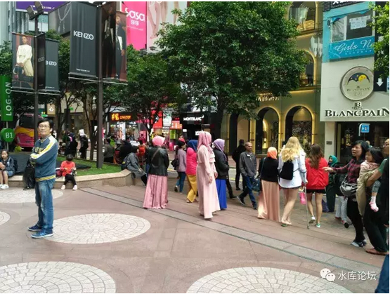
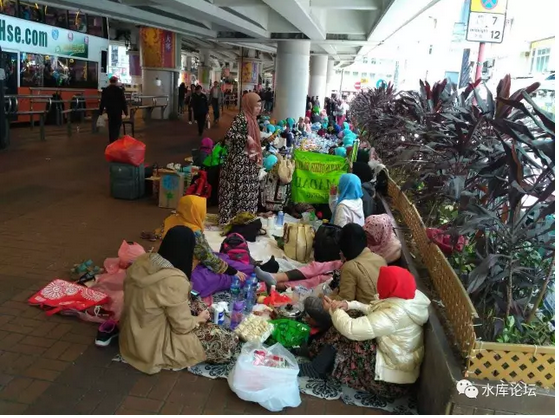
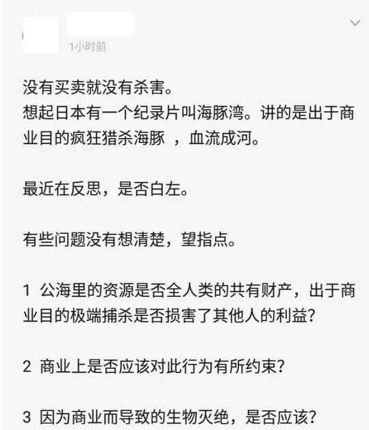
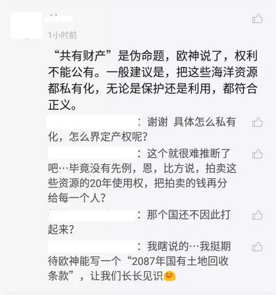
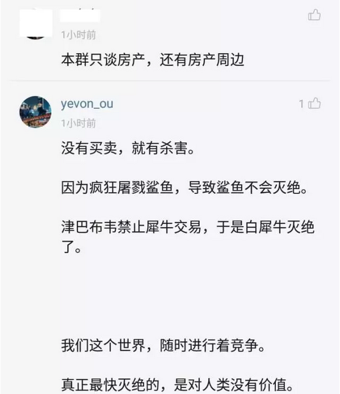

# 没有买卖，就有杀戮 \#F1150

yevon\_ou [水库论坛](/) 2017-06-12

没有买卖，就有杀戮 ~\#F1150~
============================

坚定不移捍卫吃鱼翅的权利。

 

 

一）       香港沦陷

 

有一段时间没去香港了，难免也要过去找朋友喝喝茶。

问问最近房地产市场如何，是否如无良小编传说的一样"创了新高"。

朋友叹了一口气，"哪有啊"。

 

"二手房市场冰冻，价格已经很久没升了"

"涨的都是一手房。尤其是远郊新社区一手房"。

"都是大陆仔在买。一个个似不要命，不要钱似的，数不尽的子弹"。

"不是公报说只有15%么"

"香港也有代持呀。香港人很多都是当年江门，潮汕的移民，内地亲戚很多的。毕竟30%的税"。

 

"30%的税很重要么"。

"很重要。现在最好销的就是KFS补贴30%的楼盘。而二手房，因为实际首付非常非常高。所以就卖不动"。

"30%的补贴，不还是羊毛出在羊身上嘛"。

"是的。所以现在二手房100000/m的地块，一手房都卖到了300000/m。唉，也不知道将来怎么收场"。

 

香港街头这二天，总感觉怪怪的。但又说不出来。

直到我用手机拍了几张，才恍然大悟。

 

"天啊"，我突然反应过来"怎么这么多戴头巾的"。

走在铜锣湾时代广场街头，满目尽是批头巾的。在街上五分钟，竟有六七批之多。

 

 

"香港什么时候也头巾'绿化'了"。

唉，说起这事，朋友就泪打不一处来。"自从去年中菲关系交恶，砸了菲律宾的店铺"。

"于是移民局大幅收紧对菲佣的签证"。

 

"香港菲佣的数量大大减少，印尼籍的佣人趁虚而入"。

"印尼人的服务可好么"。

"怎么能说好呢。信天主教的和伊斯兰教能比么"。

"印尼籍来了以后，虐待儿童的事件就层出不穷。很多人在家里装了摄像头，发现佣人用指甲掐小孩子，还给小婴儿喂吃安眠药"。

 

"印尼人还有一种奇怪的宗教习俗。喜欢在饭菜里，加入'身体的一部分'。她们信奉主人吃了以后，会对自己更宠信"。

"印尼佣来了以后，饭菜里往往就多了指甲，头发，某些不可描述的部分......"

 

俺看着酒楼的虾饺，感觉一阵反胃。

"就算没有印尼人，香港我也不来了"。

"为什么"

"难道你没发现为什么么。因为鱼翅，鱼翅，鱼翅！！"

 

 

难道你真的没有发现么。"鱼翅"作为粤菜的一道核心主料，正在渐渐地从香港的餐桌上消失。

先是所有的政府部门，渐渐的是大型的酒楼。到最后连进出口和家宴都没有了。

 

因为香港冒出来了一批"白左"。

无论哪家酒楼卖鱼翅，他们就到酒家门口去闹。

而香港作为美国文明的附庸，在"白左病"面前是一点抵抗力都没有的。

 

警察不出警，公权力不保护市民。

久而久之，就没有酒家卖鱼翅了。香港逐渐从世界美食之都，沦为禁忌之都。

 

 

二）       海豚湾

 

今天我们想讲的一个话题。其实和鱼翅有关。

 

大约在五六年之前，姚明那个大傻个，在CCAV上接拍了一个公益广告。呼吁"拒绝鱼翅"。

其口号就是：鲨鱼多么可爱啊，割了鱼翅鲨鱼还可以活么。

 

俺看了以后，一边看一边摇头。"体育生就是不行啊"。

"大个头，被人拿了当枪使"。

 

 

我并不是说鲨鱼不可爱，也不是说犀牛不可爱。

象牙，鹿茸，虎鞭，熊胆这类东西的药效，也不在讨论范围。

我只是说，他的根本逻辑就是错的。

 

"没有买卖，就没有杀戮"\-\-\-- 整句话都是错的。

因为没有买卖，所以才有杀戮！

 

 

对于这整个事件，奥派已经有了通盘解释。

在过去二万年中，全世界最成功的大动物，大概是牛。\[1\]

 

-   目前地球上大约有240亿只鸡，总体重0.5亿吨。

-   70亿人口，总体重3.75亿吨

-   13亿头牛，总体重5亿吨。

-   玉米，30亿吨

 

人类每天吃掉4亿只鸡。可是这么多年来，天天吃，月月吃，鸡的数量减少了没有。

没有，反而越来越多了。八十年前，二战时期鸡肉肯定没有今天多。

 

人类天天都吃牛肉。牛减少了没有。

没有。牛的放屁CO~2~，都快成为温室效应首要原因。

 

 

这些事情的背后，至为简单。因为"人工养殖"。

只要一种食物有利可图。自然有人去养殖它。一旦开始养殖，就再也杀不完，吃不完。

 

而且，"养殖业"也是一个日新月异，科技进步的行业。

如著名的"长江四鱼"，千百年来都是野生的，无法驯养。

而解放之后，随现代水产养殖科技传入，终于在50年代被突破。

 

 

也许也有人问，还有一些动物，是不可以"圈养"的。

典型的例子如藏牦牛，鹰。

 

藏牦牛生活在海拔3500米的雪线位置，活动范围巨大。往往要几百平方公里。

这么大的圈子，划个公园收门票。也不知该设几个收费入口。

 

 

但是，一样会有办法"商业化"。

具体的做法，则是"狩猎证"。

 

一张可可西里野生动物的捕猎证，价格往往非常高昂。动辄20\~50W美金。

License的范围，包括一只云豹，一牦牛，三只藏羚羊之类。

 

如果按野生生物圈的互相捕猎，这些DNA的价值么。

哦，一只烤全羊300元。

少爷玩得快活，就值一千倍价值。

 

 

这样的"特许捕猎证"是完全合法的。因此它也是"上流社会"的一种身份象征。

想象一下，当别人还在炫耀苹果，陀飞轮，这么Low的东西。

你背着猎枪，戴着雪镜，八个佣人跟在背后扛动物，可可西里无人区大雪山摆POSE。这是一件多么酷的事情。

名媛一定尖叫吧。

 

所以这个市场是无限的。是无穷无尽的。

绅士名媛，永远有IB需求。

 

 

 

而另一方面，这20\~50W美金是给谁的呢。

当然政府要抽走很大一块。

大头还是要返给青海牧民的。

 

许多人不明白，对"野生动物"伤害最大的人群是哪个。

盗猎捕猎当然是一块。

但人类的活动，栖息地的侵袭，是更大的一块。

 

灵长目动物扩张到哪里。哪里就是大规模的生物灭绝。

他们并不一定是犯罪分子。也可能是普通的农民，牧民。

但是焚林开荒，摧毁鸟蛋，这类行为本身，就在侵占动物的栖息地。

 

摧毁一处鲨鱼产卵的地方，杀死的是几千几万条鲨鱼。

而不是一条。

 

 

但是有了"特许捕猎证"，人和动物的关系就截然不同了。

动物从一个讨厌的"白羊咬死者"，食物争夺者；

一跃成为了"金钵钵"，招财树。

 

服务业的收入，远远超过"农牧业"。

且不说"特许捕猎证"的直接收入。哪怕搞个旅游景点，办旅馆和饭店，导游拍照纪念品，都可以赚到盆满钵满。

进藏文青是永远不缺人的。

 

 

当青海牧民可以从"野生动物"身上赚钱，他们看到云豹就会"网开一面"。这都是财神爷啊。

不仅不会开猎枪，遇见受伤的还会养养好。栖息地多搭几个草棚，帮助小幼兽度过最危险的冬天。

 

 

全世界大约1/2的鱼翅产量，来自于阿拉伯海海域。

如果你想要保护鲨鱼，想要世界上多几条鲨鱼的话。

你根本不需要冲进香港的酒楼去闹。你TMB就是一个SB。

就是一个SB

就是一个SB

 

 

真正的做法，鲨鱼每一年的洄游繁殖，总有几个关键节点。

你在关键节点，多投一点食物。

用微声波或者渔网，驱赶掉一些天敌。

这样鲨鱼的数量，就会成百倍千倍的增长。

这才是真正干实事的人。

 

 

学环保的人，大致都听过那个动人而又煽情的故事。

《全球最后一头雄性白犀牛：40人昼夜实弹守护》\[2\]

 

\>\> 因为人类的贪婪和商业，对犀牛角的需求。

\>\> 导致犀牛大量捕猎，白犀牛濒临灭绝。 

 

 

所以说你SB么，和姚明那个傻大个差不多的蠢。

肯尼亚"犀牛"的灭绝，纯因为肯尼亚是一个"动物保护"的国家。

 

因为动物保护，所以肯尼亚没有"特许捕猎证"。任何人都不能从动物的存活中获利。

因为不能获利，所以当地人对于"栖息地"被破坏无动于衷。

因为不能获利，所以当地人对于"偷猎捕猎"的行为睁一只眼闭一只眼。森林那么大，光靠警察和行政部门，怎么管得过来呢。

 

 

圣母们没有告诉你的是，仅仅在一桥之隔的坦桑尼亚。还有一种"坦桑尼亚白犀牛"，二者是近亲，DNA只有细微区别。

 

坦桑尼亚是没有"动物保护"法律的。坦桑尼亚政府一直致力于出口犀牛角。

此等白左厌恶的行为，严重压低了全球犀牛角价格，损伤了白左收藏家们的价值。

 

如今坦桑尼亚境内有几千头白犀牛，都快泛滥成灾了。

坦国政府一再号召中国人，中国人多多购买犀牛粉，不可告人之好处。

 

 

 

三）       加速灭绝

 

如果仅仅说完第二节，还仅仅是奥派的传统观点。

"科学尚未普及"。痛打圣母，普及科学。

 

那么第三节，则是我今天早上，纯粹个人想到的。

"没有买卖，就有杀戮。反而会加速灭绝"。

 

 

首先我们看野草。

野草是什么，野草就是野草。田间地里到处可见的"草"。

现代农场每年都要买"除草剂"。你玩SimFarm，这笔成本也是省不下来的。

 

 

可是我在想，为什么就没有圣母"保护野草"呢。

野草多可爱啊。花花绿绿的可以写生，多么诗情画意。请不要除草吧。

 

从广义上讲，野草也是"动植物"的一种。幸好它长得不可爱，圣母们看不上。

所以全球每年还能用那么多的除草剂。

野草代表的是什么呢，为什么人类如此"除之而后快"呢。

 

因为野草代表的是：争夺资源

 

一块田里，土壤的养分是固定的。氮肥的肥力也是固定的。

草和稻在争夺着养分。

草长得越茂盛，则稻谷的收成必然越低。\[3\]

 

 

同样道理，如果你放眼到[整个地球生物圈]。经济学的规律极为强大，几乎无所不在。

整个人类生物圈，都在尽最大的努力。竭尽全力在竞争。

每一种生物，都进化到了最优秀。力争使得自己在一丝丝竞争中活下来。

如果不受宠，则会灭亡。

 

 

-   人类作为地球圈的主宰。

-   对人类有益的物种活了下来。

-   对人类无益的物种，得不到丝毫关怀

 

如果一个物种"去商业化"，则意味着该物种对人类毫无益处。

在和同生物圈，同生态位的其他物种竞争时，[废物]会飞快地衰弱淘汰。

如果你不受宠，不仅不能独善其身。

而是被其他兄弟，抢了资源。

 

 

如果鲨鱼不能食用。人类在划分养殖场时，就会把鲨鱼区划给三文鱼。

如果鸡不能食用，二个月之内，鸡就会在地球上彻底灭绝。

把笼子腾出来给牛。

 

 

对于生物来说，"不能食用"才是真正的灭顶之灾。

真正逼到它灭绝的，是同生态位的其他物种的生存优势。

 

2000年前，中国商代时期。华北有5000种以上小麦种子。

经过不懈地筛选良种，扩大种植。目前剩下的已不到20种。\[4\]

您还想做一个"无用"之物种么。

 

 

 

（yevon\_ou\@163.com，2017年6月12日午）

 

 

 

[\[1\]]《比较地球上现存各物种的总重量，人类是不是最重的？》https://www.zhihu.com/question/60480456

\[2\]《全球最后一头雄性白犀牛：40人昼夜实弹守护》http://news.mydrivers.com/1/414/414886.htm

\[3\]《鬼稻威胁全球水稻，浙大科学家揭秘鬼稻身世》http://tech.sina.com.cn/d/2017-06-07/doc-ifyfuzym8184494.shtml

\[4\]其他种子并没有灭绝。DNA在保鲜库里。
