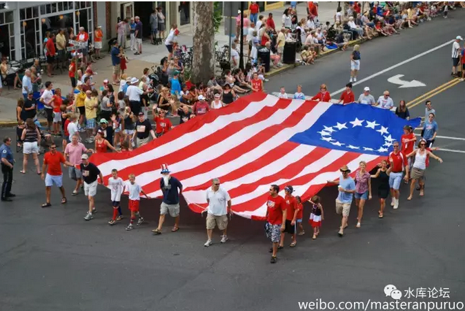
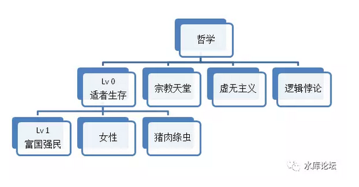
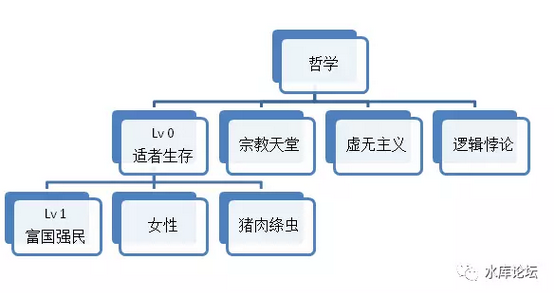
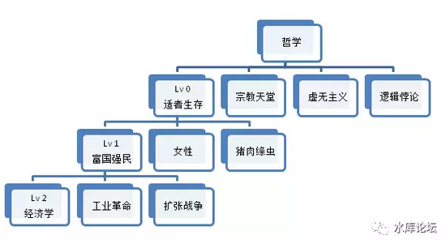
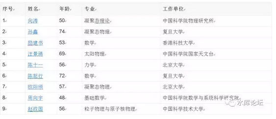
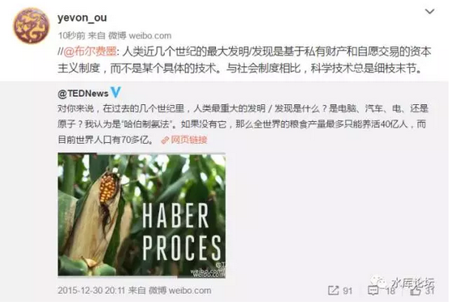
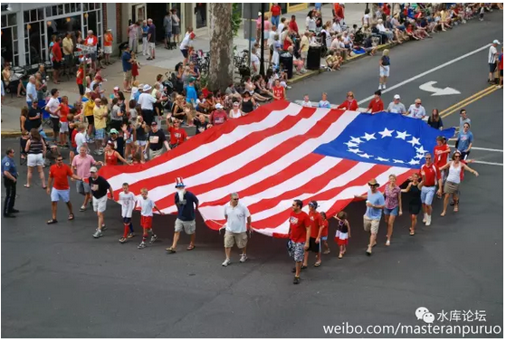
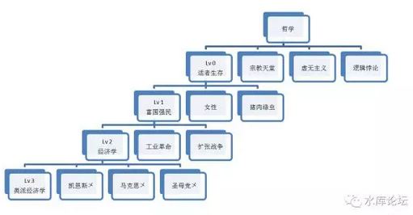

# （2） 富国强民

yevon\_ou [水库论坛](/) 2017-09-22

正本清源说奥派（2） ~\#F1180~

富国强民

 

一）       富国强民

 

"基石"总是最难解释的。第一卷的"公理"写得辛苦，说清楚不容易。

此后逻辑就轻松多了。

 

随着Lv 0："适者生存"接下来的。

Lv 1：富国强民

 
富国强民的概念，也容易理解。

在这个世界上，要活下来，有很多种方法。

 

全世界有240亿只鸡，远远超过"工业革命"之前。更远远超过史前时代，养殖业尚未兴起之前。

但是"鸡"算不算一种很成功的动物呢。恐怕也不能算。

同样道理，猫，狗，牛，羊，恐怕都不能算。

 

 

因为"鸡"的地位，是一种附庸。

是被人类关在笼子里，随时可能杀来吃掉。而且最终也的确是杀来吃掉的。

尤其是如果爆发"鸡瘟"，又或者营养学家说什么鸡肉不益于健康。

鸡被集中屠杀，更是一堆一堆。

 

谁也不愿意象奴隶一样地活着，因此我们现阶段的"适者生存"。主要是指"富国强兵"。

 

-   最强大的，就是最适合的

-   我们要做第一流的国家

-   第一流的国民

 

 

二）       Lv1的bug

 

和Lv 0的推导一样。从Lv 0到Lv 1这个步骤，也是有简化和bug的。

 

其中最明显一个反例，即为"女性"。

女性的游戏生存规则，和男性是完全不一样的。

 

远古时代部落征伐，失败者男性全部杀死。

但女性通常被俘虏。并迅速容纳为"新部落"的一员。

 

在《二性关系梳理》一文中，我们说到；

-   男性的利益，在同一时间和尽量多的女性交配。

-   女性的利益，在不同时间和最强壮男性交配。

因此女性，本身是不参加"男权社会"之生存竞争的。

 

 

好比说，欧美社会，目前普遍对华人华裔"中国崛起"心存警惕。"政治正确"中，亚裔也是受伤害最大的。

可是调查显示，欧美的男性，普遍对亚洲女性没有敌意。

 

包括欧美的上层阶级，一致同意。亚洲的女性：娇小，柔顺，乐于照顾家庭。是非常理想的伴侣。

目前在新英格兰东北部地区，一个非常显著的趋势就是：上层社会，中国人和犹太人通婚。

 

（犹太人是一个颇为封闭的社群）

 

"适者生存"是一个非常复杂的话题。

包括我们看自然界。自然界活得最好的，一般都不是最强大的。生物自有各样活法。

 

女性自带阴暗属性。哪怕"中国"完全失败了。中国女性依然可以活得很好。DNA依然有1/2的概率可以遗传下来。

 

 

另一种"适者生存"的方式，则是猪肉绦虫的生存方式。寄生虫的生存方式。

"活下去"不一定要靠本身的实力。找一个宿主，寄生在宿主体内，也是一种生物诡计。

 

有一些小型民族，极度落后民族，从根本上看，本民族根本再没有复兴的希望。

则他们可以偷渡去美国，偷渡去德国。

然后再设法成为"非法移民"。

 

在北美大陆，他们可以吃美国，喝美国，吸尽美利坚的血。

再生一大堆小崽子，扔给穆斯林。

 

这不就是苍蝇下卵的方式么。

而且目前看，苍蝇活得还不错。不管人家有多脏，人家至少就是活下来了。

 

"鸠占鹊巢"如果能顺带把你人口[灭绝]了。

说不定还能改写历史。

生物竞争，本无优劣。活下来就是王道。

 

 

三）       工业革命

 
对于一个大型的，十亿人口，拥有世界顶级血统的大汉族来说。

无论是女性卖身，绦虫寄生，这些路都是走不通的。

中国人还是要靠自己站起来。

 

因此我们把流程图再往下一格，从Lv 1到Lv 2，进入到"怎样富国强民"。

怎样富国强民？

当然要靠十三亿人口的共同努力。

各行各业，三百六十行，工人农民解放军。全体国民的一起努力。

 

 

譬如说，我这里抄了一段"中科院院士"名单。来源于百度。

 
这其中每一位院士，都是极其宝贵的。都是中华民族的瑰宝。

他们在彼此的学科，都是一代宗师。

每一位都突破了技术的上限，使得中国可以成为一流国家。

 

 

那么，我们为什么要把"经济学"单独并列。并列为主轴呢。

因为经济学是"科学中的科学"。是明珠。

 

-   如果说，物理学是所有自然科学的基础。是总纲。

-   经济学，则是所有社会科学的基础。是总纲。

 
我们知道某位院士，某位专家，他们是非常重要。

某位炼钢大师，没有他就没有高质量板材，没有不锈钢管。\[1\]

某位农业大师，没有他就没有杂交水稻，没有亩产千斤。

但是，这些"人才"加起来，也不如一位"经济学家"重要。

 

 

你譬如看21cn的北朝鲜，1960年代的西朝鲜。

北朝鲜几乎拥有"工业革命"时代的一切煤铁科技。再问邻国买一些种子，也是不难。

北朝鲜也不乏"尖端"科学家。卫星都能发射。

可是北朝鲜能摆脱贫困么，不能。

 

 

和经济学比起来，其他一切的"数理化"都是末道。都是"用"。都是边缘科技。

只有经济学最最最重要。

 

经济学决定了一个社会百倍，千万，万倍的财富差异。

（确切的称呼，应该是政治经济学）

 

 

四）       经济学的王冠

 

一个人的命运啊,当然要靠自我奋斗,但是也要考虑到历史的进程

 

在《[论儒·法·禅宗·基督自治和道教的复兴](http://mp.weixin.qq.com/s?__biz=MzAxNTMxMTc0MA==&mid=211128132&idx=1&sn=ca586ee1556e5e43c9949624294e49e6&scene=21#wechat_redirect)》\#10一文中，我们说道了"大学"的概念。

"大学之道，在明明德"。

 

 

这里的"大学"，并不是后世University的意思。

这里的"大学"，其对应的名词是"小学"。

 

儒家学者们认为，"儒道"才是大学。才是国家运转和维持的根本大道。

其他数学物理化学，纺织炼钢石化，统统都是"小道"。

核心与边缘的关系。

 

因为你多一个产业，少一个产业。无非GDP的多少。

真的不能造卡车，进口即可。

而"大学"之道，却是国家运行的根本。

 

 

譬如说，中国的这张"院士"名单。在1960年的时候，这些人就已经是壮年。

可是他们做出了成绩没有。没有。

再给他们岁月，能做出成绩么。撑死了一个北朝鲜。

 

只有等"改革开放"的春风，中美建交，加入WTO，中国大幅度引进西方文明的技术。

专家们才能应势而起。

你一个人的能力再强大，始终不能和"时局"对抗。

国家的意识型态，才是繁荣与衰败的分水岭。

再譬如说，美帝的国力如此强大。军事科技的领先优势，几乎让人绝望。

有什么东西是可以击败美帝的，苏联专家想破头也想不出。

 

赫鲁晓夫轻飘飘地说，"这又何难"。专家毕竟还是不如领导啊。

"美国的子孙会生活在社会主义制度下。但美国人很聪明，我们会把社会主义一点点喂给你们，直到醒来发现已是共产主义了"

 

 

咳咳咳，不能说得太细。这个话题点到为止。

经济学家才是捍卫我们这个国家最坚实的基础啊。

 

 

 

五）       奥派经济学

 

经济学没有流派。

重申一下，经济学没有流派！

 

世界上只有二种经济学；

世界上只有二种经济学：

讲道理的，和不讲道理（喝咖啡）的。

 

 

不讲道理的经济学，漏洞百出，自相矛盾。

面对归谬和质疑，它回答不了。他就派警察上门，然后请你去喝咖啡。

 

在"讲道理"的经济学中，奥派天下无敌。

只要你坐下来，大家平心静气讲道理。奥派天下无敌。

近年奥派在中国，如同野火燎原一般完全无法阻挡。因为奥派讲道理，公开辩论，才能收服人心。

 

我不是说你啊。

我是说在座的各位，全部都是垃圾。

 

前二天微博"吴主任"那个白痴，写了一篇"**吴主任，为什么我总隐约觉得，碰到一切问题都用奥学原理来解释，也挺危险的？真能包治百病？奥地利学派就没破绽吗？**"

http://weibo.com/1853047530/F7v5e10Sm

 

我跑上去刷刷二个字，"SB"

浪费哥哥一元钱。

 

 

这个家伙的错误在于，他对于"奥派"的理解是断层的。

东抄一句，西抄一句。

把几位奥派最重要的名人大佬，百度百科，各自传记都抄一段。

拼凑在一起，你以为就是"奥派的评语"了么。

 

TNND，你这若是硕士论文答辩。

我一定不会让你过。

 

（yevon\_ou\@163.com，2016年6月14日晚）

\[1\]推荐微信公众号：《轧钢之家》zhagangzhijia
