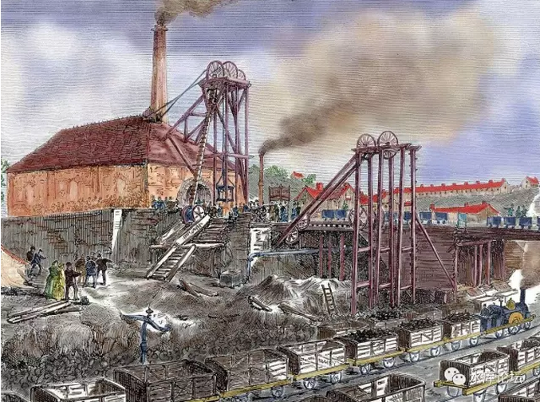

# （3）交易产生财富

yevon\_ou [水库论坛](/) 2017-09-22

正本清源说奥派（3） ~\#F1170~

dT\>0

 

 

一）       奥派是什么

 

人类在中古时期，也就是"农耕"时代，几乎没有经济学。

当时的官员，无非就是劝说皇帝要行"仁政"。勤俭节约，杜绝浪费。

 

真正的经济学"萌芽"，要等1776年亚当·史密斯向英王进献《国富论》。阐述在纺织和葡萄酒贸易之中的一些原理，切实增加财富。

我们可以看见，1776是什么年份。那一年USA都闹独立了。

 

 

一般史学家认为，真正意义上的"工业革命"，始发于1750年的英国。

"工业革命"之后，化石中的能量被释放，人类的生产力就以十倍，百倍的速度向上增加。

 

随着潘多拉魔盒"工业力量"的释放，人类也需要研究一整套"技巧"如何才能更好运用这股力量。

就像张无忌学会了九阳神功，但他还需要学习乾坤大挪移，否则就是"浑身的力气，却使不出来"。

 

 

给你一个民团，几千号人。

该部落应该怎样组织，公司应该怎样运行，怎样进行企业管理。

这是世界上最最最难的问题。

"企业管理"迄今都没有完善的最优解。

 

 

对于一个国家来说，他的道理是一样的。

中古时期的"农耕"社会，运行相对十分简单。

最主要的产物，只有一种"粮食"。

最主要的原料，也只有一种"土地"。

而且科技树千年不变。从汉代到明代，仅从铁耙升级成铁犁。

 

到了"工业时代"，这一切都极大变化了。

作为一个现代化国家，光"门类齐全"工业部门就几十个，包括但不限于：

 

-   煤炭开采和洗选业

-   石油和天然气开采业

-   化学原料及化学制品制造业

-   黑色金属矿采选业

-   食品制造业

-   纺织服装、鞋、帽制造业

-   造纸及纸制品业

-   医药制造业

-   有色金属冶炼及压延加工业

-   交通运输设备制造业

-   电气机械及器材制造业

-   通信设备、计算机及其他电子设备制造业

-   电力、热力的生产和供应业

 

 

这长长的名单，光看着就觉得晃眼。而且他们彼此之间，还互相供需。三酸二碱既是成品，又是原料。乙烯是一切的基础。

管理整个国家，就更难了。

 

 

所谓"生产关系要适应生产力"。生产力发展了，组织关系自然需要调整。

第一轮被牺牲的，是曾经以为"高不可攀"的皇帝和贵族们。

 

工业革命不到150年，基本上全世界所有的"皇帝"都完蛋了。

曾统治人类地球五千年的"帝制"，在生产力的面前，毫无抵抗就土崩瓦解。

 

 

但是，旧秩序撕毁了，新秩序如何建立。依然没有头绪。

"弯道超车"的诱惑始终存在，各国纷纷摸索出了自己的"特色之路"。

 

概括来说，纯以历史论，工业革命的"经济制度"经历了以下几种：

1）1750\~1850英国自由贸易时代

2）1850\~1900德国关税同盟时代

3）1900\~1950苏联计划经济时代

4）1950\~2000西方凯恩斯时代

5）2000\~ 圣母时代

 

是非成败转头空。

青山依旧在，几度夕阳红。

白发渔樵江渚上，惯看秋月春风。

一壶浊酒喜相逢。

古今多少事，都付笑谈中。

 

 

在每一个"英国时代""德国时代""苏联时代""美国时代"。他们都提出了自己的一套理论。

都搞出了自己一套"经济学"。

 

相对来说，则是亚当斯，熊彼得，马克思，凯恩斯等人轮番上场。每个人都是"大师"都是"伟人"。

效果呢，毫无疑问，都是错的。

 

真理只有一个。

真理兄弟s，自然都是伪货。

 

 

文明的竞争，相当于你方唱罢我登场。

一个老牌的先进国家，自然也拥有最雄厚的"理论储备"。对相关经济学研究更深。

白左圣母，自诩为掌握了宇宙的真理。

 

 

可是在文明的竞争中，老牌强国反而不能保持"领先"的角色。鲁莽的"晚辈"们，搞自己的三板斧。GDP增速更加快，更高的赶超了你。

如果你秉持真经，反而跑成了第二。

那一定是经书错了。

 

迄今人类依然没有找到"最佳"组织形式。

 

经历了计划经济，凯恩斯主义，混合经济，福利民主等一系列折磨之后。

终于有人跳出来问，"错在哪里"。

"有没有更底层的东西"。

 

 

有没有"经济学T-1层的道理"，我们能否探索更本源的东西。

使得我们有足够的智慧，可以[解析]马克思主义，可以解析凯恩斯主义。

 

为什么这些主义，最开始的时候可以获取成功。

为什么这些主义，在后期钝化无力。

施政的优劣观，哪些政策是正确的，哪些政策是错误的。哪些政策是正确中含有错误的。

 

 

这一些东西统称为：讲道理

难道你还不明白，天底下的经济学分二种：讲道理的和不讲道理的。

"讲道理"的经济学：就是奥派

 

 

奥派从一二条最基本的公理出发，象几何学大厦一般，一层一层以逻辑构建整座经济学大厦。

奥派力争做到"完美无瑕"。任何一个逻辑上的瑕疵，都完全不可以忍受。

奥派立下野心，可以解决一切经济学难题。并应付一切经济学疑问挑战。

 

奥派从来不号称自己是"实验科学"。

象马克思主义这种"先饿死300W人，集体农庄搞搞看"的事，在奥派从来不会发生。

 

奥派也从来不是"神神棍棍"。

象凯恩斯主义这种"In one hand, in another hand"，在奥派也从来不会发生。

奥派是科学。不是巫术。

 

 

 

 

二）       奥派基础公理

 

奥派基于几条最基本的公理。

1）           dT\>0

2）           有限理性

 

第一条公理，我们称之为《[[经济学第一定律]](http://mp.weixin.qq.com/s?__biz=MzAxNTMxMTc0MA==&mid=205864469&idx=1&sn=0b04583f8b94361c7a52f260bb7ccae1&scene=21#wechat_redirect)》。阐述了全部经济学的奥秘。

 

"*尊敬的先生，你号称经济学能让我们的国家变得更富裕。可是纺织女工织布，农夫耕作。你一不织布、二不耕地，请问你创造的财富，从何而来？*"

 

正确回答："陛下，财富来自于交易"。

 

在整个表格中，我们看见Lv 1的目标，是"富国强民"。

强大这种事，你找一个钢铁专家，火箭专家，水稻专家。他们对于国家的"帮助"都是显而易见的。

 

但是"经济学家"的作用，就不是第一眼看得出。

国王忍不住要问，你说经济学"创造"财富。财富从何而来。

 

 

亚当·史密斯的回答是："交易创造财富"。

我国不仅仅出产葡萄酒，我国还出产交易。

一个樵夫，有一把小提琴。

一个音乐家，有一把斧子。

斧子交换乐器，[物资]并没有增加。[财富]却增加了。

 

 

如果把"交易"这个概念再外沿一点。假设有"成千上万"件商品。集中在一个"集市"交易。

则"交易"再配置，所能创造的价值，就更为惊人。

有些物资，对你完全都是无用之物。对于别人，却是恰到好处。

具体，可参见淘宝C2C店铺。

 

目前，一个象法国这样6000W人口的经济体。

"交易"产生的财富，也远远超过了"生产"。

大概是"交易"75%，"生产"25%

商业创造的财富，是工业的三倍。

 

-   T代表Trade，贸易。

-   dT是微积分符号，代表T的微小改变。

-   dT\>0，就是任何一个微观的角落，Trade轻微增加，都是好事。

 

 

譬如说，经济学中有著名的"帕累托最优"。指的是一个经济体，在现有的科技之下，所能达到的最大生产力。

传统教科书上，帕累托最优是三重最优。

1）           生产者最优，生产量最大化。

2）           消费者最优，消费者的口味最佳化

3）           生产/消费比例最优。

 

 

但是在dT\>0的公式下，整个帕累托最优可以简化成一行字。

-   dT=0

 

 

如果生产手帕，和生产肥皂的商家，还可以进一步优化。

手帕商和肥皂商就可以做个交易，dT\>0

 

如果再也无法优化。则T达到顶峰，一切交易改良机会均已穷尽。

学过微积分的人都知道，T最大时，dT=0

消费，生产/消费比例，同理。

 

 

dT\>0还有一个推论，即"任何不能增加贸易的政府调控，都是坏事"。

我们一直看到，我们的政府，乐此不疲地推出一项又一项的"调控措施"。

每一项调控措施，都号称是"加强管理"，执政爱民。

 

对于每一项市政政策的分析，一般人往往各说各有理。无所适从。

这时候，你只要把dT\>0往上套。

-   交易是不是增加了

-   自由是不是增加了

 

创造财富，要么就是"生产"，要么就是"交易"。

 

政府这个机构，一不耕地，二不织布。

政府既然不生产，如果不"增加"交易，那么新政策就是坏的。

 

 

dT\>0这个公式，严格地说来，就是经济学界的能量守恒定律。

中世纪的巫术文化曾经搞得很复杂，走了很多弯路。"能量守恒定律"一出来，17世纪绝大多数的学术论稿，都可以扔进垃圾堆去了。

 

对于经济学界也是一样。我们的生活中，充斥着太多"凯恩斯"学派的错误论文。

你只要把dT\>0往上面一套。

看看政府管制以后，交易是比以前多了，还是少了。

决大多数的论文都可以扔掉。

 

 

三）       有限理性

 

奥派需要二条公理，出了dT\>0之外，还有一条"有限理性"。

这个是什么，明天再讲。

 

（未完待续）

 

 

 

(yevon\_ou\@163.com，2017年6月14日晚)
