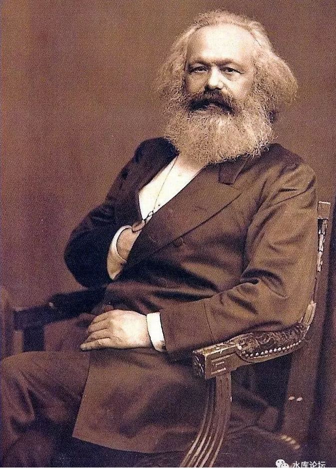
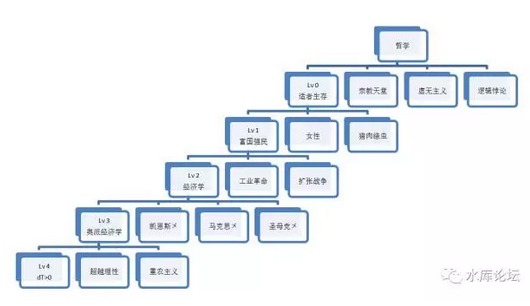
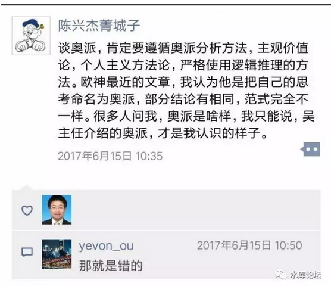
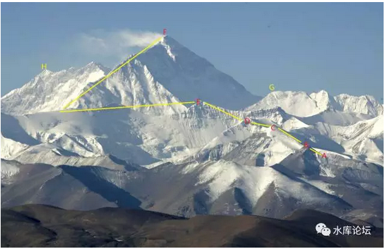
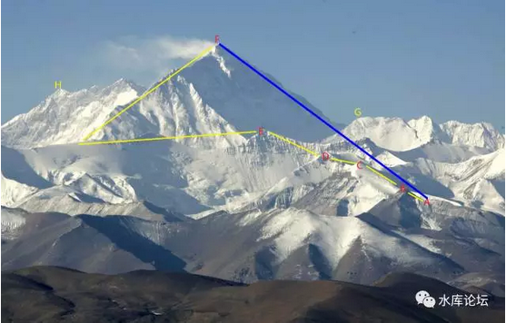
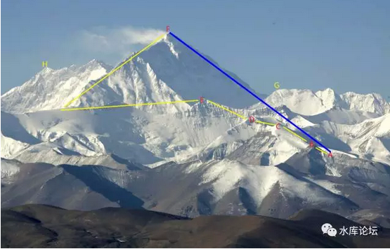

# （4）有限理性

yevon\_ou [水库论坛](/) 2017-09-22

正本清源说奥派（4）\-\-\-- 有限理性 ~\#F1170~

-   直到今天为止，奥派依然没有取得对凯恩斯学派的绝对胜利。

-   市场经济依然没有取得，对计划经济的绝对性胜利。

 
一）       指令经济

 

大约二年之前，我在青岛涵碧楼。

那一天，看着小孩子们在沙滩边堆城堡，玩沙子。我突然意识到，"市场经济是不可行的"。

 

为什么。因为当时有五个小孩子，平均年龄约在6岁左右。

她们的任务，是搭建一道沙丘城墙，长度大约4米。可以连接起二块巨大的岩石，形成一道山隘。

 

他们为此尝试了整整一个下午，五个小孩子，来来回回地拎塑料桶，拍打沙土。

可是他们最终失败了。

小孩子们搭建的沙城，总是歪歪扭扭的。不仅长度拉不直，而且很容易崩塌。

 

 

我看在眼里，其实我不说。

要搭建好的，牢固的城堡。一个首要的秘诀，先是要掺水。

泥沙中增加一定的水分。提高其黏度。

 

其次要拍实。

拍打一定要压实。压制紧密，压紧以后的沙堆才不会轻易崩塌。

 

 

我在旁边看着，可是我不教。

身为大人，如果我下场的话。按照我的估计，五个孩子若听话乖巧，只要一个小时，就可以搭起这座沙丘的城堡。

抵御蚂蚁大军的攻击。

 

可是如果我不出手的话，仅仅靠这五个孩子的"自由和协商"。

恐怕再给他们一个周末，沙城也搭不起来。

 

 

 

二）       市场经济

 
我们来看"市场经济"。

 

市场经济是基于这样一种假设，"政府不需要管理，市场会创造一切"。

道教所说的"清静无为"。

《道德经》"我无事，而民自富；我无欲，而民自朴"。

 

 

"市场经济"基于几条原理假设：

1）主观价值论。人心是难测的，无法量化的。再好的计算机，也算不出女人到底想买哪件衣服。所以要把买衣服的权利，留给女人自己。

 

2）个人主义方法论。当人在为自己的利益干活时，人是最勤奋的。

只有放手让人民自由寻找福祉，才会效率最高，路径最优。

 

3）奥派方法论。幸福不可以叠加。一个人的痛苦，不可以用二个人的笑颜来抵消。这属于不可累加。

 

 

奥派，或者市场经济，他承诺一个"尽善尽美"的世界。

或者说，你顺着dT\>0去推理。很快可以达到"帕累托最优"。

 

只要能做到100%的市场经济，就可以发挥100%的国力。

就可以达到产出最大化。

就可以富国强民。

 

 

咳咳，

因此，奥派无法说服凯恩斯。

市场经济无法说服计划经济。

Why？

 

 

因为奥派还缺少一根关键性的支柱：

"任何人的眼界都是有限的"。

 

 

 

三）       登山

 
如图。假设我们玩一个游戏："登山"。

规则是，谁站得越高，谁就赢。

 

第五代战斗机对三代机。

喷气式对螺旋式。

飞机大炮对长枪大刀。

只要我比你高一阶，武器和文明的竞争就是代差。

 

 

好了，现在我问你，"登山"这个游戏，应该怎么玩。

假设你的起点，在A点。

 
从A点开始"放眼四顾"，你觉得最佳奋斗目标，应该是B点。

 

B点算是一个小山坡的"峰顶"。

到了B点，想要继续提升的话，也是有办法的。

视线之内，下一站是：C

 

 

到了C点之后，下一个巅峰是D。

但是C到D之间，并不是一帆风顺的。他有一个下坡，要先下后上。然后再慢慢爬到D点。

 

 

中国历史上，西周岐族曾经花了非常多的科技点，点在"战车"上。

包括车轴的打磨，在当时是绝对绝对的黑科技。

木材做成圆轮，还不能散架。

当时没有润滑油，也没有橡胶。轮子能够转起来，想想都觉得牙酸。

 

可是好不容易西周把"战车"科技升到满级了。

放眼一看，战车都快被淘汰了。"骑兵"才是未来。胡服骑射才是未来。

 

 

从战车Lv 10到骑兵Lv 1，就类似于C点到D点。

他是先有一个"降级"重练的过程，然后再升上去。

 

幸好C点D点相离不远，赵武灵王还可以说服舅父。

放弃大量现有的沉没投资，重新练级。

 

 

从D点再升级，下一个"山顶"是E点。

可是从E点开始，他的升级就遇"瓶颈"了。E点的上方是天空。

 

中国从秦代到晚清，封建王朝2000年。

中国人的特色兵种，是"弩兵"。

 

关于弩的科技一升再升，从竹弓筋箭，到复合弓，地中海射箭法，后期甚至搞出了"床弩"这种逆天武器。

 

 

再之后呢，之后没有了。

因为"弓"这种武器，在冷兵器时代，潜力几乎挖掘殆尽了。弓的射程和杀伤力，动能已到了尽头。

 

一直到中国人和西方世界遭遇，被英军揍得象猪头。

中国人才恍然大悟，原来武器的发展方向，应该是"火枪"。

靠化石硝磺的威力，而不是人力发射。

人力有时而穷，但火药的力量就无穷无尽了。

 

 

诺贝尔火药，却是另一条科技树。

牵涉到化学，冶炼，弹道学，数学，微积分，材料形变，列阵兵法.........

中国人如果想要学习火药科技，就得全套从新学起。

之前的"弓马骑射"统统扔到垃圾堆里。

 

英国人相当于从H点来的。

 

四）       捷径

 

好了，回到我们最初的话题，"为什么有人不信奉市场经济"。

 

 

奥派被称为"新古典主义经济学"。因为古典主义经济学，早在1776年亚当·史密斯写《国富论》的时候，就已经奠基了。

自由交易，交易产生一切财富。

问题是，有人不信邪啊！

 

 

各位在小学，中学教育中，一定都读过《马克思主义》政治经济学。

马克思学说的核心是什么，《资本论》核心中的核心是哪一句话。

 

微观有序，宏观无序！

 

马克思从骨子里面，他是不信邪啊！

"市场经济"保证的是这样一种状态，在"市场经济"的协调下，各项效率最优化，物资生产达到最佳。

相当于你爬山的速度最快。

 

 

可是马克思他不信邪，他要做伟人。在他看来，"你们的格局太小"。

框架重于勤奋！

水库一直强调，框架重于勤奋。战略高于战术。

做事情的整套手法流程，远远重于加班几个小时。方向比速度更重要。

 

马克思心想，我可不可以弯道超车呢。

如果我在宏观上，直接就可以看到目标重点F。那我可不可以设计一条道路，直通F呢。

 
（如图，马克思设计的蓝线AF。这条道路绝大多数时候都不是最优化的，充满了深坑和坎坷，但却是最快到达终点的）

 

野球拳一到九级全都是渣。第10级就冲爆掉了。

没人教你能猜得到？

计划经济的口号，从来都是"微观无序，宏观有序"。\[1\]

 

 

 

五）       计划经济的升潮

 

 

20世纪初，计划经济开始涨潮。

研究计划经济，你一定要想通一个问题，"为什么会有人痴迷于计划经济"。

 

 

集体农庄惨不忍睹，乌克兰大饥荒。

斯大林大约杀掉了1/3的俄国人。中国的炼钢铁，大饥荒。

 

累累尸骨，但是并没有妨碍"计划经济"成为显学。

哪怕杀了这么多人，但1950年之后，计划经济反而风靡全球，亚非拉国家独立首选。

 

包括在美国，美国WASP衣食无忧，绝对不可能被收买的上层阶级，依然有许多人亲善"计划经济"。

1950年代帮助苏联的美国人，几乎全部都是出自于信仰，而不是金钱。

为什么。

 

 

计划经济的真正魅力，还是在一句话："弯道超车"。

人们信奉的并不是苏联。人们信奉的其实是力量，绝对的力量。

为了力量，可以拿出3000W人命来血祭。上层社会对此绝对不会眨一下眼睛。

请参阅《我们会信奉邪魔么》~\#F900~

 
计划经济承诺了更快的增长速度。

 

马克思预言了一条路，一条从AF直达的路。

虽然计划经济"效率"比较低，折算为爬坡的速度慢。

可是如果我"路径短"，我不还是可以超车么。

大伙咬牙干起来，三年超英，五年超美。

 

 

如果奥派不能从[正面]回答："框架比效率更重要"这个问题。

则奥派注定是不得人心的。

市场经济无法击败计划经济。

 

 

 

六）       有限理性

 

 

谈论经济学，有一个前提是绝对不可以回避的，即"有限理性"前提。

我们每一个人的智慧都是有限的，都只能看清眼前的三尺之地。

不要说让你估算100年之后的科技走势，哪怕让你估算20年，你推算得准么。

算准早去买0070.HK（腾讯）股票了，您还不早发大财了。

 

每一个人智慧都是有限的。站在A点，可能最远只能看到C点。他根本不知道远方还有一个F点。

三国志的孔明再厉害，也算不出2000年以后"火枪"最厉害。

 

 

因为"有限理性"的假设，所以才有"计划经济"的萌芽。才有马克思主义学说空间。

马克思才可以倨傲地教导你："微观有序，宏观无序"。

生产葡萄酒干什么，赶快生产"煤铁复合体"去。

 

马克思：

1）  存在一个伟人，伟人看到F点。

2）  其他人都是猪，看不见F点。

 

 

身为奥派，如果你想击败马克思主义。你就必须正面回答这个问题。

答案十分简单；

1）           伟人也看不到F点

2）           伟人和众人，拉不开距离

 

 

其一，虽然社会主义国家时常有"天降伟人"的传说。但是在现实中，历史数十年的运作结果表示，"伟大领袖"并不比普通人更聪明。

 

《资本论》大约成书于1860年代。当时，正好是英国工业革命向欧洲扩散。而德国鲁尔区煤矿大显身手的年代。

 

对于那个年代来说，最最最高科技的就是"煤铁复合体"。燃煤来炼钢，炼钢再挖更多的煤。整个国家的钢产量就不断上涨。

而在19世纪，"钢产量"就等同于强国标准。

 

 

可是遗憾的是，哪怕刚从马克思成书开始，"煤铁复合体"就落伍了。

第二次工业革命，以电能为主，化学染料工业为辅，德国因此成了第一强国。

 

再下一轮，以石油工业为主。碳氢化合物，以其低廉的成本，彻底击败煤炭。

1890年时，美国的石油开采量占全世界90%以上（部分归功于洛克菲勒），是绝对的石油国。

因为廉价的能源成本，美国才飞速GDP，成为世界第一大国。

 

可是Distrill在当年属于绝对的"非正常"行业。和今天的页岩气挖矿差不多，异议很大，破产很多。

一个计划经济的集权政府，是否会允许石油业优先发展。我很怀疑古人的眼光。

 

再往后，下一个轮次是汽车和高速公路。

电子和精确制导产品。

互联网和信息技术............

 

 

从历史上看，我们从未看见任何一个政府首脑"眼光超人"之处。绝对没有任何一个领袖预言到了计算机的崛起。

你问他们"二十年后先锋科技"，绝没有任何一个G20元首说得出。

 

"领袖优先看到F点"，是一个谎言。

 

 

其二，哪怕技术让"领袖"进步了，也不代表需要计划经济。

 

譬如说，最近很多人忧虑"超级计算机"。甚至有人担心，超级计算机会使得中国重回计划经济社会。

 

超级计算机，的确使得政府获得了更高的管理能力。

但问题是，超级计算机也使得"企业"获得了更高能力啊。

政府和企业的实力，依然没有拉开。

 

 

最早的时候，中国"企业"力量极度薄弱。连造手机的流水线都付不起，造汽车还需要"牌照"，统筹资源免得竞争。

可是随着时代的进步，手机连锤子都能造了。

汽车牌照也接近于无。

 

民营企业进一步发展的话，"千亿"级别的项目也可以接单了。

这意味着铁道部都不再需要。此类"大型工程"项目可以完全放开牌照。

 

"超级计算机"并不会使得中国的社会变得计划经济化。

超级计算机，只会使得企业的规模变得更大。

"最佳规模"由过去的数万人，变成百万人级超级大公司。

企业越来越象国家。

 

 

让我们来看，"所有人都看得见F点"，在经济学上意味着什么。

"千亿铁路"，可以由民营建造，意味着什么。

 
如图，从A点到F点，走最短的距离。而且用最高的效率。

我们坐缆车上去。

只有市场才能造缆车。

 

 

 

七）       结语

 

二年之前，我在青岛海滨。看着小孩子们搭沙丘。

我领悟到"如果领导人的智慧，远远超过民众，则计划经济效率高于市场经济"。

 

计划经济与市场经济之辩，在于；

-   [领袖的智商，并不远远高于民众。]

 

 

我们有幸生在这个时代，商界精英人才辈出。

因此，我们可以自己管理自己，自己搭出沙丘。

这才是驳倒马克思的根本理由。

 

 

 

（yevon\_ou\@163.com，2017年6月21日晚）

 

 

 

 

[\[1\]]有一个参考例子，是你妈从小打着你手心，逼你考大学。

你一边哭，一边躲，"我想出去玩"。

你妈发火道，"不行，路我已经帮你选好"。

18岁之前，小孩子的眼界是不如父母的。很多人会说，这是因为幼儿青年论。

其实在统治者的眼中，人民何尝不是幼儿。
