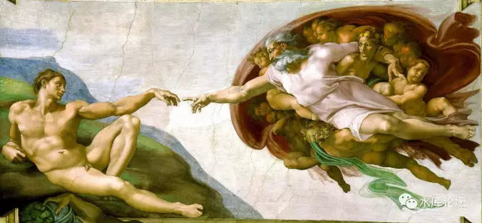
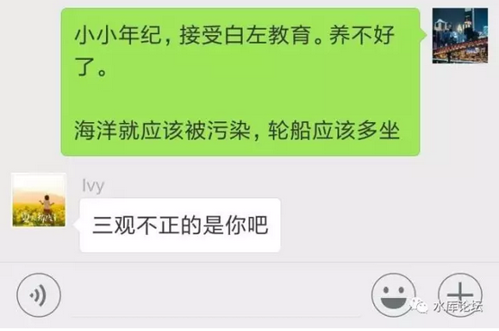
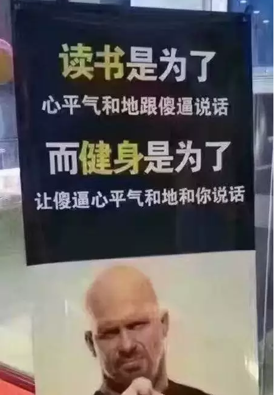
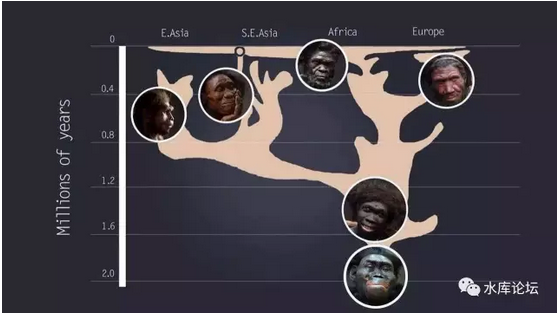
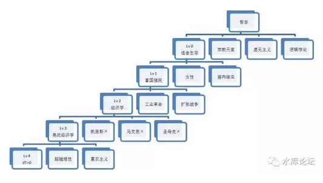
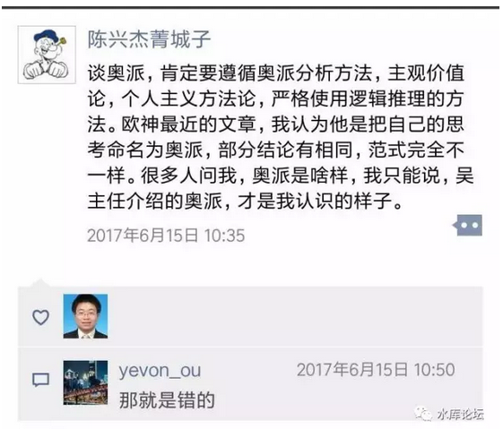

# （5）田园奥派

yevon\_ou [水库论坛](/) 2017-09-22

正本清源说奥派（5）\-\-\-- 田园奥派 ~\#F1170~

一个马基雅弗利主义者和自由主义的决裂。

 

 

一）       讲道理

 

怎样和一个SB讲道理。

 

和SB讲道理，是天下一等一最难的事。

所谓"鸡同鸭讲"，有时候，你觉得坐你对面就是一头猪。

对方满脑子的电线短路，杂七杂八地混在一起。根本不知道逻辑在哪里。

 

这种事情，如果遇到宗教界人士，则会更严重一点。

不管你说什么，对方的回答永远都是"菩萨说的"。

"耶稣教诲"

"真主有旨"

"m主席说的"

 

 

你让他别买保健品吧，别练气功吧，别喝绿豆汤，跳广场舞声音不能开太大。

讲这些事，宛如踩到他的尾巴。他跳起来八丈高。别说听进去，连反思都没有。

 

怎么样和一个SB讲道理。

如果对方死活不肯和你讲道理。掰死了死脑筋。有态度，无理智。请问如何沟通。

 

 

南梁梁武帝萧衍，崇信佛教。到了晚年，数度出家。

皇帝皇后，甚至亲自拿了竹蔑，帮高僧刮肛门。（古代没有卫生纸）

所有的人都劝皇帝，这样做是不对的。佛教并没有法力。可是萧衍不为所动。

后来"侯景之乱"，侯景一口气打到建康。

求神拜佛，全没有半点效果。萧衍活活饿死在宫城。

 

 

1840年，第一次鸦片战争。

英国人要求"开放口岸，治外法权，应收帐款不许赖账"。

而中国人自有自己一套逻辑，双方鸡同鸭讲，完全说不清谁是"正义"。

 

正义的结果，是双方打了一仗。从广东一直打到镇海，再打到大沽口。

大清国塞防，几乎全线崩溃，损失超过2000万两白银。

最后不得不"认怂"，开始接受了英国人的话语权。

 

二）       正义

 

什么是正义？

这个本应该是最简单，最浅显，最直白的问题。却被白左们混淆得毒害中国学生。

 

你去看自然界，羊吃草，狼吃羊，狮子吃狼。

你说，狼是正义的么，狮子是正义的么，羊是正义的么。

弱肉强食，才是正义！

 

 

不要说什么冠冕堂皇的话，因为我们的祖先，也是从众多的杀戮和繁殖中，脱颖而出的。

如图，当年人类有众多远亲。"智人""尼安德特人"，这是把这些笨家伙都杀光了，现代人类才全是非洲夏娃的后代。

 
我们一直在反反复复讲一个"元定律"。

元定律就是：适者生存。

活着就是正义！除此之外，再无别的定义。

 

 

我们为什么要追求真理，追求物理化学，追求实事求是。

因为这些事情的背后，可以带给我们力量，可以带给我们生存。

 

你想象一下，你和一帮绿教徒"讲道理"。

绿教徒坚持要抢劫你的家财，抢你的女儿去做卡费勒。说这一切都是真主的旨意。

而你坚决不同意。

 

"争议仲裁"的结果，就是你召来了300枚导弹，5000吨的弹药，一股脑地把绿教徒都炸上天去见真主。

而穆斯林开始念经。

 

事情的结果，是双方都"宣称"自己获得了胜利。

你看着满地的肉浆，觉得物理研究院的新型号又有进步了。

而穆斯林则宣称获得了"天国"的赏识。

 

 

我们从一开始就说到，有Lv 0的道理。

二个人讲道理。一定要有"共识"。粤菜师傅要有沟通基础。才能继续讲下去。

Lv 4的道理沟通不了，就从Lv 3开始。

Lv 3的道理沟通不了，就从Lv 2开始。

 

如果双方"根本性"的歧义沟通不了。那么就从Lv 0开始。

Lv 0就是科学扔300枚导弹，把伪科学炸成肉酱。\[1\]\

 

 

三）       田园奥派

 

自由是手段，还是目的？

\-\-\-\-\--yevon\_ou

 

在奥派之中，有一个令人作呕的流派，即"田园奥派"。

微博吴主任，黄花非鱼之类，属于这个SB。

 

"田园奥派"的特点，是他们把"第一性"原理搞混淆了。

田园奥派致力于建立一个，人人自由，人人幸福，自由最大化的社会。

田园奥派认为：自由就是目的。

 

 

田园奥派的缺点是：完全无法说服人。

你譬如把三个人放在一起；

-   田园奥派：我们最大的目的是人人获得自由

-   老太一：最大目的是供奉菩萨

-   老太二：最大目的是供奉真主

 

你把这三个人关在一个房间里，再讨论三天三夜。

谁也不能说服谁。

 

 

而如果你把"马基雅弗利"主义者和二个老太关在屋子里呢。

马基雅弗利主义者掏出手枪，"啪啪"二枪。

吹着冒烟的枪口说，"市场经济可以造手枪，菩萨不能造手枪"。

"所以我是对的，你是错的"。

你看，这里就分出了对错胜负。

 

 

水库的番外篇文章，\#10是竭尽全力，尽十年功力写的《[论儒·法·禅宗·基督自治和道教的复兴](http://mp.weixin.qq.com/s?__biz=MzAxNTMxMTc0MA==&mid=211128132&idx=1&sn=ca586ee1556e5e43c9949624294e49e6&scene=21#wechat_redirect)》。

而\#F20，马上就是《一个马基雅弗利主义者和自由主义的决裂》。

 

 

你要知道，真正的大道，绝对不是田园奥派，绝对不是自由主义，也绝对不是Liberal。

真正的大道，你叫奥派也好，叫马基雅弗利主义也好，叫xx主义也好。

"大道随行，不忘本心"，本心只有一个：活下去。

 

 

自由绝对只能[是手段]，自由绝对[不可能是]目的。

这是根本原则性的差异。而原则信仰，是绝不动摇的。

 

上次和一个中国顶级的经济学家见面。他提出一个问题。

"如果全国13亿人口，都自愿使用迷幻剂，自愿醉生梦死。死在Matrix里面。你要不要拯救人类文明"。

"我愿意"

"可你这是违反了12.999999亿人的意愿。违背了自由主义，你成了大魔王"。

"存菩萨心，行魔王事"

"苟利............"

 

马基雅弗利主义者是清醒的。他在关键时刻，是会和"自由主义"分道扬镳的。

马基雅弗利主义者的利益，就是使得中华民族的血脉，火种，可以传递下去。活下去。

 

让每一个人活得很快乐，并不是我们的目标。

 

[挪威童话：]

 

从前有一个小镇，它有一位英明的国王。仁慈而智慧，英俊而善良。

有一天，一个女巫路过小镇。她向国王示爱，遭到了国王的拒绝。

女巫大怒若狂，在井里下了诅咒。

 

第二天清晨，全镇的人都发了疯。流淌着口水，在泥地里打滚。捡起泥巴互相丢掷，吃地上的脏东西。

村民们很不高兴，因为他们的国王发了疯。

只有国王，坚持不肯吃猫啃过的狗屎，还试图给他们穿上衣服。

 

仁慈的国王痛苦万分。他回到王宫静静沉思。

当天夜里，国王来到村子中央。当着所有人的面，喝下了整整一大桶水。

整个村庄瞬间沸腾。老百姓们喜极而泣。庆祝他们敬爱的国王，终于恢复了理智！

 

 

四）       田园奥派的不自洽

 

从理论上来说，我们也可以清楚地指出，"田园奥派"的逻辑不自洽之处。

 

"田园奥派"设想的，是这样一种社会。

自由的边界，是另一个人的自由。

所有的人，都有自己的领地。保持着不受打扰的权力，互相之间通过交易和贸易，来分工合作。

 

 

对于"田园奥派"的理论模型，我们只要问一句话，竞争呢，竞争哪去了！

我们知道，这个世界上，的确会有聪明人，会有SB。

聪明人天天研究数理化。

SB拜佛拜菩萨，开斋节，还有家长群的圣母白莲花。

 

 

随着时间的推移，领地之间的实力差距会越来越大。

崇尚科学，崇尚数理化，崇尚实事求是，自然国力越来越强大。今天中国刚下水了055舰，全球最强Destory。

 

白左圣母白莲花，绿色环保恐怖分子，LGBT份子，内心脆弱易受伤害份子，却把国家糟蹋折腾得不像样。

美国同级的DDG10000，每艘造价高达35亿美金。而且只造三艘。成本的大部分大头，都是被环保圣母婊害的。

 

我们知道，从1945\~2017，是人类历史上少有的，一段极漫长的"超长和平时期"。

对于和平的价值，我想主流白左界可能高估了。

 

和平是一种扭曲。

如果地球上分成诸多社区，每一个社区各有其信仰和行事规范。有人信科学，有人信耶稣。

时间久了，社区会分出优劣。

 

 

美国的"世界警察"其实是一种扭曲。

这种强加的，强制的和平，抹除了效率和优胜的正义。\[2\]

只有在强制和平的环境下，邪教和圣母才有生存的土壤。

 

 

你如果撞墙了，你就会感觉痛。

人的身体内有大量的神经细胞，神经并不能治病，它只会告知你很疼。

 

可是你千万别打麻醉，千万别把神经封闭了。

因为知道疼，你才知道停下。如果打了麻药，直接就会撞骨折了。

 

只有不断的打脸，才能让白教，绿教停下来。

 

 

 

类似的思想，我们已经再三阐述，参见

-   《但丁密码》~\#F700~

-   《[论娼妓，芭蕾，征服，和暴政](http://mp.weixin.qq.com/s?__biz=MzAxNTMxMTc0MA==&mid=208528829&idx=1&sn=c64de8b46c112e438bbab0877f48f1ae&scene=21#wechat_redirect)（下）》~\#200~

 

天行有常，不为尧存，不为桀亡。道家讲究顺其自然。

 

 

美国人喜欢"世界和平"。美国人强加的"和平"，才是导致最近几十年乱象的根源。

而"田园奥派"幻想的"无暴力"社会。[你们和美国人又有什么区别呢]。如果让田园奥派得势，那帮蠢货肯定又会搞出大灾难。

 

一个生态系统，如果不包含淘汰机制，那我认为它大概率是错的。

 

 

五）       结语

 

天行有常。宇宙的规律就是这样的，少一个元素都不行。

"暴力"就是这样一个元素。

缺乏"暴力"的社会，一定是错误的。

 

 

至于怎样把暴力溶入经济学，我们下篇再讲。

 

（未完待续）

 

 

 

（yevon\_ou\@163.com，2017年6月28日晚）

 

 

 

 

\[1\]你如果也能研制得出导弹，那你就不是野蛮人。

\[2\]电影《红河谷》中，英军统帅冷酷地说："没有对野蛮的无情征服，怎能显现文明的优越"。
