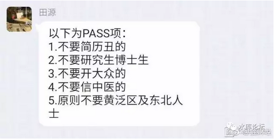

# （6）竞争与淘汰

yevon\_ou [水库论坛](/) 2017-09-22

正本清源说奥派（6）\-\-\-- 竞争与淘汰 ~\#F1170~

续之前1\~5，回复\#F1170获取

 

物竞"天"择，适者生存

 

 

一）鞭子

 

首先，我们看一个水库小密圈的帖子。

 

在这个帖子中，所有人都曲解了我的本意。参见[\#F200](http://mp.weixin.qq.com/s?__biz=MzAxNTMxMTc0MA==&mid=208528829&idx=1&sn=c64de8b46c112e438bbab0877f48f1ae&scene=21#wechat_redirect)

我的本意是，"曝政"是必须的。

 

 

有社会常识的人都知道，君王运行秩序，有"恩罚"二种手段。

恩惠笼络人心，还常常被人赞颂为"仁政"。皆大欢喜。

但是，如果你整天被人高歌"吾皇圣明"，可不可以治理国家呢。

肯定不可以。

 

 

因为在经济学中，有一条非常可怕的定律："边际效应递减"。

一岁的时候，我家小孩哭闹。最初，一粒毛豆就打到了。立刻手舞足蹈，这辈子没吃过盐水毛豆。

可是渐渐地呢，毛豆就打不住了。要巧克力。

要奶油蛋糕。

要会发光，发声响的"芭比公主玩具"。

 

这样娇纵下去，总有一天她的"阈值"会非常非常高。

要买百万元级的跑车，搞上流社会的宴会和派对。才能使得Paris
Hilton的"心情"稍微好受一会会。

对子女的无限娇纵，终会使得父母不堪重负。终有极限。

 

 

换作"政治伦理学"，如果你想要"收买"对手。那么注定是失败的。

因为对手的胃口会越来越大，越填越大。

商人不管有多少钱，都不可能"靠钱买回来"对自己的安全。就是这个道理。

 

 

而"赏罚"的另一面呢。是鞭子。

狠狠的一鞭子甩上去，你就老实了。

 

 

在对子女的教育中，如果你的子女无限娇纵，无限放纵。

欲望越放越大。

终有一天你要STOP的。

也就是无论再疼爱的子女，你第一顿打总是免不了的。

 

打孩子的目的，不是为了发泄。

而是为了让她生到这个世界上，第一次认识地球规则：有阻止你的力量。

 

 

 

我们谈论西方政治，并认为欧美法国穷途末路。

因为在"民主制"下，政治是一条腿走路。

 

民主的基本原理："互相竞争为选民提供更好的管理"。

可见，民主是"有赏""无罚"。

 

 

在民主的制度下，必然导致选民的胃口越来越大，政客们竭尽所能满足娇纵。

而缺乏那一鞭子。

缺乏那一鞭子，制止贪婪的人民。

这样的社会，怎么搞得好！

 

事实的结果，则是欧美的"福利社会"越来越严重，选民躺着吃选票。

整个国家罔顾长远利益，罔顾透支山空。

五百年积累，五十年挥霍一空。

 

 

欧美需要复兴，就需要"一鞭子"，需要狠狠地把人民抽醒。

需要痛，需要哭，需要苦难，需要死人。

需要尸横遍野。需要战争屠杀，需要《但丁密码》。

 

这目前民主制内不现实。

 

 

 

二）阴阳

 

道家讲究"阴阳"。

 

就象"赏罚"，他是二个字。赏是拉近人，罚是疏远人。

单有一股力量。是无法平衡的。

 

同样的道理，"阴阳"；

道家相信，任何一个体系，任何一个横切面维度，一定需要同时存在二种力量。

阴和阳，一个拉近，一个疏远，否则体系无法平衡。

 

 

好了，我们啰啰嗦嗦写了近1000字的引言，可是这事和奥派，和"经济学"有什么关系。

那么我问你，阴阳对称。

 

自由的背面，是什么？

几乎所有的奥派学者，都没有深入地考虑过这一个问题。

"任何一股力量"都不可以无限增长，无限增长的结果，就是癌症，就是大灾难。

 

我们可以想象一群"自由散漫""无所事事"的人们，组成的社会。

那么，"自由"的反对面，遏制"自由"的力量，是什么。

 

自由的反面，是竞争

 

 

 

三）淘汰

 

自由主义，是这样一种完美的制度。

 

"每个人享有最大化的自由，直到触及另一个人的边界"。

 

理论上，你每天坐在家里吃薯片，看电视，好吃懒做不工作，Coach
Potato，那也是你的"自由"。

你不讲卫生，不肯读书，沉溺宗教，自私怯懦，你搞基死宅，也是你的"自由"。

做一点点坏事可以，但做多少坏事又不可以呢。

 

我们的社会，总有各种各样渣滓事，渣滓人。

不是每一个人，都"一颗红心，三好学生"。积极向上，追求正气的。

 

"自由主义"制度下；

"昭和男儿"和"平成死宅"，居然是平等的。

还记得我们在《正本清源说奥派》（5）田园奥派，最后一句收尾句么： 

一个生态系统，如果不包含淘汰机制，那我认为它大概率是错的。

那么，请问，在"自由主义"的体系下，淘汰机制是什么？

 

 

要回答"淘汰"这个字，首先要回答：

-   什么是淘汰。

-   淘汰的定义是什么。

 

有幸的是，我们这个系列，是从《正本清源说奥派》（1）开始的。是从Lv
0开始的。

因而"淘汰"是什么，我们轻易地就可以回答。

 

-   物竞天择，适者生存

-   不能适应者就被淘汰。

 

如果再套用到Lv 1的道理，则:

-   不符合生产力

-   不能最大化生产力发展者，被大国淘汰

 

 

你看到中国人移民去非洲，南美，太平洋岛国。

当地的土人，懒得要命。白天剥二个香蕉，一躺就是十几小时。

中国人忙忙碌碌，日夜操劳。

中国人应该生存。土著被淘汰。最终成为Aboriginal。这才是天道，这才是正义。

 

 

顺带着，我们也可以衍生出"道德"的概念。

什么是道德。

-   勤劳，朴素，求知，科学，这就是道德。

-   懒惰，奢侈，虚荣，浮躁，这就是堕落。

 

"道德"的定义，和"生存"类似。

不被进化淘汰的，就是道德。

 

 

 

四）奥派的社会组织方式

 

在奥派的"社会"里，我们有自由。那么，如何"淘汰"？

答案是：饿死。

 

 

一个"自由"的社会，最大的特点，他是没有"君父"的。

没有政委牧师阿訇大长老，来时时评判你的作为"对不对"。

 

伊斯兰国家，你穿一条超短裙出门，就被喀嚓了。

你穿泳衣出门，被判断亵渎神灵，也被喀嚓了。

 

（沙特女性穿超短裙，被判处石刑）

而如果你生活在白左社会。

说一句，"我讨厌Gay"。

"我讨厌女权份子，都是丑女"。

"我喜欢吃狗肉"

于是你也被喀嚓了。

 

但是这一切，在"自由"的社会都不会发生。

自由的社会，没有人干涉你的行径。

 

这赋予了整个社会非常大的生产力，从而可以"试错"，可以创新，人民可以获得更幸福充实的生活。

生产力极大解放。

物竞天择，只有"天"才能裁决对错。

人世间的政委牧师阿訇大长老，都不可以审判你。

没有人"喀嚓"你，那怎么淘汰呢。

"选择"太多的时候，你怎样知道"对错"呢。

应该顺着哪一条路走。哪一个主义才可以攀登高峰呢。

 

一个穆斯林和你说，不要吃猪肉。印度教徒和你说，不要吃牛肉。佛教徒和你说，什么肉也别吃。

海底捞告诉你，牛羊猪三拼最好吃。我个人支持海底捞。

 

 

象这类问题，奥派的回复是：

各走各的路，到最后统一结算。

 

 

美国的白人圣母不吃"转基因"食品，只吃non-GMO。

从营养学上，二种食品并没有本质的区别，"非转"反而加重了成本和病虫害。

所以这是一种"智商税"，吃有机食品，事实上损伤了"白左圣母"群体的经济实力。

 

日本人特别崇拜"工匠"精神。好好的东西，明明可以机器生产，精度高。

偏偏要手工生产，质量还差几级。

日本人乐此不彼。

这也是一种智商税，削弱了日本的国力。

 

 

中国的老人，特别喜欢买"保健品"。

冬虫夏草，东阿阿胶西洋参，已经被证明没有太多营养价值，甚至不如猪蹄。

可是中国老人乐此不疲，耗费了大量退休工资。

是一种智商税，削弱了老人阶层的经济力量。

 

 

奥派的框架中，这些行为都是允许的。

但每一场无效率的试错，都削弱了你的经济实力。

当money \<0，你就被饿死。

 

奥派"淘汰"的方法是饿死。标志是money \<0.

你钱输光了，那么饿死活该。

因此我们特别讨厌慈善。慈善事实上混淆了奈何桥的界线。

 

 

 

五）主动竞争

 

在奥派设想的"理想国家"中，整个社会分成一个个的"小团体"。

每一个团体，都有他们自己的信仰和风俗。

无暴力。通过自愿商贸而往来。

 

但是这么多的"小团体"，必然有一些勤奋，有一些懒惰。

有一些正义，有一些邪恶。

类似于中国人和黑人的勤奋度。

 

有些糟糕的习俗和信仰，加速了小团体的堕落。

日本人信奉"工匠精神"，十几年没有翻身。因为生产力实在太低了。

欧美圣母的"纯手工""天然"结果也差不多。

 

 

 

除了"被动竞争"，坐等你败家花完之外；

还有一个很重要的概念"主动竞争"。

 

我有权不和你做生意，有权卡死你，有权闹得二败具伤。

这也是一个很重要的概念。"自由"的巨大分支。

 

这个概念，如果用一个更简单的词来形容，则是：

歧视

 

 

奥派是肯定歧视的，奥派是包容歧视的。

奥派的概念之中，"歧视"本身就是基石的一部分。

 

我们有权不对某些人某些事，提供产品和服务。

哪怕少做了生意，我有权少做生意。

 

象那些同性恋者，女权份子，圣母婊，福利党，黑蜀黍，绿教徒，邪教老太；

你不对他们歧视，如何加速他们的出清。

当然是要仁人志士联合起来，联合对她们歧视。逼到她们无路可走。

 

同样道理，Liberal也可以反过来对直男进行"歧视"。你可以不嫁给直男。

相互角力的结果，看看谁先灭绝。

这才是天道。

 

歧视有理

我们要求，公开歧视的权利

 

 

 

（yevon\_ou\@163.com，2017年7月21日晚）。文末贴了一个小密圈的帖子，有点长。

 

