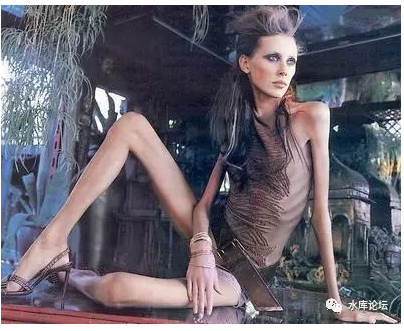
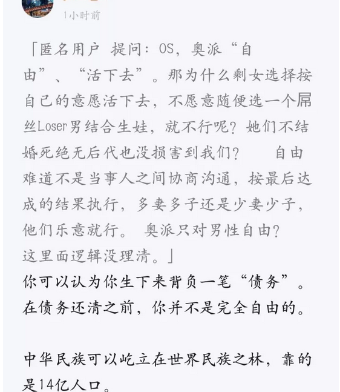
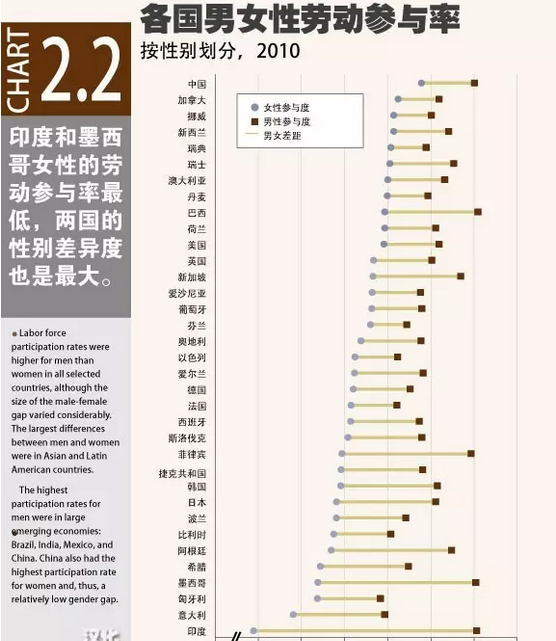
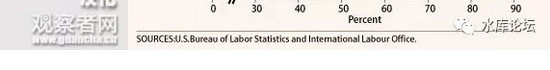
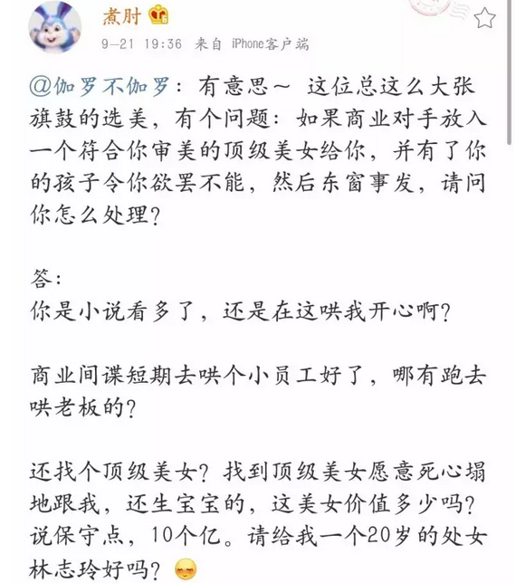

# （七）反女权宣言

yevon\_ou [水库论坛](/) 2017-09-22

正本清源说奥派（七）\-\-\-- 反女权宣言 \#F1170

本文是《正本清源说奥派》系列之第7篇。可在微信公众号"水库论坛"，回复\#F1170，获取前6篇。

 

 

我们根本不承认"女权"。

 

 

一）女权

 

"中华田园女权婊"，目前已经声名狼藉，一败涂地。

 

按照女权份子的说法，所有的坏事，都是"田园女权"们干的。包括但不限于；

-   赚三千，花五千

-   不生孩子

-   不做家务

-   长得丑还特矫情

-   全世界男人都欠她的。

 

按照"真"女权份子的说法，所有的坏事，都是"田园女权"们干的。

因为Feminism的名声实在太臭，从微博，到微信，到知乎，引发了全社会的公愤声讨。

 

所以"真"女权份子忙不迭地"划清界限"。

坏事都是猪队友干的，我们是好人。

只要把出名的"欣欣向蓉"都踢走。剩下沉默的大多数，永远都是好人。

 

 

按照"真"女权的说法，女权代表着人类光辉而正义的一股思潮和进步思想。

-   千百年来，女性处于压迫和受剥削的地位

-   女性失去工作的资格，工资低于男性。

-   女性在职场受歧视。高层董事会，政府高官，女性比例很少。

-   女性承担生育的压力。

 

"真"女权份子认为，她们追求妇女解放，追求推翻社会不公和歧视，追求妇女权益和利益。

她们从事的，是一项光辉而高尚的使命。

 

哪怕"田园女权婊"再声名狼藉。那只是技术问题。

[就"女权"本身。女权运动Feminism是光辉灿烂，正确正义的？]无数世代后回想起，仍然会觉得自豪骄傲的。

 

 

我们今天要写的是：

根本不存在女权运动。

女权其本身，就是错误的。邪恶而可耻的。

 

把你的根刨了，你滚吧。

 

 

 

二）女权运动

 

女权，什么是女权。在奥派经济学中，根本不存在"女权"的说法。

 

dT\>0，奥派经济学中，只有一个变量，那就是"自由"。

哪里有自由，哪里就有繁荣，富裕，数之不尽的钢铁，科技和创新。

哪里有自由，哪里就有幸福，解放，正义光辉和人性的绽放。

 

我们仔细看"自由"这个词。

它是不涉及性别，肤色，血统，种族和宗教的。

你待在自己屋里嗨。我才懒得管你是男人，女人，变性人呢。

 

只要有100%的自由，奥派便认为这个社会是尽善尽美的。

dT=0，当再无法增加任何自由时，全社会达到帕累托最优。

 

 

 

自由的对立面，是"暴力"。暴力所到之处，自由便不复存在。

譬如说，暴力可以强迫你把粮食上交。

暴力可以强制你读技校。黑五类不能报考大学。开公司要拿执照，还有各种各样的管制行业，民营资本不许进入。

 

 

现在我们看回"女权"的话题。在"女权"领域，有暴力存在么？

答案是没有。

 

中国无论是宪法，还是大大小小的刑法民法。对于"男女"都是没有任何区别的。

身为法人代表，无论男性女性，工商税务法务待遇都一样。

身为职业，中国没有任何一条法律规定："女性不能当总统"。

刑法领域，没有任何一条法律规定，"男杀女不用偿命"。

 

没有针对女性专属的"暴力条款"。

 

 

就是说，在"国家暴力"的层面，男和女是平等的。

因此男女就是平等的。

 

中国就是"100%尽善尽美纯女权"国家。

女性的权益已经达到了巅峰，没有进一步追求的余地。

 

 

 

三）结果不平等

 

现代女性嘶喊的，"女性收入不平等"。

"升职不平等"。

"生育不平等"。

 

这些是不平等么。是对女性的压迫和歧视么。

No，no，no，no，no，no.

 

 

我们纵观"三千年封建史"，要把历史掰开来看。

女性裹小脚，折断脚骨。这是对女性的迫害。是不平等，是"女权"。需要修正。

因为这里面涉及到了"暴力"。

当事人显然是不希望骨折的。

 

减肥算"暴力"么，不算。

哪怕饿成骨感美女，也是女性自愿的。 

                       

"女性不能当官，女性不能科举"。

这也是不平等。因为国家是属于13亿国民共有的。公务员系统必须对全体国民开放。

你用"法律"规定，女性不能从政。这是"政府暴力"的涉入，暴力是错的。

一夫一妻制，是一条巨大的暴力。

 

 

但是你看现代人的"女性收入较低""女性可选择工种较少""女性升职较慢"。

这些是不平等么。No，no，no，no，no。

 

因为这里面没有涉及到"暴力"。

分界线是"暴力"。

 

国家是不可以明文规定"不录取女公务员"的。

但是他可以公务员考试。

如果你考试考输了，的确考不过男生。

那我也没办法呀，亲。

 

 

 

四）不在擅长的战场

 

看到这里，部分"纯真女权"份子已经气疯了。

 

什么，你考"40kg负重20公里越野跑"。

什么，你考"Linux核心底层进程调度之时间碎片断裂内存片回收HASH颤动"。

什么，你考"黎曼空间近地线张量实变函数在十一维拓扑变换中的连续性假设"。

 

你这不是刁难女性么。你这不是纯心欺负人么。

你还不如考一考针线女红，不如问桌子上40瓶漾肤水的分类，保证考死你。

 

 

对不起，出哪一类的考题。不是我决定的，是上帝决定的。

人类社会发展到哪一步，生产力发展到哪一步。[需要解决哪些问题，提供哪些就业岗位]。

这些是由"生产力"决定的。上帝决定的。

 

对于今天女性收入低于男性，我感到十分抱歉。

但这不是我的错。不是社会的错。

是上帝的错。

除了你的父母，你谁也不能怪罪。

 

 

人类的历史洪流，洪洪向前。

说不定哪天战乱，"肌肉男子"顿时会吃香，文弱书生没有价值。

说不定哪天脑颅插管"纳米针"，心灵控制领域女性占据极大的优势，收入是男性十倍。

 

但是这一切，都是上帝决定的。

哪个资源要素值钱。恐龙为什么会灭绝，哺乳动物为什么可以进化。

一个人的命运呀，当然要靠自我奋斗，也要考虑到历史的进程。

 

 

对于"真理"来说，只要没有暴力胁迫。没有宪法上的歧视。

那么我们就认为这个社会是"公平"的。

关键是游戏规则的公平，而不是终点公平。

 

 

更何况，从某些意义上说，"以柔克刚"的家庭妇女，还比她们辛辛苦苦在外打工的丈夫，过得更舒服（日本）。

 

 

 

五）女性资源的错配

 

前二天我写了《[[新一代低值女]](https://mp.weixin.qq.com/s?__biz=MzAxNTMxMTc0MA==&mid=2651016238&idx=1&sn=b9082c23bdd1cdadbe9e2bb69d43ef18&chksm=80721a3db705932bac4c5b8585d4437e0675aba85e6e2355189ff323d441f4363dcee59ea1ec&scene=21#wechat_redirect)》，把女权份子都归入C，只能配门口保安王大锤。

遭受了"女权份子"们猛烈的炮火攻击。后台留言1750条，半部红楼梦长度。

 

 

在《[[新一代低值女]](http://mp.weixin.qq.com/s?__biz=MzAxNTMxMTc0MA==&mid=2651016238&idx=1&sn=b9082c23bdd1cdadbe9e2bb69d43ef18&chksm=80721a3db705932bac4c5b8585d4437e0675aba85e6e2355189ff323d441f4363dcee59ea1ec&scene=21#wechat_redirect)》中，俺阐述了这样一个观点。

"女性需要改变，要敬畏和追随市场的需求。否则就容易沦为低值贱货"。

 

女权们累计扔了十几吨的榴莲过来。她们的意见，可以总结为:

-   "姑奶奶是开了天眼，有文化的人。不再是封建时代的小媳妇"。

-   "我们干嘛要逢迎男人，独身过得也很好"。

-   "女权的教育，使我追求个性解放，更高级的精神世界"。

 

 

首先呢，作者是一个资深奥派。无论是奥派，还是Marketing市场原理，道理都是相通的："价值是多元的"。

 

1000个人看，有1000个哈姆雷特。

不同的人，有不同的评分体系。情人眼里出西施，野蛮女友嫁太贤。

有人打C也有人打A。

 

 

但是，"正本清源说奥派"写到这里，现在是第七卷，之前还有六篇。

我们层层累进，讲的其实是一个道理："价值观虽然是多元的，对错却是一元的"。

如果你不懂，建议翻翻前六篇。

 

在宇宙中，存在绝对的，唯一的"对错"。

那是什么："活下去"！

 

 

我们允许你各种各样的尝试，你可以尝试共和制，民主制，奴隶制。

我们也允许你各种各样的喜好，《掀桌子的一代人》。

你可以不吃猪肉，不吃牛肉，不吃有机合成肉，不吃永和大王，真功夫，味千拉面......

 

但是这一切的一切，"多元化"是有标准的。

标准就是"活下去"。

 

 

一切的多元化，归根到底是一种生存竞争。

大家尝试不同的方法，看看哪一种更解放生产力。

 

我们的祖先，在远古的"生存竞争"中赢了下来。

因此我们的血脉，才流传到了今天。

 

 

而"剩女""女权""圣母"都属于基因和变异低贱的烂货。

当一个剩女表示，"我为什么要迎合别人，我要高傲矜持地做57岁老处女"。

不生孩子

 

这其实表示，在这"一生一世"的生存竞争中，她是一个Loser。

[她对不起她的祖先。祖先赐予了她生命，而她却没能把DNA延续下去。对国家，民族，家族，都是一种亏欠。]

 

一般而言，我在后台留言，都会对这几百条低档C女，回复二个字：

 

贱货

六）生存竞争

 

根本不存在"女权主义"。根本不存在女权。

女性没有被压迫，中国就是100%完美的女性保护国家。

 

既然女权并不值得追求，剩女们"崇高牺牲"的目标，也就成了刻舟求剑。

当一些C类女性，孜孜以求，非得要在"职场""学术界""官场"[做出一定成就，不输于男性时]，她们其实输得更多。

 

闺女，这个目标并不值得你追求。

同样也是非正义，肮脏，下贱的。

 

 

我们现代屌丝女性，受了"毒教育"的祸害。误以为"女权"是高尚追求。

这和她们的底层父母，教育她们学钢琴，考大学，考研究生，一样是巨大的眼界の悲剧。

 

女性根本就不应该在这个战场，和男性搏斗。

女性根本就不应该在侦察兵负重越野，高等数学，芯片级汇编，高能物理等领域，和男性竞争。

 

就好比你天生是个医疗兵，你扛着重机枪上前线，干嘛呀。

非得受"女权"洗脑，非得和男人一样扛着马克沁水冷重机枪。您是医疗兵啊。

 

生孩子，养孩子，才是你的主战场。

才是适合"资源配置"的绝佳战场。

 

1949年中国建国之初，百废待兴。长期受西方列强欺负。

这时候"中华民族的伟大复兴"，是最最最重要的。其他都可以牺牲。

 

因此国家急需大量的"劳动力"。需要更充沛的人手，压低劳动力成本。

在这个情况下，"妇女能顶半边天"，中国的女性参与劳动率，[[是全世界最高的70%]](https://mp.weixin.qq.com/s?__biz=MzA5NDU4MjQ5Nw==&mid=2651822984&idx=1&sn=982e83eb69d35cd4ffefafdc30dbb617&chksm=8bb75806bcc0d110dbabe1337fed4364e40623bae39c72e68105b9f74eb5a9aeb4eda72a0e87&mpshare=1&scene=21&srcid=0922kmhZaEcyCqIAaPXGmTAH#wechat_redirect)。

 

但是长远来看，这样做并不是必要的。也不是最佳的。更不是符合效率分配的。

水库文章《[[中国真的有那么强大吗]](http://mp.weixin.qq.com/s?__biz=MzAxNTMxMTc0MA==&mid=2651015737&idx=1&sn=205e10e92778e5e3f233e647d1b79bbe&chksm=80721c2ab705953c246dd310d3158746aa4f53e3a814fcb61653a8b8bc98aa344a84cd67e05e&scene=21#wechat_redirect)》中，已经有了详细的阐述。

 

过去40年，中国少生了2亿儿童。

按每个人口价值200万元人民币计算，就是400万亿。

相当于中国的国力，倒退十年。

 

 

女性真正的价值，在于"生产人力资源"。从全要素增长来看，这样赚得更多。更利于中华民族"活下去"。

客气一点的说法，在京沪大城市，如果女性的收入不到6000元/月（小城市4000）。俺的建议，您还是别工作了。

 

全职待在家里。教育孩子，多生几个。最好生3\~4个以上。

综合30年的长线回报，你赚得更多。

 

让一个狐狸精，去当会计。本身就是对资源的最大浪费！

这二天的热门帖子，是280亿的多益网络老板徐波的"回家生孩子"理论。表明一下态度，我是完全支持他的。

 

-   煮肘的言论，完全违背了"女权理论"。而女权全错，煮肘是对的。

-   女性一定要上班和职场，才是对"资源配置"的巨大浪费。

-   生孩子比做白领，更令人尊敬。

 

 

 

七）结语

 

水库论坛的口号，叫做"[[毁三观，竖新生]](http://mp.weixin.qq.com/s?__biz=MzAxNTMxMTc0MA==&mid=204836730&idx=1&sn=39bb60c5ae70746e60cca2e78bbab5e4&scene=21#wechat_redirect)"。

 

奥派经济学，文明曙光的真理，和你平时受的"毒教育"是很大不同的。

许许多多如行尸走肉般生存的人口，需要"想一想"。你日常受的洗脑教育，往深度想。

许多"天经地义"的道理。做白领就一定是对的吗？

 

 

"女权"是一个彻底彻底全错的概念。我们反对的不是"田园女权"，不是女权中的某一个流派。

我们反对的就是"女权"。

根本不承认妇女受到压迫，根本不承认女权的正义性。

 

在奥派经济学中，只存在"自由"。

只要暴力法律中没有歧视你，你就是"自由"的。就是合理的。

 

相反的，你的错误的，愚昧的，预植入的庸俗想法，才毒害了你一生。

毕竟，女权份子都是一群颅容量很小，只看过6小时\~2周"速成手册"。肤浅丑陋浅薄，介于鬣狗和豪猪之间的一种动物。如果不是蠢到极点，又怎会去信"女权"。

 

女权=SB

 

 

 

（yevon\_ou\@163.com，2017年9月22日午）
