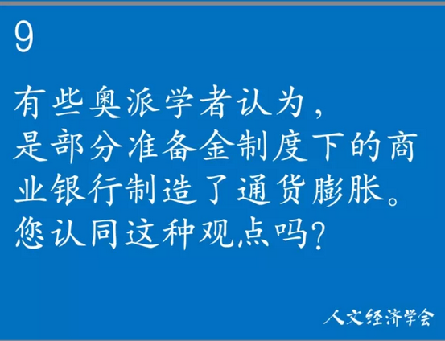
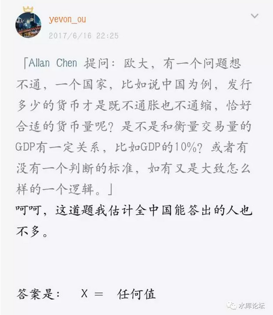

# 2017.11.11我在清华科技园作讲座，周克成代表《人文经济学会》问了我11个经济学的问题。

 

其中，有一个问题我语焉不详，一笔带过。

 

在我看来，传统的米塞斯，罗斯巴德，对于"存款准备金"制度的抨击，并不正确。

国内"田园奥派"的演绎，更是谬误千里。

 

因为这是一个很大的话题，要解释清楚不容易。

值得我们单独列写一篇。

 

 

 

一）成本

 

很久很久以前，我在思考一个问题。"成本"究竟是什么。

 

好比我现在打字的这部笔记本电脑。售价1199元。它由十一个组件构成，CPU，主板，内存，硬盘，显示器，电源.........

 

如果一个消费者"刨根问底"。他会回答，笔记本电脑的成本=11个零部件之和+商家的利润。

 

商家的利润这一块，包括组装，广告，运输，展示，行政，税金，质保等等。你可以视为全部都是人力成本。没有物料成本。

 

 

好了，我们接下去再考虑，这个显示屏的"成本"是什么。

显示屏也由几十个原件组成。大头可能是那块液晶，再加一点附属电路。

显示屏厂家外购了"液晶"，其他是人力成本。

 

我们接着再考虑，"液晶"的成本是什么。液晶就是14nm技术，生产的一块晶圆。其他是液晶公司的管理和人力成本。

 

"晶圆"的成本是什么。是沙子。你去野外随便掬一把。不要钱。

 

 

我们层层拆解，最后得出的结论是什么：

 

所有的成本，都是人力成本！

 

 

我少年读书，喜欢胡思乱想。当课堂讲到"成本"这一关节，我总觉得不对。

当马克思说成本上升，工人工资下降时，我总觉得不对。

这个逻辑，肯定有什么地方兜不过来。

 

后来为了这个"成本"我想啊想，想了十几年。豁然开朗，豁然大悟。

所有的成本，都是人力成本！

 

 

任何一件商品，你无限拆解。最终总能拆解成基本的原材料+人力加工。

而原材料从自然界开采，是不需要付给老天爷费用的。

所以"成本"=人力成本

 

全社会消费者支付的总费用"恒等于"消费者的总工资。

马克思所谓的"购买力不足"，是永远不可能存在的。

 

 

你买一台彩电，这台彩电是100%国产，在中国国内制造的。

则你支付的3000元，必然转化为某个中国人的工资。

产业分工可能千变万化，但是3000元必然是守恒的。必然有某些人获得了3000元总。

 

虽然他们的名字，可以是工人，企业家，政府税吏，并不重要。

 

 

这是一条非常非常重要的基础性定理。

一切成本，都是人力成本

我觉得光凭这一条，拿个重量级的经济学科奖，应该就没有问题。

 

 

 

二）价格

 

价格是什么。

 

我是一个木匠，我费尽心机做了一把椅子。

你是一个菜农，你种了300斤大白菜，还养了一头猪。

 

 

现在我要用我的椅子，来换你的白菜。

请问，"价格"如何确定。

 

价格是什么，价格就是"劳动"的比值。

好比椅子卖250元。

白菜1元/斤

一把椅子换250斤白菜。

 

木匠的劳动，换取了菜农的劳动。

 

 

既然我们知道，"一切成本都是人力成本"。

则你购买椅子，就是购买了木匠的劳动。

你付出白菜，就是付出了菜农的劳动。

 

椅子/白菜的比值，等于木匠/菜农劳动比值。

 

 

这就推出了我们的第二个结论；

一切价格调控都是邪恶的

 

价格调控，往往是"圣母，白左，小白领"提出的。他们的政治呼声是，既然白领的8000元/月工资无法提高。

-   冀望房子降价

-   冀望汽车降价

-   冀望医疗降价

-   冀望教育降价

-   冀望食物降价

-   冀望交通降价

 

那我就奇怪了。"医疗降价"，你不就是削弱医生的收入么。

凭什么大学生，白骨精，PaperWork，做做PPT，你就要高人一等。

凭什么你的劳动不贬值。

要求医生的劳动少收钱？

 

当年考医学院，医生的录取线，比你这学渣还要高一点。

经过了五年本科，三年实习。

八年勤奋学习之后，给你问诊听疗，挂号费收50元你还嫌贵。

 

你这小白领一二万的月薪拿着，你摸摸良心还在么。

 

 

如果你要求"教育"降价，你其实就是剥削老师的工资。

你要求"食物"降价，你就是剥削农民的收入。

你要求"交通"降价，你就是剥削司机的收入。

 

在医疗+教育+食物+能源+交通的背后，并不是冷冰冰的阶级敌人。

他们是一个个活生生的人。

是医生，教师，农民，石油工人，卡车司机。

 

你凭什么要求小白领的工资不变，让别人的劳动贬值！

 

 

价格是什么，价格就是劳动的比值。

某些人劳动多，创造的价值多。他的工资也就高。

用你的"劳动"，购买他人的"劳动"，这就是工资的本意。

 

 

正确的价格态度，三观，应该是：

该是什么价，就什么价。

政府不要干预。完全留给市场。市场博弈出来的价格，就是合理价格。

 

政府人为地"调控"价格，其实都是抢劫一批人，纵容另一批人。

这本身就是非正义的。

大家都是国民。

 

 

 

三）通货紧缩

 

我少年读书，满腹疑窦。好几个问题，一直思索了十几年，苦苦探寻答案。

其中一个问题，就是老师介绍的，"可怕的1929年美国大萧条"。

 

这一次大萧条，被誉为"通货紧缩"的典范。

在政治课老师的描述上，资本主义的邪恶真是没边了。

 

-   价格不停下跌

-   工人没有工资

-   没工资没购买力

-   价格进一步下跌

 

当年政治课读到这段时，哥哥无论如何不能理解。绝对反直觉的。

"循环排位中，怎么可能每个人都是输家呢"。

 

 

我们知道，价格是"我的劳动换取你的劳动"的比值。

单纯的降工资，并不会恶化你的生存环境。

 

好比说，你是一个木匠，你卖的椅子250元。

隔壁菜农卖大白菜，白菜1元/斤。

 

现在"通货紧缩"了。椅子卖不出价钱，2.5元/把。

隔壁白菜，0.01元/斤。

则一把椅子，还是等同于250斤白菜。生活质量并没有改变。

  

真正导致"贫困，苦难，饿死"的。应该是你的椅子，卖2.5元/把

隔壁白菜，还是1元/斤

你辛辛苦苦做一个月的椅子，只够换2.5斤白菜。几顿就吃完。

那真是饿死没生路了。

 

 

相应的，在"大萧条"阶段，必然有一个家庭，他的"收入"下降没那么快。

好比你是卖白菜的。

隔壁椅子卖2.5元/把了。你的白菜还是1元/斤。

半筐白菜就可以换一把椅子。迅速过上了大富翁的生活。

 

 

"有贵就有贱"。

"有贬值就一定有升值"。

 

价格的起起跌跌，就象是"循环排位赛"。

排在第1,2,3名很滋润，排在倒数123名很悲催。

但永远都有"输家，赢家"，不可能100个选手，都是倒数第一名。

 

"大萧条"从全社会的层面，逻辑是讲不通的。

不可能全社会100%的人口，都陷入"购买力下降"的情况。

一定有人在1929年"大萧条"时期，过得快乐无比。钱多到花也花不完。

 

 

从广义上讲，假如一个社会，并不是"外贸赤字"严重的。

好比美国这样的大国，石油自给自足，1929年不需要从中东进口石油。

 

则"一切成本都是人力成本"。

"消费者支付的一切货款，恒等于总工资"。

 

价格=我的劳动/你的劳动

全社会的价格=全社会的劳动/全社会的劳动=100%

  

对于整个社会，通货膨胀应该是恒为零的。

不管比赛多少次，100个中国人参加全运会，他们的名次肯定是1\~100。总和肯定是5050。

 

不可能是5049，不可能5051。

不管比赛多少次，中国队的总分都不会变。

 

 

真正的经济学，[应该是不包括通货膨胀这个词的。]

通货膨胀从来不是经济现象，也不是经济麻烦。

统治者不需要关心通胀问题。

 

通胀永恒为零。

 

我觉得这个结论，又可以拿一个很大的奖。

 

 

四）狭义的通货紧缩

 

目前我们社会上，使用的是一种狭义的"通胀"定义。

通胀=物价/纸币

 

 

我们知道，经济学并不关心纸币。经济学只关心"福祉"。

椅子250元，白菜1元

椅子2.5元，白菜0.01元。

这二种状态，在经济学上，是完全完全等价的。这也是我们说"通胀永恒为零"的原因。

 

 

但是在政客眼里，这二种状态是"不等价"的。

因为政客的胡乱干预，导致了巨大的麻烦。

不等价的主要原因，是因为"储蓄"。

 

假设人类是如此干脆的一个民族。"吃光，用光，花完"完全没有任何积蓄。

每天睁开眼，到集市上叫卖。"1椅子=250白菜"。

到午夜23:59回家睡觉。大伙各自把白菜吃光，椅子砸掉，没有任何积累。

第二天重新开始。

我敢打赌，100%没有政客关心"通货膨胀"的问题。

 

 

通货膨胀的真正麻烦，在于你妈妈有50W存款。

你妈妈省吃俭用，耗费了大半的青年，中年时段，不舍得花钱，最后攒了50W元存款。

 

你每月挣2W，每月花2W。

你工资随着物价上涨，你可以不在乎物价。

 

 

可是把你+你妈放在一起，你们俩就是52W元存款+2W元消费。

这个时候，你妈妈就对于"物价"高度的敏感了。

 

虽然她今天不准备花钱，明天不准备花钱，明年也不准备花钱。

可是她高度紧张，关注，她这五十万元的购买力。

她还要指望这笔钱，储蓄养老活到99岁呢。

 

 

"有利益的地方，就有犯规"。因为有存款的存在，所以政客们关心"物价"。

关心通货膨胀，通货紧缩，价格的移动。

 

人类的存量财富，是全球GDP的五倍左右。这是一笔巨大的财富。

价格的轻微移动，都意味着"财富的巨大再分配"。

数码相机取代胶卷相机，是财富增长的一小步。但却是财富分配的一大步。

 

 

因此针对价格的你死我活，不是为了效率，不是为了社会正义。

而是为了小团体的利益。

 

政府喜欢什么，喜欢通货膨胀，最最厌恶通货紧缩。污名化通货紧缩。

利益何在，国债。

 

目前的美国的国债规模，大致在20万亿美元左右。

哪怕通胀多1%，就是2000亿美金。

财政部，是"通货膨胀"的最大鼓吹者。

 

随着人为的，蓄意的滥发纸币，几千亿"纸币"仅仅是收益的第一重。

关键是政府都是大债户，欠了几十万亿国债。

通过滥发纸币，导致通胀，使得"国债"缩水，才是利益的大头。

  

 

再次强调一下，目前财经媒体上的"通货膨胀"和经济学意义上的通货膨胀，并不是一回事。

财经媒体的通胀：椅子/RMB

经济学通货膨胀：椅子/白菜=生产者/消费者≡100%

 

 

 

五）通货紧缩的牟利

 

反对"通货紧缩"的人，还有一种主流观点。

"如果人类简单地持有黄金，就可以致富。那就没有人愿意花黄金消费，会导致大灾难"

 

唉，我能说什么呢。不是坏就是蠢。

 

 

首先，说这样话的人，思维极其肤浅。只受过教科书的"正统"教育，而且以填鸭式背诵为主，没有丝毫自己的思考。

 

他们混淆了"椅子/RMB"的账面值下降。传统的政客术语。

和"椅子/白菜"的实际财富下降。经济学术语。

而后者，该值永恒是100%，生产者=消费者=100%，是不会变的。

 

 

对于"椅子/RMB"，他们的理解也是错的。

哪怕在一个通货紧缩的社会，持有"通货"，也不会使你致富。

逻辑证明十分简单；

1）前提A：市场是平等的

2）前提B：所有人都同样聪明

3）结论C：所有人都不吃亏

 

如果你想"获利"，总得找个人"吃亏"。

如果市场上所有人都一样聪明。所有人都象你一样知道"通货紧缩"。

那你赚谁的钱去呢？

 

 

事实的真相是，如果市场给出了清晰的，明确无误的信号"通缩"。

则黄金的价格就会大涨。

2017年卖1000元

2018年卖980元

2019年卖961元

2020年卖943元

 

 

如果每一个人都知道"物价不断下跌"。则大家都会飞快地去疯抢黄金。把黄金价格急剧拉高。拉高到你无利可图。

现货，期货，都无利可图。

 

如果市场每一个自然人都是平等的，都是聪明的。

则结局自然是对称的。你赚不到其他人的钱。

这么简单的道理，还在反复念叨的，不是蠢就是坏。

 

 

 

六）结语

 

一切成本，都是人力成本。

价格，就是劳动的交换。

对价格的任何干预，都是抢劫。一部分人抢劫另一部分公民。

 

就全社会整体而言，不会发生通货膨胀，也不会发生通货紧缩。

当某些劳动不值钱，必然有一些劳动更值钱。

真正的经济学，不包含通货膨胀。

 

罗斯巴德关于通胀的理解全错。社会价格上涨，不是坏事。

dT\>0，反而增加了交易。

 

 

目前狭义的语术，"通胀"指的是针对RMB价格的涨跌。

储户喜欢通缩，财政部喜欢通胀。财政部必胜。

 

 

如果市场是聪明的，无论通胀通缩，都不可能使你致富。

除非市场不聪明。

当别人都说房价要跌时，你坚持要涨。

 

 

（yevon\_ou\@163.com，2017年11月24日晚）
