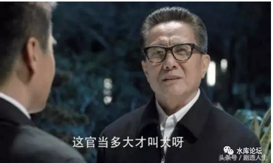
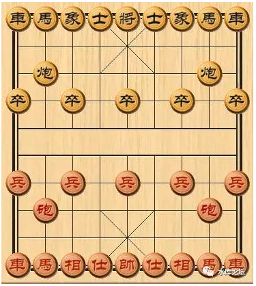
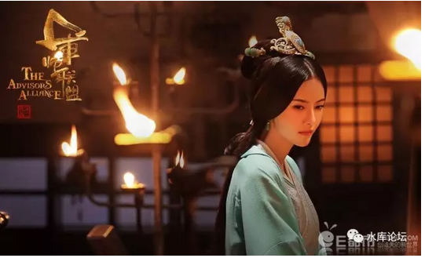

# 比诸葛亮更聪明的男人

 

 

一）智力值

 

很多很多年以前，当哥哥还象司马师这么小的年代。哥哥特别喜欢玩《三国志》系列。

 

很多武将值参数，到现在还记忆犹新。

譬如说，诸葛亮智力值100，庞统99，司马懿98，荀彧郭嘉周瑜97，陆逊96.

 

因为游戏里面的算法，大致是101-X，所以智力值哪怕差一格。都是非常大的差距。

如果吕布和武力值91的黄忠单挑的话，很有可能一刀斩，一个回合砍死。

 

 

 

当时，哥哥最喜欢的一个打法。当然是重新整编军队。把士兵交给武力值最高的人去带。

例如说，帐下报告，陆逊满16岁了，可以参军了。智力值96.

然后你再看江东水军大都督程普，智力值88.

换掉换掉。肯定用16岁的陆逊，换掉60岁的程普。

 

 

许许多多年以后，我才知道，《三国志》是[三观极其不正]的一款游戏。

甚至可以说，从小到大，很多概念，纯粹就是被《三国志》系列带歪掉了。

 

 

譬如说，正史之中，无论你的谋略指数有多高。才华惊人。

16岁的陆逊一毕业，无论如何，都不可能取代60岁老领导的。

 

陈宫和荀彧，张昭和郝萌，哪一个智力值更高。

恐怕也不是那个算法。

 

 

正好这二天在放《军师联盟》，不如我们来讲讲这个话题。

三国之中，曹魏庙堂，谁才是最厉害的谋士？

 

 

 

二）文官

 

文官系统，远远比武将系统复杂和庞驳。

 

 

最初的时候，拿衣服总以为平定天下要靠"天下无敌的武将"，对于关羽和张飞津津乐道。

随着你年龄渐长，你逐渐会发现，无论是在正史之中，还是现代国际政治，"文官"远远比武将更重要。

文武之道，永远都是"以文治武"。哪怕在乱世之中，也是如此。

 

 

小学生以为关羽，赵云，诸葛亮是天下英雄。

大学生才会知道法正，荀彧，程昱，陆逊的重要性。

而到了很后期，才会知道蒯越，崔琰，顾雍，贾逵，这些人才是真正的大人物。

 

那么，"文官系统"到底是个怎样的东西。

 

 

 

三）谋士

 

回到我们最初的问题，"谁才是天下第一的谋士"。

诸葛亮，司马懿，还是荀彧？

这个问题的提法，本身就有问题。

 

 

因为"谋士"这个职业，他并不是一个职业。他至少可以分成五个职业。

"文官"这个兵种，他并不是一个兵种。他至少可以分成五个兵种。

 

《三国志》XI开始，有了"智力"和"政治"二项文官值。

其实这还不够。严格的文官划分，应该有五个值。

 

-   内官

-   外官

-   参谋

-   士族

-   文士

 

让我们来逐一展开。

 

 

 

首先，让我们来看"荀彧"。

荀彧的地位极高。早期的三国志，给了他97的智力值评分。也就是仅次于传说中的"卧龙，凤雏，司马懿"。

 

荀彧是当之无愧的曹魏集团"二把手"。

其地位，类似于"萧何"。

 

每次曹操出征，留守大本营的，一定都是"荀彧"。

在曹操离开的时间内，所有的政务处理，荀彧可以获得100%全权。几乎就是代理国王。

用官场术语来讲，叫做"监国"。

 

当年汉高祖刘邦远征项羽，在荥阳成皋（虎牢关）一线和项羽僵持不下。

而这个时候，萧何坐镇关中。从容调度。

萧何只要有一丝一毫不稳，或者半寸反心，刘邦早就死得不能再死，直接读档挂机了。

 

 

 

荀彧最后的官职是"尚书令"。

翻译成现代汉语，就是"总理"。

尚书令是百官之首，总领一切政务。

 
如果你的人生理想是"当大官"。

步步升官，升官发财的话。那么做到"荀彧"这个位置，就算到头了。天底下再没有更大的大官。

 

可是有没有比"荀彧"更重要的官职呢，有的。

 

 

 

四）内阁

 
 

我们来看中国象棋。

在棋语中，车比喻城堡。马比喻骑兵。

（国际象棋的话，象比喻教宗。黑象天主教，白象新教，犬齿相交，永不相逢）

 

宰相的寓意，就是"相"。

相虽然也不出国门，防守型武器。但其重要性，却不如"士"。

 "士"是什么，士是永远也出不了九宫格的人。

 

 

 

如果我们看"军师联盟"这部电视连续剧。就十分明显。

"荀彧"是曹操手下头号大臣，是尚书令，是总理。

可是曹操最信任的人是谁，真正遇见心腹大事，和谁商量。

郭嘉，郭奉孝。

 

 

"汉初三杰"，有军功无敌的韩信，有百官之首的萧何，但排名第一的，却是张良。

张良就象是一个小尾巴一样，时刻跟在刘邦的身边。

张良就是象棋中的"士"

 

 

在真正的官场之中，分为"内廷"和"外庭"。

宰相做得再好，他始终是"外庭"。是百官之首。

今年麦子多收了一点，税赋多存了一点。这当然是好事，当然也很重要 ==\>

但是和内廷相比，都是渣。

 

"国之大事，唯祀与戎"。

从来没有人说治理河道，调节税赋，征收粮食，发展商业重要。这些都是小事。

国家国力削弱5%，不会亡国。

 

 

 

内廷关心的是什么呢，其实就二条线："王权"+"人事"。

内廷最关心的，首先是王权。

有没有人要谋反。太后和皇帝的冲突，慈禧和光绪，谁说了算。诸嗣子争位，应该如何立长。

"最高权力"才是真正重要的事。

 

 

无论是《琅琊榜》《军师联盟》，最最最紧要的部门，必是"校事府"。

翻译成现代汉语，则是国桉。

 

掌握了这个核心部门，震慑百官，才是帝王的保障。

 

 

 

"内廷"的第二个作用，则是"人事"。

我们常常有一句嘲讽的话，"你对于真正的力量一无所知"。

 

什么是真正的力量。你以为"庙堂"，你以为朝堂大会，开大会议堂，是很重要的事么。一点也不。

清朝最重要的机构，是"军机处"。

 

"军机处"的意思，是皇帝绕过"外庭"。直接插手宰相的事务。

因为忙不过来，所以才有个秘书板子。圈子不大，5\~6个人。

而这个圈子，才是真正说了算的地方。

 

明天发个条子，就可以任命/罢免六部尚书。

我掌握了你的人事任免权，你还有什么剩余力量呢。

 

 

 

在电视剧《军师联盟》中，第1\~2集，曹操想要考验许昌百官的忠诚度。

一纸命令，就把文武百官都关到牢里去。

无论你的抬头是太尉，京兆尹（首都市长），全没有半点用处。

哪怕宰相也说不上话。

 

然后曹操还是要讨论，哪些人该抓，哪些人该放。

该抓该放该敲打，到哪一个层次。

而这些"核心心腹"的讨论层次，则限于郭嘉，曹丕，满宠等很小一个圈子。

这个圈子，才是真权力："内廷"。

 

 

内廷的特色，有几点。

1）圈子很小。最多不超过10个人。一般6\~7人。

2）纯粹以君王的私交做准则。

 

 

也就是说，你如果想读"进士"，然后升官，一级一级做上去。恐怕终身无望。

"内廷"一般都是从太子府跟出来的老臣。

例如雍正一代，最著名的文武官：张廷玉，田文镜，年羹尧，全部都是四阿哥府上旧人。\[1\]

 

中国近代史上，著名的则是袁世凯/唐绍仪。

中华珉国第一任总理。

 

 

 

在电视剧《军师联盟》中，曹丕来找司马懿，让他入府。

这个"入府"，其实就是核心小圈子的意思。就是谋主。

你看他们饮酒，也就：陈群，吴质，刘据，司马懿四人。外加一个武将曹真。\[2\]

 

如果曹丕顺利继位。

这个小圈子的地位，直接就是登堂拜相。大司马大将军。

而且比"宰相"荀彧更有实权。

 

你如果看《琅琊榜》的话，所谓的麒麟才子，做的也是谋主的事情。

意思就是整天算计来，算计去。到底是四皇子争宠，还是八皇子，还是十四阿哥。

 

至于土地田亩制度，科举儒学考试，农民收入调查。这些事在《琅琊榜》中，都是绝然找不到位置的。

都是外庭庶务官们做的杂事。

 

 

 

五）参谋

 

-   内官

-   外官

-   参谋

-   士族

-   文士

 

《三国志》因为处于大争之世，所以在传统的"内廷""外庭"之外，还有第三类的文官，所谓"军事参谋"。

 

卧龙，凤雏，闻名于天下。

连环计，反间计，苦肉计，借东风，这些脍炙人口的计策，在三国演义中流传了上千年。

但是其实他们都属于"外围"的文官。

 

 

第三重的参谋，是带兵打仗的文官，献计献策的文官。"火烧连营"，"夜劫粮草"，"峡谷伏兵"。

-   曹魏势力的荀攸，程昱

-   袁绍手下的沮授，审配

-   蜀汉势力的庞统，徐庶

-   孙吴势力的吕蒙，陆抗

 

 

这些人，名义上是文官。但其实却是带兵打仗的"参谋长"。

《三国志》游戏所谓的智力值对比，也是指"参谋"交锋时才有输赢。

否则，你又怎能判断吕虔和向宠，哪一位种地更强一点。

 

 

 

六）士族

 

第四重的文官，是所谓"士族"。

 

电视剧《军师联盟》中，崔琰是一个非常重要的角色人物。

不仅曹操对他十分尊敬尊重，费劲心机求曹植娶他女儿。

而且一出手就是"六部尚书"，直接就是部长级的文官。

 

而如果你看看《三国志》游戏呢。智力值68，渣。

随便找个人，放把火，能把他的粮草烧得老家都找不着。

 

 

 

为何这样一个游戏中"评分"并不高的人物，在正史，在演义中，在史学家眼中，却无比重要呢。

类似的还有顾雍，贾逵，蒯越等人。

 

请大家记住，中国一直有十九姓的说法。

关中：韦裴柳薛杨杜

侨族：王谢袁萧

江左：吴朱张顾陆

代外：元长孙宇文窦源

 

 

甚至有人说，唐代之前，这19姓囊括了中国90%的历史。

所有政治事件，90%都是由这十九家人登台而来。

 

 

这些"世家大族"才是隐藏在水底下的力量源泉。

无论你皇帝如何风光，可是你的军队，你的文官，80%的"干部"都是由这十九姓子弟担当。\[3\]

你说如何可以忽略士族的力量。

  

 

譬如司马家。司马家本是"河内"望族。（正史中）族人和仆奴无数。

因为司马懿是大地主，曹操才再三征召。而司马懿还可以推脱"脚伤"不去。\[4\]

 

当最后"高平陵之变"时，司马家以臣克君。

司马家的核心武力是什么。是三千"食粟"门客。无铠甲轻装轻步兵。想不到吧。

因此晋代以后，帝王家严禁贵族蓄养门客。

 

 

士族在《三国演义》小说中，只不过是一个名字。

但历史的实质，远远比这更复杂。

 

 

 

七）文士

 

曹操讨袁的时候，有一个叫陈琳的人，写了一篇《讨曹檄文》。骂曹操祖宗十八代都是太监，骂得十分不堪。

 

而这样的文章，只有陈琳能写。

袁绍手下虽然谋士如雨，但是田丰，沮授、审配、逢纪、荀谌，郭图、许攸、辛评，每个人都有自己的事情干。

对于骂娘这种事，实在兴趣不大。

 

 

我们知道，"内廷"中的，都是神仙。

外庭，都是高官

参谋，带兵大帅。

士族，清流世外。

 

这样七推八推，最后"檄文"就流落到一些文学词藻，小字辈的手中干活。

杨修杨主簿，如果出现在官渡之战中，肯定也很适合干这样的事。

 

 

相对来说，文官们都是"干活"的。

而卖弄文字，则被视为"杂耍"的。

例如郭沫沫在D内地位从来都不高，大伙都看不起他一个执笔文人。

 

虽然人家自称精通诗词歌赋，文章达练。

而且肯舍得拉下脸皮拍马屁。

 

 

 

八）结语

 

"谁是最厉害的文官"，这种问题，本身就是没有答案的。你说一个人能力强，那是没用的。

 

1）内廷。内廷主要比的是，和天子的亲密度

2）外庭。主要看政绩和资历。爬升缓慢。

3）参谋，这是唯一可以迅速决出谋士优劣的渠道。

4）士族，士族靠的是血统。

5）文士，弄臣。

 

文官这个概念，本身就是五种职业，五种纬度。

因此比较谁优谁劣，谁聪明谁毁身，本身就是毫无意义的。

 

 

 

相对来说，比较女演员的颜值，要更容易一些。

譬如这部戏里面，我选甄宓。

 

（yevon\_ou\@163.com，2017年7月1日晚）

 

 

 

 

[\[1\]]李鸿章一辈子再NB，可就是没进过军机处。

\[2\]顺便说一句，在正史中，陈群是惊天动地的大人物。影响中国历史500年。

因为在陈群手里，搞出了"九品中正制"。这直接导致了魏晋之后的贵族门阀。

\[3\]士族兴起的主要原因，是"垄断"教育权。一直到1949年，全国识字率不足1%

只有饱读诗书，才能做官吏，才能做高级官吏。

唐代开始科举，但是90%以上进士，仍被十九姓垄断。

宋代科举，80%进士，是三代进士。

真正的寒门崛起，要到明代以后。部分是因为蒙古人。

\[4\]正史中，张春华只有一段记载。说她发现有一个婢女，看见司马懿脚伤痊愈。毫不犹豫就去厨房拿了把刀，私下动手把婢女捅了。杀伐果断，杀人不眨眼。电视剧中，关于此段拍得毫不煽情。
