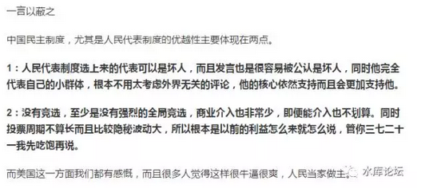
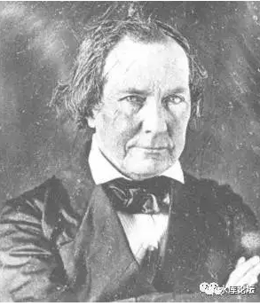
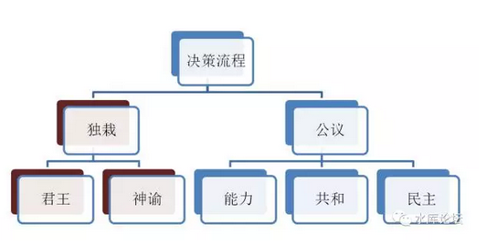

# 为了，生产力的竞争 

 

 

一）前言

 

昨天去看了久负盛名的电影《大护法》，果然是刷新下限。

晚上在家乐福逛的时候，"小密圈"就被下架了。

 

官方的说法，是增加后台闽赣辞接口。鉴于上次分答"失联"48天的事实，大家也有心理准备。

到时候再上线一个阉割版的好孩子，就不知道多少天能改正了。

 

 

终日忙碌，突然之间一夜放假。颇有点不适应了。

早上直接睡到了pm，神清气爽，怅然若失。

少了很多收入呀。

 

打开微信群，N个"失联群"已经建立起来了。

让我感兴趣的，却是圈内转的知乎二个帖子。

 

肛里拉出个电锯：

《中国的民主制度比美国的强得多》zhuanlan.zhihu.com/p/28048337

《中国民主制度比美国先进的新维度解释》zhuanlan.zhihu.com/p/28066082

 

肛锯这个人，水平是极好的。

他的缺点，就是"从来不讲人话"。

 

上次我翻译了他一篇讲游击队的文章，就是水库文献《人肉磨盘三两三》\#F880

艰难晦涩，改成水库"白话文"版才好看。

 

 

闲来无事，没有小密圈的日子，每天多6个小时，一下子很不适应。

不如我来写一篇吧。

 

文章的题目，也极为谨慎。叫做"量子退火效应"。希望不会得罪WJ。

其实真正的名字，应该叫做《民主制和共和制》，更为贴切。

 

 

二）零售业

 

首先我们举一个例子。随便取一个行业，"零售业"好了。

零售业，就是卖东西给散碎消费者。

 

 

零售业应该怎么组织。如果你想投身"零售行业"，怎样才是最有效率，最有竞争力的。

这个话题，经过了好几次迭代。其实是没有"最终答案"的。

 

最早的时候，零售都是杂货店（Kiosk/Grocery）

此后，进化成超市。\[1\]

然后，进化成Shopping
Mall。销品茂动辄占地10万平米，矗立郊区一座城，提供吃饭到购物的全套流程。

 

 

从1960年代始，Walmart开始兴起。

Walmart的口号，及其相应流派，被称之为EDLP（Every day LOW price）.

 

当时，主流的商家促销方式，类似于麦当劳，家乐福。

他们是把名下所有的汉堡，分成七类。

星期一：A类8折

星期二：B类8折

星期三：C类8折

星期四：D类8折

星期五：E类8折

星期六：F类8折

星期天：G类8折

 

Walmart一看，说你们不用这么玩了。ABCDEFG，我们每天都打八折。

不管你哪一天来，我们价格都是最低的。

不用研究促销，不用研究日期。来沃尔玛，就一定省钱。

 

 

为了做到EDLP的目标，Walmart高度削减成本。

Walmart构建了全世界第二大的卫星通讯，仅次于美国军方。

Walmart的经理办公室，也是业内最寒酸的。连店内海报，居然很多黑白的。

 

Walmart拥有全世界最高的销售额，500强第一名。

但是他的毛利，却十分勉强。仅仅只有1%都不到。

价格战实在已经打到了毫无活路。也不给对手活路。

 

 

所以说Sam Walton是非常非常NB的一个人，上个世纪100人，应该排得进。

Walmart起来以后，其他竞争对手就没有活路了。K-Mart，Sears纷纷破产。

Carrefour被扁得象猪头以后，转行卖IB商品，才勉强活了下来。

 

2000年左右，Sam死后十年，是Walmart最辉煌的年代。

Walton家族，财富第一次超过了比尔盖茨。

因为他有四个儿子，所以他们家是美国第5,6,7,8名富豪。

 

 

曾经一度，Walmart被认为是"不可击败"的。

就象Nokia在手机领域的霸主地位一样。

可是此后呢。

 

帝国的寒冬，来得比北境更快。

Walmart已经拥有了全世界最庞大的IT系统，仓储管理，也做到了尽善尽美。

和供货商的关系，维持了几十年。人脉不可估量。

 

击败（击伤）Walmart的，是Amazon.com

所谓"降维攻击"，人家根本不和你在一个层面上竞争。

 

一个4500人口的标准美国小镇，只能养得起一家Walmart。

再开的第二家Hyper-market，就是自杀。

可是我可以搞"电商"啊，我可以搞0家销品茂。

 

 

到了2017.7月，Walmart市值2200亿美元。

而Amazon市值4500亿，足足是沃尔玛的一倍。

曾经的忧心忡忡"惹怒巨人"，现在巨人的市值只有你一半了。\[2\]

 

 

三）自演化

 

分析"零售业"这个例子，我们可以得出几个结论；

1）最有效率的模式，最有活力，最终活下来

2）产业不停在升级

3）最终升级成什么样子，谁也不知道

 

商业的精彩之处，就在这里。

扎克伯格30岁就成为了"亿万富翁"。甚至比钢铁大王卡耐基的财富还要多。

 

商业是一个高度迭代演化的系统。

生产力不断发展，组织化不断进化。权力和财富迅速地在分配和转移。

昨天你还是高高在上的巨型公司，明天已被新锐取代。一夜黄花。

 

 

而什么人可以取代你，怎样的"创业"可以取代沃尔玛呢。

答案是："不知道"。

谁也不知道，知道的话，你就成亿万富翁了。

 

市场上，有无数的人在赛跑，有人做QQ，有人做微信，还有人做"来往"。

有人做陌陌，有人做映客，有人做今日头条

 

哪些小组会成功，哪条路径通往明天。谁也不知道。

一切，只能接受市场的审判。只能接受"天道"的审判。

 

 

水库论坛，刚刚写了《正本清源说奥派》（6）~\#F1170~，提了一个"自然演化"的观点。

道理都是通的，是骡子是马，拉出来溜溜。

 

 

四）大一统

 

好了，以上都是"经济"范畴的话题。老生常谈。

可是，和"政治经济学"又有何关系。

和肛里拉出个电锯写的《中国的民主制度比美国的强得多》，又有何关系。

 

 

天底下的政治，分为二种。

一种是"大一统"之后的政治。好比秦始皇统一中国，刘邦兴建400年汉室王朝。

"大一统"王朝的目标，主要是追求"稳定"。

 

水库有一篇划时代级的《[论儒·法·禅宗·基督自治和道教的复兴](http://mp.weixin.qq.com/s?__biz=MzAxNTMxMTc0MA==&mid=211128132&idx=1&sn=ca586ee1556e5e43c9949624294e49e6&scene=21#wechat_redirect)》。

在春秋战国时代，"儒"学毫无地位。肯定比不上兵家，墨家，阴阳家。

 

可是"汉武"统一中国之后，"罢黜百家，独尊儒术"。

此后的2000年，儒学一统中国。成为官方意识形态和道德标准。孔夫子被捧为"大成至圣先师"，为什么。

 

 

因为帝国的目标不同了。

儒学是一种高度稳定的制度。"儒学"的本质，就是等级制。

而三角形是高度稳定的。奉行"儒学"的中原王朝，往往可以维持300年。

 

相应的，草原上的雄鹰，"胡儿不过百"。游牧王朝，绝大多数连100年都到不了。

具体可参阅《草原军团的末日》\#F125。

 

 

另一方面，"儒学"的另一个特性，则是"战五渣"。

等级制的含义，就是排序和服从。英雄好汉，全都死于阉党和死太监的手里。

任你有冲天的本事，在"体制内"也是无处可走。

只能打磨成顽石。

 

在春秋战国时代，"儒学"就是战五渣。

战国七雄，没一个采取"儒学"治国的。

唯一信奉儒学，儒教国家的。一个是卫国，一个是孔子家乡鲁国。

 

而这二个国家，越混越衰败。越混越没有战斗力。

到最后简直快开除球籍了。

 

 

中国在长达2000年的时间内，一直以为自己是"地球上唯一的文明"。

中原王朝，占据了已知文明世界90%的版图和人口。

北方草原虽然有侵扰，但是攻城能力严重不行。只要紧守长城防线，大可以关起门来做逍遥天子。

没有竞争。

 

 

而1840年鸦片战争之后，形势发生了很大的不同。

大地图打开，中国人惊讶地发现，蓝色星球，CHINA只占1/15的陆地面积。

地球上同时还有七八股文明势力在博弈，《文明6》妥妥的既视感。

 

中国人经历了非常长的痛苦时间，1840\~1949，差不多整整一百年才调转过头来。

这个调头，主要是"天朝上国"到"普通一国"的心态转型。

 

既然我们是普通一国。我不怕。

重玩一盘，我还是能拿第一！

 

摆正了姿态，老老实实搞工业化。过了70年又是重工业第一。

不就是七八个竞争对手么。

只要我踏踏实实，认认真真去做。过个几百年，我还是能把你们都灭掉。

 

 

中国由"大一统"的王朝模式，重新切换到了"春秋战国"的争霸模式。

地处欧亚大陆的最东侧，黄金般的"侧翼"位置。\[3\]

再玩一盘，我也不怕。

 

只不过，重回春秋战国"一霸"的位置。再用"儒学"治国就不行了。

得用效率优先，人才优先。哪怕对统治者本身的位置，造成威胁，也在所不惜。

 

 

五）细胞

 

天底下的政治，分为二种。

一种是"大一统"之后的政治。

一种是"竞争图强"的政治。

 

"竞争图强"的政治，应该如何设计？

咳咳咳，这个问题，可以写上三千字。

也可以三个字就够了："往上看"。

 

 

我问你，"最富竞争力"的零售业。应该如何设计。

答案是，谁也不知道。

知道你就发财了，赶紧去买QQ股票。\[4\]

 

但是，你可以找N家企业互相竞争。

把他们都放在市场里，互相竞争。最后谁活下来，发展壮大，谁就是最棒的。

 

 

同样道理，对于"经济"领域，扩展出去就是"政治经济学"领域。

政治领域，同样需要"优胜劣汰"。

同样需要"养蛊选兵"。\[5\]

 

 

许多人对于"养蛊选兵"有一个误解。他们以为"选王"就是选总统，只要把最高领导人选出来，国体堪定，就天下太平。

真实的世界，不是这样的。

 

领导人当然重要，很重要。领导人是一个"倍乘器"。

但公司的每一个有机机体，也很重要。

 

 

一位领袖的精力，毕竟是有限的。

好比你在公司里，公司的基本架构，是划分为"部门"的。

 

如果你的部门里，都是太监死人妖。一个个全是拍马屁，裙带关系，人事政治斗争。没一人奉献干活。

则你的CEO，Jeff Immelt，哪怕制订了再正确的企业方针。GE还是要衰弱的。

 

 

"领袖"的职责，你可以祈祷运气。哪怕极度腐朽的王朝，也会出二个明君。

唐王朝快到了断气的时候，突然冒出来了"大中之治"。

美国眼看快被"白左"玩死了，突然冒出来一个"特朗普"。

 

但是，一个国家，一个民族，一个大型组织。最关键的还是他的"尉官""校官"等中下层组织。

这些有机肌体被破坏以后，是非常非常难以恢复的。

 

譬如说，办公室里一旦养成了"拍马""拉帮团伙"的风气。

你要让它再回复到"齐心协力干革命"的状态。

从来不可能。

 

 

六）共和制

 

什么叫做"共和制"。

共和制就是公司。

 

好比说，你要搞一个"企业家协会"。广发英雄帖。

则每一个参加的会员，就是该公司CEO。每家公司，只有一个代表。

 

 

当你搞了"企业家协会"，大家排排坐，坐下来。商量一下新的ICC标准应该怎么做。

Type-C充电接口，每一个电气符号，定义应该如何规范。

 

这个时候，每一个会员，各自代表他们的公司。

公司有大有小，会员的发言权，有轻有重。

最后"业界标准"出台的过程，就是"共和制"下的议事流程。

 

 

那么，"共和制"有什么特点。

1）强弱不是固定的

2）发言权不是固定的。

3）可以随时退出

其中最重要的，是第一条：强弱不是固定的。

 

 

好比说，Walmart是P&G的单一最大客户。

宝洁公司差不多有1/3的销售，是在沃尔玛产生的。

 

因此Walmart对于P&G，就有非常大的话语权。

不仅是规格和价格，有些时候，甚至产品设计，包装定位，市场细分，Walmart也能指手画脚。

 

但是，Amazon起来了以后，Amazon卖洗发水的也很多。

随着Walmart占宝洁销售份额越来越低，他的话语权也越来越低。

 

 

国际上的电信服务商。一开始搞出了GSM，2G的电信标准。

到了3G的时候，中国死活不同意。非要在ICC中，加入中国的3G标准TDS。

当时闹出了很大的风波。

 

如果说3G还仅仅是争执的话，4G中国人就直接拿到了入场券。

目前的国际电信协议，频段，编码，专利，都有越来越多的中国人标准。

 

话语权的背后，还是靠巨大的CHINA电信市场。

你实力强了，腰杆子才硬。

 

 

因此企业家协会，或者称为"共和制"，他是一种"与时俱进"的制度。

商战总有胜败，总有欺负。

总有新生力量，总有老大腐朽。

谁打赢了商战，成为大公司，谁就有更大的话语权。

 

共和制制度，可以保证最先进，最有活力的人，获得最大份额的话语权。拥有决策权力。

 

 

 

七）民主制

 

1783年，美国刚刚建国的时候，他是一种"乡贤"制度。

 

从他的权力运作制度，就很容易地看出来。

美国的总统竞选，叫做"投票人"制度。

 

意思就是51个州，不管是弗吉尼亚，还是卡罗来纳，你们先在州的内部决斗。

赢了之后，派二个代表。到首都来吧。

 

 

那么，什么样的人，会在"州"的层面选举获胜呢。

当然是当地的缙绅，土豪。换言之，[一方之霸]。

 

美国选举的本意，就是每一个州的土皇帝。大家一起到首都来开个会。

拍拍手，照个相，唱个大合唱。

维持一个虚君政府。和气的体面。

 

 

而且你再想一想，1783年时，美国的"选举"绝对不象今天这么干净。

马克·吐温小说有写，他一宣布参选，马上就有9个不同肤色的小孩子，拉他裤脚喊"爸爸"。

 

那么，当年在"北美十三州"参选获选的领袖们，就更不是什么"人民的选择"了。

土豪，他们唯一的可能，就是土豪。

就是一方之霸。

 

 

这样的制度，你说好么。按照2017年现代的"政治学伦理"，白左圣母SB们，肯定要说"不好"了。

因为它严重违反了"民主"的制度。选出来的候选人，未必是民意拥护。难免作奸犯科，罪行累累。甚至象"血钻"一样，就是当地的独裁者。

 

可是，白左们的审判，并不是正义的审判。

达尔文正义，"天道"面前的正义，才是真正的正义。

 

（肛锯说：）

"北美13州代表"都是狼和蛇一样狡猾的人，然后这样的人再组织"中央政府"。

掌握国防和外交的权力。

这样的制度有什么好？

 

这样的制度，充满了血腥。可就是有一个好处。

狼和蛇都是充满战斗力的动物。

 

十三个恶棍组成的政府，可以血腥，可以残暴。但绝不会无能。

他们可能让你不快。但他们不会丧权辱国。

不会有认穆斯林做干爹的圣母婊。

 

 

（米拉波·拉马尔（MirabeauLamar
1798－1859）德克萨斯清教徒移民的领袖，美国西进运动著名民兵统帅，以喜好驱赶杀戮印第安人著称，为了抗拒墨西哥政府对清教徒聚居区的控制，他多次指挥清教徒民兵攻击墨西哥人和政府军）

（美国恶人东征西讨，吞并了法属路易斯安纳，阿拉斯加，德克萨斯，新墨西哥）

 

美利坚合众国的国运，真正的转折点，发生在1969年。一个历史上完全没有记载的年份。

因为那一年，一件划时代的大事发生了：电视机发明了

 

 

在传统意义上，美国其实是一个"共和制"国家，美国人引以为豪的，是"代议制"。

因为美国虽然号称为"民主选举"，但几乎2/3的政治家，都出自于东北部"新英格兰"。

内陆省份虽然人口众多，红脖巨多，雀斑少年众多。

但是这些人口，传统上是"政治冷漠"的。

 

截止1969年美国选举的特点，新英格兰的"党内大佬"们，开会决定谁选总统，谁选州长，谁选议员。

然后把表格统一下发，通过漫长的邮寄过程，寄给内陆省份的分支和支部。

大伙跟着老大指示，画圈，投票即可。

 

 

而1969年，一个是嬉皮士，一个是越战，然后又是Baby Boom。

正好是年轻人精神崛起，寻求反抗精神的时候。

教育的进一步普及，高中以上学历人口增加，促进了这一趋势。

 

新生代人口心想道，"我为什么要听你老头子的话"。

他们不再按照New
England党魁的指示去投票，而是根据电视判断，根据自己的喜好，来独立投票。

 

爱尔兰人天主教徒，肯尼迪因此选上了总统。

你能可以想象，来自甘肃的，信奉伊斯兰教人士，选上中国总统么。

刺杀迫在眉睫。

 

 

以1969年为分水岭，美国整个"国体"都改变了。

1969年之前，是共和制。

1969年之后，是民主制。

 

 

熟悉日本，或者香港选举制度的人都知道。在日本，有所谓"铁票""票仓"的说法。

好比日本铁路系统200万张选票，就都是投给总裁的。

总裁让他们怎么投，就怎么投。

 

这就是"铁票""票仓"，有了这200万票，铁路系统在日本就立于不败之地。

不管谁当首相，都不敢怠慢了铁路联合体。

 

这是什么，这就是"共和"。

 

有一些大型的团体，譬如大型的矿山，财团，连锁企业。

他们内部也有"铁锁连舟"。你进了这个公司，只能一致性投票，万万不可以做叛徒的。

 

因此财团的首脑，就相当于"门阀"。

和德川时期的大名，藩主，没什么二样。

日本政坛常常有三世，四世，五世的议员家族。

 

从政治上讲，这代表着"共和"。

每一个议员，就是一股大型实力的首脑。

可能是铁路总公司。

可能是石油天然气系统。

可能是银团，商贸，航运。

各有各的小王国。

然后"议员们"再排排坐，组织成了议会。神仙们开会，其实就是社会各利益团体的分赃会议。

 

 

然而，你设想一下，假设"铁路总公司"某个不肖的晚辈，离经叛道，偷偷妄自投票给了肯尼迪怎么办。

如果年轻人一个一个溜出去，投给他们各自心水的候选人，怎么办。

整个体系分崩离析。

 

 

美国发展到后期，1969年之后，就是由"威权共和制"，向着"个人民主制"的转换。

国体由Republic，转为了Democratic。

 

日本，韩国，也在崩溃。

随着老人们逐渐死去，"传统"的权威和习俗荡然无存。

"铁票""票仓"日渐萎缩。

日本韩国，也正在由威权的"共和制"转向"民主制"。

 

 

八）民主之恶

 

如果一群人，聚在一起，商量一件事情。要依循怎样的"决策仲裁机制"。

 

 

决策有很多种方式，大方向可以分为：独栽+民主+其他

君主制是另外一个话题，我们今天暂且不展开讨论。

 

对于"公议"这条线，他又至少可以分为：能力+共和+民主，三种方式。

 

 

其中，最好的方法是"能力"。挑选一批最精良的人才，来治理国家。这也是"选举"的本意。

只可惜的是，"能力"本身是一个非常模糊，难以量化的指标。有些人，哪怕他是成功的外科医生，化学博士，也不代表他有治理国家的能力。

 

一般而言，我们可以采取净纳税额，或个人财富，作为投票权重。

间接模拟能力。

 

 

比按"能力"投票差一级的，则是"共和"。

共和也称"威权统治""寡头统治"。

 

好比你开公司，手下有1000个员工。你可以把1000张选票都搜罗过来。

从而成为一个"小土豪"。

 

只有土豪们才能去投票。这样的制度，称之为"共和"。

共和类似于企业家协会，大大小小的山头，大家协商出一个ICC电信标准协议。

 

比共和更差一级的，是"民主"。

民主就是不管阿毛阿狗，不管精英还是山瑞。只要是人，就给你一票。

"肛里拉出个电锯"指责的，主要是民主的邪恶。

 

 

 

我们举个例子，假设你是P&G公司。你现在负责洗发水的销售。

到了一年一度的订货会议，一大堆的经销商都来了。

 

七嘴八舌的，有的人说你瓶子的颜色不好，有的人说你瓶子的形状不好。有的人说你不够香薰芬芳，有的人说应该是红壳的，有的人说应该蓝壳的。

你感到心烦意燥，放眼望去。先是找到Walmart的代表，再是找到Amazon的代表。

 

这二位是销售额的绝对大头，财神呀啊。

因此产品需要怎样改进，优先听Walmart和Amazon的意见。

 

在这里，Walmart的"江湖地位"，是他自己争取来的。

因为Walmart承担了1/3的销售数量，他才可以坐头把交椅。

如果哪一天Walmart内部管理混乱，成本失控，销售模式不符合时代潮流，他就会失去话语权。

 

在这场会议之中，"排序"是合理的。

生产力最大的人，占有最多销售份额，占有最大话语权。

小经销商的意见，则是被聆听。最后做决定的，是产权人你自己。

真是一个完美的模式。

 

 

而"肛里拉出个电锯"指责的，是另外一种模式。

假设全中国所有的超市，合并成一个"洗发水销售总公司"。

P&G的人，先去和"总公司"谈条件，然后总公司再分发批零给Walmart，Amazon，Taobao，会发生什么情况。

 

情况就是，信息被高度降噪。

原本含有1024Byte的信息，最后只剩下16bit。

 

 

你去问总公司的代表，"红色瓶子还是蓝色瓶子更受欢迎啊"。

他含含混混地回答："52%消费者喜欢红瓶，28%消费者喜欢蓝瓶"。

"应该怎样改进啊"。

"红色更畅销，不去全部只生产红瓶"。哐当，死翘！

 

 

 

九）大选区

 

肛里拉出个电锯，写了二篇文章。其中心思想的概括是；

"现代媒体网络的进化，使得割裂市场被消灭，从而产生了大选区"。

 

 

设想一下，假设二个胡建年轻人。一个专擅讲胡建话，一个专擅讲普通话。

-   在胡建省内选举的话，A必胜无疑

-   在全国选举的话，A必败，B必胜

 

美国总统选举，常常发生"选参议员"必败，选总统大胜的事。

-   林肯选州长惨败，选总统胜利。

-   福特总统退休以后，选州参议员惨败。

 

这种事情，在崇尚"官本位"的中国人难以理解，好像大官一定就有大智慧，就是"上座"。

但在民主制度内，却是很常见的。

能赢"大选区"的人，未必就是最贴合本区的土著，地头蛇。

 

 

但是这个定理，反过来说，"能赢大选区的B，未必合胡建人的口味"。

随着选区越来越大，总统必然离普通民众越来越远。

 

在1969年之前，因为"铁票""票仓"，USA实际执行的是"共和制"。

权力都在参议员手里。各省先选好了自己的参议员，众议员，党内大佬开会再决定推哪个帅哥当总统。

 

 

但是，1969年之后，情况发生了变化。

就好像Amazon电商吸走了Walmart的销量一样。小镇上最然仍只有一家销品茂，但购买力却被吸去了网上。

 

Amazon只要有一个网址，一个总部，就可以源源不断地吸走订单。

Hillary
Clinton只要站在那里，通过电视广播，通过Twitter拉票，就可以源源不断的有几千万张选票。

她还依靠土豪干什么。

 

 

当年卡特和肯尼迪竞选总统，卡特奔波51个州，和200000人见面并握手。筋疲力尽心力交瘁。

肯尼迪什么也不做，天天在家里敷面膜。

 

然后电视辩论，在几亿观众面前直播。肯尼迪容光焕发，帅得一塌糊涂。

彻底击败糟老头子卡特，当上总统。

 

如果"总统选举"都是这套玩法，你还需要基层民意干什么！

 

 

很多事情，都是一环套着一环的。"大选区"制度，本身就是联邦政府扩权，而导致的后果。

竞选总统，直接向3 0000 0000选民直播。

而不是靠30000个土豪的阴谋勾结和内部会议。

 

 

这样一种"先进的""仁义的""高大上"政治尝试。

最终把美利坚带到了沟里。

 

候选人越本地化，越可以为选民提供更好的服务。

当候选人更多的以"全国性"的话题获胜，服务水准的僵化不可避免。

随着美国总统"全国直选"，和总统权力的扩大。统治者和民众的疏远不可避免。

对基层述求的理解，政策的反馈，都不可避免迟钝。直到全国崩坏。

 

结论是，把权力留给小选区。让每一寸角落都充满竞争。

由下而上构建权力架构。

 

 

十）代议制

 

选举有二种方式。

一种叫做"直接选举制"。3亿人民直接选总统。

一种叫做"代议民主制"。民众只能选议员，议员们再选首相。例如德国。

 

 

"肛里拉出个电锯"批评的，主要是"直接选举制"。

因为直接选举制，并不能最优化"乡贤"。

在每一个郡县，每一处工矿，每一个族团，他们的KOL并没有被充分尊重。能者居之，也没有最大化。

 

"电视竞选"其实很邪恶的。

候选人不需要真才实见。他们更需要的，是耍酷，装深沉，装悲痛，装子弹，乃至于八卦新闻。

 

民主也是很邪恶的。"最优秀"的人和"平庸"的人，都仅仅占有1票选票。

这使得质量的优势无法显现。

 

 

因此"直接选举制"选出来的，往往是吹牛大王，煽动狂人，秀相，马克龙。

而且欧美连续选出40岁左右的领导人\[6\]，这些人对于基层的运作几乎没有任何概念。执政荒谬，在所难免。

 

 

比较理想的选举方式，应该是"代议制"。

好比中国13亿人口，则可大致分为三个层次，13亿=1000\*1000\*1000

 

第一层，1300个人选1人。所谓"缙绅"。

能选上缙绅，必然是小有成就的人。在当地小有影响力，一定范围内的KOL。

缙绅可以随时被替换，一旦你失去竞争力，就会被别人选上。

 

第二层，1000个缙绅选1个"议员"。

由聪明人再选出的聪明人，就彻底过滤掉了"民意"。所有的极端民粹主张，哪怕请愿再多，也选不上议员。

议员也随时可以被替换。一个议员的垮台，相当于一个"大型生态位"的垮台。相当于一家大型公司的垮台。

但我们知道，"养蛊选王"。就是要在内部不停地竞争淘汰，才能代表最先进的生产力。

第三层，1000个议员组成"议会"。

美国众议院的人数是435人。中国传统政治中，"进士"的存活人数，大约在1000人左右。

  

如果以1:1000000人口作为基数的话，则1000人左右的"议员"，已足以构成"官场"。并承担社会的绝大部分功能。

在议员之中，可以再推选举领袖，内阁，各大功能性小组。

 

 

总而言之二条主张；

只有土豪才拥有政治权利（缙绅）

土豪推选最高领袖

 

 

 

（yevon\_ou\@163.com，2017年7月26日晚）

 

 

 

 

\[1\]超市英文的称谓是Supermarket。其主要的业态是"联华超市"之类的，面积不超过200平米。其实就是个大型的7/11

\[2\]指Amazon从卖书开始指向"全面电商"，当时的分析师曾忧心忡忡，和Walmart的竞争会让Amazon耗尽资源破产。

\[3\]在欧洲争霸中，最有优势的是英国和俄国。因为他们处于最西侧和最东侧，即所谓的"侧翼"位置。没有二线作战的压力。而德国生存位就很差。

\[4\]腾讯股票是唯一赶上京沪房价的资产，2004年上市5元，现价300

\[5\]指苗疆摘取100只毒虫，放在同一个罐子里。让他们互相吞噬，最后能活下来的，就是蛊王。

\[6\]奥巴马当选47岁，教了12年书。
