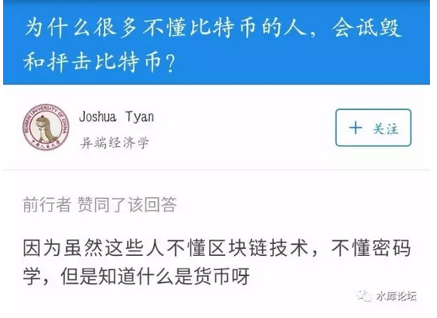
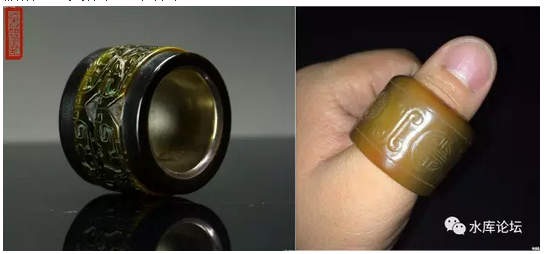
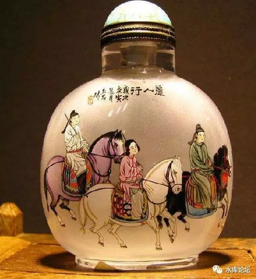
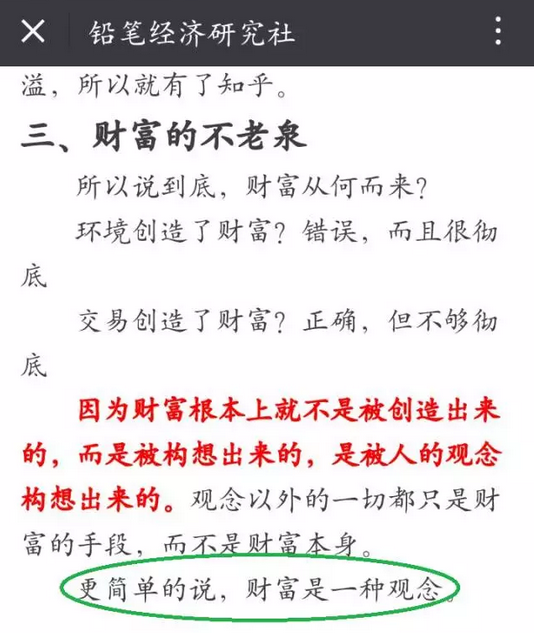
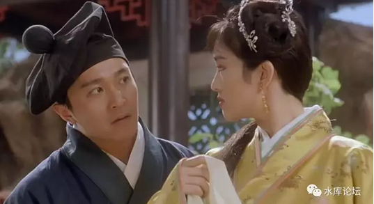

# 正本清源比特币 \#F1250

yevon\_ou [[水库论坛]](/) 2017-08-19

正本清源比特币（一）\-\-\-- 价值 ~\#F1250~

在投资界，是存在严格鄙视链的。

 

楼市 \> 股市 \> 币圈

 

 

一）前言

 

在\#0《水库目录》中，还存在好几个漏空：

 

\#F820      论马尔萨斯陷阱

\#F1170     正本清源说奥派（7）（8）

\#F1260     90后的故事（2）（3）

\#2980      中介篇（5）

 

俗话说，挖坑不填，板砖一吨。

但静流小猪扒迟迟不把资料传过来。今天再新起一个话题，难免会被人骂。

 

 

前二天无意中看了一篇文章《[[比特币江湖的第一次大型火拼]](https://mp.weixin.qq.com/s?__biz=MzI2MzY0OTU1MQ==&mid=2247483707&idx=1&sn=a29ae788587bedd0143a54a9bf29cc18&chksm=eab9e15bddce684dc56e81a629690c77697daa8add32e3e0d136dbf56e8e6cc438a250ec0dac&mpshare=1&scene=21&srcid=080668YzuZ9BgUfDNJcEl9Xi&pass_ticket=Ci10N#wechat_redirect)》。神作啊，文章写得很有趣。但我估计全中国[看得懂的人不多]。

虽然"币圈"已经是很大的一个亚文化圈子。但我们要切记投资界的鄙视链：

 

楼市 \> 炒股 \> 币圈

 

-   炒楼的看不起炒股的。

-   炒股的看不起炒币的。

 

在整个生态群中，比特币是最Low最Low的。无论是金钱，财力，社会地位，统统都不入流。

社会最底层的屌丝。

 

因此那群SB虽然满口区块链，矿池，HASH，ICO，但是你要问他们一些高级的知识，那是全然不懂的。

4月10日，我写了篇文章《[[比特币值多少钱]](http://mp.weixin.qq.com/s?__biz=MzAxNTMxMTc0MA==&mid=2651015726&idx=1&sn=b1a8e850de5b8741ba65235dbe678353&chksm=80721c3db705952bd1c8dff2ca692d274a9fb77e68d204f0da11a52e4bc26febb7215e56b793&scene=21#wechat_redirect)》\#F1000

但是上周我去国贸参加了一场"慕道社"的活动，惊讶地发现，绝大多数的朋友，对于"数字货币"还是一无所知。三观也都是错的。

 

所以今天另开一坑，写《正本清源比特币》系列。篇幅估计3\~4篇。

每一篇都可以独立成章。

反正都是很Low的东西，写起来应该很快的。

 

 

 

二）价值

 

讲清楚各个概念之前，照例我们要做一些铺垫。从较遥远的故事说起。

第一个故事，什么是"价值"。

 

以"珠宝首饰"行业为例，目前业内绝对的"大路货"是什么。

走货最快，受欢迎程度最高的，大概是戒指。

其次是项链。

 

 

但是在150年以前，也就是晚清1850\~1900年那段时间内。你知道"珠宝首饰"业的绝对通货是什么。

是扳指和鼻烟壶。

 

扳指，它大概长这个样子。

鼻烟壶，大致长这样子。

小时候家里还有几个。那玩意极冲，闻一口可以清醒很久，象薄荷糖一样。

扳指的传入，主要是因为满大人。

学过"古筝"的人都知道，弹琴一定要戴指套。因为琴弦对手指有损伤，时间久了受不了。

 

同样道理，满清以"骑射"立家。骑马射箭，女真人从小练习。

而"射箭"的话，对手指更伤。

弓弦的拉伤力，可不是琴弦能比的。

 

扳指是套在大拇指上的。其作用，就是让你拉三石弓。

建州生活必需品。

 

 

满清入主中原以后，原本存在于骑射贵族中的"扳指"，逐渐形成风气。雕龙镶凤，成为权力和地位的象征。

到了晚清，更是人手一个"扳指"。

地主老爷出门，手上没有绿油油的，你都不好意思见人。

其地位，就象今天的"劳力士金表"一样。

 

粗略估计，晚清百年，留存世上的扳指，应当在"千万枚"的数量级。

代表的"珠宝首饰"市值价值，更是天文数字。

 

好了，问题来了。

这么大一笔财富，今天到哪里去了。

 

 

答案是没有了。彻底没有了。今天的男性，再也没有人戴扳指。

曾经的千万两黄金，当没有人喜欢时，迅速地价值沦为零。

无数扳指，如垃圾一般，纷纷碎裂在历史的长河中。

 

 

昨天铅笔社有个蠢货，"通货朋仗"周通，写了篇文章怂哥哥。

今天铅笔社自己都看不过去了。刊登了一篇读者来信《[[抢劫是不是交易？（读者来稿）]](https://mp.weixin.qq.com/s?__biz=MjM5NzA0NjA0MA==&mid=2650742708&idx=1&sn=77a9dd585da060415ee319b189071ba5&chksm=bed44dc389a3c4d55555a734c9bbe6cac4fe3005aba686e2e2e8473f52f6c6ae0224deb95112&mpshare=1&scene=21&srcid=0809oMIHXujFEpUo3nNLw75Z&pass_ticket=lcBiG#wechat_redirect)》

 

最后一段，写得是非常正确的。

 
三）财富是一种观念

 

财富是一种观念。

 

马克思主义的"劳动价值论"，是绝对错误的。

根本不存在"内在蕴含的劳动"。

 

 

财富是一种观念。

更确切的说，财富是由[消费者]决定的。

消费者人口是不停变动的，因此"价值"也是不停变动的。并不是一个常量。

如果蚊子统治了地球，则今天留下的所有物质财富，全部都没有价值。

 

 

同样一个扳指，在1870年是人见人爱，地主老爷人手一个。拿来送礼"体面过人"。

而到了2017年，因为消费者群体不复存在。扳指的价值也不复存在。

 

 

在今天，很多东西可以卖出高价钱。例如大鲨鱼奥尼尔的球衣，科比的球鞋，吴亦凡的签名。

可是随着时间的推移。这些人名，最终会被人遗忘。当奥尼尔再也没有人知道时，他的球衣自然也就毫无价值。

你说，今天还有多少人记得"罗文"。

 

一样东西之所以有价值，是因为有喜欢它的人。

而且这个人活着，有购买力。

 

 

翡翠的鉴赏业，讲究"种，底，水，工"。

老法师会和你说，一套一套，翡翠的估价标准。

 

可是你知不知道，整个的1950\~1990年，全世界的翡翠市场，"绿"翠根本不值钱。

因为中国人以"绿"为美。

而日本人以"白"为美。

 

整个20世纪下半叶，日本人财大气粗。中国人萎缩贫穷。

"翡翠"市场的话语权，就以日本人说了算。以白为美。

 

直到21世纪，日本衰弱，中国崛起。

翡翠市场"绿"翠以火箭般的速度崛起。迅速调整为中国人的口味。

 

哪里有消费者，哪里才有价值

 

（另一个有趣的例子，是国际书画市场）

 

 

基督教最珍贵的宝物，是"真十字架"。

为了夺回二大圣物，不惜发动了数次"十字军"远征。

 

而在伊斯兰教徒的眼中，那只不过是一块大木头。

在耶路撒冷战役中，哪怕打碎了，也毫不可惜。

 

一件事物的价值，取决于爱惜它的人。

如果基督徒都死光了。那么他们爱惜的"圣物"也就毫无价值。

拉丁美洲有多少圣物，被殖民者当柴火烧掉。

 

 

 

四）黄金

 

上周"慕道社"活动时，有人问我，对于"黄金"应该怎么估价。

 

我回答说，从"消费"上来看。黄金的价值大约是150美元/盎司。

黄金有工业用途。因为其良好的延伸性，导电性，可以做汽车发动机的点火。

 

二战时美国铜资源短缺，最重要二根轴承，找FED（美联储）纯银制作。

导电性，加工性都远远好于铜。国防部喜出望外。

 

 

另一方面，现代金矿的开采，纯金矿已经很少。

大部分是"伴生矿"。也就是在铜，锡等矿石开采时，有低等级的黄金含量。顺手硫酸一起烧出来。

因此黄金的"生产成本"，已经降到几乎为零。

 

那么，黄金应该卖多少钱呢。我查了一下今天行情。

XAU/USD=1274

请问，支撑黄金站于USD150之上（大约8倍）的动力是什么呢。

 

答案是：黄金是一个超级IP概念

 

 

水库花了很多篇文章来讲Marketing，

读者们也渐渐明白了，"广告是一种固定资产投资"的概念。

 

好比你花2亿去投广告。

看似"哐当"一响，CCAV三十秒，你的钱就永远消失在电波中了。

 

其实不是的。

广告依然在。它存在于消费者的心中。

消费者对你的记忆，就是你的财富。就是你的[固定资产投资]。

"消费者"才是第一生产力。

 

 

 

而"消费者"值多少钱呢。按照我们在《[[怎样把品牌做死掉]](http://mp.weixin.qq.com/s?__biz=MzAxNTMxMTc0MA==&mid=2651015965&idx=1&sn=7ec19f86548d01eb90fa25e73faf350e&chksm=80721d0eb70594188a7aa18ed9c699cd63bad372c8d022e495cfbf6973132ff6767de75b0f25&scene=21#wechat_redirect)》~\#F1180~中的说法，建立一个"全国性"的知名品牌。

大约需要耗资5亿元。

 

而这，依然是很不可靠。美誉度也很低的"二三线"品牌。

好了，现在我问你，全中国，全世界，全人类，有多少人知道"黄金"这个品牌。

 

有多少故老相传，习俗传说，从小就向你灌输"黄金宝贵""黄金保值""黄金万世不易"之类的说法。

 

黄金难道不是超级大大大IP么

 

财富不在于实用价值多少，而在于多少人相信它。

你喜欢，它就值

 

 

你从小玩《三国志》系列。传国玉玺就是中国No.1的宝物。

你从小看"唐伯虎点秋香"，唐寅就是天下一等一的才子。唐寅的画就是价值万金的宝物。

 

同时代的戴进，哪怕艺术地位丝毫不逊色。可就是没有影响力。

自己搜：Consumer Education

 

谁的故事，可以列入中国教科书。

谁的字画，就会在20年之后暴涨。

 

 

 

五）比特币

 

好了，我们一笔笔来，逐次展开，终于讲到比特币了。

我现在就问一个问题：

 

作为一个超级IP

目前全中国有多少人知道"比特币"

 

 

如果和"妙洁洗手液"之类的商标比起来。那么"比特币"的品牌无疑要响亮得多。

不仅知道的人更多，而且范围更广，卷入更深。

 

 

一个全国知名的二三线品牌，名气"含金量"值￥5亿元。

则一个全国知名的大品牌，你说这个"牌子"值得多少钱。

 

比特币没有产权人。

目前存世的，大约有1500万枚。

因此比特币的"品牌含金量"由这1500万枚分享。

 

我们仔细算一下，IP估值（Intellectual Property）假设为￥15亿。

15亿 / 0.15亿 = 100元

也就是每枚100元左右。

 

 

比特币这么大的名气，卖给你每枚100元，那么哈哈考虑一下。小赌怡情。

可是，现在BTC官方报价23000元，怎么算？

下篇再讲。

 

 

（未完待续）

 

 

（yevon\_ou\@163.com，2017年8月9日晚）
