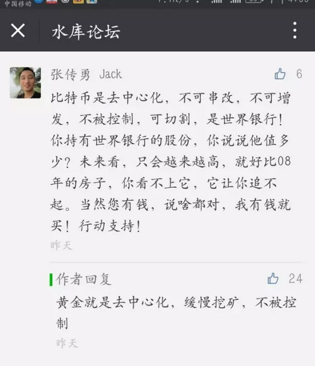
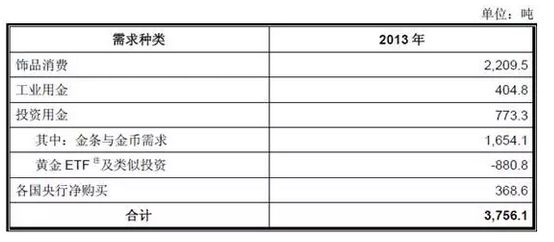
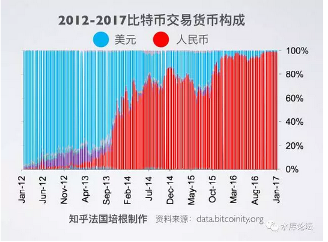
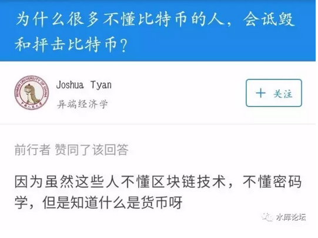
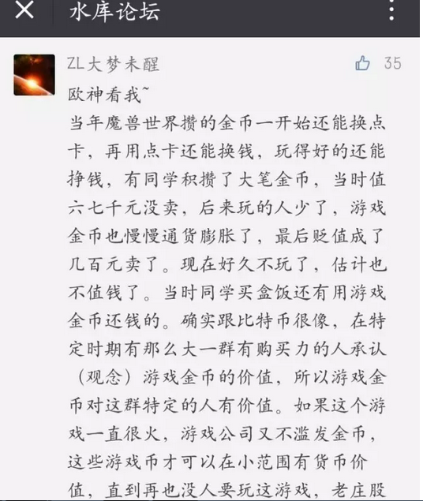
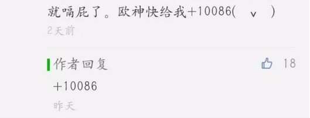

# 正本清源比特币（二）\-\-\-- ICO \#1250

原创： yevon\_ou [[水库论坛]](/) 2017-08-12

正本清源比特币（二）\-\-\-- ICO ~\#1250~

 

在第一篇《正本清源比特币（1）\-\--
价值》发出了以后，我们很快收到了读者回复。

 

哥哥似乎拖延症又犯了，一直懒到今天才写答。

 
回复，简单也就四个字："以上全错"

如果不尽兴的话，还能加二字套餐。

 

 

 

一）黄金

 

我们来看BTC的四大特征，也是"币圈"那帮SB一直吹嘘的。

 

-   去中心化

-   不可窜改

-   不可增发

-   不可追踪

 

具有如此强大的四大特性，能不能使比特币变成"世界货币"。能不能形成世界银行呢。答案是：

不可能，一文不值

 

 

为什么，因为还有一样和比特币完全类似，具有同样四种功能的完美货币：黄金。

 

-   黄金去中心化，不是任何一家政府的印钞机

-   黄金不可窜改

-   黄金不可增发

-   黄金不可追踪

 

 

我想提示一下各位炒BTC的SB，有没有最基本的数学常识：

 

-   全球的黄金存量是171000吨。目前每年矿产金3400吨。折合2%

-   比特币每年产量8%

 

 

按照现在的规则，BTC每10分钟产出25个，每小时150个。每天3600个。每年1314000个。

按照目前的BTC存量，假设按1500W枚估算，则每年出产8.7%

 

在未来25年，比特币的产量，远远超过全球黄金增速！

 

 

很多人不明白。比特币和黄金，其实属于"同一生态链"的[替代性]产品。

 

黄金本身的工业需求，是非常非常低的。换算成替代品，可能只值\$150美金。

 

 

黄金目前能卖到\$1274美金/盎司这价格，主要因为黄金是一个超级超级大IP。千百年来的故老相传，无数无数影视作品里探宝宣传。

 

黄金，是属于那种"大家都说它很NB我也觉得它很NB但又不知道什么地方NB总而言之就是很NB"的商品。

 

而比特币和黄金是同一类商品，同生态链的替代物。

黄金不会颠覆世界，你凭什么相信比特币会颠覆世界。

 

 

 

二）黄金的替代作用

 

黄金并没有央行。黄金是"分布式"的。不受任何一个央行国家控制。

黄金也没有"背书"。没有刺刀和行政命令，强迫你使用黄金。

 

黄金的产量很小。黄金的增长，主要依靠"挖矿"。蓝色星球上的Au总量有限。

比特币产量很小，主要依靠"挖矿"。总数有上限。

这样看，比特币和黄金，是否非常非常相像。

 

 

黄金按照目前"增量/存量"，每年仅增加2%左右。

比特币今年增加8.7%，但此后速度会慢下来。大概到2042年时，比特币和黄金增量追平。

买BTC的SB们，在未来25年，比特币"供应"都是快过黄金的。

你们凭什么相信比特币会"稀缺"。

 

 

比特币不记名，不可追索交易。特别适合于"暗网"交易。

黄金同样也不记名。作为化学元素，全世界的黄金没有任何区别。

 

500克黄金，绝不比500克毐品份量更重。而且更小巧，易于携带。

目前BTC的交易速度，已经慢到了难以忍受的地步。同样的"暗网"交易，用金条小黄鱼，反而更为方便。

 

 

而我们知道，全球的毐品，军伙，枪枝交易，使用的通用货币是什么。

比特币么，别开玩笑了。

黄金金条，也不是。

 

全球通用的货币，依然是美元。尤其是美元旧币纸钞。

为什么，因为方便。

虽然有众人吐槽的"监管"问题，但美元依然是全世界最好用的东西。暗网99%的结算手段。

 

为什么不用黄金，因为黄金竞争不过美元。美元可以转手去买汉堡包。

为什么不用比特币，因为比特币竞争不过黄金，更竞争不过美元。

一文不值。

 

 

或许我要提醒一下各位，BTC全球98%的交易量集中在中国，全球95%的产量集中在中国。

 

有人说"转移资产去国外"，别开玩笑了。根本没有这个市场。

因为海外根本没有承接盘。

根本没有美金买家。几千万美元，池子就雪崩了。

 
归根到底，比特币是中国人"自娱自乐"的一项玩具。在海外根本不算IP。

根本无人知晓。

 

那些币圈的SB张口闭口"世界银行""暗网交易"。

你有没有想过，BTC的增发速度，比黄金还快。

口口声声的"暗网"交易，你买个屁啊，快递能过海关么。包邮么。

 

 

比特币的所有性能，黄金都优于比特币。

黄金都快混不下去了，IP将死。

你凭什么相信BTC比黄金好？

 

 

 

三）ICO

 

比"比特币"更进一步的，被称之为ICO（Initial Coin Offerin）

或称"山寨币""数字货币"。

 

 

从某种意义上讲，比特币被称为"第一代数字货币"。诞生于2008年11月。

比特币至少有二个重大缺点。

1）作为创始人，中本聪大约拥有700万枚。后来人都是"抬轿子"的。

2）作为一项10年前的技术，很多科技在今天看来已经"过时"了。

 

比如说，因为设计上的缺陷，BTC据说一秒钟只能"交易七笔"。

对于一种货币来说，尤其是现代商业社会。这是不可想象的。

人民币，一秒钟要交易多少。7亿笔？

 

其次，区块链本身的设计，每一次交易，都要复制之前的代码。

这使得BTC的文件，变得越来越庞大。

 

很多人以为的"比特币"，还停留在一个U盘拷十几个，扔在角落里。

而现在的比特币，动辄一个文件3\~4G。

 

据说硬分叉以后，"数字货币"文件还会变得更庞大。一个文件200G，大到家里的硬盘都拷不下。

大型文件，不仅存储麻烦，也给硬件系统带来巨大的开销。

 

 

如果说以上的"细节"还仅仅是IT问题。

则中本聪在设计"比特币"的时候，将最前面的700万个比特币，全部都划到了自己的名下。相当于总量的50%。

这件事，就绝对"叔可忍，嫂不可忍"了。比特币产业搞得再大，也就是为中本聪做嫁衣。

 

 

最近十年，计算机编程飞速发展，尤其是并发式加密，云计算，TPU理念等，都是当年所无法预想的。连手机都八核了。

在新技术的驱动下，便就有人想，要不要开发"第二代数字货币"。

 

第二代货币，至少做到了几大优势；

1）交易速度快，每秒可高达500笔。

2）系统容量大。可以同时供几亿用户使用。

 

这样一来，比特币的所有优势，诸如"匿名，洗浅，暗网交易"等等。第二代货币全部都可以做到。

而且速度还比你快100倍。你自己说用哪家。 

 

好了，现在问题来了。"第二代数字货币"，应该如何定价。

一枚"质数币"，应该值多少钱？

 

（莱特币LTC、未来币NXT、无限币IFC、质数币XPM、美卡币MEC、分子币MOL、苹果币APCCOIN、阳光币ssc）

 

 

 

四）经济学

 

据说，今年ICO（山寨币）行业风起云涌。截止写稿之时，市面上的"山寨币"已经超过了800种。面值数万亿。

其中部分品种，例如以太币，总市值已经超过了比特币。

请问，山寨币"真实"的价值，应该是多少钱。

  

 

在物理学上，有一个定律。

"如果一个系统，可以拷贝出无数子系统，则它的能量一定为零"。能量守恒。

 

同样道理，ICO如果可以"无限复制"出无数副本。

则ICO的价值一定为零。财富守恒。

 

 

 

举一个最最极端的例子，假设有一个程序员。被关到了监狱里。

给他一台电脑，没联网。

 

这个程序员奋力疾书，设计出了一种"鸡腿币"。最高上限2100万枚。他自己挖了700万枚，全部存放在本地硬盘里。

请问，这个"鸡腿币"有价值么。

 

答案是"没有任何价值"。

在狱警的眼里，你就是一个人，一台电脑，一个硬盘。

 

 

 

同样道理，目前ICO江湖，"山寨的山寨"已经闹得非常之凶。

甚至有许多VC拿到ICO项目，打开一看，咦，怎么98%的代码都是一样的嘛。

 

山寨一个ICO并不难。甚至只要把初始密码改掉，以后2100万个密钥都会不同。同样无法破解。

 

程序员关小房间里，一晚上就可以弄出"鸡腿币""鸭腿币""鹅腿币""咸蛋币"等众多品种。

然后再让你们认购。

 

请问，"山寨币"的价值是多少。

 

是时候再祭出这张图来了：

 

 

山寨币值多少钱？

==\> 有多少名气，值多少钱。

 

价值并不存在于山寨币，而存在于消费者[心中]

技术不产生价值，人类产生价值

 

换言之，有多少人知道你，承认你，喜欢你，IP有多响，你就值多少钱。

《正本清源比特币》（1）反反复复强调，IP=钱

 

数字货币虽然可以无限量"创设"，但知名度却不会从天上掉下来。

 

 

你的确是可以"程序员关进房间"，一晚上搞出"鸡腿币""鸭腿币""咸蛋币"。

可是，有多少人知道你呢。

 

看一下目录。（莱特币LTC、未来币NXT、无限币IFC、质数币XPM、美卡币MEC、分子币MOL、苹果币APCCOIN、阳光币ssc）

 

IP=钱

知名度=总市值

 

既然数字货币是一种"大家都说它很NB我也觉得它很NB但又不知道什么地方NB总而言之就是很NB"的商品。则他的主要价值来源，就是IP（知名度）了。

 

因此以太币总市值超过比特币，是不合适的。

 

 

 

五）比特币的末日

 

说完了"IP=钱"，比特币的拥趸们难免要沾沾自喜。

"比特币总是越来越有名的，岂不是睡着就可以升值"。

 

我要说，他们的想法，是拿衣服的。

比特币的行情，很有可能是一场幻觉。

 

Brand Value，并不会无缘无故地增加

 

 

我们学Marketing的，做品牌经理。一辈子打交道的，就是"品牌价值"。就是维护品牌价值，增益品牌价值。

 

因为了解，所以熟知。

只有我们才知道，任何品牌，都不会"自发"地生长。这个得靠血肉养的。

 

品牌不会无缘无故地增加，想要变得[更有名]，千难万难

 

 

比特币的成功，是"天时，地利，人和"的多重幸运累加结果。

中本聪投在广告上面的预算，是0元。

相当于大学BBS发一条帖子，然后全球转载。这是什么概率！

之后的山寨币统统死翘。

 

 

因为目前正好是"数字货币"一个风口，有很多创业项目，所有的ICO，全部变成了BTC的免费宣传员。它是老大。

但是，风口是会过去的。幸运不可吃一辈子。

 

 

因为互联网"生如朝露"的特性，BTC的垮台，甚至远远比预计更快。

更何况，央行完全有办法打压BTC。

什么办法，下篇再讲。

 

 

（未完待续）

 

 

（yevon\_ou\@163.com，2017年8月11日晚）
