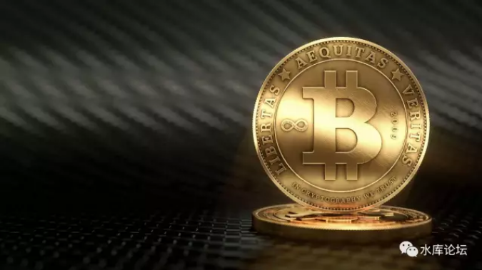
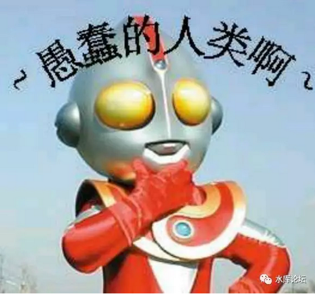
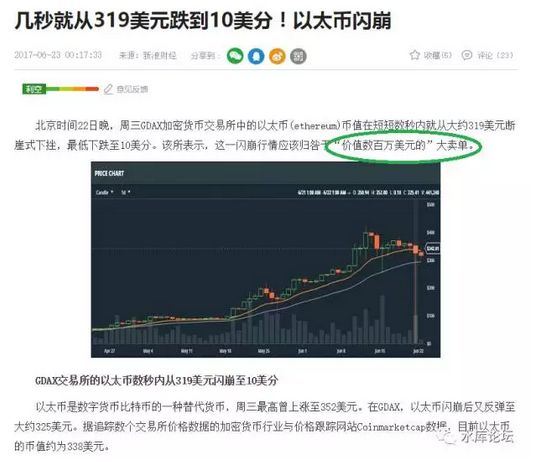

# 正本清源比特币（四）\-\-\-- 矿机 \#F1250

原创： yevon\_ou [[水库论坛]](/) 2017-08-17

正本清源比特币（四）\-\-\-- 矿机 ~\#F1250~

 

创世神的棋盘

 

 

一）歧视链

 

在《[正本清源比特币](http://mp.weixin.qq.com/s?__biz=MzAxNTMxMTc0MA==&mid=2651016110&idx=1&sn=f9d15d31bd45f63e200833e7082e0871&chksm=80721dbdb70594ab3b5be89a64a1e3c968943acbe95fa807dcb0cde9d0be20b5c1e8fc51f878&scene=21#wechat_redirect)》（一）里面，我们开篇名义，投资界是存在严格"歧视链"的。

 

楼市 \> 股市 \> 币圈

 

玩"数字货币"，是最Low最Low的。比富士康厂妹还不如，是投资界的"杀马特"。

 

 

这句话说出，肯定有很多人不服气。

你说歧视就歧视啦，俺还瞧不起您呢。"币圈都是新时代的精英"。

同样都是投资，何必还要分出三六九等呢。

 

歧视的背后，总要有所"不同"。凭什么瞧不起人。

歧视衡量的标尺是什么。

是利益。

 

 

出来玩，总是为了"赚钱"的。总是为了更好的生活。

哪怕投资界互相看不起，但有一个是绝对的共同语言："赚钱"。赚钱就是硬道理！

因为"赚钱"的不同。整个投资市场可以分为：

 

正和市场 \> 零和市场 \> 负和市场

 

-   正和市场：楼市，跨国贸易

-   零和市场：股市，麻将，文物

-   负和市场：彩票，比特币

 

以房地产市场为例。目前全国普遍的"房租"收益并不高。可能也就2%左右。

房屋本身，还有一个"折旧"的因素。每年贬值1%

这二项相加，持有"房地产"并不能增加你的物质财富。仅仅能维持和保持社会阶层。

 

但是，房地产有个超级特性。它是可以"贷款"的。

把贷款算上去。再加上通货膨胀。整个房地产的回报就是"正数"了。房地产就是一个"正和游戏"。

这段话你可能听不懂。你先抄下来。回家慢慢悟好了。社会会教训你做人。

 

 

 

另一方面，中国的A股市场，可称为"零和游戏"。

A股基本不分红。每一年的现金股利，正好和所有的印花税，券商手续费打平。

如果你观察"现金"这个不变量。池子里的现金，是±0%

 

因此，A股一个人的赢利，必然体现为另一个人的损失。是一个博傻游戏。

如果算上"大股东减持"，"增发配股抽水"。更加惨不忍睹。

 

 

而比特币呢，比特币是一个负和游戏。

 

 

 

二）矿机

 

比特币最核心的部分，在它的"矿机"设计。

我可以说，全中国99.999%的币圈中人，根本不懂得矿机的真正意义。

这也是难免的，币圈=SB圈。

 

 

按照中本聪的设定，全世界有无数的"矿机"在运行。

比特币每10分钟新产生12.5个。这是随机"赠送"的。

赠送的概率，视你的"计算能力"而定。

 

为了获取"免费赠送"，在比特币世界，展开了一场"军备竟赛"。

-   最开始，用个人闲置电脑。

-   然后用专业服务器。

-   然后发现CPU还不好，GPU的算法更给力一点。

-   然后发现GPU还不好，专业设计的ASIC更好。

-   然后是TPU

 

除了芯片类的投入，"挖矿"更大的一项成本，是"电能"。

现代的挖矿中心，往往需要3万台刀锋服务器并联。占地十几亩的机房，专业IT团队维护。

这么庞大一个系统，24小时不停运转，电费是一个天文数字。

 

 

这么高的成本均摊下来，目前全世界一枚比特币的"挖矿成本"，高达RMB
18000元。

而且还在以每个月5%的速度在涨成本。

 

前二天[（1）](http://mp.weixin.qq.com/s?__biz=MzAxNTMxMTc0MA==&mid=2651016110&idx=1&sn=f9d15d31bd45f63e200833e7082e0871&chksm=80721dbdb70594ab3b5be89a64a1e3c968943acbe95fa807dcb0cde9d0be20b5c1e8fc51f878&scene=21#wechat_redirect)[（2）](http://mp.weixin.qq.com/s?__biz=MzAxNTMxMTc0MA==&mid=2651016118&idx=1&sn=7a582a38bc0828e389f97bc75a89d31d&chksm=80721da5b70594b32c5f80d801df0aaae13f0eb8985916982fd494ffe551c53853dd9d1733c9&scene=21#wechat_redirect)[（3）](http://mp.weixin.qq.com/s?__biz=MzAxNTMxMTc0MA==&mid=2651016130&idx=1&sn=e2493ea71d677058fd75547a864e2a17&chksm=80721dd1b70594c7088ae427f3ca13f189b51cd894c3f7f31a33730338fd77f975edb6625a96&scene=21#wechat_redirect)有一个SB一本正经地说："比特币就得值二万多，因为挖矿成本降不下来"。

把哥哥笑得呀，差点岔出了小疝气。

 

 

为什么，因为站在外星人高高的角度，透视这一切，那么评语只有一个：
 

对于外星人来说，你的能量，是完全浪费掉的。

 

你花费掉了数以千万元的电能，但是你却没有计算出任何有价值的"数据"。

这么庞大的亿亿亿亿级计算支出，只不过是一个"选秀"节目。

却没有创造任何的生产力。

 

最后的赢家，只有一个，就是电力公司。

 

 

我们知道，天底下有些"庞氏"骗局，是可以维持很久的。

你骗我，我骗他，他骗你。

如果骗子可以形成一个子系统，互相骗来骗去，整个系统"不失血"的话，则整个系统可以持续非常长的时间。

 

最典型的譬如蜜蜡，沉香，手串。甚至是元青花。

你跑到潘家园的"古董市场"。就这么几十间老字号铺子。他们自有自己的一套估值系统。

一件"唐代佛首"在铺子之间来回转手，互相买卖。整个价格体系是可以持续许多年的。

 

可是，如果每一间铺子要交200000元/月的电费呢？

 

 

如果你在潘家园开张，每间古董铺子，要交数十万元/月的电费。

这整个"古董圈子"，现金作为一个不变量，失血急剧缩小。

很快，多间铺子就要被迫出售古董，兑取现金。你卖我卖，整个古董市场迅速崩溃。

 

"持续失血型"庞氏骗局，是不可持续的。

 

"负和游戏"不可持续的速度，远远快过四人麻将。

 

 

 

三）持续失血型庞氏骗局

 

按照目前的设定，比特币每10分钟产生12.5个，每小时75个，每天1800个。

每个月54000个，每年657000个。

 

比特币的"挖矿"业务，已经是一个高度竞争的市场。军备竟赛全部都是ASIC刀片服务器。不存在低成本玩家。

 

 

于是，每个币18000元的成本是少不了的。

这相当于比特币"挖矿业"，每个月向电力公司孝敬9.72亿人民币。

 

 

我们知道，比特币是有庄的。

整个比特币神话，就是一个老庄股。

 

 

我们知道，操纵一只老庄股，是不需要100%筹码和资金对应的。

只要仓位高度集中，产量高度集中，90%捏在少数人手里。

再宣扬宣扬美好前景，让散户"锁仓"。

只要很少的资金，就可以控盘。

 

根本不存在所谓"资金外逃，境外拉升"等用途神话。这和股市里的利好，概念造势，是同一个套路。

 

比特币大约有1/2是持有在中本聪本人手中。或者说，在矿机（挖矿业）兴起之前，所有的币都在中本聪手里。光买第一个比萨，就用了24W枚。

 

几大机构，再控制了剩下一大半中的一大半。

按BTC目前￥3000亿市值算，流通盘可能仅1/10.

控股庄家的资金，估计在100\~200亿RMB。

 

 

（如图，数字货币的价格深度极薄。轻易就可以击穿）

\*
比特币在今年6月，7月，连续发生二次2.4W枚币的大型出货行动。但均不成功。价格被瞬间击穿。数分钟后被右手拉起。

 

 

站在一个外星人的角度，悬空俯视：

 

比特币庄家已陷绝境！

 

因为他的资本金，就在150亿人民币左右。

而只要"比特币"行情不结束，就持续有人挖矿，就每个月要上交9.72亿人民币电费。

若无意外，他会在十五个月内将本金烧光。

  

将所有的比特币玩家视为一个整体的话。

电力公司是唯一的大赢家。

 无论你们怎么玩，我反正每个月收9.72亿电费。

一直收到你们再也交不出电费。

持续失血的庞氏骗局，焉能久乎。

 

 

 

四）中本聪的智慧

 

币圈都是SB，Low得不能再Low的乡村潮男，投资界的杀马特。

中本聪的智慧，99.999%币圈SB根本一无所知。

 

中本聪留下"挖矿/矿机"这样一个世界设定，思想本质是"反炒作泡沫"。

中本聪本人，期望比特币是1美元/枚，他并不希望比特币涨到4000美元/枚。

中本聪是学者，不是黑心商人。

 

 

按照经济学中的"套利"原则。矿机的"挖矿成本"，永远会低于"比特币售价"一点点。

也就是说，比特币卖200元/枚的时候，只会有家用小型的廉价服务器。

比特币卖20000元/枚的时候，会有专业的水电站矿场矿库。

比特币200000000元/枚的时候，会有整整一个城市上百万人口围绕挖矿。

 

 

-   比特币200元/枚时，挖矿对于"全系统失血"是972W人民币/月。

-   比特币2000元/枚时，挖矿对于"全系统失血"是9720W人民币/月。

-   比特币20000元/枚时，挖矿对于"全系统失血"是9.72亿人民币/月。

 

可见，中本聪对于比特币的设定，他是"憎恶"厌恶炒家的。

炒家把BTC的价格炒得越高，整个系统的电费，孝敬给电力公司的钱越高。

最终使得炒家无法坚持。

 

你们要去炒BTC，真是热昏头了。

 

 

 

币圈整个圈子，都是最Low最Low，乡村三四线城市杀马特，盲流穷屌大学生。

他们对于"世界"的设定，一无所知。

只知道在"导师"的训导之下，被洗脑，被肉鸡，榨出积蓄换废纸。

 

 

但是，相对来说，"发币"的人，才是精英。那些"设计骗局，主导骗局"的人，才是真正和中本聪同等智商的聪明人。

因此，在后期的"第二代数字货币"ICO设计中，很多创世神都取消了"挖矿耗电"的设定。

 

-   要么就是规定，强制2100W枚币都是属于创世者的。然后他再卖老币给你。

-   要么设定，按照UID随机分配。不需要挖矿

 

象中本聪和哥哥这么有良心的人，不多了。

 

 

 

（未完待续，还有一章）

 

 

（yevon\_ou\@163.com，2017年8月16日午）\[1\]

\[1\]从某些意义讲，比特币可以认为是有"央行"的。其央行有"利率"。实行的法定利率是"-4%"，负四每年。相对于高息货币在汇率兑换上应另有算法。

只不过这段能看懂的人就更少了。
