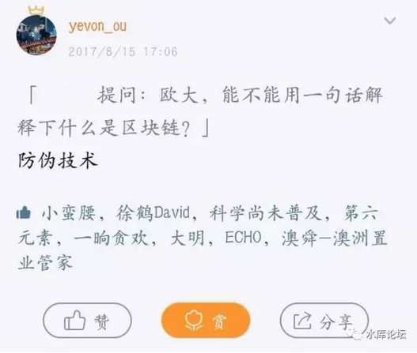
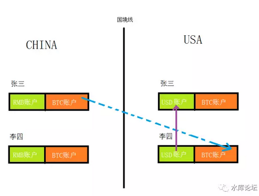
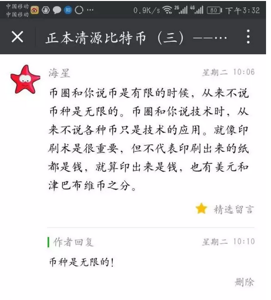
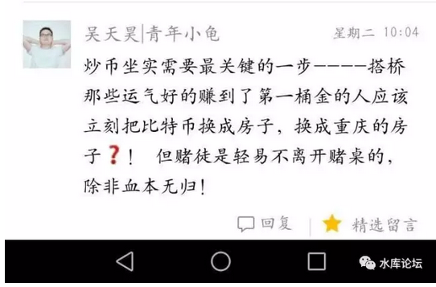
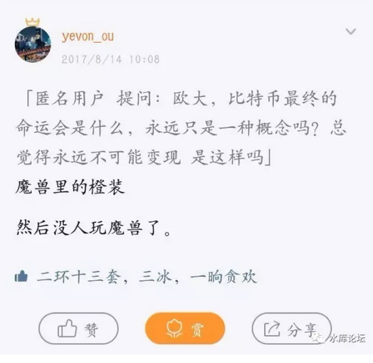
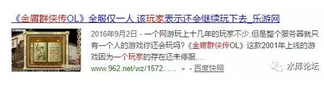
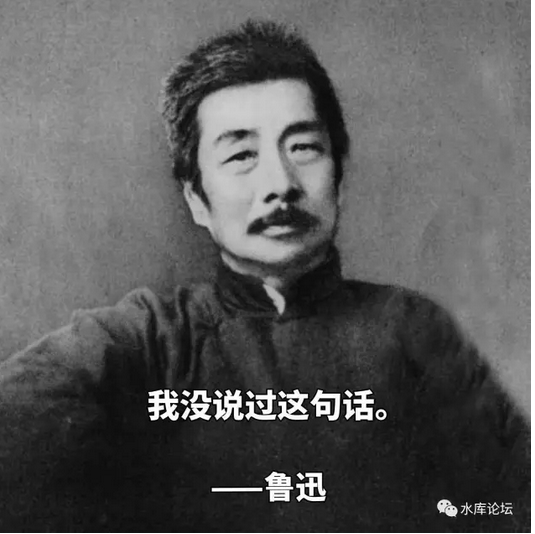

# （附录） 问答

yevon\_ou [水库论坛](/) 2017-08-19

（本篇无图）

《[正本清源比特币](http://mp.weixin.qq.com/s?__biz=MzAxNTMxMTc0MA==&mid=2651016110&idx=1&sn=f9d15d31bd45f63e200833e7082e0871&chksm=80721dbdb70594ab3b5be89a64a1e3c968943acbe95fa807dcb0cde9d0be20b5c1e8fc51f878&scene=21#wechat_redirect)》写了1\~5，这是"圣典"级的作品。

以后中国要讲比特币教学，直接拿哥哥的文章去吧。框架都已经搭好了，基石垒石大厦。

剩下就只余贴贴墙纸。

 

关于比特币，还有一些杂七杂八的知识。

但是哥哥懒得写了。主要是没人看。阅读量连房子一半都不到。

所以剩下一些"知识点"，用问答的方式。

一个回答，可能就几十个字。不再象1\~5，用长卷篇幅细细展开，手把手教。

数十个字，您自己悟吧。

 

 

Q1：欧大，能不能用一句话解释下，什么是区块链。

A：如图

Q2：可是我币圈的朋友都在说"区块链"，好像很NB的样子。还说要改变人类文明历史呢。

 

A：中本聪设计了一种无比复杂的系统，绕啊绕啊绕啊绕。

最终解决了电子网络中"伪造"的问题。

也就是，可以轻松Copy/Paste的数据包，怎样鉴别真币假币的问题。

 

当有无数无数十万台"去中心化"的电脑。

如何确定"争议仲裁"的问题。

怎样在没有皇帝的状态下，判断谁说得更有理。

 

"区块链"的技术，就其本质是一种"防伪技术"。

但是防伪技术的完善，使得"数字货币"成为了现实。

 

要在互联网上发行货币，就要先解决"伪钞"，这个是前置条件。

区块链成熟之后，ICO才如雨后春笋般崛起。

 

 

但是，区块链就其本质，依然是一种"防伪技术"。

这个只能说"小发明"。和蒸汽机，铁路，电力的发明，完全不是一个数量级。

 

"防伪技术"，也并不能更多的增加人类财富。

从本质上讲，或许还不如"贵金属光谱仪"。

 

 

 

Q3：比特币完全匿名的货币属性，也没有价值么。

A：比特币并不是完全匿名。

如图，蓝色这条虚线是存在的。BTC汇给李四是没有问题的。

[而紫色这条实线，是不存在的]。是违禁的。

 

你当然可以在BTC任何交易所，"售出"比特币。

问题是，对方无法将美金打给你。

 

 

关于美元的任何交易，都是接入USA中央结算系统的。

你在任何场合下，想要一笔200W美元的交易不被监控，都是不可能的。

 

所谓的"BTC协助资金海外外逃"，这个市场根本就不存在。

全世界不受监管的银行，不多了。

 

 

比特币唯一不受监管的交易，是"暗对暗"。

换言之，二条线都是虚线。才不会被IRS监控。

 

譬如说，在网上买一些"盗版音乐"。

买明星的隐私照片，买盗版软件，买二个游戏密码。总之"虚对虚"。

 

如果你想购买实物的话，你买枪枝掸药，过不了海关。瞒不了朝阳大妈。

买1000个京东快递。也足够把你暴露了。

 

 

Q4：中本聪拥有那么多比特币，你为什么说他永不抛售。

A：因为比特币并不是完全匿名的，他无法抛售。

 

目前全世界想要寻找中本聪的政府很多。他被逮到的话，就算不被喝猫屎咖啡，关在深山里"协助科研"一辈子，也是难免的。

 

而你同一个账户出货太多，总是会被监控的。

换美金，购京东，这些事更不用想了。

 

哪怕"暗对暗"，换购其他ICO。

同一个BTC地址出货多了，ip地址，tcp包头部，也会留下蛛丝马迹。

 

我若是中本聪，就永远不出货。

 

 

Q5：据最新财报，BTC的交易量，JPG/WON/RMB/USD各占四分之一，你为什么说它没有海外市场。

Ａ：中国政府宣布监管"比特币"之后。

二周之内，BTC的交易量，中国下跌50%，日韩上升50%。

难道之前在中国交易欢乐，都是日本人冒充的？

 

 

Q6：你在（二）说，政府想要打压比特币。比特币既然是匿名的，政府怎么能打压呢。

A：币圈SB比较多。小学七年级水平。

 

"数字货币"本身并没有价值。他们的价值，来自于他们的"名气"。名气越大，市值越大。

总市值=IP

 

政府如果想打压"比特币"的话，他自然不会搞"三反五反"。

不会搞大运动狠狠批判"比特币的丑陋嘴脸"。

"全民公讨比特币骗局"。

这样反而在给你做嫁衣。

 

 

政府真正想打压"比特币"的话，他就去所有的论坛"封贴"。

在所有的BBS，微信，微博，把任何涉及到"币""币圈""ICO"之类的字眼全部都删掉。

使得任何关于"比特币"的讨论，看不见，听不见，闻不见。

 

"交易所"本身是重资产。需要有服务器，员工，公司。

关掉境内所有的比特币交易所。

封掉境外所有的比特币交易所网址。

  

这样，就让BTC存在于你们的硬盘好了。

20年以后，谁关心糟老头子硬盘里有什么东西。

 

 

Q7：有币圈人士指出，比特币可以托管在交易所。手里只留一个"钱包"，尺寸不过110K。你怎么看。

A：如果寄存在"交易所"，那不就脱离"去中心化"的本意了么。

你是不是等着交易所被抄，还是员工偷币潜逃。

 

 

Q8：比特币最小可以分割到0.00000001份，单位"聪"。

而人民币最小只能到0.01元。

难道您对"币圈"强劲的分割功能视而不见么。

 

A：币圈都是最Low最Low，社会最底层的屌丝。

财富，学识，智力，阶层一无是处。简称SB

 

事实上，任何一种货币都是"无限分割"的。

好比我设立一个交易所，发行"黄金米粒"。任何人集满了10000粒米粒，就可以到我这里来兑换1克黄金。

 

如此，只要加一重手续。就可以把货币单元扩大几亿倍。

 

 

 

Q9：可是黄金可能被政府没收，被抢劫。而比特币不会。

Ａ：听说过黄金ETF么。

 

譬如我可以拿5000吨黄金，发行5亿亿份"黄金币"。

这些黄金币，用这5000吨黄金做背书。所以是非常有信誉的。

技术上，一样可以做区块链，做成数字货币，无法追索。

 

然后你把这5000吨黄金，飞船射入外太空。不就没事了么。

 

 

Q10：呃，这个脑洞有点大。您能不能再详细说说。

A：外太空嫌麻烦的话，直接沉船到马里兰海沟（11000米）。按目前人类的技术，再过200年也无法打捞。

或者你找个活火山，从高空中对准了扔进火山口也行。几百年之内也捞不出来。

 

反正这些东西都是"无源之木"，就和"文交所"一样。你信就信，不信就不信。

 

"呃，您能再解释清楚一点么"。

"意思就是，比特币比火山黄金币还不如。你就是个垃圾"。

"连政府都不屑抢劫你"。

 

推荐阅读：[石币之岛]

 

 

Q11：可是比特币是"通缩货币"，总量不超过2100W枚。在全球政府滥发纸币的今天，难道不弥显珍贵么。通缩必升值。

A：比特币是严重通胀货币。哪头猪告诉你，它是通缩的。

你导师么。

你导师是SB，你也是SB。

根据费雪方程式：MV = PT

哪怕你货币的总量不变，可是"使用你交易"的商贸越来越少。你依然是"过剩"的。

比特币本质上是一种严重通胀的货币。\[1\]

 

为了帮助你理解这个问题，我们编一个小故事。

 

"请你解释一下，你是怎样花完你父母半年寄来的生活费的"。

"我买了一把刀。魔兽世界的极品橙装屠龙刀"。

"为什么要买刀"。

"那时候玩魔兽么，觉得挺好玩的。而那把刀一直在升值，在涨价"。

"朋友和我说了，整个魔兽世界，屠龙刀就只有这一把。杀伤力9999999999"

"这个是限量版的，绝对不会增发"。

 

"魔兽全世界那么多的人都在玩"。

"魔兽又是匿名的，只凭账号密码登陆"。

"暗网必备，全球通货"

 "据说很多人用魔兽洗钱。买下游戏里的屠龙刀，再卖给欧美的买家。钱就转出去了"。

 

"你买了之后，那把刀升值了么"。

"我把全部的生活费都投进去了。刚买的时候，也的确又涨了一段日子"。

"后来又发生了什么，是魔兽公司违背信誉，增发第二把刀么"。

"不是，屠龙刀始终只有一把，这点暴雪信誉卓著"。

"那你怎么亏了"。

 

"因为后来同寝室的朋友，都去玩剑侠情缘了，接下来是大话西游，然后是征途"。

"慢慢，慢慢的，魔兽里的人越来越少"。

"我才知道，屠龙刀虽然不会增发，游戏却是可以增发的"。

"无数无数的ICO，*争夺的是同一批客户*。也就是在校大学生"。

"现在他们都去玩阴阳师，再没有人管我了。我想把屠龙刀卖了，也没人要"。

 

 
Q12：比特币的价值，到底是来自于通货，还是IP

A：二者相加

 

 

Q13：比特币不是奥派么，不是无政资理念的伟大实践么，不是奥派的一面旗帜么。

身为上海奥派中坚人物，为什么你要反对它。

 

Ａ：这锅奥派不背。 

只有BTC的杀马特们，天天凑上来说"我们是奥派的亲儿子，亲孙子"。扯着虎皮打大旗。

奥派从来没有认过亲。

哪一天BTC崩盘，也不要怪在奥派头上。这就是我站出来，正本清源的原因。

 

 

奥派支持的是：中本聪关于"数字货币"的伟大尝试。是BTC体系。

合理价值，每枚币卖2元钱。

我们支持的，不是你每枚币卖30000元。

丧尽天良 :@

 

 

Q14：您之前说BTC值20元，后来又说IP分摊有100元。又说2元。到底应该是几元。

Ａ：写不动了。媳妇叫我有事。

下次写《marketing系列之：广告的应用》再插进去吧。

 

 

（全文完）

 

（yevon\_ou\@163.com，2017年8月18日午）

 

 

 

 

 

\[1\] 费雪方程式：MV =
PT，绝大多数人都知道，如果将货币平白增加200%，则通货膨胀就会200%。

但还有一个神奇的推论，假设货币不变，是你的"国土"缩小一半。则通货膨胀也是200%

《比特币值多少钱》\#F1000中，举了一个常凯申丧权辱国，丢失50%国土的例子。

在现实生活中，"多少交易使用你"一般由枪杆子守护。960万平方公里一寸也不会少。

但BTC恰恰是没有"枪杆子"做背书的。他并没有护城河。

随着莱特币，以太币，ICO等种种山寨货币兴起，BTC的市场份额不断丢失。毕竟，大家争夺的都是同一类客户：刚毕业的在校大学生
