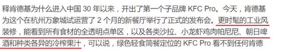
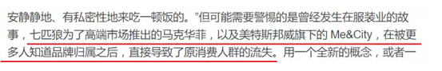

# 掀桌子的一代人 \#F1260

原创： yevon\_ou [水库论坛](/)

**水库论坛**

微信号 Shuiku-net

功能介绍 科学尚未普及

2017-09-03

 掀桌子的一代人 ~\#F1260~
=====================================================================================================================================================================================================================================================================

 

昨天，我买了一个米老鼠的卷笔刀。

 

她把它扔在了地上。

 

 

 

一）忠诚

 

我父亲曾希望我多看一些《世界名著》。在他圈出来的书单里面，有雾都孤儿，嘉莉妹妹，呼啸山庄，悲惨世界，麦克白和百年孤独。

很抱歉，以上所有的书，我一本也没看过。

 

我只看过孤星泪，小李飞刀，天龙八部，碧血剑，萍踪侠影，喜宝，刘德华，周星驰，钟楚红，邱淑贞，星矢，乱马，白素贞......

 

 

 

很多年以后，俺讨好地买了一个卷笔刀。

一个米老鼠形状的，带二个耳朵，会发出声音的，很可爱的卷笔刀。

 

俺女儿七岁，她愤怒地把卷笔刀扔在了地上。

"我不要米老鼠。我要冰雪奇缘，冰雪奇缘"！

恍惚间，我似乎看到了什么。

 

 

为什么小孩子不喜欢"米老鼠"呢。因为她没有看过"米老鼠"。

我仔细想了想，严格地说，90年代播放的，黑白电视机上的"米老鼠和唐老鸭"，她一集都没有看过。完全无感啊！

 

她看过的，童年中最大的IP，第一名肯定是"小马宝莉"。

其次是海底小纵队，汪汪队立大功，熊出没，芭比。

 

 

学写字的桌台上，密密麻麻排开一百多个"小马"。

每一具小马如数家珍，每一个可爱标志，都能讲出故事。

 

俺叹了口气：

品牌是要折旧的

 

 

 

目前全世界的"迪士尼乐园"混得都不好。

香港迪士尼惨淡经营。上海迪士尼开园二年，也远远没有达到期望中效果。

 

曾经的经营者以为，孩子们会喜欢米老鼠，白雪公主。小孩子尖叫，欢呼。

然而，并没有发生。

小孩子对于米老鼠的表现很冷淡。害怕连合影拍照都不肯。

 

 

"迪士尼"犯了一个错误。他们以为"小孩子喜欢米老鼠"。

1）喜欢

2）天生

 

这二者都不是。"小孩子喜欢米老鼠"是后天的！

是每天放学，看上二集米老鼠。是日积月累，电视轰炸了好几年后才有的效果。

迪士尼花费了几百亿去建造乐园。但是他们并没有占领屏幕。

 

真正有价值的，不是米老鼠胶片。而是电视机。

比电视机更有价值的，是孩子们有限的注意力时间。

 

 

 

二）背叛

 

前二天，看了一则新闻《[真功夫、吉野家、永和大王、味千......为什么这些连锁快餐现在都处境尴尬？](https://mp.weixin.qq.com/s?__biz=MzA3NjY2MTMzMQ==&mid=2650322726&idx=1&sn=d85e8c268ef98606d437f4263a9ac097&chksm=8751c01ab026490c7182b914dbdba9ac0424bb28108bfecb79cff81cc67560190bbaf53ed68b&mpshare=1&scene=21&srcid=0903Xbf2hfpnhITxj427M61L&pass_ticket=IX7WT#wechat_redirect)》

文章很长，但还是建议各位看一遍。很有帮助。

 

如果你是一个基金投资人。你需要决策"味千大王"。请问你是割肉，还是抄底。

我赌一元钱，我赌"真吉永味"沉沦。不可能再复兴了。

为什么，因为他们的品牌太"老"了。

 

 

 

同一个时代，更大的受害者，还有P&G宝洁。

曾经，P&G是洗发水的绝对王者。任何品牌都无法和她竞争。全国前六名，有五名是P&G名下。\[1\]

 

但是最近五年，P&G每况日下。市场份额不断蚕食。

任何一家竞争对手，都不是巨型企业。可能就是韩国的一家小公司，可能就卖几十万瓶。

可是消费者就是喜欢"小众"的品牌。就是对飘柔，海飞丝，沙宣，潘婷无感。感觉"大路货"。

是消费者厌倦了你。而"厌倦"是marketing的终极武器，无药可救的。

 

 

 

这些品牌，经历的是同样的问题。

不是他们做得不好，而是"人口"变了。是消费者变了。

 

低级的品牌经理，雏嫩的新手，容易把"市场"看作是一个常量。

市场份额有多少，消费者口味去屑还是滋养。几年前的报告，拿过来修修改改还能用。

 

这样的思维，大错特错。

"市场"是动态的。消费者的人口，是随年变化的。

 

哪怕你什么事也不做，你也会飞快地丢失市场份额。

每年2%

 

（15岁\~65岁，共50年。每年更换2%）

 

 

 

"真吉永味"的问题，他们并没有做得不好。消费者一如既往地喜欢他们。

可是消费者在"老去"，品牌在"死去"。

一到65岁，就永久性地退出消费市场。

 

而新生代，新新人类，他们并不喜欢"味千拉面"。

经过五年，你就失去了10%的消费人口。

 
色拉好吃么：     
哥哥最讨厌湿冷腻的色拉了。

帕尼尼好吃么：    油死了

朝日啤酒：        不如青岛

冷榨果汁：        IB

 

 

但是，这些都不重要。

营养，价格，口味，性价比，产品经理千万别搞错了核心诉求。

哪怕新餐厅卖狗屎，"新新人类"也会去吃的。

 

新新人类的核心诉求只有一个，你千万别搞错了：

 

-   不去妈妈去的餐厅

-   妈妈说好的，那一定不好

 

 
从某些意义上讲，KFC pro依然是错误的做法。

你想做新品牌，你根本就不应该用KFC三个字。

就好比"真吉永味"如果开子品牌，85%的概率也是会失败的。\[2\]

 

但是纯商业"职业经理人"很难抗拒KPI的考核。

Line Extension中规中矩，有更大的概率可以活下来。

但真正的"大卖"超级大赢家，一定是一个新品牌。

 

 

因为消费者的核心诉求是：

-   和妈妈不一样

 

 

 

三）颠覆

 

-   60年代法国年轻人发疯一样地喜欢共产主义

-   70年代闹嬉皮士

-   80年代中国改革开放穿喇叭裤

-   90年代平成死宅

-   00年代白左圣母闹世界

 

为什么"年轻人"如此颠覆。为什么年轻人永远不肯跟随"秩序"，现有安排的格局。

 

因为这是对他们最有利的选择！

 

 

这个世界并不是"水平"的。竞争和抢劫无所不在。

在过往的研究中，人们往往重视同一个时代中，不同国家，不同阶级之间的抢劫和对抗。

 

其实他们没有看到，不同年龄，一代人对一代人的抢劫。

 

 

 

在商业上，最容易赚钱的，是"囤积居奇"。

具体来说，找到一种珍稀资源。然后把所有的"好货"都抢到自己手里。

吊得高高的，卖给后来者。

 

在某些更极端的情况下，"老头子"甚至还能兼职"裁判"的角色。

不仅所有的好货，都在老头子手里。而且什么是好货，也得让老头子说了算。

 

 

最典型的，譬如中国字画，红木，瓷器，翡翠，和田玉市场。

不那么典型的，还有土地，地段，矿山，政协委员和书法大师。

好东西都被人抢光了。新生代穷无立椎之地。

财富在二代人之间，是不平等的。

 

 

而新生代的对策呢。

"天底下最好的紫檀，都在我们家。而且我还垄断了紫檀的评价标准"。

"对不起，我们不喜欢红木。简欧风格更好一点"

 

"中世纪所有的古画，都在Old Money手里。这个坑没尽头的"。

"对不起，我们只喜欢先锋派油画。古画都是垃圾"。

 

"钻石的4V透明，都握在我公司手里"。

"对不起，我更喜欢彩钻"。

 

"全上海最好的核心地段，都在我们手里。不可复制的稀缺"。

"对不起，我更喜欢张江的荒郊野岭"。

 

 

新生代对于原有的"估值体系"，基本是全盘否定的。

你如果垄断了某项资源，我就干脆不和你玩。

这样，不玩"红木"虽然对家居装饰[有一定的损失。但总比被剥一层皮好。]

 

 

 

上兵伐谋，"在选择的战场发动战役"。

而作为年轻人，就绝不肯在你已经构建了重重堡垒，机枪防御完善的阵地，和你发生对抗。

 

60年代法国人，老家伙"互相推荐"的风气太浓厚。

因此年轻人搞出了"引用数"排名的SCI方法。

 

日本人的论资排辈实在太严重。

因此引发了"宅男"文化爆发。（此举'退而求其次'损害了日本国力）

 

中国的年轻人，隐性地对父母不满。

也对长辈们垄断社会，政治，经济权力不满。

所以他们搞"文青""马拉松""西藏骑行"来异化个人成就。吃菜只吃色拉。\[3\]

 

 

 

四）IP时代

 

我们总结一下思路。

 

-   每一代人受的教育不同。长辈的"经典"，子辈可能根本没接触过。

-   子辈倾向于，掀桌子不买单。

-   结论：IP不保值

 

（IP翻译为：名气、品牌价值、无形资产、知识产权等）

 

 

在我小的时候，上海译文出版社专门组织了力量，出版了一套《世界名著》丛书。

按我父亲的说法，这些"经典"是可以挨过时间的考验，历经数百年而不腐的。

 

我们知道，现在这就是一句笑话。象《邦斯舅舅》《漂亮朋友》这种书，哪还有谁记得。

即使记得，我也不建议下一代读。因为严重脱离时代，实在没什么营养。除非纯为考古。

 

 

"后人哀之而鉴之"，其实我担心的是，我们这一代人，心目中的"经典"，在未来也不值钱。

星爷的电影，在VR时代也不值钱。

我们所追捧的，角逐的，出名的，在未来弃若敞履。

 

任何一个做局做出来的钻石，翡翠，红木，字画，普洱，蜜蜡，LV，PP价格体系都不保值。

都禁不住岁月、人口的洗礼。

 

财富不可建立在[人心]之上，

资产不可建立在IP之上。

 

"品牌"的贬值，是非常非常迅速的。浮沙上的大厦。

大米远远比古董更保值。放弃品牌价值，专注实用价值。

大面积，低单价。

 

"您知道嘛，这北京的学区房，也得讲究一个血脉和传承"。

"北京的学区房，摸金分三派八脉。向来以中关村一二三小为尊，学问大着呢"。

"40平米，1300W元。这不是卖破房子，卖的是文化，底蕴，传承！"

 

你要问我对北京学区房怎么看。

00后会不会花1300W来买你。

NO，他们大概率会掀桌子。

 

 

 

（yevon\_ou\@163.com，2017年9月3日）

 

 

\[1\] 除了怪胎SLEK，只有老人才记得当年恐怖的"红色城市"。数十亿张的刷墙传单。

[\[2\]] 在美国，MCD和KFC的定位是"满足基本生存的食品"。而完全不涉及品牌溢价。这样的定位，哪怕品牌老化，也活得下去。

[\[3\]] 有一群SB，比特币上限2100W枚，在2030年之前几乎全部挖光。

于是那帮SB就吊起来卖，妄想"一币一墅"。

而事实的真相是，新生代根本不可能卖他们的账。New
Money自己再去搞一个"沙特币"。

好久没给自己做广告了。小密圈终于修好了。

改版之后，叫做"知识星球"。在App Store和安卓都可以下载。

 

房产深入知识，只接受付费入圈提问。
