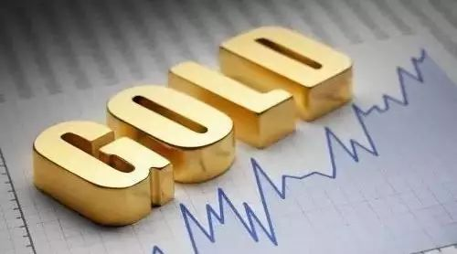
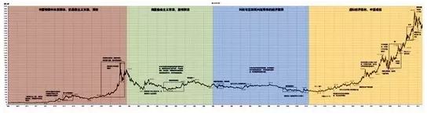
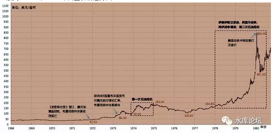
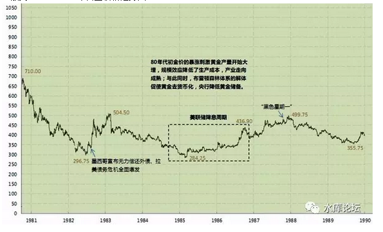
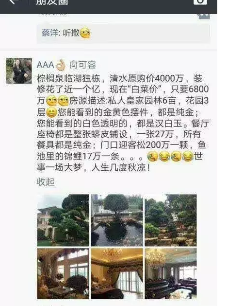
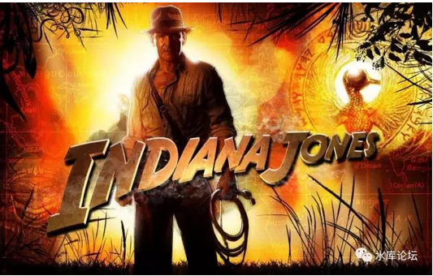

# 黄金已死，有事烧纸 \#F1270

原创： yevon\_ou [水库论坛](/)

**水库论坛**

微信号 Shuiku-net

功能介绍 科学尚未普及

2017-09-06

黄金已死，有事烧纸 ~\#F1270~
============================

 投资黄金是合理的吗？

 

 

 

一）金价

 

今天心血来潮，想到讲讲黄金。

首先，我们来讲个故事。是非对错，等故事讲完了再说；

 

 

几乎所有财经类的中国学生，都听说过"布雷顿森林体系"。来龙去脉，汗牛充栋，写了几千本书。

所有的"人云亦云"，关于金本位，大致复述同样一个故事；

 

-   美帝国力衰弱，滥发纸币

-   1971年，尼克松取消金本位，美元崩溃。

-   可是之后呢，[之后王子和公主过上了幸福的生活？]

 

 

其实我们想问，之后呢。

之后黄金的走势表现怎么样。投资黄金，能不能赚大钱。

 

 

直接先上图。"过往50年"黄金价格走势图。

 

http://stock.sohu.com/20130924/n387125773.shtml

 

（放大：1968年-1980年黄金价格走势图）

 

（放大：1980-1990年黄金价格走势图）

 

 

你要"投资黄金"，首先要问一个问题："黄金之前多少钱"。

 

1971年时，"布雷顿森林体系"要求\$35美金/盎司。

美帝国力衰退，滥发纸币，法国人率先质疑。被抑制的价格。

解体之后，短短几年，金价就翻了二三倍。

-   显然，\$35是不合理的。

 

 

此后，黄金经历了一段"市场化"博弈。各国一律采取浮动汇率。

黄金的"保值增值"，带给它巨大的心理优势。狂热，炒作，投机热潮。

1981年，"炒黄金"冲到了\$850美金高位，但很快就腰斩。

-   显然，\$850这个价格也是不合理的。

 

那么，你要问"均衡态"黄金的价格，市场给出多少值合理呢？

 

 

我们看第二幅绿图，尘埃落定，硝烟散去。非常长的一段时间内，黄金在一个大箱体内振荡。\$300\~400美金。

取1980年，XAU=\$350，是比较合理的"均价"。

 

 

你发现问题在哪了么。今天是2017年，XAU=\$1300

 

经历了整整三十七年，黄金一共只翻了四倍！

 

 

 

二）通胀

 

-   过去10年，表现最差的资产是什么，是黄金。

-   过去20年，表现最差的资产是什么，是黄金。

-   过去30年，表现最差的资产是什么，是黄金。

-   过去40年，表现最差的资产是什么，是黄金。

 

 

有一层遮羞布，我很惊讶几乎所有的"财经媒体"都没有提到：黄金的表现之差，已经到了"匪夷所思"的地步。

 

从1980\~2017年，一共才翻了四倍。

你还能历数生活中，有多少东西只翻了四倍吗。\[1\]

 

 

 

一般认为，从1980年中国改革开放，物价累计上涨100倍以上。

当年你的父母，上海大学生起薪36元，现在3600元都不止。

当年3分钱一个馒头，现在5元一碗米饭都不止。

 

世界上，美国也通胀，累计通胀在20倍左右。

欧洲，日本，香港，都有20倍以上通胀。百万富翁已经贱如牛毛。

 

 

在所有的资产中，涨得最多的，可能是京沪的房子。光2000年之后，就涨了20倍。

有一句笑话，叫做"京沪永远涨"。

再这样涨下去。迟早北上一间水泥做的房子，会比纯金打造的房子更贵。\[2\]

 

（搞笑图，纯为推销重庆）

 
 

三）IP

 

黄金的表现，为什么这么差。

这件事，要从更"本源"的角度说起。

 

 

黄金为什么值钱？从学术上讲，黄金铂金被称为"贵金属"。银铜是"贱金属"，价格差上百倍。\[3\]

可是用途上，二者并没有这么大的区别。

 

目前全球最受欢迎的导电金属是"铜"。被广泛用于电线，轴承之中，有良好的导电性，易加工。

铜供不应求，铜矿不足。网线已开始用铁丝。

 

比铜高一级的，是"银"。

银几乎所有性能都和铜重合。但比铜更好。铜能做的，银都能做。

 

比银更高一级的，是"黄金"。

黄金具有绝佳的导电性，延展性。金饰品更美丽，不容易氧化。

 

可是，以上依然不是"黄金"比"银"贵一百倍的理由。

 

 

黄金能有今天的价格，非常大的路径依赖，和它几千年来的"江湖地位"有关。

 

欧洲，从古罗马时期，使用的就是金币。实打实Coins拿在手里，日常消费用的。

中世界无数的魔法传说，童话城堡，女巫收的也是金币。

 

中国，中国虽然没有"金币"的说法。但是有"金子"的崇拜。

层层堆垒的金条，总意味着宝藏。跑路的时候带二箱小黄鱼，抗战电影都这么宣传。

 

"印第安纳·琼斯"电影拍了五六部。前赴后继，跑到南美洲的丛林里。

为了什么，为了寻找遗失的黄金。\[4\]

跨越国界，朝代，民族。千百年千万人众口一词，"金子，金子，金子"！

 

这是什么，

这就是"IP"啊！

（IP翻译为：名气、品牌价值、无形资产、知识产权等）

 

你看"印第安纳·琼斯"寻宝电影的时候，你就深深记住了"黄金=财富"这个概念。

千百年来不停地洗脑，这个概念就无比强大。无比值钱。

史上最强广告。

 

 

 

四）废帝

 

前二天看晚清小说，1911年清帝逊位之后，他的日子过得很不好。

和所有被"统zhan"对象一样，每过一天，他的力量都在被削弱。

 

-   军队离不开土地（见：三代之治 \#F129）

-   君王离不开人民

 

 

清室在台上的时候，每过一天，他的"人望"都在增长。

名正则言顺，在台上的每一天，IP值都是增加的。

 

可是清帝退位之后，宛如无根之木，采摘之花，他再没有营养可以汲取了。

虽然"遗老遗少"们还保留着忠心，可是每过一天，这份忠诚都在被削减。

每过一天，记得他的人都在减少。

每过一天，老人们都在死去。而新人们只记得新帝。

 

被"统zhan"的人往往只有一二代的价值。

因为无论你名气多大。离开了养育你的那片土壤，过了二代人，你也就毫无价值了。

 

黄金的"价值"，其实和"废帝"很类似。

1971年之前，黄金是"本位"。它就是货币界的皇帝。

 

19世纪掘金潮。全世界任何探矿，都比不上发现金矿。

因为金矿就是钱，不用再销售。秒杀一切煤铁油。

 

 

1971年之前，只要"金本位"存在一天。全世界的所有人，每天都被一遍一遍洗刷着脑子。每一天都对黄金印象更深刻。

"黄金就是钱"。金子就是财富。

可是1971年"黄金"退位了。宛如清帝退位一般，从此之后，越来越少的人知道它，无根之木。

 

 

前天，我女儿把一个新买的米老鼠卷笔刀，扔在了地上。为此写了一篇《[掀桌子的一代人](http://mp.weixin.qq.com/s?__biz=MzAxNTMxMTc0MA==&mid=2651016196&idx=1&sn=ecdfe9c838fdb924d9d095dd2c686f48&chksm=80721a17b7059301ffa24a916e89fceb7e62eff37b18bd617a5af77cc33e4e34d4e9f9e5412c&scene=21#wechat_redirect)》。

这让我感到很惊恐，因为她们一代人，是不认识米老鼠的。是不知道迪士尼IP的。\[5\]

 

可是比米老鼠更远的，是"黄金"。

仔细想想，我女儿这辈子也没有接触过任何"黄金"的概念。

她甚至不知道黄金是很值钱的。

 

 

或许她知道黄金是很值钱的。但是她不知道黄金为什么值钱。值多少钱。

把黄金和白银，黄铜放在一起。她会觉得那是差不多的东西。

就算贵一点，也贵得有限，绝对没有100倍的差距。

 

 

"笃信"黄金的那一代人，正在飞速地死去！

 

黄金为什么严重跑输通胀。

1000两黄金，从换一个小城镇，到半条街，到仅仅一套房子。

卅年间，黄金丧失了96%的购买力。

因为信奉黄金的Fans们，在死去。

 

 

-   1971年，几乎全社会的人，都从小出生在"金本位"的氛围中。有权有势的大人物，都从黄金时代延续。他们共同堆起了黄金大牛市。

-   1981年，1910\~20年代人死去，退出历史舞台。1930\~70后还在。

-   1991年，30后退出。40\~70后还在。

-   2001年，40后退出。50\~70后还在

-   2011年，50后退出。60\~70后还在

-   2021年，60后退出。70后还记得"金本位"。

-   2031年，再也没有人记得"黄金"！

 

黄金未来会不会变得和"白银"差不多的产品呢。

那还要在现有的基础上，再跌掉90%

 

 

目前，欧美的年轻人已经完全不佩戴金饰。

因为欧洲人尚白，他们觉得黄灿灿的很乡土气息。

而且黄金的价值太低（相对于欧元），哪怕穿戴1kg，也达不到炫富的目的。

还不如把钱花在钻石，手表。

同等质量的PP，价格是黄金的10倍。

 

目前，全世界最后，也是最大的黄金市场，是印度。

全球存量13万吨黄金。印度号称：官方1万吨，民间2万吨。

每年，印度都要从黄金市场进口500吨以上，几乎吃光了所有的新增供应。

 

在印度民间，尤其是农村地区。黄金长期被视为一种"稳健的""靠谱的"投资行为。

印度人嫁女，嫁妆大规模地使用金饰。

每年二次的"盂兰节"（就是昨天），是全球黄金销售最大的盛事。

 

随着印度农村的现代化，富裕化。

如果黄金失去印度这个巨象市场，那真是彻底完蛋了。

 

 

 

五）结语

 

没有使用价值的东西，都不保值。

黄金作为全球人类最强大，最古老的IP，品牌一哥。可是依然逃不过这个铁律。

 

在过去40年中，黄金丧失了96%的购买力。

未来年代，黄金可能再贬值十倍。

 

人口变迁，IP是一项高度不保值的东西。

 

 

重要提示：本文不构成做空黄金建议！

 

 

 

（yevon\_ou\@163.com，2017年9月6日午）

 

\[1\] 因为黄金是没有任何利息的。这使得任何资产都轻易跑赢它。有一种说法，1971年哪怕你持有\$35的美元，投身美国金融市场，现在都比黄金高。

\[2\] 金箔目前大约是1000元/平米

\[3\] 铂金是一个更大的IP陷阱。

\[4\] 哪天《印第安纳·琼斯》跑到南美洲丛林里，是为了寻找失落的硬盘，和硬盘上存储的比特币。那比特币才叫是翻身了。

\[5\] 2006年，迪士尼斥巨资收购微小型公司Pixels"皮克斯动画"。这对于迪士尼商业是一个巨大的失败。意味着百年米老鼠唐老鸭，再也卖不出价钱。虽然迪士尼仗着雄厚的资金储备，但对股东利益，是一次巨大的摊薄。
