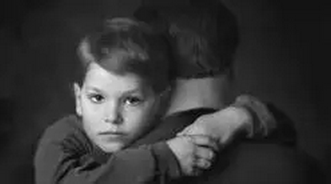
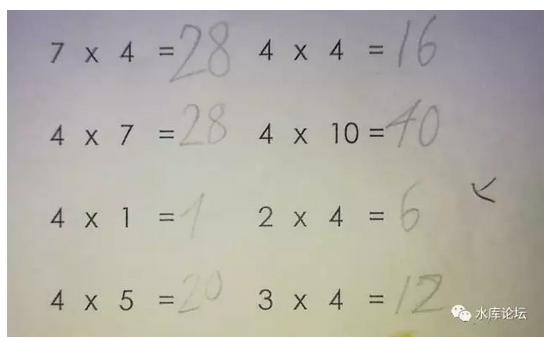

# 亲爹给你的教育 \#F1310

原创： yevon\_ou [水库论坛](/) 2017-09-30

亲爹给你的教育 ~\#F1310~
===================================================================================================================

 

谁的错？

 

 

一）前言

 

石臼大临近，闭门学习核心价值观。因此就不要催更了。

按照伙伴们的建议，最好是完全不更。彻底一句话不说，闭门读书。

 

不过话痨始终是忍不住。"房产"是万万不敢写的了。

"水库论坛"虽然是一个房产号。可是我们近期更新的全部都是\#F系列。随笔和散文。

 

前一阵子怼了比特币，接着又怼女权。

房子是万万不能写的。今天我们来写写"母婴育儿"。

 

 

 

二）作业

 

晚上在剥螃蟹。吃饭的时候，蟹膏和蟹黄，早早被千金取走。

饱饱大小姐跑到楼上书房，开始写她的家庭作业。俺继续留守处理无数的蟹脚。

 

过了一会，饱饱大小姐拿着她的数学作业下来了。

俺继续处理蟹脚，一边翻阅她的二位数乘法。

 

4Ｘ10=40，4Ｘ4=16

4Ｘ7=28，2Ｘ4=6

 
嗯，这里错了。

俺拿过一只圆珠笔。用蘸满醋的手反手夹着，随手打了一个叉。

 

当我又剥了三个小钳，一个中钳，开始处理大钳时；

饱饱大小姐发现了她的数学作业。然后发出了一个声惊天动地的嘶吼声：

 

不要啊\~

 

饱饱大小姐激动得浑身发抖。

"你为什么，为什么，用圆珠笔打叉"。

"圆珠笔擦不掉的"。

"周一交作业，老师就会发现这个叉。老师就会批评。按规矩作业上是不允许有圆珠笔的"。

"我就会拿不到本周的五角星。月末就会拿不到Star of Month"。

 

饱饱大小姐发出惊天动地的吼声。

"不要啊\~"

 

 

请问，遇到此情此景，应该如何教育。

谁对谁错，应该如何安抚。

 

 

 

三）对错

 

我让她吼了足足二分钟。继续耐心地剥了二个小钳，一个中段，一个大钳。

谁也不许安抚，你给我好好听着。

 

 

"不重要，一点也不重要"。

"今天我来给你上人生中的重要一课，什么是重要，什么是不重要"。

"你的作业，就是根本不重要"。

 

"你的作业交上去，老师根本就不会看"。

"老师即使看，20个学生，他也不会注意到你的试卷"。

"就算是老师注意到了。让他打电话给爸爸"。

 

 

 

我今天费尽心机煮了一个三斤的龙虾，一个二斤的龙虾，七只螃蟹，一条鱼，忙累了二个小时，就是为了伺候你们二个小畜生吃好穿好。

关这一顿饭，就花了我一千多元。

 

相对于你爸爸这么庞大的付出，你有没有露出过笑脸。

吃光了所有的膏肓，你有没有搂着爸爸脖子说："谢谢"。

你知道什么才是昂贵贵重重要么。

 

 

现在你为了这么一张破文不值的破纸。

为了少拿一个Star，为了学期结束一枚喂狗抢食的勋章，你对着你老爸大吼大叫。

你知道什么是真正宝贵的财富么。

 

如果我纵容你，

岂不是将来你父母的恩情，

在心中还比不上一阶升职加薪。

 

 

我今天在教育你，在教训你，在惩罚你，是为了让你记住。

在这个世界上，什么事情真正重要，什么事情毫不重要。

 

能判断这一点，才是对你真正的教育。才是你未来成就的分水岭。

而远远比你2Ｘ3, 7Ｘ8的数学教育重要得多。

 

 

 

我今天要教育你的，是让你知道，在整个学校的处理流程是怎样的。

教师一般是很忙的。偷懒是每个人的天性。

学生作业，由于不记入KPI，尤其被忽略得厉害。

你要学的第一点，是"作业不重要"。

 

其次，即使你老师发现了作业本上打了一个"叉"。

这也并不意味着什么。有可能是小宝在玩耍的时候胡乱涂抹，有可能是猫狗的爪子印。

 

完美主义是人生的大敌。我们可以看到一些读书好的人，最终他们的人生彻底失败。一辈子都没有什么出息。更不适合做创业者。

因为他们的人生太"完美"了。一辈子没有犯过什么错误。就如同你这本作业本，完美无瑕。充分符合学校的要求。

 

而这个世界，真正需要的一种能力，是"评估不良后果"的能力。

如果我这个作业本，花上一个叉，会对我的学业，导致多大的灾难。

会不会导致我退学，留级，记大过。还是仅仅在学校老师的一个哈欠间忽略。

 

这是一项巨大巨大的能力，任何赞美都不能评语它的无穷威力。

当你熟知了"缺陷/代价"之后，你才算是掌握了游戏规则。进击急退，游刃有余。

袁绍用兵，方正圆熟，不肯损失一兵一卒。

曹操舍得弃子，诡道。最终袁绍被曹操打得大败。

 

 

第三重的能力，是"补救"的能力。

我现在也不过在你的作业本上，画上一个微不足道的小叉。

可是即使我画个大叉，把作业本涂抹。哪怕把作业本撕得粉碎。

天就塌下来了么，值得你对你父亲大吼大叫么。

 

没事的。我们做最坏的打算，哪怕我把你的作业本撕成粉碎，蝴蝶状片片飞散在空中。

最坏的恶果，也无非家长写一篇"情况说明书"。说作业被家里的狗咬碎了，无法恢复云云。

值得惧怕嘛，芝麻都不算。屁大点的事。

 

第三重的能力，是"寻求补救"的能力。

作业如果被污染。你首先要想的，应该是"解决问题"的方法。寻找怎样的借口，甚至捏造一个说法，让老师信服。

实在不行，可以让老师打电话给爸爸嘛。

学会了这三项能力，你才是一个厉害的人。

 

四）白左

 

而事情的相反面呢，你现在算是一个"名校"了吧。一年也要小几十万学费。

你在学校里学会了加减乘除，英语单词，语文拼音。

你以为这是"教育"么。No，这仅仅是扫盲。

 

我们见过很多"悲剧级"的家庭。他们的[炮灰]父母，养独生子女，买学区房，奉行"求精不求量"的错误政策。

然后就把孩子完全交给了学校，不理。

 

 

当你的吼叫发作时，奶奶第一时间就把你搂进了怀里。

"是爸爸不对，爸爸不该用圆珠笔"。

"大家一起想办法怎样涂掉"。 

这就是完全错误的教育。

错误的教育，完全搞错了一点，"你不可以对着父亲大吼大叫"。

疏不间亲，读书读到没人性。

  

 

世界上什么东西珍贵，什么东西不值钱。

什么是珠宝，什么是贱货。

低买高卖，商人因此而发财。但这么是贵，什么是贱？

 

孩子啊，你要记住。你在这世界上一切幸福的源头，是你的父亲。

因为父亲的苦力存在，供应你吃，供应你喝。

你吃最好的澳龙，吃螃蟹和鱼肚，一顿晚饭爸爸花费了一千多元。

没有父亲，就再没人如此疼爱你。你就是街头讨饭的。老师绝对不如父亲亲。

 

而等你考上大学。踏上工作。

你的第一份工资才3000元钱。要赚回这顿千元晚餐，更不知道猴年马月。

 

 

在这个世界上，许多事情是不重要的。

父母们挖空心思，横跨半个上海，带你去逛迪士尼，花费千金试图哄你一乐。而带给你的欢乐，可能还不如几张小马贴纸。

在你心中，一个玩偶，一幅连环画，一支彩笔，价值或比头等舱海陆大餐行政套房更宝贵。 

 

学校里并没有教育你甄别珍贵的本事。

在你的心目中，你觉得拿到一颗"红五星"是天大的事。你觉得奋斗一个学期，最后获得一个虚幻的Star
of Semester排名，是天大的事。

屁，屁都不如。逗狗骨头。

 

孩子，那是不对的。

那是贱货，是毒害穷人家的小孩子的。

他们没有亲爹，来给你觉醒教育。

 

  

我们的教育，始终在混淆着"贵贱"之道。

自古以来，诛心最上。

要掠夺一个人的财富，抢夺一个人的金钱。最佳的办法，并不是拔出你的剑，冲进别人的村庄或城堡。

 

抢劫最佳的办法，是给穷人们"洗脑"。

摧毁他们的三观。让他们不知道"什么是重要，什么不重要"。

只需要传道士几句话的花言巧语，就可以煽动穷苦农民，把全部的财产捐献给教会。并且抛头颅洒热血，为基督而牺牲圣战。

世上还有什么生意，能比[捐命]更赚动呢。

 

 

当你对老父斥责的时候，我无比的难过。这说明你的教育已经走入了邪途。

你的教育，教你放弃了你最珍贵的东西，世界上最宝贵的人，你力量的源泉：你的父亲。

千金之宝，却被你弃若敝履。遗置于地。

 

你所追求的，是一文不值。三二枚勋章就打发的贱货。

我们通过这种方法，把别人的钱都卷到了手里。我不希望别人再把后代钱卷走。

 

 

 

管控的教育，从来不会教给你真正的知识。

你来到这个世界，爸爸无比的珍稀你。你是爸爸最爱的小天使。

 

我今天要教育你的，是只有亲爹才会告诉你的知识。

只有亲爹才有的家学，只有亲爹才有的真心。

 

好了，现在爸爸来教你。怎么给老师写解释信。

 

 

 

 

（yevon\_ou\@163.com，2017年9月30日晚）
