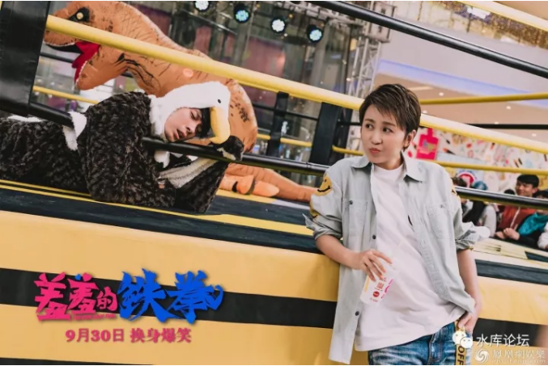
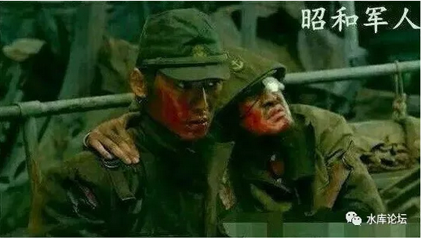
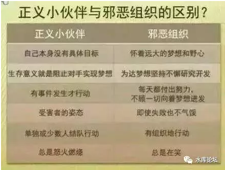

# 不公平地揍人 \#F1340

原创： yevon\_ou [水库论坛](/) 2017-10-22

不公平地揍人 ~\#F1340~
===================================================================================================================

 

 

美国海军虐法西斯日本。

 

 

一）羞羞的铁拳

 

《羞羞的铁拳》票房过20亿了，于是哥哥又去贡献了二张。

因为是第二次看了，绝大部分时间我都在打哈欠。

 

一直看到影片快结束了，最后十分钟。

大春和吴良在台上恶斗。大春本来快赢了，吴良却开始掰他的手指。

马丽在台下看得心急如焚，大声对裁判说"掰手指，犯规"。

裁判看了一眼，屁股一撅，赶紧跑到对面去了。

 

电影院发出一阵猛烈的嘘声，眼角隐隐有些许湿润。

为了弱者的不公，规则的无耻。充满了苦难而艰辛的人生。

 

哥哥拭拭眼角。思绪，却不知不觉飞远去了。

因为前二天看了一个贴：《为什么中途岛战役中，日本几艘航母一炸就废？美国有用什么黑科技吗》

https://www.zhihu.com/question/66144558/answer/240558820

 

 

1905年，日本打赢日俄战争。跻身世界列强。

自那年起，日本人就野心勃勃谋划，下一轮的太平洋扩张。

太平洋扩张中，"假想敌"是美国。\[1\] \[2\] \[3\]

 

日本人做了30年的准备。包括自以为高明的"偷袭珍珠港"。

可是等到1942年，日本海军和美军，在太平洋正式开怼时。日本人懵了。

 "我擦，和剧本演的不一样呃"。

 

 

日本海军总参谋部排演的，叫做"七成"计划。

意思是，由于大日本蝗军的武勇，一个打三个。所以海军部的计划，是70%日军和100%美军做"换算比"的。

 

可是，真到开打的时候，虽然美国军人没有动辄切腹。"红脖"大兵发起猛来，却是三个日本兵打一个美军。根本啃不动。

 

 

以"航母决战"为例。日美海军差异，主要有几个方面。

1）炸弹，美国人的炸弹900kg，日本人的炸弹250kg

2）引信

美国人的炸弹，可以使用穿甲弹，钻破甲板，在甲板下方内爆。

日本人的炸弹，只能在甲板上滑行。象个大爆竹。

 

3）损管

美国人有大量的工程师，被炸伤了可以迅速修复

日本人学历远远不够

4）装甲

美国开放式机库，通风开窗。

日本封闭式机库，内爆一个炸弹就惨了。\[4\]

 

这些因素加在一起是什么呢。四个大字：

全面地弱

 

日本帝国不仅攻击力弱，防御力弱，魔攻力弱，连奶瓶回血都弱。

好比一个15级的剑士，PK 25级剑士。被全方位压制着打。

"马鹿"喊再响也没用的。 

 

 

二）竞争

 

美帝战胜蝗军，是反法西斯战争的伟大胜利。是正义的胜利，人民的呼声。

这点并没有可争议之处。

 

我想说的是，在"昭和"军人心中，他们一定是感觉十分屈闷的吧。

"你有种拔出剑来，大家面对面地比试一场"。

武士道的精神，不会惧怕任何危险和牺牲。 

问题是，美国人抽着雪茄，吃着罐头。

远远地扔一个1000磅的炸弹过来。

一炸弹炸毁你半条船。

 

日本人，一百枚炸弹，才能命中十枚，才能击沉一艘。

美国人下个月又修好了。

昭和军人心里那个苦啊。

 

 

《羞羞的铁拳》我看到一半，看到大春嚎叫着，被掰开手指，踢断了手臂。在地上滚来滚去地哭。我就在想，"这个世界上，有拔出剑面对面的决斗么"。

 

 

举个职场上的例子吧。"寒门再难出贵子"。

你十年苦读，拿了一个大学文凭。去应聘高级职位。

 

HR问你。

"有没有社会实践经验"。

"有没有Summer Job"

"有没有客户资源"。

"对本公司的企业文化传统，有了解么"。

你张口结舌，"什么叫贵企业の文化传统"。

 

隔壁推过来一张简历，烫金的校长推荐信，McKinsey暑期工经验，

去英国伦敦实习，在日内瓦发表演讲。

自带属性，三个订单，五个大客户。

家里叔叔以前是这公司的"执行董事"。这\-\--就叫"熟知企业文化"。

 

 

在我们这个社会，除了少数竞技体育领域。\[5\]

其实是不存在"简单竞争"的。

 

从来没有干净的竞争

任何竞争，都是有无数的辅加属性。全面拼教练（diē）。

  

 

很多大学里的佼佼者，天之骄子。

都市小说的男主角，女生尖叫的"学长"。篮球队长。

甚至不少女学生费尽心机泡到的"男神"。劈腿偷情闺蜜无数狗血剧情追到的偶像。

 

这样的人，在社会上混得非常非常差。

差到不知所措，标配Loser。长期混迹于最底层，郁郁不得志。空有一副老来皮囊。

 

 

为什么，因为游戏规则"变了"。

从小到大，你的游戏规则就是"考试"。从小被灌输，"考试"成了唯一的优生标准。

 

考试考得好，你就是好学生。父母夸奖你，老师也喜欢你。

考试考得好，你就可以"升学"。从小学升为中学，从中学升为重点大学。

 

 

可是从大学毕业这一天开始，"游戏规则"变了。

变得是如此突兀，如此复杂。没有贵人指点的话，很多人一辈子就陷不出来了。

社会上的竞争，是多头多线程。

 

社会上的竞争，从来都不是"考试"，或者一维的。

有一些三好学生，一厢情愿地认为，我只要"认认真真"工作。全公司加班到最晚，编程最用心最仔细。就可以有光明的未来。

  

全错！如果你这样做的话，你这辈子都不会升职。

[整个部门里干活最好的人，通常都不会升职]。升职，根本就是一个派系问题。

象很多国企段子说的，"整个部门30个人，就他一个人干活"。

"那他怎么可以升干部呢"。

"升完了干部，谁来干活"。

 

 

同样道理，社会上的竞争，也绝对不是"一维"的竞争。

Nokia，卖手机，努力把成本降到更低更低。结果颠覆他的，是iPhone。

"康师傅"红烧牛肉面，好不容易把"统一方便面"终于打垮了。击败方便面的，是美团外卖。

 

这个社会上的竞争，赢家更多是"降维攻击"。

日本人准备了30年。天天盘算着"巨舰大炮"的对决。建造了大和，武藏等终极战列舰。

可是时代变了，美国人砸死你的，是海军航空兵。\[6\] \[7\]

  

为什么你要追求"拔剑砍一场"呢。美国人有得是炸弹。

为什么大春妄想在拳坛上击败吴良呢。例如韩剧《舞者的纯情》，就是在大赛前一夜，打断你的腿。

多维度竞争，才是常态。 

 

 

三）母性三观

 

我们小时候都玩过街机。游戏厅里的巨大机器。

一些著名的游戏，例如《三国志》《1942》，你选择一个赵云，往往要经过漫长的道路，打过无数无数的小兵，才能见到最终的Boss。

 

最后一关的大Boss，其实也不是很难打。

虽然电脑的攻击力大得惊人，血又厚得要命。但还是可以躲避克服的。

 

真正令关卡难度大增的，是打最终大Boss之前，你往往要经过一段很长很长的树林。打掉无数刀斧手和小兵。或许还要打掉几个中等和小Boss。

 

这导致你到"最后一关"时，一般不是满血满魔的。而是"残血"泛红。

身边的药品和特技，也消耗得七七八八。

 

 

一个象哥哥这样，长期"三观不正"，整天胡思乱想的非典型学生。

俺在街机游戏厅，俺想的是："曹操好，我不要当赵云。我要当曹操"。

"做大Boss真TMD爽呀"！

 

假如我是一个帮派首领，我干嘛不带兵，不带部下。傻乎乎地站在村口等你砍。

我傻呀。难道就为了证明你武力值比我高。

如果我是曹操，我肯定恨不得，垫在前面的小兵越多越好。伤掉你一半血槽。

你喜欢站在被削弱一方，还是被增强一方。

 

 

假如我是一个舰队司令。对方的军舰，射速比我快20%，装甲比我厚20%

类似于英国人对战西班牙"无敌舰队"。

我为什么要正面和你对决。为什么要和你海战。

我不会断你的粮道，偷袭你的补给基地。炸你的石油和商船。我傻呀。 

 

在这个世界上，除了少数竞技体育领域。

"单一竞争"是不正常现象。"复合竞争"才是社会的常态。

我们目前的教育，有很大的问题。

目前全社会的教育，越来越"圣母"化，白左化。

整个社会越来越巨婴化。充斥着老实读书，然后质问，why买不起房的迂腐份子。

 

 

无论是影视文艺，还是课堂课本，或者老师教导。

那些有组织有计划，有胆略有阴谋，布下重重陷阱，把"胜算"预先布置得十分大的人，[往往被污蔑为"恶人"。]

 

（看了恨不得暴打她一顿）那些单纯无脑，"我不听我不听"，行事完全没有伏笔和计划，对投资和未来完全没有"责任感"的小白，却被美誉为英雄。

  

教育正在教你蠢得象大春。

整天嘻嘻哈哈，事到临头单凭一腔蛮勇，靠"武林秘籍"和奇迹，在残血的情况下，逆袭打败满副武装的大Boss。

然后继续嘻嘻哈哈，一点没有任何悔悟醒悟和改善。

 

这是正确的三观么。

这是正义的英雄么。

这样的教育，到底在宣扬什么。

 

 

俺时常对俺闺女说。"每次打架，都是我十个打你一个"

"你好汉，你NB，你一个打三个"。

"可还是被我七个人摁在地上猛揍"。

"谁是大英雄？"

 

我才是英雄！

你不是。 

 

（yevon\_ou\@163.com，2017年10月21日暮）

 

\[1\]《历史上有哪些精心布局却被对方一下破局的故事？》https://www.zhihu.com/question/39665045/answer/82492210

\[2\]有二篇参考阅读《假如把二战时日本和意大利的地理位置互换一下，二战会是什么走势》https://www.zhihu.com/question/22016773/answer/147101004

\[3\]《二战时期的日本军工处于什么水平？》https://www.zhihu.com/question/61758582/answer/193988052

\[4\]《二战英国，日本和美国的航母在甲板和机库的设计上有哪些区别？》https://www.zhihu.com/question/40990356/answer/246756271

\[5\]其实在竞技体育领域，竞争一样不公平。2008年奥运，中国游泳队清一色的Speedo"鲨鱼皮"四代泳衣。价值20000美金，只可以使用四次。小国表示难以竞争。

\[6\]参见《当然不是被热水器炸飞的》http://weibo.com/ttarticle/p/show?id=2309404158437968717421

\[7\]《为什么汽车工业对一个国家来说很重要？》https://www.zhihu.com/question/55369677/answer/241406100
