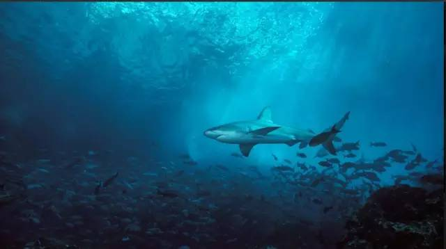

# 《拜金女郎》侧记

原创： yevon\_ou [水库论坛](/) 2016-07-06

《拜金女郎》侧记

《拜金女郎》是我早在十几年前，初中时期就开始构思的一篇文本。虽然细节和骨肉随着时代不停飞跃，但框架是一开始就定下来的。

整部小说最核心的一点，就是"她被指出是各种心机绿茶婊，然后她（刘母）当中宣布她就是选出的儿媳妇"。

最初的场景设定，是一个类似于茜茜公主选婚的大宴。当约瑟夫王子手捧着花球走近时，竞争对手公主当众指出，茜茜所做的一切，全都是虚情假意和伪装。构筑了大量心思的一个圈套。

而这时，皇太后，也就是那个手握大权的老女人，当中宣布"Yes，不错，这才是我理想中的公主"。这才是我理想中的儿媳妇。

皇家的规则和价值取向，自然和民妇的不同。那些以为检举出心机骗局胜利的无知小白兔，根正小红苗，才是幼稚洗脑低能的可笑。这样的人，自然不配站在殿堂上。

很久以前，有一部梁朝伟和徐静蕾演的电影《伤城》。其中，梁朝伟扮演一个一心接近女主的复仇男。

但"拜金女郎"的故事，的确不是从伤城里来的。是我更早之前就想好的。

在实际写作中，唯一做了大幅修改的，是增加了泠夜辉出走的这场戏。

在原始剧本中，是没有泠夜辉出走的。也就是她死不悔改。做狐狸精就要全心狂热做到底。哪怕在殿堂上被揭穿，也要撒泼打横死赖强词夺理。直到皇太后出面，来一个颠覆性的大翻转。

在现实版中，增加了泠夜辉出走的桥段。其实冲击力是大幅减弱了，戏份被削散了。她已经不配称之为一个真正的"拜金女郎"。

但是，我实在是很喜欢退机票压垮柜台的那幕场景，一时半伙又找不到更好的喜剧。所以还是忍痛让她心软了一会。

毕竟，这世俗的十几年，我也不同初中时的心境了。

泠夜辉坠海的桥段，参照的是《非诚勿扰》第一集。

舒淇坠海，其实是一种交代。无论你之前欠了多少纷扰，我把命填给你，就算是一个了断。真心求死过了，这事就算是结了。以后剧情才可以展开。

泠夜辉的故事，其实交代得很清楚。IQ太低还看不懂的人，自动面壁去。

泠夜辉是一个硬壳。当她背叉着双手，扭来扭去，在赛车旁剪立时，其实她是一种伪装，是狐狸精幻化出的人形。

而只有当她被真正打动时，那个坚果外壳才会破碎。才可以看见她柔碎的内心。

在文中，出现了二次。

第一次是在洛溪岛上。非常宁静浪漫的夜晚，泠夜辉却突然发起火来，哭喊着捶打"你为什么要这样对我，为什么要这样对我........."。

另一次则是在刘子默送完她大梅沙酒店。二人泛舟海上。泠夜辉却突然变得尖酸刻薄了起来。费尽心机找一切机会挑刘子默的刺，一百个不满意。

果然，秉承了一贯的"送礼物都没有好下场"爱情剧规则啊。

这文中有很强的代入感。就是泠夜辉看见了过去，把眼前的刘子默混成了人渣。对人渣有数不清的痛苦、憎恨和怀疑。

在最后和刘父的对话中，泠夜辉说："我想变个坏人。坏人，能让我变强"。

所以她找到了刘子默，哪怕她制定计划前都不认识这个人。她决定转职做拜金女郎。

刘子默是一个很暖阳的人。就象是人参滋补品，会慢慢补上你心灵中的裂痕。

这样的人，生活中自然是有原型的。知名不具。

但问题是，刘子默一样面临心力消耗的问题。人不可能哄自己开心，当他滋补哄慰着别人；他自己却是在消耗，在枯萎，在心力耗尽。

太阳不是永动机。如果一个男人永远是暖阳。他迟早也是会耗尽的。

所以刘子默还是需要找一个狐狸精。不多，只要一点点养分就可以让他活下去。可是我们这个世界女性缺少敬业精神，哪怕一点点养分都非常非常地难找。

此外，追逐赛车的桥段，最初是参考李修贤、王晶的电影《绝桥智多星》。

在片中，李修贤想要泡王祖贤，所以就在道路上超车。一连超了好几次，直到引起王祖贤的注意。

二人在弯道上飙车，极为惊险地把王祖贤压制在后面。从而引发了女方的注意。

刘子默、泠夜辉的最初相见，其实我想写赛车的。但是我不懂车，堵塞了很久，最终也写不好空气弹跳的桥段。

所以还是改了，改成了在飞机上的一杯冰水。

二沙岛一直都是飙车圣地，这些广州的十三行都很清楚。珠江新城是因为水库地主群前一阵子有人推销楼盘，"南望珠江，北望花园"。而西城经典则是虫虫小妖精的心水盘。只不过位置改成了东城。

有人问我，为什么是Corolla，为什么不是大奔。

第一，泠夜辉是去广州出差的，所以她租的车。

第二，戒心，戒心，戒心，讲三遍。第一印象你最好象朵小花一样。

美丽，稳重，正派，不惹是生非，所以Mini Cooper和Smart也不行。

郭淳在生活中有原型。那个商铺是自贸区航津路的ShoppingMall。光赠送的5m\*7m室外广告箱，至少价值100W元一个。

当别人还在花大价钱死磕森兰板块住宅时，职业选手成本自然与众不同。

大梅沙的酒店是林姐的。当然也有150个房间和300米沙滩。不过我从未问过她是否出售，也没有购买的打算。

她独子比我女儿大一岁，可惜长得虎头虎脑的。不够英俊帅气。继承父母的主板上市公司，市值大约是25个Billion.

泠夜辉坠水的段子，既可以看作是自杀，也可以看做是谋杀。自杀谋杀。

刘子默手里一根绳子，完美地解决了这一切。

如果刘子默手里没有绳子，那怎么办。那也不好说，因为后面交代了，泠夜辉是游泳能手。

Waldorf那个宴会厅我是真心喜欢。你去看过了你也会知道，很漂亮。

如果你哪一天想找女朋友求婚，建议你把整个厅包下来。就摆一桌，在上海总会正中心。他的七道菜西餐也超级棒的。

至于震旦的光幕和烟花就算了，操作起来很烦。空气艇倒是可以考虑，据说每个晚上只要3W元。

个人资信报告，理论上是隐私。但如果你有一个P2P个人小贷牌照，其实可以查的。

最后何以玫和泠夜辉撕逼的那场戏其实有一个bug，因为一般的火柴只能燃烧四秒钟。不够讲完那一长串的话。

只有特制的磷芯火柴，但又不可能出现在餐厅桌子上。

所以这段话只能改成泠夜辉右手持火柴，左手拿着火柴盒。但这样写也太Stupid了，只能略过。反正也大致可以看得通。

泠夜辉一开始就点了一杯白兰地，一杯朗姆酒。而她只喝朗姆酒，说明白兰地点来就是准备泼的。

她往白兰地里面加冰块，加到了第七块时何以玫开了口。这决定了冰块的浓度。

其实餐馆里卖的白兰地都很少，一般只有1厘米都不到。这样的酒是不足以燃的。甚至连七块冰块都无法完全浸没。但何以玫是一个大小姐。所以这也解释得通。

RR是半岛的专用车辆。每一个住店客人都可以用他接送往返机场。

那艘船是我编的。其实我一直希望外滩上能有快速游艇系统，一直通往松江遥远的水系。以后的有钱人，在陆家嘴上班，在外滩吃晚饭，吃完就直接坐船到松江的码头别墅上岸。

双脚根本不碰汽车。这才是理想高大上的生活。

航空里程是个笑点。我一直期望着有人回复"卧槽，500W航空里程"。结果却无人关心。是不是零太长了。

刘氏父子既然涉足酒店业，那完全可以靠航空伙伴计划向泠夜辉打里程。这解释得通。500W航空里程大约价值人民币20W元左右。

专属私车直接开到跑道上，把滑行的飞机拉下来，塞一个人上去。

这样漠无法纪的事我不知道上海机场能否可以做。但至少在沈阳这种级别的城市，是一定可以做到的。而且只需要一个旅团级干部就可以了。

光幕电视确有其事。但我不确定民航法规是否允许它悬挂在飞机舱顶。也可以改成一个立式支架。但IB味就差了很多。

有人问，为什么刘父可以在机舱内做这么多的布置。

"欧美的上流社会，很喜欢买一家航空公司。因为这倍有面子"。

"我在东南亚有大量朋友"。

其实一开始还酝酿了一句台词，"以我的力量，虽然不足以使国际航班返航，但包下半架飞机还是可以的。尤其是这种东南亚的小航空公司"。

"宾客们都在后面，中舱。虽然没到齐，但重要的也来了七七八八"。

后来觉得实在没地方塞进去这句话，所以也没写。

航空公司最初是以宿雾航空（CEBU）为蓝本的。他只有一架飞机，收购不难。

不需要签证，没有入境记录的国家是科伦坡。

全文尾最后的结局，配的应该是梁静茹的《勇气》。可是QQ音乐居然没有这首歌。只能草草地选了一首姚贝娜的充数。

《梁静茹·勇气》的酷我链接是：http://m.kuwo.cn/?f=qqliulanqi&mid=MUSIC\_82767\#1

泠夜辉的身家，大致在1亿资产，3000W负债左右。这是根据25%的负债率反推出来的。

3000W贷款，月供40W，信用卡上限400W，这是很真实的数据。只有真正富贵圈人才写得出来。

16套天诛，这是"富贵自由"的最基本底线。3000W才可以财务自由，但你要有一亿，才能象泠夜辉这样生活。

相比之下，泠夜辉相对于她的身家，还是花得太多了一点。但人家是拜金女郎，又是一个求偶期的女生，花多点也是可以原谅的。

剧中设定何以玫比刘子默小三岁，何以玫刚刚从英国毕业。

所以泠夜辉年纪并不大，能取得如此资产，殊实不易。

整篇文章真正触动我心境的，是到最后刘父几乎是苦苦哀求着说："象子默这样的人，你会喜欢他的"。

很多人会奇怪，供求关系，为何会如此逆转。

但事实就是这样。这个地球上99%的有钱人，都处于极度的情感荒漠之中，如道明寺般渴望慰际。

而我们的民众，敌视仇富得要命。恨不得分光土豪的田地。但是偏偏就没有一个人，填补土豪的精神食粮。泠夜辉轻易就可以拿走刘子默绝大多数银行卡。

这其中，给"狐狸精"行业留出了巨大的空间。狐狸精这个职业前景广阔远大，堪称21世纪的高科技朝阳产业。

有女孩子评论说，前二辑的铺垫太多。不如直接进入第三卷的撕逼大战精彩。

这种人，就是天生注定的一辈子女屌丝命。

事实上，精华全在前二辑。我还觉得写得太少了。专职哄男人开心，如何安排美丽的邂逅讨男人欢心调情与挑逗。

这些东西，才是狐狸精的立身之本。

而第三卷的撕逼大战，只是粗俗的街寮般的女人才会关心的事情。

你一个女人，不仔细阅读狐狸精秘笈，心思全放在争风吃醋上面。那你这辈子也这样了，这篇文章对你毫无帮助。

你注定一生都是个女屌丝，住出租房去吧。

今天早上看阅读评论，idronnie说她每天养家赚钱，八小时忙完累到死。这时候她最需要的是被找个狐狸精，而不是当个狐狸精。

对的，所以你不是狐狸精。

"体脑分工"是人类文明的高阶段产物。只有衣食无忧了，你才会想到去当狐狸精。八小时专业狐媚。

所以狐狸精的产生必然是极少的。你以为满大街都是狐狸精吗。我们的街上只有粗俗不堪的女屌丝和大妈。

刘父说他这一辈子都没见过狐狸精。许多人问作者的自我代入，究竟是刘子默还是泠夜辉。

这还用问么。刘父的名字就叫做刘逸文。《拜金女郎》是我写给我儿子看的。

有人问，还有没有下一篇。

没有了。至少十几年内是没有了。

小说写的是故事，是人生，只有人生的体酿感悟，才能写出伟大的作品。

孔二狗写《黑道风云二十年》时惊才绝艳。但是他这部写完，出版商让他再交二部剧稿。他写"炒楼客小曾"，就写得一塌糊涂。

远不如我反击的《秦时明月汉时霜·我的租客[孔二狗]》。

因为作品来自于生活，十几年的感情，才能触入笔尖。当它宣泄完了，灵感也就完了。

就先写到这吧。

（yevon\_ou\@163.com，2015年5月17日）
