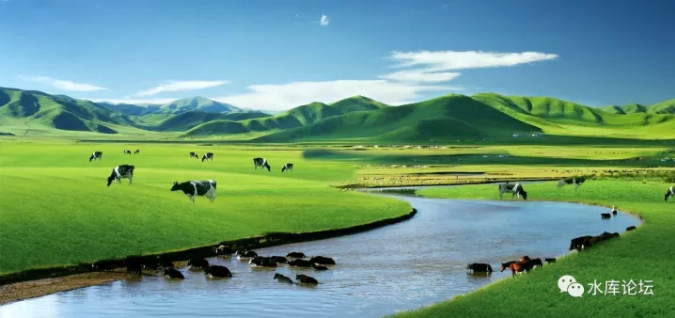
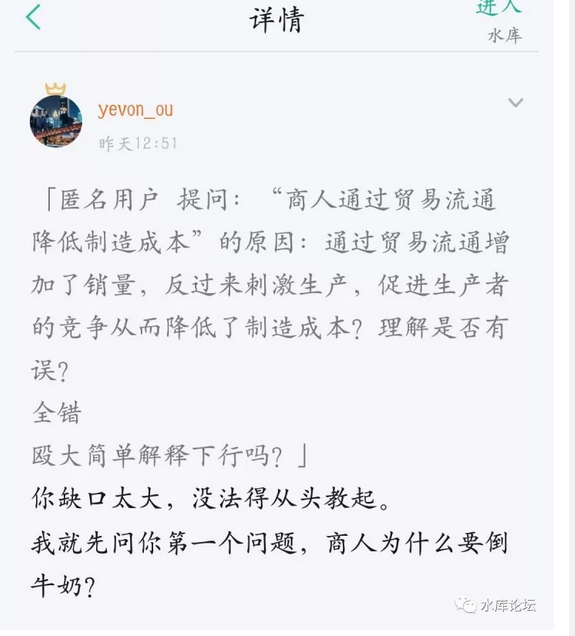
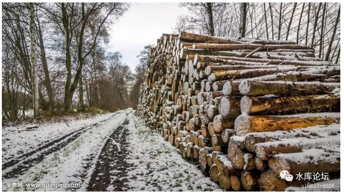
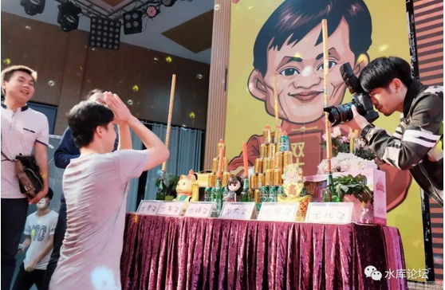

# 牛奶为什么要倒河里 \#F1350

原创： yevon\_ou [水库论坛](/) 2017-10-23

牛奶为什么要倒河里 ~\#F1350~

本文是纯经济学

 

 

每一步都要付费

 

 

一）前言

 

前二天，有人在后台留言说："最近什么都写，就是不写房子"。

 

《[[水库论坛]](http://mp.weixin.qq.com/s?__biz=MzAxNTMxMTc0MA==&mid=204836730&idx=1&sn=39bb60c5ae70746e60cca2e78bbab5e4&scene=21#wechat_redirect)》是一个讲楼市的公众号。可是最近东一锤子，西一锤子。

长久以往，便如同我们在[[\#1]](http://mp.weixin.qq.com/s?__biz=MzAxNTMxMTc0MA==&mid=204836730&idx=1&sn=39bb60c5ae70746e60cca2e78bbab5e4&scene=21#wechat_redirect)中所写的：

 

-   "每一篇都是精华，独立成篇都是好文"

-   "可是凑在一起，却毫无主线。珠玉不成串，无框架体系"。

 

嗯，我承认，最近十几篇写的，全部都是垃圾。

本来稿箱中的文章，应该是《一刀流心法》《拖延流》《水库90后》《团购的力量》等

但是，这些都不能写。

 

 

开会啊！大哥！

加强中国梦学习，核心价值观，富强民主团结。

封号啊，大哥！

俺还指望这微薄的广告收入，贴补家用呢。

麻烦别催了。再等二月吧。

 

微信菜单中，有"目录\-\--广告入口"。各位金主多多投放。感谢衣食父母。

 

 

 

二）牛奶

 

今天这篇，我们纯粹讲一个"经济学"原理。

因为昨天有人在知识星球提出一个问题： 

中国的教科书，有著名的"四大傻"：

 

-   资本家为什么要把牛奶倒在河里

-   煤产量越大，煤矿工人为什么越买不起煤

-   隐身衣永不可制造

-   "超级溶液"不可能被发明

哥哥看到这些毒教育，通常是被蠢哭了。

 

 

资本家为什么宁可把牛奶倒进河里，也不肯便宜卖给穷人，或者免费赠送。

是不是为了保持"价格联盟"，是不是为了垄断，是不是为了惩罚消费者下次购买。

初中课本的教育，把资本主义描绘得邪恶不堪。

 

 

你们迄今为止，关于"牛奶倒进河里"，读到所有的分析，全部都是错误的。

因为它偷换了一个概念。

 

你看，非洲的小朋友多可怜。每年饿死几百万人。

你看，我家的小狗小猫多可怜。小动物最喜欢喝牛奶了。

你看，我多可怜。穷人夜宵还饿肚子呢。俺都恨不得家里变出二罐牛奶。

 

 

讲这些话的人，他们偷换了一个概念。牛奶并不存在于你的冰箱中。

牛奶存在在哪里。在牧场里。

牧场在哪里。《[[大城市的生生死死]](https://mp.weixin.qq.com/s?__biz=MjM5NzUyMzU1NA==&mid=2650673748&idx=6&sn=0811027774559a27e9b73981a2a32125&chksm=bed20b5989a5824f8007fd9f3ab16ee7dae76df138a6f2c3b27222d70f54d38b74d21fd7a35b&mpshare=1&srcid=1107DXk0BLPhug5uelB0twJR&pass_ticket=k0RGd&scene=21#wechat_redirect)》说，30KM的无人区。到最近的集市，要开车1个小时。 

 

事实上，如果你真的跑到"牧民"家里。

真正的牧民，是非常非常热情好客的。

他们会拿出各种食物和你分享。绝大部分的牛奶，酥油茶，随便你喝，都不要钱的。

在蒙古，青海等游牧部落，甚至还保有着"暖脚"的习俗。

 

 

从来没有"牛奶不卖"之类的说法。

只要你肯到牧场，肯到草原深处。肯远离城市200KM。牛奶是免费喝的。

 

牧民们真正无法负担的，是"距离"。

都市白领们的诉求，是深夜回家，冰箱里有一升脱脂牛奶。

[从牧场到冰箱]，这其中的距离是无限远。

 

 

什么时候会倒牛奶呢。Bingo，聪明人都想到了。

当都市里的牛奶售价，连"运费"都赚不回来的时候。

 

 

譬如说，从来没有人把紫檀木，扔进淀蒲河的。

紫檀这玩意，三十年长一厘米，千年不腐，木质紧密。

 

但是，生鲜，水果，牛奶，蔬菜，就属于"极易腐烂"的食品。

在运输条件不好的19世纪，牛奶从美国中部的农场，运到大西洋边的纽约。

耗时可能要一周，甚至更多。

腐烂变质不能喝。

 

紫檀不会扔进河里。但是牛奶会。

当售价赶不上运费。

 

 

更何况，在21世纪的今天，如果你"不幸"生存在欧美等国家，你还要面临一些"控诉"费用。

如果小朋友喝了你的牛奶，拉肚子怎么办。

老奶奶吃坏了住院，索赔怎么办。

圣母敲诈勒索怎么办。

赚着卖白菜的钱，操着卖白粉的心。欧美"吸血律师"，动不动罚你赔偿几百亿美金。

 

这些"法律"成本，远远超过了牛奶本身的售价。

 

 

 

三）要素

 

经济学有几大要素，价格=f（时间，地点，人物，事情）

学理工科的人，是极其严谨的。和Karl Marx的嘴炮不同。

f（x）只要任何一个要素变了，价格都会变。 

 

冬天的西瓜，夏天的草莓。

都市里的牛奶，农场里的快递。

要素的任何变化，都会导致价格剧烈波动。

 

 

马克思主义的不要脸之处，在于他混淆了"时间和空间"。

你一边说，家里面的小孩，饿得哇哇哭。营养不足，没有牛奶喝。

一边又说，农场黑心的资本家，把牛奶倒在河里。

"冰箱里的牛奶"和"农场里的牛奶"，[并不是同一件商品]。你这样偷换概念，不要碧莲么。

 

-   牧场里的牛奶，我可以免费送给你喝。

-   可是冰箱里随手有牛奶，我真的做不到。

 

 

把"农场里"的牛奶，运输到大都市来，是一个专门的行业。英语叫做Logistic，我们叫做"物流业"。

目前在GDP中的份额，大约占9%

 

马克思主义长期把"物流业"痛斥为第三产业。以为它不创造价值。这是极歪的三观。

"物流"是商品中不可或缺的一部分。穷疯了头，才会只看"产地价格"，呸！

 

冰箱里的牛奶，成本=牛的奶+冶炼加工+运输到冰箱

 

 

 

四）信息成本

 

随着中国经济的发展，逐渐由一个农业国，转型成为工业国。"运输业"日渐庞大。

 

目前中国机动车保有量，超过了3亿辆大关。

按数量级换算，全国至少有几千万人从事"司机"物流行业。

 

因此近期的文献，渐渐地不谈"服务业"。物流司机，也被视为"工人"，成为劳动人民的一部分。

老古董们，开始习惯了工业化生活。觉得物流和炼钢一样，也算劳动了。

 

 

可是，另有一块成本，秀相白左们无论如何也不肯承认。

冰箱里的牛奶：

成本=牛的奶+冶炼加工+运输到冰箱+信息成本

 

 

信息成本指的是什么呢。我们看回中学课本。

"士农工商"，其中商人提供，[将货物由甲地运输到乙地，低买高卖等功能。]

 

其中，"运输"功能，逐渐被社会认可。

"卡车司机"渐渐被认为一种正当职业。归类为"工人"的一体。

运输是制造业不可或缺的一段环节。

 

 

但是"低买高卖"依然不能被人理解。甚至连"交易平台"，也不能被人理解。

在一些计划经济官僚的眼中，"集市"就是一个点，只要你把牛奶拉到了秦皇岛，就自然能卖得出去。

 

 

这样"朴素"的观点。在前工业化时代是可行的。

"重工业"绝大多数是大宗交易。例如煤炭，木材，焦炭，铁矿石。

你如果去过东北的林场，那真的是"堆积如山"。脸盆粗的滚木，一百捆堆成一座小山。垛垛延伸到视线的尽头。 

对于"大宗交易"重工业，你的确只要把货运到"秦皇岛"码头。

闭着眼睛卖好了。

 

 

可是现代"工商业"社会。根本不是那么一回事。

最典型的，例如看"京东"。

 

京东号称有超过300000个供应商，2500W活跃个人客户。

每一分钟，都有无数女人在京东上，东逛西逛，乱买东西。

 

客户的信息，是海量的，随机的，短生命周期的。

谁也不知道，这女人扔在购物车里的衣服，到底是想买，还是不想买。

你好心帮她"购物车"清空了，又说尺码不对了，现在不想要了。

哄女人开心真的很难哎。

 

 

对于现代电子化的商业，买卖都已经到了"KW人"的数量级。

而且消费者的需求，变化极快。买不买你家的牛奶，心念转电几秒钟。

要撮合"买卖之间"的供求，需要一个超大型的平台。

 

这个平台，是如此重要，如此庞大，如此高科技复杂。

以至于他的市值，超过了中国石油，中国移动，中国神华。我们一般称呼他为"阿里爸爸"。 

传统的计划经济者，非常地不要脸。

他们默认为，你是一个司机，你载着一卡车牛奶。

只要开到上海市区，你就可以把这厢牛奶卖掉。换成钱。

 

我倒是气极反笑。"卖给谁"

上海那么大，你知道卖给谁么。你知道怎么收款么，你知道怎么刷好评么。

要不，我给你一箱牛奶。你卖卖看。

空想YY的书生，真是不要脸。

 

 

 

五）结语

 

冰箱里的牛奶：

成本=牛的奶+冶炼加工+运输到冰箱+信息成本+流量成本+风险成本

 

 

商业，一共可以拆成四块成本：

-   运输，从甲地到乙地

-   信息，淘宝京东平台撮合

-   流量

-   风险

这四块成本，可以优化，但却是哪块也不能少的。

所谓"农超对接"，就是耍流氓。 

 

卡车司机，基本已被认可为"劳动人民"一部分了。

京东天猫，虽然仍戴着一个"服务业"的帽子。可是码农认祖归亲"农民"，估计也不会太远。

 

流量，我们花了很多篇幅解释。"IP系列""未来商业"系列。

风险，炒菜客想被认可为"实业"，还需要很多\~很多的岁月。

 

 

不过后二节来不及写了。因为哥哥要外出拍照。

拍照干什么，印海报呀。

印海报干什么，2017.11.11有讲座呀 :D

  

 

（yevon\_ou\@163.com，2017年10月23日午）
