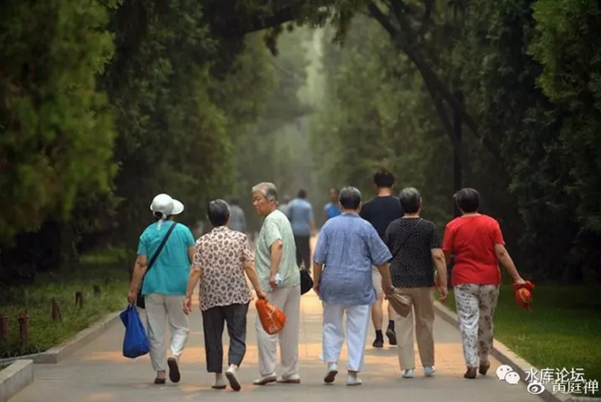
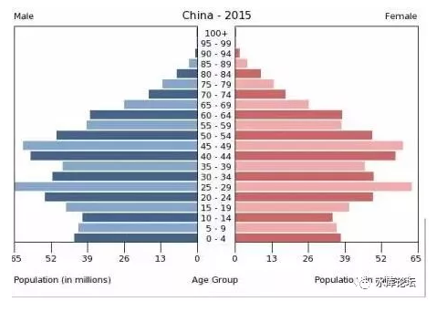

# 欧美国家可以拒绝非法移民么 \#F1380

yevon\_ou [水库论坛](/) 2017-11-28

欧美国家可以拒绝非法移民么 ~\#F1380~
=================================================================================================================================

 

未来中国要引进一亿黑人移民么

计生委啥逻辑？

一）引言

 

"非法移民"已经对欧美造成了非常严重的社会问题。

前二天"波士顿恐袭"电影热播，每一天，都有人丧命在恐怖主义的袭击之下。

 

邪教肆虐，病在腠理。虽然表面是大胡子残忍乱杀，短短时间，圣母们又跳出来了。

 

"随着欧洲的老龄化，欧洲必须引进外来劳动力。劳动力缺口巨大"

 

我觉得这句话很有意思。

这样一句"口号"式的主张，究竟是理论还是事实。其背后的逻辑和实质如何，能不能不假思索地套用。

 

欧洲圣母们，几乎已经把"引进劳动力"当做公理来使用了。真相如何，待我们细细辩解。

 

 

二）护工

 

在美国，Nanny绝对是高收入人群。

 

带小孩的，照顾老人的，包括在医院里辅助打针的，我们所谓的"护士"。

"护士"这种在中国职场，绝对的低技能，低收入人群。在美国属深蓝蓝领，很高收入呀。

 

 

一个"护士"，年薪7\~8W美金，是非常稳稳的。

如果你愿意干些脏活，累活，例如给流脓的患者换绷带，连福利十几万美金都能拿。

 

每一年，都有大量的中国人"护士"出国。

福建蛇头专门盯着护士的职位，不需要很深入的职业培训。有绿卡就能上工，而且永远不愁找不到工作。

 

 

只不过，在美国，一个好的"护士"非常地难找。

美国人大都不愿意做护士。也就老墨和新移民肯干。

而美国的"医药界"协会，向来是非常强势的团体。护士要经过重重考试，产量不高。

至于外国护士，无论如何也不可能拿到美国从业执照的。

 

 

2016年8月，日本爆发了严重的"养老院伤人"事件。\[1\]

凶手一连杀死19名老人，26名重伤。

当问及杀人行凶的动机时，植松圣仅淡淡地说，"我憎恨这些垃圾，社会的蠹虫"。

 

好了，现在问题来了，"老人，年轻人，护理行业，究竟是怎样的关系"。

（日本年轻人烦透了老人）

 

 

 

三）年轻人

 

我们简单地把社会，分为"老人，年轻人"二大群体。

其中，年轻人工作，积攒物质财富。

老年人不工作，消耗物质财富。

 

 

当一个老年人超过65岁了以后，他渐渐地不再工作。转为净消耗。

整个社会的物质财富，纯粹由劳动的年轻人制造。

 

对于老年人的利益，他们肯定希望价廉物美。

老年人肯定希望生产者越多越好，劳动者越多，则物价越便宜。食利者才能长久生存。

 

 

而"引进劳动力"意味着什么。

引进的人口，全部都是青壮。

这些人会拉低人力成本价格，拉低工资，拉低物价。

 

"护工"就是一个非常典型的行业。

如果没有"外劳"的话，护工的价格会非常非常贵。一直贵到天上去。

价格管制的话，植松圣就会心怀怨恨。

 

 

在美国，一个护士10W美金/年。相当于60W人民币。

在北京上海这样的城市，如果纯粹让"上海的年轻人"去做护工。帮你擦屁股，端屎盆。

这个价格，估计也是天价。

我估计也要60W/年。

 

而现在你请的是安徽阿姨，满手皱纹，目不识丁。

5000元/月就够了。

 

 

-   如果没有外来劳动力，老年人的晚年生活，将会是天价。

-   如果拥有外来劳动力，老年人的晚年生活，可以维持相对低廉价格。

 
我们看人口图，人口图是非常明显的曲线。

现年45\~50岁那批人，逐渐进入老龄社会。

80后，90后人口严重不足。

"抚养比"必然上升。

 

一个成年人，又要上班，又要照看三个老人。则"护工"的时间和价格，必然涨到天上去。

人力不足。\[2\]

 

虽然从全社会的财富角度讲，变化并不大。

但是单项成本，即"老年人护工"，可以有10倍，20倍，甚至更多的倍数狂升。

 

 

当一个国家呼吁，"引进外来人口"时，他其实是为老年人在呼喊。

 

-   老年人，是最主要的消费者。人力密集型服务的消耗大户。

-   年轻人，还在生产。并不喜欢竞争对手。也很少购买护工产品。

 

在这个环节上，"老年人"和"年轻人"的利益是相反的。

 

 

 

四）民主

 

"欧洲必须引进外来人口，否则会面临劳动力短缺的问题"。

 

这句话本身是伪命题。

一定要引进么，不引进会如何。

 

 

答案是，不引进也可以。但是老年人的生活质量，会变得非常差。

退休后的生活质量，甚至会比55岁时，差一二个数量级。

"选民们"，会面临一个[生活质量急剧下跌]的过程。

 

在这里，历史岔开了关键性的一步。

"要不要听选民的话"。

"是不是民主证体"。

 

 

这片土地，是我们祖先百战抢夺而来的。又传递给我们的子孙，世世代代繁衍生息。

当生育率下降，人口减少。

但只要我们紧守边疆。总有一天，老年人死光，"人均资源"数量回升。衣食富足。

 

美国人初到美利坚大陆时，平均每个家庭生育8个子女。

考虑到这是平均数，简直夸张到恐怖。比今天的穆斯林还厉害。

 

因为美洲大陆，是流淌着"奶和蜜"的土地。

30万年积累的沃土，只要把种子洒下去，就可以无穷无尽地长庄稼。

人类在如此沃土，轻松繁衍生息。自然心情愉畅，大生特生。

 

而到了今天，随着美国人逐渐住进大城市，人口密集，"人均资源"狭小。

"人均资源"是生育率最重要的指标之一。

大城市只住90平米二房，没农场没谷仓没骑马没打猎。

心情自然不愉悦，也就不肯多生了。

 

短期"白人凋零"并不是坏事。

如果Liberal"白左"都不肯生孩子。过了几十年，降落一亿人口。

则"剩余"的白人们，发现人均资源极大增加，又恢复到每人独占一片街区。自然大生特生，生育率又会反弹。

 

 

但是，"外来移民"就不一样了。

"外来移民"，本质上是一种[鸠占鹊巢]的行为。

非我族类，来到我们祖先世世代代繁衍生息的土地上。

 

而且他们生得特别厉害，几代人一过。黑人，Hispanic后裔，甚至都超过美国新生婴儿60%。

长此以往，白人的"人均资源"没有恢复，生育率不会自然反弹。

是一个灭种亡国的结局。

 

 

面对如此巨大的国运差异，是否应该引进外劳移民。

欧美老年人的回答是："Yes"。

 

欧美老年人贪图的，是尘世的福祉。

为了自己可以多活几年，为了自己临死可以享用廉价的清洁工，扫大街，卖煎饼的。

欧美的老年人，寡廉鲜耻地选择了"出卖子孙"。

 

 

在这个节点，国体决定命运。

欧美是"民主政体"。领导人合法性是选票上台。

 

老年人如果占到30%的人口，更糟糕是"老年人"的投票率还特别高，岁月长\~组织化程度高。特别抱团，有工会。

有哪个政客，愿意得罪30%的巨巨巨型票仓。

 

 

"老年人的自私"+"民主政体"，共同合力，才是鸠占鹊巢的理论依据。

你想，一群人"白左"到连孩子都不生。他们又怎会怜悯身后千秋万代。

 

 

 

五）国运

 

你要问，我写这篇，今天什么意思。

咳咳，其实是因为雀巢咖啡咳咳咳，很多话讲得不能太细。

 

-   你愿意得罪选民么。

-   您能够得罪选民么。

-   苟利国家生死以，你能够强行压制民意么

 

最近某些地方啊，咳咳，发生了火灾。

火灾之后，咳咳，消失了很多低端服务业。

 

低端服务业消失以后，给人民生活造成很多麻烦。生活质量下降了。

人民很多骂声。

 

https://v.qq.com/x/page/w0509lz27qk.html

 

其实我看整个事件，我更关心的是背后的"意志力"。

哪天中国被"民意"绑住，凡是涉及民意的事情都推行不动。那才真的是祸国殃民，灭种亡国了。

 

而这次的表现，很好，非常好。我给高分。

是非对错并不重要，正义善恶也不重要。

"臣闻天下大义，当归于一"，这个才是大事。

 

 

只有组织可以为了肌理健康，强行切削掉一片时，这个组织才是蓬勃富有生机的。

只有大脑还清醒，可以控制四肢时，才是活着的。

欧美的组织度已经溃烂，帕金森麻痹症。

 

 

象哥哥这么三观不正的人，一直认为，能让"65岁农妇去喝毒药"，才是伟大的国家。

能支付铁血和代价，才是伟大的国家。

妇人之仁，苍天不容。

天行有常，天地不仁以万物为刍狗。

 

 

中国人计划生育，不是为了给黑人腾生存空间的。

老年人请不起护工，死了就死了吧。

 

 

 

 

 

（yevon\_ou\@163.com，2017年11月27日晚）

 

 

 

\[1\]《可怕的老龄化社会-日本养老院"砍人"背后》http://www.sohu.com/a/109333076\_463549

\[2\] 如果发展机器人技术的话，按照经济学原理，造机器人就占用了面包师，农场主的时间。面包会不足。
