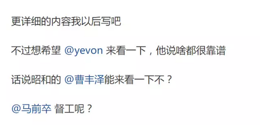

# 我昨天生病。

前天也生病，今天还生病。

北京的空气，折磨得我快投胎了。不行了，俺得躲到南方去过二天。

 

早上在吃面包的时候，看见"肛里拉出个电锯"，连续发了二篇文章；

《发现一个真汉奸，公司里哪些人是好人，哪些人是坏人》\[1\]

《中国特色产业扶持------产业扶持政策的真正的成功与失败的判断方法与操作方法判断准则（这篇文章有点难看懂）》

 

 

文章真是长长长长长啊，俺二个面包吃完。文章都没有看完。有15000字吧。

俺一边看，一边想，这种资料，知乎上能看懂的人，能满10人么。

肛锯这个人，缺点就是不讲人话。 

偏偏还不让人休息，居然留了这么一段话。

哥哥一边咳嗽，一边病体残躯。

等我来翻译一下吧。

 

 

 

一）君子和小人

 

首先，什么是君子，什么是小人。

诸葛亮《出师表》千古名言，"亲贤臣，远小人，此先汉所以兴隆也；亲小人，远贤臣，此后汉所以倾颓也"小学生都会背诵。

 

可是你少年读书，你有没有想过。

中国数千年历史，为什么"昏君"层出不穷。为什么"奸臣"层出不穷。

你纵观二十四史史书，"奸臣"占据绝对多数，大概95%以上。

"清官"绝对少数，来来回回就这么有数几个。

 

来来来，带你去你爸公司。

公司里这么多副总，你一幅幅脸庞看过去。

你倒是告诉我，谁是君子，谁是小人呀！

 

 

你如果看柏杨版资治通鉴，柏杨看到《出师表》这一章节时，是非常非常地不屑的。

注释中，差一点点就写"放你妈狗屁"了。

 

因为你说朝堂上，公司里，组织里，谁是"忠臣"，谁是"小人"。

这话是没法解释的。

你看着十几个副总，每个都笑靥如花。每个都是"君子"，全部都是好人。反革命老蒋早就被赶到海峡对岸去了。我们都是红红好干部。

 

"亲君子，远小人"根本就是一句空话，执行不下去的。

 

 

那么，公司里谁是君子，谁是小人呢。

真正的解释，还是要到"儒学"经典中去寻找。

 

孔子对君子的要求是"中庸"。中庸是儒家核心思想之一。

秩序决定游戏规则，宗教覆盖其上，道德再覆盖其上。

中国人多，就一定要"中庸"。

 

"中庸"的意思，是人要一团和气，圆滑无棱角。

引申的意思，是很多人放在一起，不会互相扎伤。

 

 

举个例子，譬如说，公司里，就是有这样的奇葩混蛋。

你工资23000/月，他工资20000元/月。

他整天什么事情也不干，就盘算着这个三千元。

 

为了这3000元，为了这行政级别差一级。

他不惜翘掉公司几个大客户，让公司损失几千万。就是为了让你"完不成任务"。

他可以在所有问题上，和你唱反调。

浪费几十个人，一起花十几个小时，开无聊的会。让公司搞一些毫无效果的"发展计划"。

 

一场内斗，动辄消耗掉公司数百万上千万的资源，可是他不在乎。

在他眼里，还不如他的工资3000元重要。

"拔天下而利吾一毛，吾为也"。

这种自私人，就是"小人"。

 

 

相对来说，"君子"的要求，则是反过来。

-   在公司中，不主动攻击别人。在利益轻微受损到阈值前，接受损失，不反击。

-   当某些情况，自身损失3000元，为公司挽回数百万时，愿意牺牲。

 

公司里面，磕磕碰碰。部门利益轻微受损的事，总是难免的。

睚眦必报，是没必要的。

当你欺负我在一个"阈值"之内，好说话好商量，这样中庸，才是一团和气之道。

 

 

显然，我们可以看见，当一个公司内部，全部都是"君子"之时，虽然不说公司就一定可以开发iPhone什么划时代的产品。

但至少公司是可以运转的，大家劲往一处使。

 

当公司里全是"小人"时，内斗就成了主旋律。

这个时候，公司就很难维持下去。对于工商业企业，是破产消亡。

对于朝廷庙堂，就是北宋和南明。

 

 

对于任何组织来说，"甄别"小人，才是最难最难的公司治理环节。

尤其当大老板生意做大了以后，公司内部层级很多，信息不畅，给了"小人"非常大的生存空间。

 

在阿越的《新宋》之中，他着力描写了一个大反派："吕惠卿"。

吕惠卿贵为独相，一人独霸朝政九年。

但是这个人，是非常非常难以击败的。

 

因为吕惠卿很聪明，他永远都在最正确的时刻做最正确的事。

用北大的流行术语来说，"精致的利己主义者"。

这种人高度理解游戏规则，用尽一切办法保护自己。他什么事都做得尽善尽好，唯独就是对国家不好。

 

我们今天后人读穿越文，吕惠卿在宋史是列入"奸臣传"的大Boss。

因此你心里有底，揭开迷雾。

 

 

但是当事人是不知道的。你穿越回去北宋，做赵顼。

你也不知道手下哪个臣子贤明，肯牺牲自己承担公益。

哪个臣子内斗小人，嘴上说得甜蜜，转身就挖坑给你跳。

 

就好比今天北大"精致的利己主义者"。有人统计，50%以上是害虫。是共和国的癌细胞。

可是你杀啊，你一个都杀不了。

你倒是指正指正，"精致的利己主义者"满屋子谁是奸臣。

 

"小人"是非常难杀的寄生虫。

古往今来，历代都是如此。

 

 

在肛锯第一篇《谁是好人，谁是坏人》中，他主要讲了这个道理。

他认为，盗亦有道。

在土匪，马贼，山寨，小偷集团中，他们的逻辑和正常人是不同的。"打家劫舍"未必就是坏人。

 

但是，有一类人永远是坏人。吃里扒外，内战内行，外战外行。

这样的人，跑到任何地方，都是害虫。

哪怕进了土匪窝。他也能祸害到土匪窝破产。

 

 

这种"小人"，属于无法凝聚成"组织核"的。

任何公司，都不会也不该录取他们。

按照刘仲敬阿姨的说法，叫做黄泛区"费拉"。

杀杀光，重新换一批人种最好。

 

 

 

二）显形剂

 

肛锯的第二篇文章《产业扶植政策》，讲的是显形剂。

 

 

"小人"对公司是巨大的毒害。

但是一般"小人"很难被发觉。

 

如果"小人"的比例很低，则"小人"造成的破坏很轻微。察觉不到。

公司年会汇报上，他往往还会显得一幅"忠心耿耿"，政治正确的表忠心态度。

 

如果"小人"的比例中度，则这个集团的"竞争力"会非常糟糕。

最后被人一锅端。

例如北宋灭亡得莫名其妙。北宋战斗力，还没有匆忙组织的岳韩襄淮军厉害。到后世人们才发现，所谓"六辅"，宋徽宗几个大臣都是贼子。

 

 

肛锯提出了一个设想，能否让"小人"浓度高度密集。一下子，整间公司从上到下，全部都是小人。没一个干活的。

然后我们拟个"黑名单"制度。凡是从这件公司出来的，统统拉黑，大家不要招聘好了。

 

 

这种"浓度高度密集"在正常情况下，是不可能发生的。

因为公司无法跨过"中级阶段"，有六个奸臣，就把国家搞死了。哪还能熬到"满朝文武，上上下下"全部都是奸臣。

 

理论上还是可以的，那就是"产业补贴"。

-   小人是不肯好好干活的，争图眼前利益。

-   小人更擅长钻补贴空子

-   小人跳槽欲望更强

 

 

你譬如现在搞个"太阳能"补贴项目。不要求你赢利，纯以行政手段要求，你达到NN片的发电规模，又或者是第三代技术。

 

那么"正规"的公司，他是没法竞争的。

你如果老老实实在办公室花图纸，做三年期成本精算，做消费者市场研究，你是无法"切换"到这个"抢红包"频道上去的。

 

 

真正能拿到"补贴"的。只有皮包公司。

只有那种，一开始就没想过好好工作。一开始就冲着补贴去的公司。

他们的整个业务模式流程，是倒过来的。

 

-   政府需要上第几代技术，我就上第几代技术。

-   要求的手续全部都有，不要求的技术全部没有。

-   面向政府，而非消费者。

 

这个不是重点，重点是"皮包公司"里面招收的，都是什么人呢。

招的都是害虫。

 

 

垃圾公司招垃圾人，这是千古不破的定理。

"小人"既然目光短视，他们就更容易被"新风口"吸引过去。

凡是不想踏踏实实工作的，就更容易被"加薪+50%"吸引过去。

凡是靠"公司急剧发展"来吸引人的；

就更容易吸引到"不忠诚"的部署。

 

因此"政府补贴计划"，在补贴下，更容易催生这样一种怪胎。

从上到下，全部都是害虫。

一旦脱离了补贴，连正常的生态圈都活不下去。

 

 

然后事情就很简单了。政府"突然"取消了补贴。

注意这个"突然"，补贴既不能很短，也不能很长。长不多就是等"害虫公司"成型。

 

取消补贴，整家公司轰然倒地。

-   董事长是骗子。

-   中层干部都是小人，都是急功近利的人。

-   基层员工不良记录。拉黑

-   其他公司架构成型

 

 

这样的"补贴\-\--取消"周期，相当于一场曝光。

一下子就把整个行业里的"害虫"集体曝光。

类似于，十几年前，如果你的履历上有etang，对你日后的求职生涯，是非常有妨碍的。

 

 

另一方面，经过此番震荡，"坚守岗位"没跳槽的老员工们。

无形中经历了"君子"的考验。

留下来的这个团队，是更纯洁的团队。而且也把位子填补满了。

只要老板不太笨，就不会亏待他们。

 

"产业补贴"花掉了几千亿不重要。

相对于"君子小人"，能甄别出"精致的利己主义者"更重要。

庞大帝国，蛀虫远胜于花掉二根树枝。

这点同意。

 

 

大致就这些吧。哥哥生病中，继续咳嗽咳血去了。

 

 

 

（yevon\_ou\@163.com，2017年12月14日晨）

 

\[1\] https://zhuanlan.zhihu.com/p/31944214

https://zhuanlan.zhihu.com/p/31992054
