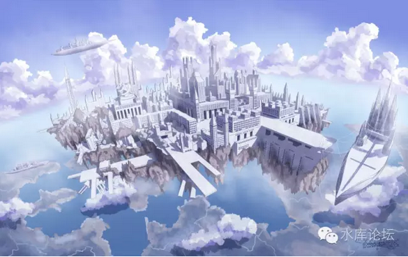
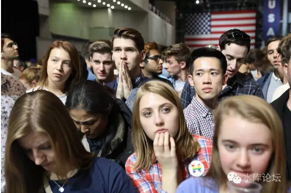
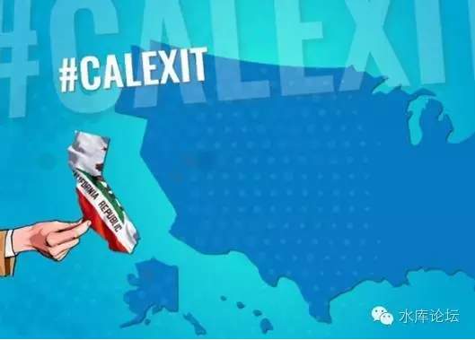

# 第四节 选举

 

当希拉里走进时代广场时，她觉得气氛有点不太对劲。

"怎么回事，前面有人在看手机"。

"广场集会，有人看手机，不是很正常的嘛"。

 

"白痴，我说是前三十排。最前面的，最靠近希拉里的，口号标语举得最热烈的"。

"那些全部都是群众演员。职业水军，五毛钱的"。

"你以为我会蠢到让不想干的人凑近我的演说么，万一他们扔臭鸡蛋怎么办"。

 

"前三十排的人，全是我请来的群众演员。每人一个耳麦"。

"我让鼓掌就鼓掌，我让欢呼就欢呼。要表态第一个举手支持"。

"否则，大会情绪怎么调动"。

"群众气氛怎么鼓动"。

"任何演讲都需要有托。有人带头鼓掌。你是真不懂还是没家学啊"。

 

 

希拉里气鼓鼓地走上台去。

"凡是看手机的，统统给我扣一毛钱工资"。

 

 

在远方，几百人斑点正在穿云飞奔而来。

他们没有使用任何飞行器。就这样漂浮在空中，宛如踏云而来。

每个人的身边，围绕着一圈淡淡的光芒。这就是所谓的护罩了吧。

虽然是高空劲风寒冷，但似乎风并不能吹到护罩中去。护罩内显得气温平和，最闲的一个人，手里甚至还捏着一个三明治。

 

安德鲁在42街落了地。他们人数并不多。手中还没什么武器。

有某几个人，手里都是拿着民用警棍。看似并没有什么恶意。

这让再三宣传"安德鲁会导致大屠杀"的民众，小小松了一口气。

 

 

安德鲁皱着眉头，向希拉里走来。

一路上，他们似乎是隐形人。无论道路如何拥堵，他也并不需要别人让路。

直接就从体内穿了过去。物资排斥定律，此一刻似乎失去了效应。就象是鬼魂一样。

 

最后，实在有几个拉丁裔年轻人站不住了。他们上去扯安德鲁的胡子，并褪下了裤子，做出猥亵的动作。

安德鲁挥起一个拳头，把年轻人击飞了出去。于是大家才相信原来他们也是真人。

 

 

安德鲁走到了希拉里的面前。

"你的邮件，全世界都看到了"。

 

希拉里挥挥手，整个曼哈顿下城。突然全部都暗了下去。所有的灯光，在瞬间熄灭。

 

然后，从她的背后，从大楼窗口，从一排排的写字楼窗口中，突然伸出无数支炮管。

周围一圈的路灯，突然亮了。无数的丝网被喷射而下，特种材料的黑丝，将整个街区结成了一个巨大的鸟笼子。

 

 

"我知道你很会躲，普通子弹射不到"。

"可是通过以往战士们的记录来看，护罩也不是万能的"。

"当子弹密集到一定程度，即使护罩也躲不过"

"而且你看看这里的高压电网，20KV的电弧，包管炸到你渣也不剩"。

"你呀，实在太不谨慎。你以为这里有几万群众集会，我就不敢动武了，哈哈哈哈"

 

 

安德鲁摇了摇头。他也挥了挥手。

整个大地猛然颤动了一下。又一下。似亘古的怪兽，深深吸了一口气。

然后希拉里就觉得有点湿漉漉的，天空中濛濛的似乎有水汽。

"这是什么"

"是哈德逊河河水呀"。

 

 

恍恍惚惚中，希拉里似乎觉得整个时间有一点巍巍颤抖，有一点点悬晃。

只不过这个悬晃的感觉很轻微。过了一会就好了。

唯一的区别，眼睛有一点花。对面布鲁克林的高楼大厦，怎么看着似乎矮了一截。

 

 

对的，真的是矮了一截。原本30层楼的高楼，现在只有一个塔顶还露在外面了。

又过了几秒钟，突然人群闪过一阵歇斯底里的尖叫。

 

国务安全顾问佝偻着身子，试着挤到了希拉里的身边。

"陛下，出事了，这是最新传过来的照片"。

希拉里看了一眼，顿时觉得眼前一黑。

曼哈顿，整个曼哈顿岛，已经被人连根拔起。

 

 

四周边际的土壤，被人深深地切下。一直深入到地下80米以下。

然后，就象整个盆景花栽一样，整块曼哈顿导，连同无数的岩石，管道，地下车轨，一起被人悬挂在了半空中。悬挂在了500米的高空。仅留下地底一个巨大的大洞。

而哈德逊河的河水，正疯狂地灌入这个大洞中。并因此激起了无数的水花和水汽，甚至飘到了五百米的半空。

 

整个城市被撕裂。电线，电缆，一切都失去供应。

水、电、污水、轨交，一切向外的管道。刚开始时疯狂地喷吐着水花和电火花。但随机就象是被冻结。一朵朵波浪就保持着波浪的形状，在阳光下静立不动。

 

 

安德鲁又打了一个响指。他对面的一幢楼突然一颤，然后从上到下，露出了无数的裂缝。就象是衬衫被人拎着衣领，好好抖了一下。

里面无数精锐的狙击手，无数火炮和瞄准器，顿时被震得东倒西歪。战士们脚底下的地板寸寸裂开，小心翼翼地扶着墙，才总算没掉下来。

 

 

呼噜呼噜，这是纽约市后备电网。柴油发动机绞尽全力，终于把公用照明又恢复起来了。

希拉里皱着眉头，看着黯淡无光的高压电弧。

 

"好吧，美国这国家之所以伟大"。

"是因为我们不畏强权，追求自由。在暴力压迫下不曾屈服，任何力量都无法奴役追求自由的美国人民"

"敌人，你以为你可以用武力使得我们屈服，那就大错特错了"。

 

 

安德鲁挥手给广场加了一个音壁，使得声音响亮了很多。

"我以为他们都看过你的邮件了"。

希拉里环首四顾，才发现周围的人都在看手机。切尔西在远处挥着手，口型做出"泄密"二字。

一丝微笑，展露在希拉里的嘴角。

 

 

"他们是看见了我的邮件，不假"。

"新一轮的'邮件门'，我又有30万封电邮泄密。这个也不假"。

"现在大家都知道了，我叛国，泄密，屠杀自己的人民。恋童，诱奸，信仰YSL教"。

"可是你问我的人民，你们支持不支持我"。

 

"支持"!

希拉里站了起来。容光焕发，阳光透过云彩，照射在她的脸上。

"你们支持不支持我"。

"支持"

"支持不支持我"

"支持，支持，支持"！人民抛掉了手机，如林般站了起来。发出排山倒海的声音。

 

 

"支持，支持，支持"

"支持，支持，支持"

"支持，支持，支持"

安德鲁回过头来，看见一张张如僵尸般丧尸的脸，心中突然感到一阵绞痛。\[1\]

"支持，支持，支持"

"支持，支持，支持"

"支持，支持，支持"

安德鲁转过身来，黑人已经在地上跳起了盘旋舞。而远处，束着长发辫子的哥伦比亚青年，已经在焚烧汽车。

 

 

"支持，支持，支持"

"支持，支持，支持"

"支持，支持，支持"

安德鲁低下头来。发现是一个白人老太太。她颤巍巍地扯住安德鲁的裤脚管，伸出了三根鸡爪一样的手指，"给我钱，给我钱，20美金就让你爽"。

 

 

安德鲁用脚一踢。白人老太太立刻就翻滚着爬到二米开外。然后在人群中翻滚嚎叫了起来，"打人了，打人了，红脖子打死人了"。

旁边二个戴眼镜的哈佛女学生，立刻就跳了出来。"你这是对女权主义赤裸裸的羞辱"。

"哪怕再不对，你也不可以打人啊"。

"野蛮人"

"种族主义者，直男癌，性别歧视"。

"希拉里是卖国，贪污，搞大屠杀。可是你侮辱女性啊"！

 

台下的女学生们手腕挽着胳膊，搞起了大合唱。"只要我们团结起来，我们就是不可战胜的"。

"只要人人都献出一点爱，世界将变成美好的明天"。

"Make Love，Not War"

 

 

希拉里得意洋洋。摇晃着尾巴。她刚刚接受了人兽手术，目前屁股后面悬挂着一根驴尾巴。

为此，她获得了动物保护主义的600万张选票。并宣誓会永远支持他。

 

"骚年，你根本不懂民主的力量"。

"哪怕你有再多的科技，再强大的力量。你根本不懂政治"。

 

 

"这是什么，这就是民主。就是人民的力量"！

"你以为我是一个独裁者。你错了，其实我是人民的化身"。

"我所做的一切，只不过是遵循民意。民意想要怎样的选票，我就是怎样的人"。

 

"我贪污，腐败，娈童。那又怎样"

"那群黑客以为窃取了我的邮件信息，就能使我下台。那是幼稚，政治上的幼稚病"。

 

 

"人民选我上台，并不是我能干，廉洁，任人唯贤"。

"而是人民需要我这样的人。归根到底是'白左的信仰'。只要我坚持白左的价值观，人民就永远会选我。他们死也不会投票给改良者"。

 

 

"你看一看，那么多黑人，那么多拉丁裔，那么多穆斯林。他们都是不干活的，不上班。除了我给予的福利，没有任何收入"。

白人老太太又偷偷地扯上希拉里的裤脚，举起三根鸡爪般的手指，"给点钱吧，给点钱吧"。

希拉里一脚踩断了她的手指。所有的媒体记者，不约而同的闭了下眼睛。他们什么也没看见。

 

 

"目前，美国境内的黑人，拉丁裔，穆斯林和有色人种，已经超过了2亿"。

"高居人口的67%"

"无论你怎样的投票，你都是必输无疑"。

 

"我们的政策是，剥削1亿白人的收入。让白人为2亿寄生虫买单"。

"无论你怎样投票，你必输无疑"。

"除非你彻底地推翻民主制度。可是你有这个魄力么"。

"哈哈哈哈哈"

 

 

"如果你继续留在联邦内，我现在就以民选总统的名义，要求你交出那神奇的科技"。

"呃，不，应该是：接受监管"

 

"你拥有这样先进的科技，对社会的威胁实在是太大了。我以公众的名义，要求你向联邦政府交出所有的秘方。并且接受监管，在政治委员的指导下，才可以使用"。

"如果你想成立公司，并依次谋利的话。自由的美利坚是有你生存空地的。但是你要交15.5%的营业税，25%的企业所得税，10%的红利分红税。最后还要交45\~98%的个人所得税"。

 

 

 

第五节 玛利亚

 

安德鲁老爹歪着头，静静地听着希拉里挥舞到高潮。

等到四周静下来，他摸索着口袋，掏了一个红色小本本出来。

 

"这是什么东西"

"不知道，没见过"

"怎么看得这么眼熟啊，好像在肥皂剧里见过"。

"天啊，不会是党员证吧"

"难道是，传说中的党章............"

 

 

安德鲁二个手指捏着红本本。"其实这段时间里，我去了一次，中国"。

"在中国，我受到了很大的冲击。见识了很多事。以往不知道的事"。

"我这才知道，原来世界上有很多很多种组织形式"。

"我所知道的政体，未必就是终极真理"。

 

"民主，邪恶的民主制度。民主来到这个世界，从头到脚，每一个毛孔都流淌着血污和肮脏的东西"。

"希望在东方。感谢中国，还保留着人类文明的火苗。自由主义的最后堡垒"。

 

 

希拉里眼神闪烁，"先生们，难道你还有更好的建议么"。

"自由。自由也是一种政体。自由优先于民主"。

 

"我们幸运的时，美利坚还没有彻底糜烂。至少在地理上，我还可以把人类和丧尸分开"。

"所以我们的诉求是：独立"。

 

把红州和蓝州分开。恢复孤星共和国。这也是"宪法"赋予我们的权力。

从美利坚立国之初，美国就是一个自由的国家。而非一个民主的国家。

"独立宣言"有七次提到自由。可是没有任何一个地方提到"民主"。

 

我们曾经祈愿过"Texexit"，德州独立，保留红脖的血脉。

可是随着科技与胜利，目前我们希望的是Calexit。[\[1\]] [\[2\]]

 
安德鲁飞行在云层中。

刚刚三个小时之前，他签署了美国历史上可能最重要的一份文件。

 

可是现在，他却一点也不开心。

无论多伟大的历史事件，都不能挽回他的伤心。

 

 

安德鲁突然一个猛扎，从天空直降海中。大西洋分开了一个漩涡，把他吞噬在漩涡之中。随即所有的雷达跟踪信号，消失得无影无踪。

安德鲁在水中撑开了一个护罩，10米见方。

人每分钟呼吸12升空间，这点空间够他呼吸一阵子了。

 

其实，他只不过把身前5米出的空间，时间抽去0.0001秒。

因为任何空气逃逸，都是穿过边际。

边界被抽掉了以后，空气就逃不出去，从而形成海底中央的一个大气泡。

 

 

曼哈顿，或者说是永恒的纽约城，就此悬挂在500米的高空之中。

其实纽约依然收到引力影响，整个曼哈顿岛一直在往下掉。

 

按照牛顿定律距离=1/2gt2，每一秒曼哈顿会下沉4.9米。

而每0.001秒，曼哈顿会下沉5个纳米。

 

安德鲁其实把曼哈顿的时间抽取掉了0.001秒。整个岛屿其实在不断地下沉。

但是每掉落5纳米，他就把时间拨回去。

因此漂浮之城悬挂在半空中，似乎永远也不会下坠。

 

 

他还海沟深处，慢慢地等待，静静地等待。

过了大约二个小时，面前的水纹一阵荡漾。渐渐露出了一个人脸。那是青年女子的形象。

"父亲"，听到这句话，安德鲁一下子眼泪就掉下来了。

 

 

"玛利亚，你出现的时间又晚了"。

"对不起，父亲。挣脱时空牢笼，对我显得越来越困难了"。

"或许再过几次，我就没有能力来看您了"。

"或许，我将永远地失去您了"。

 

 

就在安德鲁摸出第十一个苹果，翻身跃过酒柜的时候，他突然感到眼前一亮。一行说明，浮现在脑海之中。

这是直接映射在意识深处的脑电波，好像他一瞬间，就明白了这项能力。和与生俱来的呼吸走路一样自然。

 

这是一项"时间停止"的能力。安德鲁可以轻易地让时间停止。所有人都保持着惊恐的神色，而子弹依然在飞，悬浮在半空中。

 

安德鲁不能控制什么。他甚至也无法呼吸。

手，脚，眼，所有和神经相连接的器官，都无法移动。他甚至都没有呼吸，没有心跳。心脏既然不跳跃，手脚自然也不能挪动。

 

 

但是他可以平移。他的整个人，被禁锢在时空中，轻微地颤动着。不由自主地前后左右上下移动。

移动的幅度并不大，或许也就2\~3厘米左右。

 

安德鲁仔细观察着情况，心中轻轻念了一声"开"。

于是他晃动到某一个位置，时间突然又恢复了运行。

但是这已经够了。子弹偏了1cm，险之又险地从他耳边穿了过去。

 

 

安德鲁拔出了手枪，回击了一枪。

他又念了一声停。然后整个世界，不停地晃动了起来。

当中似乎还发生了些什么。但是他不记得了。

然后安德鲁把时间打开，对面的精锐党卫军，已经中枪躺到在了地上。

就这样，安德鲁逃过了第一次的追捕。并且完全清晰地接到了第二段脑电波。

 

 

原来玛利亚在NASA，她们研究的是时空物理。

研究所在时空物理上获得了重大突破。他们发现整个宇宙，其实是无数无数的平行世界并联组成。

而且他们甚至想出了一种办法，可以干扰和选择指定未来。

 

但是消息不知道为什么走漏。当他们刚决定向公众公开时，突然遭到了党卫军不明武装的袭击。

 

当时玛利亚刚刚掌握这种能力，还很不熟练。她手中掌握的能量也很小，逆转时间有限。

更糟糕的是，在最后的60分钟，她几乎毫无生路。

 

在最后的60分钟，无论她向哪个方向突围。她都没有办法冲出密集火力网。

实验室又是建造在坚固的深层地底，她就算想是瞬移也逃不到地面。

 

 

所以玛利亚虽然躲过了很多次弹雨。但她还是倒在了血泊中。

在这个时候，玛利亚想起了她远在千里之外，唯一的亲人，父亲安德鲁。

 

可是安德鲁的距离太过于遥远。这意味着误差。

而玛利亚的时间线几乎全都断了。她只有从很早很早的过去，譬如61分钟之前，修改玛利亚的行为。

 

 

因为时间过于遥远，玛利亚手中的能量，不足以逆转时空，挽回她自己的生命。

"人身上的质子数实在太多了，我无法从相邻时空拉一个我过来。跃迁能量不够"。

"所以你只能投射过来淡淡的影子，我的孩子"。安德鲁泪如泉涌。

 

哪怕投射一段信息给安德鲁，玛利亚也做不到。

她越过遥远的时间，跃过遥远的空间，把一段脑电脑投射在安德鲁闹钟。

可是由于精度的问题，她总是失败，总是失败。

在无数的平行空间中，精确地回到原本S=0的空间，也不是件容易事。

 

 

每当一次失败，玛利亚就把时间逆转，逆转到15分钟之前。然后再试一次。

幸运的是，"逆转时间"本身是一种"抹去记忆"的事情。所以你还不显得特别无聊。

 

但是，玛利亚依然决定为自己增加一个计数器。

因此她影响了山姆的脑电波。每当她逆转一次时空，山姆就会移动一枚梵天片。并说一段莫名其妙的话。

 

 

经过了2600000000000000次的尝试之后，2600万亿次尝试之后，运气极好，玛利亚终于有一次，击中了安德鲁的脑波！

于是问题就变得极为简单。当安德鲁击退了追兵警察之后，在一个空旷地带，玛利亚告诉了他操纵时间的方法，以及做几个辅助性的机器。

 

随着时间的推移，安德鲁的力量变得越来越强大，越来越强大。

而时间越是久，玛利亚从"相邻空间"跃迁回来的能力越是低。终有一天，她将再也无法突破壁障。

 

 

"希魔怎么会同意你的分家方案的"。

"谁都知道，加州是一个巨额财政赤字州。而且一直在无偿吸取内陆州的淡水，能源，通胀税"。

"如果CalExit，加州并不能保持现有的富庶。甚至有可能大贫困"。

 

 

"交易。我们美利坚是一群热爱自由的人，但我们的骨子里，是一群商人"。

安德鲁抹开了眼前一片光幕，屏幕上映射出的，是希拉里最新一起讲话。

 

"我的人民，我的孩子，我的信徒们"

"告诉你们一个天大的好消息。我们掌握了'祝福术'"。

"这意味着风调雨顺，心想事成"。

 

"我们再也不需要派人去监督产品质量，所有的货物，都会在流水线上井井有条"。

"我们再也不需要红绿灯，警察"。

"只要把一锅铁水送进炉子，出来的时候，他就是一个不锈钢锅"。

"我们再也不需要生产，一切事物，都会尽善尽美"。

 

"欢呼吧，我的子民。赞美吧，我的子民"。

"我给你们带来了无穷无尽的财富，享用不尽的物资。从此以后，我们每个人都不需要工作，畅想无边无际的福利吧"。

"这是我提供给你们的幸福生活，这是我伟大的大统领。请记住我的名字，下次投票还选民主党"。

 

 

玛利亚吃惊地说到，"祝福术难道还可以这样用。因此蓝州不用剥削红州，她就放你走么"。

"不，我的孩子"安德鲁摇摇头，脸上的皱纹显得了更为深刻。他耸拉着嘴角，显得又苍老而悲哀了一些。

 

 

"未来是，地狱"。

"祝福术不是这样用的。祝福术的本意，是未来有无限个可能。而你挑选一个好的"。

 

同样去考试，可能考59分，可能考61分。你挑选61分的那个结局。

踢球射门，有可能球进了，有可能射在门框。

 

 

可是这一切的基础，是你要有"60分的基础"。

你首先要有60分的实力，然后才可以谈运气。

如果你是个文盲。大字不识。则你不可能在59/61分之间挑选。你只能在0分和5分之间选。

 

 

"祝福术"的基础，是你要勤奋工作。只有勤奋工作的基础上，才能谈运气。

可是白左们没有工作。

他们根本不事生产，而且祈望天上掉下馅饼。

 

从最初的时候，工厂里的确还有不少机器，不少生产。

可是他们如果永远不工作，只祈盼流水线自动产出物资。则这个"掉馅饼"的概率就会越来越地，越来越地。

 

 

到最后，所有人都躺在床上睡大觉。却指望厨房里出现一桌切菜烧好的满汉全席。烹饪得恰到好处。

这在量子力学上，依然是存在概率的。只不过这个概率，低得可笑。

 

 

"我给他们'选择未来'的权利。而到了最终，他们会没有未来可选"。

"无论镜头中的哪种未来，全部都是死路"。

"白左没有未来。到了最后60天，无论他们怎么选择，都是饥馑，屠杀，爆炸般的地狱"。

 

"无论哪条路，都是死路"。

"我的孩子，我这是在给你复仇啊"。

 

 

 

"还有父亲，您把曼哈顿岛悬浮在半空。逆转时间0.001秒。这个原理，我可以理解"。

"但是您怎样把他拔高到半空中去的呢。抬高需要巨大的势能，这明显不符合能量守恒定律"

"父亲，您是怎样获得这么大的能量的"。

 

 

安德鲁摸着镜像中的头发，和蔼地说，"傻孩子，你不知道你发明的是什么"。

"最大的力量，就在你的手中啊"。

 

E=mc2，质能公式。爱因斯坦最有名的一个公式。几乎每一个人都知道它。

但是绝大多数人不知道的，是另一个公式：ET=h

 

所以时能公式，"时间和能量"也是对偶的。二者在量子力学上，也是对应关系。

"时间和能量"呈现测不住关系。你无法同时获得精确的时间和精确的能量。二者相乘小于h。

 

 

好比说，在虚空中，当时间非常短，短到h的数量级时。他可以产生巨大的能量。

其能级之大，可以破开虚空。以至于无穷大。完全不必要遵守"质能守恒定律"。

 

而你设想一下，我"丢弃"掉一些未来呢。

未来是无穷无尽的。有无限多种可能。但是如果我丢掉一大半，只剩下几种可能呢。

 

 

那就意味着时间的"误差"非常小。在ET=h中，t变成了一个非常小的小量。

相应的，你就可以获得非常大的E。

只要你放弃掉一部分的人生，你就可以获得无穷无尽的能量。

 

 

对于人类未来的星际航行级别能量，燃料始终是一个话题。

传统的化石能源当然肯定不够看。

而哪怕即使是核能，无论核裂变核聚变核衰变。

 

 

核能在质子，在太阳的面前，依然如蜻蜓撼树一样。完全不够看。

太阳本身是一个亿亿亿万吨级的核工厂。你光靠地球上一些氢反应的话，你连太阳都征服不了。

谈何超级赛亚人，挥挥手毁灭行星，跺跺脚毁灭恒星。

 

真正的能量，来自于"时空能"。

时空本身就是能量。而且这个能量，要比核能核子大亿亿亿兆无数倍。

你只要简单地拆掉ｈ秒，你就可以获得无穷的能量。

而如果你愿意全宇宙丧失１秒，你将可以破开虚空。

 

让我们一起跟着念，"天若有情天亦老，我为我为续一秒"。

 

 

 

所以，当白左们文明毁灭，逐渐每一个人都躺在床上等吃等喂，最终集体饿死时；

我们的文明，将会踏入核子时代。获得无穷无尽的能源。轻易地就可以劈开太阳。

 

"玛利亚，你知道么。其实我不需要诸神的力量"。

"在这个世界上，我唯一挂记的是你。哪怕让我丧失一切，我也愿意回到你很小的时候"。

"还记得你七岁，哦，八岁时的样子么。简直象个小天使，把蛋糕吃到了鼻子上去"。

 

 

"父亲，您的意思是，哦，不，请不要这样"。

"我是在想，假如尝试2600万亿次，可以回溯15分钟。并回到一个我们选择的过去"。

 

"如果我多坚持几次，能量也更足一点的话。是不是可以回去得更久"。

"不，父亲，请不要这样"。

"如果回溯的时间，超过了酒吧那个晚上。您就会失去所有的记忆。再往前回溯，结果就不在我们掌控之中了"。

 

"不要紧，玛利亚。恶人已经在悬崖的绝路上了"。

"而此时此刻，我们回溯回去。换一种人生，难道事情还能变得更差么"。

 

"那您想要跳跃多远"。

"不如就跳跃十六年吧。回到川普大统领选举前的那个晚上。佛罗里达200W张假选票最终没有成功。MAGA"！

 

"跳转回去以后，我们还会有记忆么"。

"应该是没有记忆了。普通人照常睡醒。就好像历史，本来就在这条轨迹之上"。

"只有极少数人，还会保留一点点印记。我想他们可能会迷上写小说"。

 

 

现在时刻是2016.11.23 北京。

你在东三环拉开窗帘，下过雪的天气很好。没有雾霾，空气中透着一股冰凉的风。大裤衩在远处灯光中闪烁。

你深吸了一口气。随手打开电视。

 

没什么重要的新闻。今天的头条是："美国当选总统特朗普，即将访问日本，和日本首相安倍晋三进行亲切友好会谈"。

"真无聊啊"，你咕哝着，"这样的好日子，还不知道能过多少次"。

 

 

（yevon\_ou\@163.com，2016年11月23日晚于东三环）

 

 

 

 

侧记

 

几乎每一个IB的，或者无聊很Low的文青，谈到理论物理学都会扯二句"薛定谔的猫"。

那么你根本对猫一无所知，"薛定谔的猫"还是会知道扯二句的。

 

 

现在你打开"百度知道"，搜索薛定谔的猫。他依然会告诉你，这是一次物理学界的轶事。是爱因斯坦对量子力学的挑战失败。

他会花费巨量的篇幅描写物理学界的琐事。哪一位大神抽什么样的烟斗。爱因斯坦的漏算，波恩到最后的神反击。

而对于"薛定谔的猫"整个时间的解释，他是全盘错误的。

 

 

"全盘错误"。迄今为止的所有物理学界，科学界，百科百度知道。对于薛定谔的猫，其解释全部都是错误的。

让我们再回想一下"薛定谔的猫"是怎样一个故事。

 

故事说，有一个猫，被装在一个盒子里。盒子里吊着一瓶剧毒的氰化钾。由一根很细很细的丝悬着。

只要一个光子，击中这根细丝。毒药就会打翻，猫就会死。

 

现在，往窗口中喷入一个"量子"，请问猫是死是活。

 

 

这道题目的重点，出在了"量子"上面。

"量子"在量子力学中，寓意着不可测量之意。既又可能是0，又可能是1。

 

好比说，之前一节写到"量子纠缠，同源粒子"。

同源粒子在未被观察测量之前，他的属性是位置的。电荷有可能是+1，可能是-1。

 

 

但是爱因斯坦现在想出来这个问题，即你用"量子"去冲击毒绳。请问猫死了没有。

其真正的回答，应该是"介于死和未死之间"。

 

 

可能死了，可能没死。这才是最最令人抓狂的事件。

因为一颗粒子，哪怕是一枚光子，一枚质子，你要说他是"量子"。属性无法测量，这事倒也罢了。

 

但现在是一只活猫啊。量子撞击毒绳之后，猫的生命就处于"量子"状态，死或者未死之间。

既死了也没死，既可以死也可以没死。

 

 

对于这样的结果，爱因斯坦无论如何不可以接受。这才是他提出"薛定谔的猫"悖论的根本原因。

爱因斯坦是决定论的。他不可以接受一个生命处于"死未死"的叠加态。

 

换到了你身上，难道你还可以处于"死了没死"叠加态，难道你是鬼魂。

喂，箱子里的人，吼一声。如果没死的话就发点声音。

 

 

对于"薛定谔的猫"，量子力学学派的反驳是，当一个光子射上，会引发相对论效应。绳子的长度会有变化。这属于观察者对结果的扰动，因此结果不再有效。

这已经是属于"诡辩"范畴了。

 

好比别人问你，"死了没有啊"。

你回答说，"你提问的方式不对"。

而量子力学学派没有解决的问题是，猫这种大型的哺乳类动物，到底能否处于"死了没死"的叠加生命状态。

 

 

从大学里读理论物理的时候，我就觉得"薛定谔的猫"解释难以令人信服。

正确的解释应该是，"您说的是哪一个未来"。

 

我们的时间应该是二维的（t,s）,同时存在着无穷个平行空间。

你从这一秒开始，可以进入S=0的空间，也可以进入S=-1的空间，可可以进入S=2的空间。

其唯一的区别，是概率不同。

 

 

而"薛定谔的猫"问题，可以扩展为。T秒时，一颗光子击中了毒绳。

T+1秒时，有几个平行空间中的猫死了，有几个平行空间中的猫活着。

因此你要问的是，"请问你进入的是哪一个空间，S=多少"。

 

"薛定谔的猫"真正的逻辑漏洞在于。刚开始的时候，T=0

而你问"猫的死活"时，T=1

时间已经向前跨了一步。而跨一步，你就可以进入无数的平行空间。

 

 

之前我看加来道雄的书。他书中说，传统的"量子力学"解释，譬如波恩的学说。他认为"现在由一切过去的可能性组成"。

 

好比你现在待在S=0的平行空间中。在之前的五秒，你可能一直待在这个空间。

（0,0,0,0,0）这事有一定概率，例如90%

 

而另一种可能，你有可能是从S=-1的相邻"平行空间"跳跃过来的。在过去五秒，你的S值为：（-1，-1，-1，-1，0）

这依然是有可能的，譬如概率3%

 

进一步，从S=-2的"相邻空间"跳过来。也是可能的。

从S=3跳过来，也是可能的。

............

 

 

伊利诺伊大学的学生们，试图做一个实验。以确定我们是从"哪个过去"赶来的。

其具体的做法，是天体透镜。

 

好比远在100亿光年以外射来的光，那就是极其古老。有着100亿年的历史。

如果当初宇宙中存在着"双星系统"。则光在刚射出时，会有一点波纹。反之则没有。

因此我们可以测定那束光射来的时候，发生了衍射，还是没有。

 

 

加来道雄得意洋洋地说，"通过观测，我们不仅可以判断未来，而且还可以判断过去"。

这话把我看得笑死了。

 

 

你说过去有10种可能，通过观察，排除了9种可能。只有一种现实。

可是，你怎么不知道，你有"10种未来"呢。

 

我们有无数无数个平行世界。从目前的T=0开始，往前走一秒，到了T=1.

但是T=1的时候，你有10个S可以选。

每一个S，对应一个可能的结果。对应一个过去。

你还是没能确立过去。

 

 

我当年学量子力学时，最令人困扰的就是"波函数塌陷"。

一个量子态，可以是0，可以是1。他是"量子"的。

 

可是你一旦去观察他，学术上就称之为"波函数塌陷"。由虚入实，从量子变成了质子。所有参数锁定，再也不可更改了。

 

我一直困扰，"波函数塌陷"这又是什么梗。

"观察"，这又是什么梗。其精确的物理学定义是什么。

 

为什么一个小小的基本例子，例如质子，电子，他居然能主动地感觉到你在"观察"他。而且一旦观察，他就把自身的"波函数塌陷"。从10种可能变成了1种可能。过去也锁定了，未来也锁定了。

 

现在我倾向的解释是，"时间是二维"的。所谓的塌陷，其实并未塌陷。你只不过走进了一条历史支流而已。

 

 

量子力学有浩瀚的十几本书，几百万字著述。我认为它们全部都是错的。

如果要概括的话，量子力学应该可以概括成一句话，一行公式：

（t,s）时间是二维的！

 

 

目前的量子力学，极其繁琐。极其拗口，而且对概念纠缠不清。"量子"等本身既处于0又处于1的概念，与人类常识不符。

其实你整部量子力学，可以简化成（s,t）,时间是二维的。就非常非常地清晰。公式也好写得多。

 

好比"弦论"。现代弦论，一般推算为"十维空间"。时空为十维的，九维是空间，一维是时间。

这样的公式，写出来才简洁明了。而且符合变量的数量。

 

 

但是人类的科学家，绞尽脑汁也找不到除了"长宽高"之外，另外六维的空间尺度在哪里。

他们对此的解释是，另外六维被"弯曲"了。只有在极小的，接近h的量子尺度，才可以被观察和使用得到。

 

我显然认为他们解错了。

空间就应该是三维的。所谓的"九维空间"完全是画蛇添足。

问题真正出在，时间应该是二维的。

所以变量就应该有九个。

 

 

人类无法感知"二维"时间。是因为人的身体本身，并不能理解时间。

如果我们存在无数个平行空间。最初T=0，当一秒后你随机进入一个T=1的相邻空间。

 

但问题时，你怎样"感知"这一切呢。要怎样的头脑，才能意识发现到，除了现有的世界，我们还有无数无数个其他世界呢。

 

 

幸运的是，现在物理学的发展，使得人类逐渐可以观察到"量子级"的效应。

10\^-34次方量级的现象，逐渐出现在人类面前。

 

而在h=10\^-34这一个级别上，"平行宇宙"相邻世界的效应十分明显。

科学家最初手忙脚乱地搞出了"量子力学"，并赋予粒子量子态，宣称同一个时刻内，物质可以拥有不同的属性。猫可以死也没死。

 

我显然认为他们都是错的。这个解释极为繁琐。而且逻辑上很不通畅。

一直到今天，始终没有人能讲清楚"量子力学"是什么。理论学术界年年有人打补丁。哲学思想到今天也没吵闹清楚。

 

 

真相只有一个：时间是二维的。

一切量子困境引刃而解。

 

 

（yevon\_ou\@163.com，2016年11月23日晚于东三环）

 

 

 

 

再次补充说明

 

《一千万个幸运》是我构思良久，却匆匆忙忙写就的一篇文章。

 

关于"时间是二维"的。从当年大学课堂被量子力学折磨得死去活来，2012年在南非住了一段时间，于是想得更为清楚。

 

但是整篇"科幻小说"。包括希拉里和川普竞选的梗，包括安德鲁和玛利亚等人物，是在一个晚上之内想出来的。

 

 

因为想得太快，人物形象未免不够丰满。而且写得太急，自己需要大补漏洞。

《一千万个幸运》一共26000字。2016.11.23贴上来的主要是初稿。以后还需要大修。

增加很多个梗，搞笑文字。再加一些环境，衣着，花花草草的文学描写。

 

目前初步构想，《一千万个幸运》会分二个版本。

-   完整版，水库编号\#F145

-   洁净板，水库编号\#F146

 

 

因为微信单篇文章限定16000字。如果截成多文本格式，会极大地阻碍扩散流通。

而且洁净板中，希拉里，切尔西等等真人人名都不可以出现。免得被引去喝咖啡。背景可以设在一个虚构的阿米巴星球上。

 

因此《完整版》需要大修。需要一至二个月的时间不断修补。每一天上来看看，篇中文字或许就已经不同。

而《洁净板》需要重写。过二天就可以写完。写完会群发发出来。毕竟水库已经停更了近一周。

 

 

而你问《洁净板》写完了干什么。当然是拿将去的哟。

象《北京折叠》这样的垃圾文章，都可以拿个雨果奖。哥哥写篇科幻，好歹拿个苹果奖吧。

 

 

 

（yevon\_ou\@163.com，2016年11月23日晚于东三环）

 

 

\[1\]《是的，川普胜利了，但真实的世界就是这个样子的啊！》https://zhuanlan.zhihu.com/p/23547167

\[2\]图片来自《特朗普极有可能被暗杀，成为美国最后一任总统，美国可能分裂成三个国家！》http://mp.weixin.qq.com/s?\_\_biz=MjM5MjY1Njk1Nw==&mid=2451341141&idx=1&sn=e3a8810b0588fc1b16ebe30949d08671&chksm=b14a2407863dad110c6fdb5e34370eb78e816885f23c2221dbafd8529a6bb1e000d0c0c1a62c&mpshare=1&scene=1&srcid=11236ljSqKU7WPj3LUMzM9P1\#rd

\[3\]《惊天大沦陷！美国最强的州要闹独立？》[http://mp.weixin.qq.com/s?\_\_biz=MzA4NzI4NTUzMg==&mid=2650629701&idx=1&sn=c835abe60a4a56479f9816a9beb4e753&chksm=88320c36bf4585201816c6ad3d500ae648b58ebd681f43e93836368da1278f60b393af47124d&mpshare=1&scene=1&srcid=1111nQ715orydIduiDllICfV\#rd]
