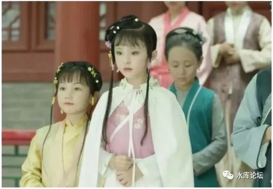
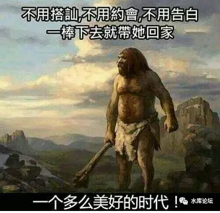
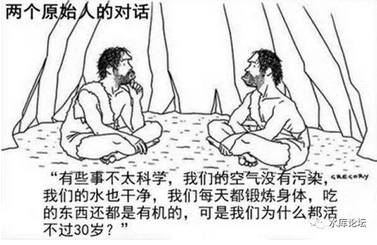
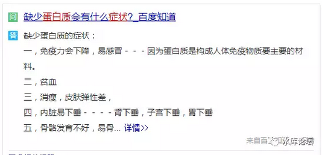

# 把生命加倍 \#F1450

原创： yevon\_ou [水库论坛](/) 2017-12-28

把生命加倍 ~\#F1450~
================================================================================================================

本篇为人口卷

 

为什么进化出三代同堂。

 

 

一）原始社会

 

近日家母咳血，因而也无心嬉戏。

侍奉汤药之余，胡思乱想，突然想问一个问题。

 

"一个65岁的人，活在古代，会是什么情况"。

什么情况，首先，她绝对不会是祖母。

 

 

正常的情况下，一个65岁的人，在古代，至少应该是"曾祖母"。甚至可能是"玄祖母"。

-   婴儿：1岁

-   父亲：15岁

-   祖父：30岁

-   曾祖父：45岁

-   玄祖母：60岁

 

 

譬如说，前一阵子颇迷唐嫣的苹果肌。唐嫣拍《锦绣未央》，讲的是北魏拓跋氏的故事。

而我们来看看拓跋皇族的谱系；

           出生   间隔
  -------- ------ ------
  拓跋珪   371    
  拓跋嗣   392    21
  拓跋焘   408    16
  拓跋晃   428    20
  拓跋濬   440    12
  拓跋弘   454    14
  元宏     467    13
  元恪     483    16

 

这说明什么，说明拓跋濬和唐嫣谈恋爱时，仅仅是一个12岁的小屁孩。

小学五年级的水平，打"王者荣耀"的年级。

 

电视上罗晋和唐嫣爱得死去活来，其实在正史中，罗晋演一个12岁的小屁孩，是无论如何也演不象的。还不如让全"儿童版"的红楼梦来拍，更现实一点。\[1\]

再比如说红楼梦。"林黛玉进大观园"是红楼梦的开始。

关于"黛玉入园"，红学界一直有二种说法。一种认为是8岁，一种认为是10岁。

 

但无论八岁，十岁，总而言之很小很小的啦。

进了大观园之后，后面的故事大家也很清楚了。黛玉就和贾宝玉，谈起了恋爱。

 

整个红楼，到大观园破灭，贾府灭门，前后不过二年多的时间。

有一种野史观点，认为黛玉死于小产。死状和小产高度相似。

你换算一下，宝玉黛玉二人，他们的婚姻和生育年龄，又仅仅只有几岁。

再往前翻一点，更为厉害。

在原始社会，譬如BC5000，当时的人类更加弱小。

 

智人时代，平均寿命只有17岁。

人类的代际更替，生育率必须达到2.1

考虑到原始社会的死亡率非常高，假设1/3的孩子，死于野兽和疾病之手。

这意味着原始人的生育率，至少要达到3.

 

然后你再换算一下，女孩子月经初潮11岁。平均2年生一胎。

那就是连续不断地生了。

接连不断地，一个接一个地怀着。

 

参考阅读《一个严肃的问题：人类为什么要生孩子？》

https://www.zhihu.com/question/263683694/answer/272033130

 

 

 

二）现代社会

 

而我们目前生活的"现代社会"是什么样子呢。

 

在我们的身边周围，几乎没有11岁生孩子的例子。

哪怕20岁之前，高中大学如果有人怀孕，也是全市轰动。整个学院的新闻。

 

按照正统的生物学家，我手里看到的几篇论文。

无一例外表示，"女性最佳的生育年龄，是24\~25岁"。

"如果拖延到28\~29岁，卵巢已经开始有了一定程度的老化"

 

你再去翻1000篇学术著作。也绝不会有学者，建议你把"生育年龄"放在12岁的。

唐嫣初见拓跋濬的小屁孩岁月，而且要赶快生子，晚了就抢不到皇位了。

 

 

另外一方面，我们的"学制"却越来越长。

古代14岁称"束发之年"。如果是君王，则要行"冕冠之礼"，冠礼之后，君王就可以执政。太后撤去帘子。

 

苏轼写"老夫聊发少年狂。左牵黄,右擎苍"，那一年他38岁。

38岁，已经堂而皇之自号"老夫"。而且周围的人，也公认他老头子了。

 

前二天教科书掀卫青、霍去病风波。

霍去病建功立业的时候，24岁。

大破匈奴。千古第一人。这份功业，今天没有任何24岁人可以做到。

 

 

我们现在的学制，目前"本科"教育16年。一个正常的大学生，毕业时22岁。

十七八岁想出头，除非你去拍电影。

 

更严重的，22岁"本科"还不够。

有越来越多的趋势，考"研究生"和博士。毕业时25\~28岁。

再眼睛眨一眨，耽搁二年。

对于许许多多的都市人来说，"职场"开局从30岁开始。赚工资打工成熟，从30岁开始。

 

我们的学制，实在太久太长。

等我们毕业的时候，古人都快要退休了。

 

 

 

三）被延长的生命

 

你以为我想吐槽"超长学制"么。吐槽生命的浪费么。

错了，我真正想问的，60岁为什么是祖母。

 

你有没有发现一个问题，把所有的"岁月"乘以2，正好就是古人。

 

有时候我甚至想，是不是外星人，偷偷把我们的时间拨慢了。

 

 

我们的生命，的确是延长了。通过更多的营养，更好的医疗，宋代的平均寿命，大约仅30岁。\[2\]

而到了今天，远远不止60岁。

 

但是，更绵长的寿命，带给我们的，并不是更多的谱系。

假如有一个老祖母活到了60岁，她并不是有15+15+15+15的四代玄子孙。

反而是30+30二代子孙。

更长的寿命，带给我们更长的生长周期。

 

 

 

绝大多数的人，都知道东北的大米好吃。

南方天热，米稻一年二熟，甚至一年三熟。单论产量，东北远远不如南方粮仓。

 

可是从营养和口感上，东北"一年一熟"的三江大米，却秒杀了南方稻。

东北天寒，植物致密。

精密生长，每一寸都更紧致。哪怕伐木制具，东北的木材也远远超过南方。

 

 

同样道理，如果你看人种的话，《临高启明》对于明代的人种，进行了蔑视的嘲笑。

当时的中国人，身材矮小，男性平均不会超过1.50米。

骨瘦嶙峋，体脂率低得可怕。

 

古代的中国人，大约有99%的人口，一辈子都接触不到"蛋白质"。

在梁家辉电影《棋王》中，他讲述了一个道理。有一个轿夫，一辈子只吃过一次肉。20年前扛一个县太爷，过黄河的时候，县太爷开恩，碗里加了二条肉丝。

平常时分，你吃吃杂粮加糠加馍馍就不错了。

 

长期的蛋白质缺乏，使得古人都患上了"蛋白质缺乏症"。

但是，另一方面，古人的"力气"却是惊人的。

一个瘦瘦小小的挑夫，动辄可以拉起200斤的扁担。连续干活十几个小时。

你今天吃得白白肥肥的，你都挑不动200斤。

 

这意味着什么呢，意味着"透支生命"。

凡是做重体力活，做旷工苦役的，一般都死得很早。

因为他们透支了元气。人类长期超负荷劳作，营养品补充又少，自然得用生命力来还。

老天爷记账的。

 

 

中国人，长期以来，喜欢把日本人叫做"小日本"。

因为日本人矮矮小小。如果说，古代中国人法国人平均身高1.50米，则日本人大约只有1.40米。

长期的营养不良，可以参见今天的北朝鲜。

 

但是明治维修之后，日本急剧的工业化。相应的，日本的食品工业能源大发展。

牛奶，肉食品，乳制品，纷纷跟上。

到了"抗日战争"的时候，日本人的身高已经超过了中国人，显得更为高大魁梧。

 

1937年的日本人，和1837年的日本人，简直就是二个人种。

2017年的中国人，和1017年的中国人，也简直就是二个人种。

 

 

我讲这些故事的原因，是我想问。

现代更好的营养，是不是把中国人培养成"东北大米"了。

 

我们知道，人，本来就应该好好培养的。

小孩子，就应该让他吃饱，喝饱，充足的营养，充足的睡眠。

养得饱饱的，做父母的才不心疼。

 

中国古代的人种，其实是"不正常"的。

因为古代普遍吃不饱，一碗米汤养六七口人。因此才需要"透支生命"，吃得比羊还少，干得比牛还多。

然后不到35岁，就挂了。

 

当我们今天有了充足的营养，充足的休息。

我们生物体内部的作息，是不是自动地把我们调整到了"细密"模式。开始紧致生长。

我们的寿命，是不是可以到120岁？

 

 

 

四）翻倍计划

 

你仔细看60岁的祖母，这里面最神奇的，是60岁还是"三代高堂"。

而不是15+15+15+15的玄祖母。

 

-   为什么生命体会选择增加了每一代的成熟期。

-   而不是更多的代际。

-   这问题我想了几夜都不清楚。

 

 

如果你和古代比，基本上我们是把"生命"加倍了。

-   原本12岁开始生育，现在24岁。

-   原本14岁开始工作，现在28岁。

-   原本18岁算作剩女，现在36岁。

-   原本30岁可做祖母，现在60岁。

-   原本40岁三代死光，现在80岁

 

而且春耕秋收，今天的"1/30/60"家庭结构，大家都觉得很正常。也丝毫没有妨碍到社会的正常运营。

 

当地球公转二圈，才算是一年，这是何等的幸运啊。

 

 

 

五）结语

 

顺着这个思路想下去，还有很多个话题。

 

1）生命年轮会不会无限增长下去，40岁才成年，80岁当祖母。

2）密长的生物学原理何在

3）为什么哪怕在一些很贫困地区，也没有切换成15\*4代的模式

4）为什么生物倾向于"三代"同堂。

5）可不可以通过压缩"生长周期"的方式，获得更绵长的生命。

 

写不动了，吃早餐去了。

  

 

（yevon\_ou\@163.com，2017年12月27日晨）

  

次文是广告。

哥哥实在太穷了。最近神马广告，加钱就接。

各位一定要原谅我哦，临近年底，老婆老娘孩子，负重的命。

 

 

 

 

\[1\]《小戏骨版《红楼梦》再现经典，豆瓣评分9.3，颜值演技吊打小鲜肉，获赞无数》http://www.sohu.com/a/198050492\_682915

\[2\]林万孝《我国历代人均寿命和预期寿命》：夏商不足18岁，汉朝22岁，唐朝27岁，宋朝30岁，清朝33岁，民国35岁，1957年57岁，2013年75岁。
