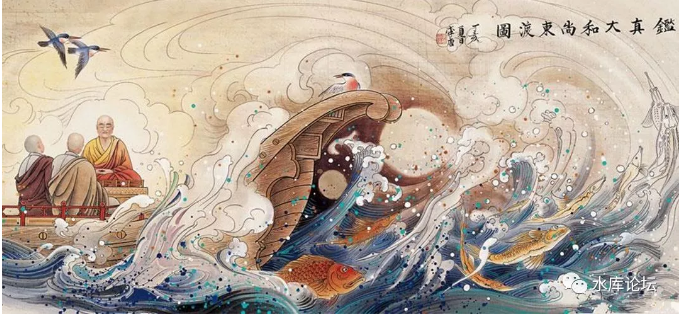
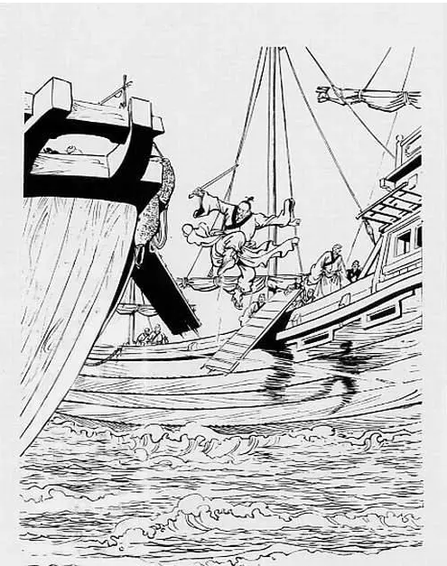
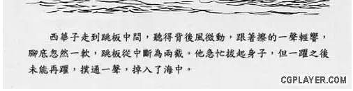
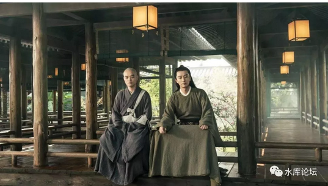
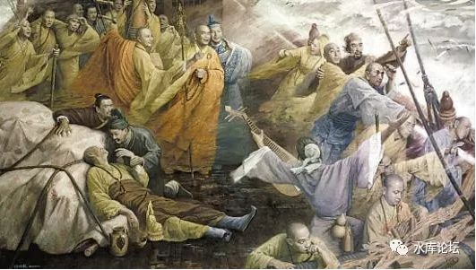
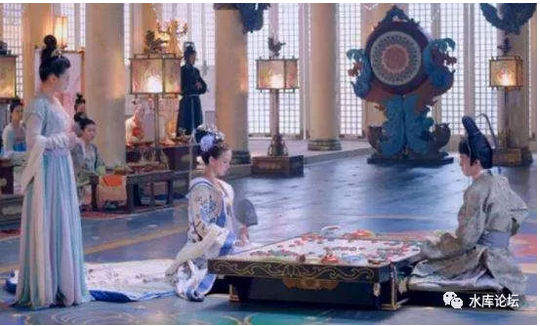
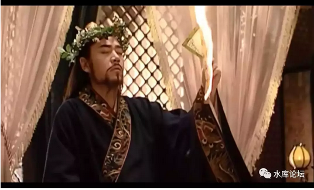
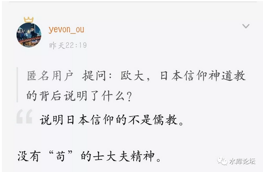
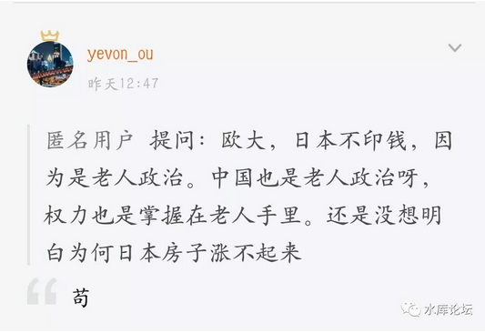
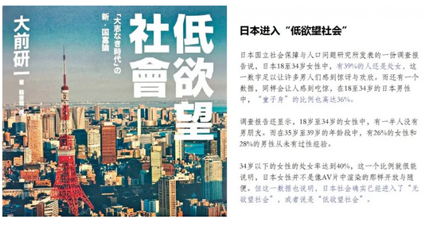

# 日本人的苟利 \#F1460

原创： yevon\_ou [水库论坛](/) 2018-01-09

日本人的苟利 ~\#F1460~
======================

 

今天，在水库知识星球，有人问了哥哥二个关于日本的问题。

我写《[司马懿的魏晋孽债](http://mp.weixin.qq.com/s?__biz=MzAxNTMxMTc0MA==&mid=2651016646&idx=1&sn=382f6ba6fc0b3fb81970e557094d7862&chksm=80721bd5b70592c380bf2387e1df6272b673ac2731206b5241b59dd4a370dbf49f27f40d63e8&scene=21#wechat_redirect)》，自信已经融会贯通。犯大错的机会不大。

 

邪马台民族，俺只能说"略懂"。但做不到大彻大悟的境界。火候八成。

各位若是不嫌俺磕叨，不妨听俺展开几句。 

一）大船

 

日本人的"开化"，始于AD663年的"白江口海战"。

当时，唐王朝还差最后一步征服高句丽。最后一场海战，唐军+新罗 VS
百济+倭国。

这是"倭王"第一次踏上历史舞台。应百济之邀，进入国际序列。

 

结果毫无悬念。

技术上有"代差"的倭国，被唐军的高头大船打得落花流水。全军覆没。

倭国的倾国之力，片甲不留。

 

 

古代的海战，主要靠放箭。

但是绝大部分人不知道，放箭的胜负，主要靠"船高"。

譬如我的船高五丈，相当于五层楼的高度。而你仅仅是小舢板。

则二军接舷的时候，感觉就和"攻城"没什么区别了。\[1\]

 

敌人可以居高临下，往你头顶放箭。

而矮的一方，射过去都是木板。根本不伤血。

  

面对这种七世纪的"巨舰大炮"，毫无还手之力。

倭国人民，自然也是要救亡图存的。

 

只不过"大船"可不是这么好造的。

想要船舷高，船就要大。

船大，从哪方面讲，都是一个技术活。龙骨和肋骨的工艺，耐受耐拉力。

 

而且船越大，工程越大。就需要相应的国力。

造了大船，你没有远洋贸易，大船也是浪费。海军很贵的。

所以这是个系统难题。

 

在这些需求下，日本派出了"遣唐使"。

 

 

 

二）鉴真东渡

 

日都奈良，有"小长安"的说法。

日本人心慕大唐文化"全盘唐化"，整个奈良城，就是翻照长安城的格局兴建的。只不过国力有限，扶桑造了一个微缩版。

 

中国人搞洋务运动，喊出了"中学为体，西学为用"的口号。

后来洋务运动惨败，中国人想想不对。还得是"西学为体，西学为用"。彻底抛弃了爱新觉罗封建王朝。重新搭建一个新世界。 

日本人学习盛唐文化，从一开始就是"唐学为体，唐学为用"。

日本人的民族性，上手就抛弃了"日本传统"。全盘唐化。

1200年后，又搞了一次。

 

整个"全盘唐化"运动，至AD753年的"鉴真东渡"达到高潮。日本国王，连续三次写信邀请"鉴真大德"。那是真的诚心诚意。

全日本朝廷上下，是全心全意地相信鉴真就是"活佛"。只要鉴真抵达奈良，就可以带给日本繁荣昌盛与富裕。 

 
但是中国教科书没有教道的是：

-   鉴真东渡之后，并没有得到重用。

-   相反在50年内，连续发生了二次"严重排佛"事件。佛教一度几乎遭到取缔。

-   日本的"遣唐使"，在鉴真之后逐渐关闭。学习唐朝进入了一个封闭消化期。

 

这是什么情况呢。

 

 

 

三）遣唐使

 

我们知道，"照搬"一个国家的政治制度，是有非常非常大隐患的。

盲目地"推销"民主，绝对是邪恶之举。

 

菲律宾脱胎于美国，原本是美国领土的一部分。

菲律宾宪法，从头到尾，每个字都和美国宪法一模一样。

极端点说，你要给国税局交各种各样表格，"A1
Form"连这个编号，菲律宾都是和美国一样的。

 

但是淮北为枳，淮南为橘。菲律宾的政治运转实效如何，大家也看到了。

更不用提，在黑非洲，还有一个更奇葩的国家"利比里亚"。有兴趣可以看看它的历史。\[2\]

 

政治制度，有其更底层T-1的道理。

你一定要研究清楚了T-1，把更深层逻辑想得通彻。

然后结合本国特色，重新推演，才能摸索出适合的路。所谓"中国特色社会主义"

 

 

日本人很清楚，光有"格物"是不够的。

你招了几个船匠，学会了大唐的造船工艺。你还是打不过唐国。

因为你没有这个国力，使得国家富强。

 

哪怕你穷兵黩武造大船，对方说不定又进化出了"火炮船"。

你没有那个社会，产生不了科技创新。

国家的竞争，是全方位的竞争。

 

因此要挑战大唐，就一定要从"体"开始。

从国家社会制度层面，改革政体，刺激生产力。

不是战术胜，也不是战略胜。而是国力胜。

 

 

"遣唐使"派遣了十九批。奈良朝廷，"全盘复制"了盛唐的制度。

但是玩着玩着，日本人觉得不对了。

"遣唐使"的结果，日本不是越来越强。反而是越来越弱了。

 

因为"国力衰弱"的惨痛结果。日本国内保守派反对声音越来越大。

"遣唐使"逐渐不再盛行。鉴真也被束之高阁。

日本从AD800开始锁关，一锁差不多又是八百年。\[3\]

 

 

 

四）大一统

 

为什么越来越弱。因为中国和日本，有一个根本性的政治差异。

-   中国，是一个大一统王朝。

-   日本，是分散大名首领。

 

中国从秦始皇统一六国之后。在"列国竞赛"方面，已经没有对手了。

皇帝是唯一的，再没有第二个天子。

放马归田，专心文治。

 

皇帝考虑的，是"如何治理"这个国家。文治，保证政令和支持面的畅通。

因此中国皇帝发明了"科举"。

 

科举，是寒门世子，皇帝给他们官做。让他们分享皇帝的权力。

官位，并不是世袭的。任期是有限的。打工仔。

你是中央政府的官僚，而不是地方的土皇帝。

 

 

但是日本天皇，他并不是"大一统"王朝。

日本天皇严格地说，只是"最大部落的酋长"。类似于法皇于法兰西。

当时的日本，无论是交通，人口，开发度，都远远没到六十六国打造"新日本"的地步。这事，得八百年之后，让织田信长和猴子来做。

 

 

日本天皇模仿盛唐的"科举"。

他也找寒门来考试，授予他们官职。取代传统的源，平，藤，橘四大皇姓。

然后他就发现，搞到非常糟糕。

 

"大和族长"和周边的大名，还是存在竞争关系的。

虽然名义上是天下共主，但其实各藩之间，都在争权夺利。

 

天皇搞"郡县制"，让科举的人，统领一部分郡县土地。

这些人虽然轻微地提高了生产力，可"忠诚"是一个更大的问题。

 

分划出去的"郡长"，搞不好闹独立了。又或者和周边的大名勾结。

天皇岂不是气得吐血。

王畿越来越小。"遣唐使"搞得越多，学唐朝那一套。反而把"大和朝廷"搞得越发虚弱。王权不盛。奈良王朝，崩溃于二百年后。

AD753，鉴真东渡。

在\#F10《[论儒·法·禅宗·基督自治和道教的复兴](http://mp.weixin.qq.com/s?__biz=MzAxNTMxMTc0MA==&mid=211128132&idx=1&sn=ca586ee1556e5e43c9949624294e49e6&scene=21#wechat_redirect)》一文中，我们说到，佛教是"儒教"的高级补充。

"朝为田舍郎，暮登天子堂"，在严格的等级制社会，禅宗的"顿悟"提供了一步登天的屌丝妄想。为意识形态提供了理论根据。

 

日本连"科举制"都消化不了。

这种"高阶科技"又怎么推行得下去呢。

因此鉴真虽然被赞赏为"大德"。到了日本，却是没法推行他那一套的。"崇佛"反对阻力大得不得了。

 

以"鉴真"作为标志性事件。意味着日本对于"大唐"的科技树收揽，已经到了极限。再也消化不了。

此后，日本进入了八百年的闭关锁国阶段。直到彻底消化，破茧而出。

 

 

 

五）神道教和儒教

 

历史是掷骰子，

几百年的生产力差异，使得日本和中国走上了不同的道路。

 

-   中国以儒教治国

-   日本国教，是神道教

儒者，先天下之忧而忧，后天下之乐而乐。

 

 

中国为什么会特产"地命海心"奇葩生物。因为这个国家，是和他们有关的。

中国的国号是"共和国"，而共和国的精神，千百年前就融入血脉。

 

中国是"科举"。科举你是有机会做到"上层"的。

哪怕皇帝做不了。但"一人之下，万人之上"，宰相还是可以当的。

 

一般情况下，皇帝都很懒。不怎么想管事。

一二十年内，就是你在掌舵整个帝国的运转。 

"王与马共天下""宋与士大夫共天下""清与疍吏共天下"。

天下，是天下人的天下。

"天下兴亡，匹夫有责"。

 

 

但是日本只差一步，日本没有踏上"科举制"。

奈良王朝崩溃后，此后的天皇更虚弱，更空壳。\[4\]

 

中国有四民的说法，"士农工商"。

日本也有四民，"士农工商"。只不过这里的"士"，指的是"武士"。

"天皇---大名---家臣---百姓"，四级结构，始终存在。

 

 

武士的后代还是武士，农民的后代还是农民。

没有大名的允许，你一辈子甚至都不能离开这个村庄。

 

日本人长期以来，缺乏大一统的实体。

每一个人，效忠于自己的大名。大名再效忠于天皇。"达则兼济天下"不存在的。

日本根本没有这个"天下"给你去忧。

你谁呀。肉食者鄙。 

六）老人社会

 

我们用了漫长的篇幅铺垫，是为了回答这个问题。

2018年日本的问题，大家都知道了，"老年人太多，年轻人太少"。

老年人不从事工作，净消耗。

而年轻人被压榨得太厉害，懒洋洋也不想工作。

爬职场几十年，才爬到全公司第十八级小组长。还不如"低欲望社会"呢。

 

 

也并不是没有人，试图改变这个局面。但几乎所有的尝试，全部都失败了。

-   如果你今年80岁，你有60年的时间可以拉帮结伙。

-   如果你今年25岁，你只有5年的时间可以拉帮结伙。

 

我们一直讲一个"组织度"。其实社会上的组织度，各个微信圈的人际关系，也不是一天之内搭起来的。

你拥有的寿命越长，你的人际关系网，肯定就越复杂。

 

日本的老年人，拥有漫长的时间去"结社"。

老年人的投票率又比较高。

"老年政治团体"，遂结成了一块铁板。牢不可破。 

然后水库提问者，接着又问，那中国不也是"老年人当政"么。

我回答说："苟"。

 

提问者再问，为什么日本老臣不苟，中国"苟"

俺回答说，因为中国有生生不息士大夫精神

 

+1s 

 

（yevon\_ou\@163.com，2018年1月5日子）

 

\[1\] 破艨艟主要靠火船。但是海战火船很难。

\[2\] 《美国人一手建立的国家，为何陷入史上最残酷的内战\|地球知识局》

https://zhuanlan.zhihu.com/p/28589000

\[3\] 遣唐使持续到AD895，但后几批不重要。

\[4\] 最穷的时候，要靠宫女出去卖。
