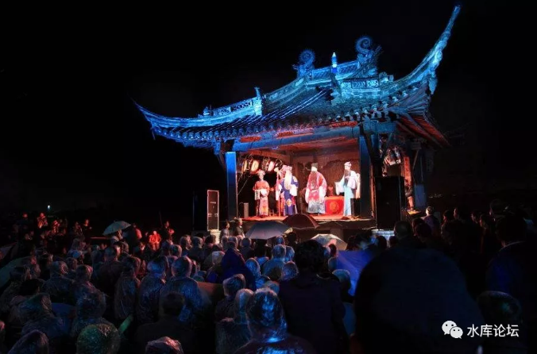

# 逢年过节的必要性 \#F1520

原创： yevon\_ou [水库论坛](/) 2018-02-12

逢年过节的必要性 ~\#F1520~
=====================================================================================================================

 

神权远去，民族逐渐兴起

 

 

一）身份认同

 

中世纪尾声的一个重要标志，是人们逐渐不再为"神灵"而斗争了。

 

在整个中世纪，敌我认同的最主要划分是"信仰"。

你信基督教，犹太教，还是伊斯兰教。

是这个教派，还是那个教派。

这个分支，还是那个分支。

 

欧洲人最重视的一个词，是"异教徒"。

凡是异教徒，那就是敌人。同为基督教国家，彼此就是兄弟。

只要你信耶稣，

则一个黑人摩尔人，在拜占庭荣登高位，难度是不大的。

 

 

在中国，类似的概念，是"忠君"。

郭靖和金轮法王的争夺，金庸写郭襄"各为其主"。

蒙宋战争，其实是蒙古大汗和宋理宗之间的战争。

 

当时的行规，叫做"食君之禄，忠君之事"。

只要朝廷给了你官爵，你就是臣子。做臣子，必须一生一世。誓死不渝。

但是只要没吃过明禄。象顾炎武，查伊璜，这种人降清，那是一点心理负担都没有的。

\* 参见王陶陶对明末，和日本侵华战争的分析。

 

 

中世纪尾声的一个重要标志，随着"识字率"的上升，"启蒙运动"的推行，无神论开天辟地。

人们逐渐认识，"神灵"是不存在的。为了虚幻的宗教和神谕，而去拼死拼活，是很不值得的。

 

神灵逐渐远去，民族主义兴起

 

既然大家不是为神灵的旨意而争斗，那自然就可以追逐一些更现实的东西。

最直接，最直观，就是"过得舒服"。

 

什么叫"过得舒服"，在枫叶国CalgaryMuseum的墙上，刻着这样一行字：

-   我们只会奋死捍卫，我们珍视的东西。

-   我们只会珍视，我们熟悉的东西。

-   我们只会熟悉，我们接触的东西。

 

人类要分"远近亲疏"。譬如在"小年夜"这种日子。你一看，家里包起了饺子，烙起了馅饼，拿一支二尺长的大葱，蘸一点浓酱，卷大饼吃。

不用怀疑，您就是山东人！

 

然后你再打开电视，看一段春晚。

曲艺节目，说一段"俺山东有个英雄，关公战秦琼"。

你心里满满的，这是回到家乡了。

 

 

当人类不再需要为"神灵"而战斗，他们自然根据"习性喜好"，抱团成为了小团体。

远近亲疏，是最强大的纽带。珍视共同的生活\~劳动\~习惯，语言\~玩耍\~文化。

  

我们看欧洲历史，有一个令人瞩目的现象。

一直到1715AD，路易十四"太阳王"的年代，欧洲的强权是什么。

是法国，西班牙，奥地利。

尤其是法国，作为绝对的强权，实力占到欧洲40%以上。

 

德意志呢，作为一个"地理名词"，不存在的。

你让一个十八世纪的"政治学家"做预测，他猜一百次，想破头，也猜不到"德意志"会突然崛起。

简直说非洲54个国家，突然统一起来，凝聚成一个10亿人口工业化大帝国。

我们今天站在三百年后，我们知道"法国"并没有形成强权。

相反的，高卢雄鸡从拿破仑1815之后，就再也没有打过胜仗。

一战，二战，被人揍得象猪头一样。

哪怕今天，欧洲的"主导人"也绝对不是法兰西，默妈妈才是绝对的女王。德国是欧洲轴心Axis。

 

德国是怎样崛起的？

身份认同感！

 

在"神权"时代，Deutsch恐怕是最不幸的民族。

他33%的人口信新教，32%的人口信天主教，其次还有东正教，德鲁伊，奥丁神教等一堆乱七八糟的教。

 

3000W人口，欧洲第一大单一民族，混得连维京人都不如。

四分五裂，互相内战。

 

瑞典的开国君王，古斯塔夫。当时全瑞典只有80W人口，他居然可以拉扯出一支23W人的常备军。

靠的是什么，德国宗教内战。 

-   一半的德国人，出钱养活瑞典主子。象辽国皇帝一样侍养着他。

-   一半的德国人，他可以抢。

因为如此丰功伟绩，瑞典一跃成为北欧强权，世界一级。古斯塔夫后人，迄今仍是瑞典皇帝。

 

德国是怎样崛起的呢。

德语。

 

工业革命以后，"神权"时代不再。

当德国人静下心以后，共同的[文化和猪肘香肠]，使得他们成了同一民族。

 

"汉萨联盟"几乎是一开始，就把法兰西排斥在外的。自始至终所有的谈判，无非是老大普鲁士，还是奥地利。

为什么，因为大家操的都是德语。和"法语区"尿不到一起去。

 

德国人从最初的关税联盟，到此后的军事联盟，再到政治联盟。

最终俾斯麦从"统一战争"中脱颖而出。德意志大帝国浴血重生。令欧洲，乃至世界颤抖。

 

没有黑森林秘境文化，就不会有德意志。

所有讲德语的人，就是德国的天然边界。

二）中华帝国

 

和一般人理解的不同。"中华民族"其实是一个很"新"的词。

《义勇军进行曲》创作于1935年，而"中华民族"这词创造于1902年。创造者：梁启超。

 

20世纪初，中国也处于"剧烈现代化"，放眼看世界的年代。

是"忠君"君权天授，向民族主义国家转型的年代。

 

"国体"之策，该如何走，众说纷纭。有了五大臣欧洲考察之行。

载泽的奏折，经过了外包外包再外包，枪手枪手再枪手。

最终慈禧太后看到的版本，却是"乱党"梁启超写的。

 

 

在1900年代，中国的"地方离心主义"是非常非常严重的。

某些意义上讲，中国和土崩瓦解的奥斯曼帝国，奥匈帝国，并没有什么二样。

都是靠"苏丹忠诚"凝聚起来的旗帜。

彼此臣民之间，并没有什么好感，也没有什么交往的。

 

"冬川豆"曾经撰写过文章，1900年之际，一个广东人听大锣大鼓，吃粤菜喝煲汤，住骑楼。

哪怕和隔壁邻省的"江西老表"相比，二者的差异也是巨大，方言都无法沟通。

 

如果你再进一步，把广东和山东，甚至黑龙江，新疆相比。

再胆大的小说家，也不敢写他们血浓于水。

 

 

除了文化上的差异，更严重是"心理"上的隔阂。

"民国史"目前是很少教了。如果你还能翻到民国史的话，你就会看到"联省自治"有多受欢迎。喊得最凶的，居然还是孙文那个逆贼。

 

除此之外，"晋人治晋""浙人治浙""川人治川"也是百万高频词。

乡民的向心力，到省会为止。

部分连省会，都没有齐心。

 

 

整个事件的转折点，当然是太祖了。

"中华民族"经历了一百年的不幸，之后的一百年，其实是极度幸运的民族。

因为几个伟人，中华民族被保留了下来。960万平方公里，没有分崩离析。

保留了最大的本土。

 

而太祖带给了中国几十年的和平。在和平期间，就可以做一件事：

"铁路"

 

 

1953年第一个"五年计划"，是中国第一次从国家层面调度资源。

大批的工程师北上，大批的干部南下。

上海交通大学，被拆成西安交大。"八大院"更被拆零十几间。

随着这些精英在全国的"再分散"。中央吏治，而非地方吏治，终于站稳了脚跟。

 

其次太宗，又是一个极其幸运的人。

太宗迎来了"生产力的大发展"。

 

 

所谓"春运"，有学者嗤之以鼻。什么春运，不存在的！

1960年代，1970年代，为什么全国没有"春运难题"。

为什么到1980年代，反而爆发开来了。

 

因为以前，技术上根本做不到。

古代"进京赶考"，路上就要走大半年。到了京城，干脆找一家破巷子住下来。没有取得功名，就不用回家了。

 

古代人不想"春运"么，没那么矫情。

是因为1960\~1970年代，根本没有这个铁路运力。想也不要想。

一旦出门打工，就想好五六年别回家吧。

 

正是因为铁路运能的大发展，才能有几千万人出门打工。

才会触发"春运难题"。

 

 

我们知道，在21世纪，中国的"工业化进程"是非常惊人的。

高速公路，高难度隧桥，以前所未有的速度在建设。以至于"高速通路通车"，甚至都不再成为一条新闻。

 

而电力，超市，互联网的进入，则以革命般的速度，把内地"偏僻"地级市，逐渐和整个中华帝国连接在了一起。

 

今天，哪怕你想去怀化的山间度个假。你也可以搞一场"说走就走的旅行"。

而且到了当地，一样有很好的五星级酒店。吃住租车加油都不用愁。

 

现代交通和人际交流，使得中华民族凝聚成了一个整体

 

参考阅读：《[对藏民来说，可乐的配方就跟香巴拉一样神秘](https://mp.weixin.qq.com/s?__biz=MjM5NTc1NjYyMA==&mid=2651744208&idx=1&sn=3904649cde0a41498e8842d6cec45fac&chksm=bd0968f38a7ee1e54e23caaa5cf8b904e140a69d25c57195992ca9092799f7a0c2804680f026&mpshare=1&scene=21&srcid=0212Hmni7sD3XgQca3T90LrU#wechat_redirect)》

 

在1900年，一个广东人和一个东北人见面，他们是完全无法交流的。

方言无法沟通，斗蛐蛐和滑雪，也是完全二个层面的话题。必然不亲热。

 

今天，他们二个人一见面，

谈的都是迪丽热巴。

 

 

 

三）共同感之建设

 

有一些妹子，她们对最新的黑人球星如数家珍，手机里关注着芭芭拉·史萃珊每日动态，身上佩戴着亮闪闪的配饰，交往的全是黑人小伙子。一开口，哎呀妈呀，满沫子东北口音
\-\-\-\-\--论中国的"黑化"

 

 

我必须提醒各位的是，我们在不停"同化"四方蛮夷的同时，其他各种异质文明，也在不停地同化我们的国民。

 

"黄皮白心"早已是一个屡见不鲜的话题。意思是有这么一批香蕉人，流着中国人的血，吃着中国人的菜，但内心却是"效忠"于白人的。

他们自以为喝了二年洋墨水，从此以后不是中国人了。

凡事必提美国，什么东西都是英国的好，老牌贵族就是文明高档。

连Bally昨天被山东民企收购了都不知道。

 

 

基督教在中国的扩散到了什么程度？

https://www.zhihu.com/question/31356208/answer/316328963

 

我们的文明，一直在分裂出"中日亲善"人士。

下一次日本人打进来的时候，还是不愁汉奸的。 

怎样保护中华文明。使得我们依然团结，依然强大，凝固成一块巨大整体。

是一个庞大的德意志帝国，而不是一小块讲波兰语的，一小块讲丹麦语的，一小块讲匈牙利语的。

 

我举个例子，请你说出"高中时期"还有印象的五位同学。

有时候，有些人和你做了三四年的同事。可是你们之间，交往平淡如水。

但是哪一天，你摔了一跤。他扶着你去医务室，涂红药水，这事你却可以记一辈子。

 

平淡的事情没有记忆，

特殊的行为，才值得记录

 

在欧洲几乎所有的"小镇"中，他们都乐衷于建筑"市政广场"。

其具体标志，是中心一个喷水池。然后一个可以容纳数千人的大广场。

逢年过节，大家就在这里载歌载舞。

 

如果每一户都是分门独立的农户，则你永远也培养不出"市民文化"。

诗歌，小说，艺术，哲学，商业，都无法发展。

 

你一定是需要一个"庆典式"的场景。人群要集聚。

在这一天/这一周，大家放下了手中的活，一般是农闲。

然后聚集在一起，互相交流，彼此熟悉，交个朋友，喝杯啤酒。讨论古丽扎娜。

 

请婺剧下乡团，唱上三天社戏。

于是鲁迅有了浓浓的记忆，原来这就是乡愁，写下不朽的《社戏》。

稻花香里说丰年，这样一段记忆，可以跟随你一辈子。

 

 

-   我们只会捍卫，我们珍视的东西。

-   我们只会珍视，我们熟悉的东西。

-   我们只会熟悉，我们接触的东西。

 中国文化接触得越多，你越是爱国。

 

 

 

（yevon\_ou\@163.com，2018年2月11日晚）

 

 

框内是广告。也是2017年"投资回报率"最高的项目，

不幸的是......从我头上，搜刮去的。

 

原因是，去年三月"水库论坛"开始接广告。青年小龟，戴着眼镜，奸兮兮地第一个找到我。

包下第一个广告，而且打了八折，折扣后是28000元/主文。

 

然后这个家伙，就是"[拖延流](http://mp.weixin.qq.com/s?__biz=MzAxNTMxMTc0MA==&mid=2651016620&idx=1&sn=8069f3b9580598d13ba67e0b6d3edb0e&chksm=80721bbfb70592a94abba6201a528d285457baea95f7c31d6727a4d9cabced2fc6e8a75f2c55&scene=21#wechat_redirect)"。一直拖着，迟迟不投。

静待水库论坛，粉丝数猛涨，影响力猛涨。

拖了近一年，"水库论坛"订阅已经超越370000人。"广告报价"翻了好几倍。

 

俺实在忍不住了，小龟啊，你个龟娃子春节前一定给我投掉！

这人长这样：
