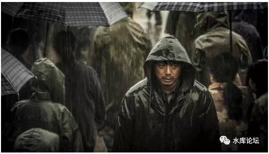
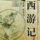
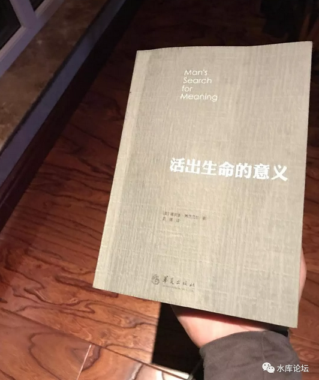
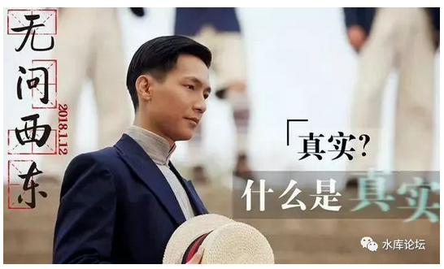

# 天地不仁，以万物为刍狗；圣人不仁，以百姓为刍狗。

天地之间，其犹橐(tuó)籥(yuè)乎？虚而不屈，动而俞出。

多言数穷，不如守中。

 

春节偶得，突然悟了几句道藏。

 

 

一）       暴雪将至

 

休假期间，实在是懒得动。五天也就看了七八个楼盘。

剩下的时间，全都在没日没夜地看碟。

 

看了NN部之后，翻到了铁锈色的《暴雪将至》

这是一部非常著名的电影，段奕宏靠此获得了2017年《东京电影节》最佳男演员奖。

 

 

影片讲述了一个沉闷至极的故事。

段奕宏是一家钢铁厂保卫科的科长。厂里接连发生了女工被害的事件，连环杀手杀了三个女人。

警方办案的时候，段奕宏作为小圈子里的"余神探"，积极主动凑了上去，争取配合警方办案。

 

没想到警察局的老刑警队长，到基层小兵，全都对他不屑一顾。

小警官甚至把他的点烟晾在了雨里，把车窗摇起，"认清楚你自己的身份"。

上海人看到这一段时，真心就有点看不懂了。

警察同志，这不都是"为人民服务"的么。啥身份呀。

 
接下来，就是段奕宏和他的组员们，在小酒馆里喝酒。

几乎所有韩剧都会出现的路边大排档，3元钱一塑料袋，浑浊不堪的啤酒。

杯桌盏晃，小兄弟们缀唆着，"余神探这么厉害，赶明也混到体制内去，事业编啊！"

段奕宏嘴上不说，眼神里却是一股老得意的样子。"时辰未到，时机未到"。

 

然后这个业余的保卫科科长，就发疯一样地去追捕疑犯。

期间，他徒弟战死。

他女朋友被他出卖，自杀。

他自己二次铁链箍头，九死一生。

事业编刑警队长，还是对他不屑一顾，冷冷淡漠。

 

 

故事的最后，段奕宏终于找到了他"心目中"的嫌疑犯。

在麦草田中，他挥棒把人打成重伤。

结局毫不意外，无辜！故意伤害罪，段奕宏入狱十年。

影片的最后，2008年，段奕宏终于刑满释放。

他回到中南钢铁厂，整个厂区早已倒闭，空无一人。

 

说起往年历史，他的牺牲，他的坚持，没有一个人记得。

甚至就连当年高不可攀的刑警队长，也早已退休。目前在大门口看门，喂狗。

 

小人物怅然若失，这一生，到底是图什么呢。

 

 

二）       小人物

 

整部影片最大的黑色幽默，主人公付出了"徒弟，女友，自身"如此巨大的代价，而他的追求，仅仅是：

月薪2000元的不下岗事业编。

 

 

如果是美国人来拍，如此巨大牺牲，一定是为了拯救地球。

如果让阿拉伯人来拍，如此巨大牺牲，一定是为了所罗门的宝藏。

只有让中国导演来拍，如此巨大牺牲，是为了在1998年代不下岗。

还真是黑色幽默。因此日本人会心地给了一个"最佳男演员"奖。

 

 

片子看了很久，我突然想起来，在"办公室政治"里面，为什么有人会咬你。

为了开会请谁，不请谁。

排座位谁坐前面，谁坐侧位。

写邮件cc谁，不cc谁。

为了这些事，有些人可以和你闹，可以和你斗，可以和你作。

 

你LP在公司里受了一肚子的气，回来再把怨发泄到你的头上。

你不觉得这件事很黑色幽默么。

 

东北一个三四线城市的五流钢铁厂的六流科室的七流保卫科科长，

他的人生，在京沪人眼里就是一场笑料。

可是你争来夺去，为了办公室里面Manager变成Senior Manager.

你不觉得这件事同样很可笑么。

 

有些人为了在职场多爬一阶，也的确付出了"亲人，女友，自身"的惨重代价。

后人哀之而不鉴之，到底谁是小人物呢。

 

 

三）       道德经

 

天地不仁，以万物为刍狗；圣人不仁，以百姓为刍狗。

天地之间，其犹橐(tuó)籥(yuè)乎？虚而不屈，动而俞出。

多言数穷，不如守中。

 

这是《道德经》第五节的经文。

大家都知道，"天地不仁以万物为刍狗"是道教的核心教义。

但是接下来，马上一句"天地之间，其犹橐(tuó)籥(yuè)乎"，就很少有人能理解了。

 

这句话经文的意思，是说"我们的世界"就像是一个盒子。

悲欢离合，生死搏斗。小人物的奋斗，段奕宏二次出生入死，十年大狱，其实就在这个盒子里，上演着木偶戏。

 

而这个盒子边上，有二个小洞。小洞里有一双眼睛在看着。

那是京沪的人。高高在上，一套房子卖好几百万，BAT大学生起薪二三十万。

什么事业编2000，呸，SB。

所有的成功学，都在教导你"脱离事业编"。

 

 

而"京沪观众"是最终力量么。也不是。

那些骄傲洋洋的小白领，也不过另一场"木偶戏"。

在这个箱子里，所谓"职场风云"，所谓精英靓女。在A8\~A9的眼里，也无非二个字：SB

 

拼什么职场呀，你玩一辈子，不入流啊。

搞搞房子，搞搞小黄车，搞搞ICO，谈论的都是几千万上亿的生意。

 

 

但是这个"盒子"，这个"生态"之外，又是一个盒子。

在赵家人眼里，无论商人如何狡诈，如何挖空心思从消费者手中搜刮几个亿。

不还是一块肥肉么。

在zz面前，商人予取予夺。很多时候，甚至就是一块肉养熟了再割。

 

 

更进一步，"赵家人"也是一个世界，是神仙界和天界。

但是赵家人是终极么，也不是。

按照地球的"宇宙尺度"，所谓王权兴衰，不过二三百年的气数。大历史，大生物，以百万年为单位，灵长目或许都斗不过猩猩。

 

 

更进一步，有一种说法"线粒体不死"。

人类的繁衍更替，对于"生存"的所有竞争和奋斗，归根到底是你的血脉存活。而线粒体是永恒不变的。

究竟是你活了下去，还是线粒体活了下去。"人的生命"是不是一种傀儡，是寄生虫和宿主，令人不寒而栗。

而线粒体又是怎么来的呢，生命是如何产生的，宇宙"外生说"盛行一时。究竟有没有上帝。

还是说，宇宙的本身，不过巨人的一个喷嚏？

 

女儿情吴静 - 西游记 电视剧配乐原声

 

天地之间，其犹橐(tuó)籥(yuè)乎，这句话的意思，天地类似于一个盒子。

一层套着一层。

山外有山，天外有天。

 

如果我们仅仅是木偶戏，所有挣扎与奋斗，类似于段奕宏的"编外科二等帮佣"惹人耻笑，毫无意义。

那我们的人生，还有什么目标呢。

四）       不如守中

 

天地不仁，以万物为刍狗；圣人不仁，以百姓为刍狗。

天地之间，其犹橐(tuó)籥(yuè)乎？虚而不屈，动而俞出。

多言数穷，不如守中。

 

人生不过一场笑话。

段奕宏无论如何奋斗，他的人生，在京沪"大人物"眼里看来，不过一场笑话。

而京沪人无论如何奋斗，我们的人生，在"赵大人物"眼里看来，又何尝不是一场笑话。

既然如此，我们还要不要"笑话下去"。

保卫科科长段奕宏，还要不要削尖了脑袋往上爬。

 

这个尖锐的问题，就构成了第三句："多言数穷，不如守中"。

简单点说，努力去做，但不要炫耀。

 

真正的高手，都是得奖了以后，继续谦虚地说，"哪里哪里，做得还很不够"。

既然永远都有"天外有天"的存在，则最好的不丢面子的方法，就是"谦虚"。

所谓"多言数穷"。

 

 

而另一方面，什么才是真正的欢娱呢:

 

\"Il n\'ya qu\'un héroïsme au monde: c\'est de voir le monde tel qu\'il
est et de l\'aimer.\" \-\-\-\-\-- RomainRolland.

世界上只有一种真正的英雄主义，那就是在认清生活真相之后依然热爱生活------罗曼罗兰

 

 

任凭世界纷纷扰扰，任凭别人将我的成就，贬得一文不值。

我追求心灵的平静。

当我认清了世界的真相，我依然热爱她。回首一生，无愧于心。

所谓"不如守中"。 

 

 

（yevon\_ou\@163.com，2018年2月21日午）
