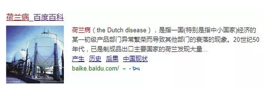
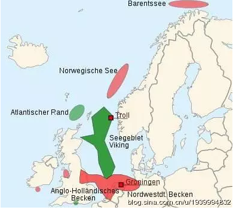
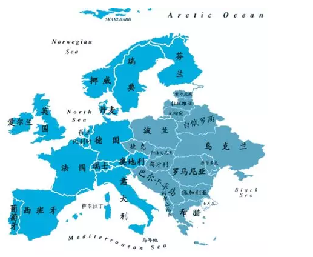

# 荷兰效应 \#F1570

原创： yevon\_ou [[水库论坛]](/) *2018-03-04*

本篇为经济学科普。

 
一）       荷兰效应

 

前二天我在山海关的高铁上，翻着宁南山写的《[[希望与危机------东北经济的未来十年]](https://mp.weixin.qq.com/s?__biz=MzI0NzQzMjU3Ng==&mid=2247488728&idx=1&sn=a023fc7498f07fc91537f85d0757bcfb&chksm=e9b14037dec6c921cd900b6bd1e02c9e5d1ac0ca5721ab5598c55bff6e1a4e89b85c61abc507&mpshare=1&scene=21&srcid=0221b9FT9qzOnXcXazprOwnO#wechat_redirect)》，实在是颇为有趣。

为了讲清楚我们今天的概念，首先我们要讲另一个故事。远在大西洋一陲的马车夫小国：荷兰

 

 

荷兰，以其著名的"荷兰病"闻名欧洲。经济学科班学生，几乎耳熟能详。

 

欧洲西北角，称之为"北海"。在国际法上，属于英国（苏格兰），荷兰，挪威三国共有。

1959年，在北海意外地发现了：格罗宁根气田(Groningen)

 

在此之前，整个欧洲大陆被认为是贫油国。全欧洲，只有罗马尼亚有一点点少得可怜的石油矿井。

当年希特勒为了区区1000万吨石油产量，战略重心极大倾斜。非得横穿匈牙利

、南斯拉夫，拿下罗马尼亚。

就是因为全欧洲都没油。一旦英国实行海运封锁，他连飞机坦克都发动不起来。因此重兵囤积边远之地，实在情非得已。

 

 

可是在1959年，荷兰意外地发现近海就有石油，距离欧洲主要工业国超级近，政治军事安全，产油量最高达到1亿吨/年，是罗马尼亚十倍。岂不令人喜出望外。

 

直到今天，2016年苏格兰独立公投，独立派一个重大的理由，是脱英之后可以"独享"北海油田。

挪威福利富甲天下，靠的也是500万人独霸1/3油田。

 

荷兰是第一个发现油田，也是第一个开采的。其直接结果，就是SHELL皇家壳牌石油公司的兴起。

借着1970年代"石油危机"油价暴涨，着实发了一笔横财。

 

 

可是"横财"对于荷兰这个国家，是不是好事呢。

有些经济学家认为，不好。

 

因为石油业一旦开始兴起，他就开始招人。

荷兰一共只有这么点人，怀孕造人也来不及。Shell要招人，就只能从人力市场上求。

 

随着石油业的兴起，原本是做厨师，卡车司机，警卫保安，电子工程师，网络工程师，汽车火车机械，

几乎所有行业的人，都被扯去干石油了。

 

而相应的；

-   饭店老板招不到小工

-   运输公司招不到司机

-   警察队伍招不到警员

-   汽车制造业招不到工程师

 

石油，作为一门收入很高的工种，可以开给"石油从业人员"很高的工资。

边际效益相等。

餐饮业要留住递菜洗碗的小工，就要给到高得多的工资。人工暴涨。 

（并不是每一个人都钟情石油的，小企业主恨之入骨）

本来，荷兰很是有些制造业，服务业，在欧洲颇有名气的。汽车和航天工业，也拿得出手。

可随着"石油"效应的普遍暴涨，这些产业纷纷失去竞争力。

石油业的兴起，导致了其他产业的萧条

 

当时的左翼经济学家们，对"石油大亨"们十分不满。咬牙切齿的给它起了一个名字叫做"荷兰病"。也有词条叫做"石油诅咒"。

 

按照百度词条，其具体的展开是：

一国(特别是指中小国家)经济的某一初级产品部门异常繁荣而导致其他部门的衰落的现象

 

 

1982年，荷兰属的"北海油田"接近枯竭，国际油价不振。荷兰石油收入一落千丈。

在石油收入崩溃的同时，荷兰政府茫然四顾，发现满目苍夷。

 

当时，荷兰的人力，物价十分高昂。所有的产品都贵于欧洲水准，通货膨胀严重。

同时，政府福利积重难返，赤字高垒，失业率暴增。荷兰成了不折不扣的露瑟，欧洲病夫。

 

经济学家们，盖棺写下了定语："荷兰病"。

荷兰病：通指发现一个大油矿，并不能使你致富。相反会让你百业萧条，产品失去竞争力，实在是大祸啊。

 

 

听起来很有道理？

嗯，水库花了这么多的篇幅，详细讲述"荷兰病"。就是为了告诉你：

以上全错。

 

经济学界关于大油矿，荷兰，荷兰病的分析，全部都是错误的。

无非是穷人意淫的左翼宣传体。

 

 

二）       荷兰复苏

 

"荷兰病"的故事，发生于1982年。

在36年后的今天，2018年，无论从任何一个角度看，荷兰都属于"发达"经济体。

 

目前荷兰在所有西方国家中，名列第十。经济指标发达，财政稳健，科技高新。是仅次于美国的全球第二大农产品出口国。人均GDP45000美金。

 

 

在1982年时，荷兰石油收入断绝。在当时，荷兰的确是失业高企，赤字严重，通货膨胀，所有的经济产品，都不具备优势。

但是，油是死的，人是活的。

 

随着石油收入的崩溃，荷兰人也在不断地调整"心理期望"值。

当年欧元尚未建立，荷兰盾一贬再贬。

随着汇率，人工，跌掉三四成，荷兰逐渐显得便宜。制造业，服务业也恢复了竞争力。外迁出欧洲的产业，逐渐又迁回来了。

 

这就是奥派叙事风格，和凯恩斯叙事风格的根本差异。

 

奥派认为，经济本身是活的。类似于道家的"阴阳"。

奥派的身段很软。该认怂时就认怂，该降薪时就降薪。哪怕以前是当厂长的，并不妨碍再去干保安。

 

而在凯恩斯的叙事方法中，衰退是不可接受的。

我们注视凯恩斯的叙事手法，凯恩斯特别喜欢夸大"危机"。

一旦说到通货膨胀，政府赤字，失业高企，仿佛天都要塌下来一样，世界末日。

 

而凯恩斯学派，是绝对不接受"世界末日"的。

你以前是一个石油高管，月薪30000欧元。现在石油被采光了，您还是回去烤面包吧，面包师月薪3000欧元。

可是凯恩斯就死活不接受。凯恩斯就一定要"刺激"经济，非得让大厨再继续拿30000欧元

你说，怎么可能，怎么可能成功。

 

因此凯恩斯的国家，往往"泥足深陷"。衰退的周期特别长，特别长，经济长期扭曲，长期虚火，长期不振。

月薪3000的人硬要拿月薪30000，那就只能搞很多障眼法手段。"限购限售"一起来了。

 

 

我们批判这个例子，主要想说的是，"发一笔横财是好事"。

-   摸中一个大油田，是天大的好事。

-   中彩票500W，也是天大的好事。

-   您不想要500W，您送给我好了。

 

我们现在的新闻媒体小编，很不要脸。总是喜欢报道"中500W，三年后花光，一贫如洗扫大街"之类的新闻。

其实这个扫大街的，他中彩票之前，还是扫大街的。

中彩票之后，仍是扫大街的。这叫干回本职工作。

 

可是这三年他爽了啊。

白爽三年，有什么不好。

 

同样道理，"荷兰病"并不是病。荷兰在1959年之前，和1982年之后，其实在欧盟内部，过都差不多的日子。享受差不多的地位。

 

但1959\~1982，当中有23年的时间；

这23年，荷兰人爽了啊。挥金如土，和中东土豪无异。这又有什么不好呢。

让我们也多中几个油田吧。

 

真正难受的，是1982年之后的"调整"。

由奢入俭难。收缩带来的痛苦，远远大于放纵学坏的速度。

而且在民主社会，特别忌惮"让老百姓勒紧裤腰"。很容易导致内阁垮台。

 

 

三）       东北

 

在宁南山《[[希望与危机------东北经济的未来十年]](https://mp.weixin.qq.com/s?__biz=MzI0NzQzMjU3Ng==&mid=2247488728&idx=1&sn=a023fc7498f07fc91537f85d0757bcfb&chksm=e9b14037dec6c921cd900b6bd1e02c9e5d1ac0ca5721ab5598c55bff6e1a4e89b85c61abc507&mpshare=1&scene=21&srcid=0221b9FT9qzOnXcXazprOwnO#wechat_redirect)》一文中，他举了辽宁省辽源市的例子。

 

辽源是煤矿城市，在全国煤炭城市中，也算是赫赫有名。

1990年左右，辽源的矿藏逐渐枯竭，作为典型的"资源枯竭型城市"，堪称奄奄一息。

 

辽宁省内，活得最好的是沈阳。可以吸周边所有小兄弟的血。

而鞍山，抚顺，阜新，铁岭，一大堆老大哥围绕之下，辽源的排名毫不靠前。要看省内救济，恐怕是指望不上的了。

 

结果发生了什么，辽源发生了"纺织业"转型。

哪怕你想破了十个脑袋，你也不会把一个东北煤炭城市，和"纺织业"绞合在一起。

2016年，全国20%的袜子，是在辽源生产的。

整个城市沉到谷底，然后起死回生。

 

另一个例子，是"钢铁城"通化。通化医药，目前也是全国赫赫有名。

 

宁南山举了一些例子，"事情不会更坏"。

虽然已经很糟糕。但是阴的力量越强大，阳的力量越强大。

目前全国的人力成本都很贵，如果你还那么便宜的话，迟早还是能吸引资源过去，再均衡复苏的。

 

一个地区的最终潜力，均衡态下，应该是"资源禀赋 \* 社会制度"。

东北黑土地的资源禀赋得天独厚，社会制度差了点，但终究也是有下限的。

 

我承认，宁南山的文章很有煽动力。象他这样，每隔三五天，就能产出一篇宏观巨著鸡血文，引用的资料如此庞杂和巨大，俺们只能叹为观止，心服口服。

 

 

从"荷兰效应"引申开来，我其实也在思考上海。

上海最近几年以来，萎靡不振。目前和二线城市差距有所拉近。

虽然上海存在老龄化，管制过死，价格高企等等缺点。但是长江出口，中国第一大都市的底子还在。

 

上海还要衰多久，才能重新显现竞争力？

只得靠上海人自己的努力，争气。

否极总有泰来。

 

 

 

（yevon\_ou\@163.com，2018年3月4日晚）
