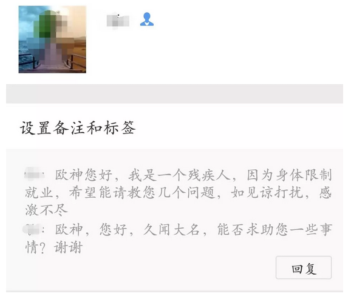

# 自媒体那些小事 \#F1610
----------------------

原创： yevon\_ou [[水库论坛]](/) 2018-03-17

自媒体那些小事 ~\#F1610~
=====================================================================================================================

 

招聘启事，第一则

 

 

一）       自媒体

 

上篇《[[社会平均工资]](http://mp.weixin.qq.com/s?__biz=MzAxNTMxMTc0MA==&mid=2651017052&idx=1&sn=ab90a6247aaef48272f07d2176eacc9d&chksm=8072194fb705905926c79469128accafa395ab5521acd7ad04427b003785c3789353604587df&scene=21#wechat_redirect)》读者留言：

封号这种事，哥哥最怕了。咖啡御免。

[[\#F1590]](http://mp.weixin.qq.com/s?__biz=MzAxNTMxMTc0MA==&mid=2651017036&idx=1&sn=003c45ede93a2132b909aad85e4c3c22&chksm=8072195fb70590496888475cd9acb4f19b7afb57a006cadf4aea972affafab769875c6fdbfc0&scene=21#wechat_redirect)骂的其实不是知乎，但写得太隐晦了，大家都看不懂。

 

反正会会期间，没什么可聊的。今天也懒得写楼市，我们写几行《自媒体》。

 

-   自媒体是什么

-   怎样写好自媒体

-   如何靠自媒体赚钱

 

"自媒体"行业和水库正文"楼市"关联不大。但也是一条生财之路。

适合青年创业。或者捞点现金，贴补家用。

 

 

 

二）       自媒体行业

 

自媒体，我们以"微信公众号"为例。

你以为它是一个账号。其实他是一整个团队。

 

自媒体的江湖，大致可以分三档。

Lv1:        月收入200W以上

Lv2:        月收入20Ｗ

Lv3:        月收入\<2W

这里面，最主要的是"内容的产出"和制作能力不同。

譬如以"直播"行业举例。

-   你打开直播，99%是一个女孩子，发愣呆呆对着一个镜头唱歌。

-   0.9%是小制作。四五个人，演绎一段内涵段子，冷笑话视频。

-   0.1%是大制作。类似跑男，亚洲歌王。

 

如果你要说"收视率"，或者吸金程度，肯定是有诸多明星，采访讲座等大事件，观众人数才会多。

但是"直播小妹"不是不想搞大型综艺，而是她真的没有这个实力。

 

 

对于"自媒体"行业，规则也是如此。

你根本不知道这是一个快速迭代，竞争已经如此惨烈的行业。

流量高度向头部集中，最终必将寡头垄断。

 

如今，你在"朋友圈"能看到的文章，和三四年前，随随便便是条狗，就能写公众号，已经大不相同。

平庸的号，难以生存。No.3,4注定淘汰。

如果你是一个细心人，你数一下，最近你打开的微信文章。它们已经越来越多地聚集在了二个区间；

1）80000\~100000+阅读。这是头部大Ｖ

2）10000\~25000，这是细分专业。

 

相对应的，自媒体已经"公司化"。

 

 

 

三）       公司化

 

咪蒙的团队，大概每个月收入300\~500W。

月收入过二百的，就我接触的，至少还有《功夫财经》《果壳网》《吴晓波频道》等。

 

他们共同的特点，在这一个单薄的公众号背后，其实是一支巨大无比的团队。

-   咪蒙35人

-   功夫财经60人

-   果壳+在行+在行一点120人

"宁南山"团队，没有50个人，我看根本下不来。

从选题，组织原始资料，写稿，润色，排版，后期推广，客服，有一个庞大而复杂的体系。

有严谨而森严的等级控制。

 

这么大的一个机构，动辄上百人的组织，他们的运作，其实已经类似于"报社"。

内部的组织流程，和一份报纸的"选材\-\--编辑"没什么二样。

也就是说，这种大型的"自媒体"机构。其实最不像互联网媒体，而是象传统媒体。

只不过少了"发行"这一个步骤。

 

而互联网的特点，应该是互动而交互。再小的个体，都有自己的品牌。

这种"臃肿"的公司，就存在了被颠覆的可能。

"自媒体江湖"第二个等级，是那种阅读量在10000\~25000之间的号。山野草根号。

这种账号，往往是在一个"亚社群"。在一个细分领域，有着自己的粉丝基础。

 

相应的，其人手，也简配十倍。

目前业内的标配是：

-   二位主笔，月薪35000\~50000.

-   一个编辑

-   一个商务

 

主笔要二人的原因，是因为一个人写不动。

假设每周2更，每个人写一篇。

即使这样的频率，对很多大V，老头子，也是无法承受的。

 

因此他们还需要"编辑"。也就是大V写一个框架。有时候甚至就仅仅是选题和主要观点。

然后"编辑"再去百度，搜集资料，润色框架，把骨肉一点点填进去。

商务是揽客，接广告的。

 

 

"自媒体"世界的第三重蚁民，是那群月收入\<10000的屌丝们。

例如，知乎有一个大热贴：《做自媒体月入上万是什么样的感受？》zhihu.com/question/52656569

 

2017年11月，张一鸣宣布"千人大V"计划。

号称"今日头条"要从知乎挖1000个V，力争给到10000元/月以上，打垮知乎的流量。

哥哥看到小丑乱舞，只能说"呵呵"。

 

 

 

四）       尾部效应

 

如果你观察"公众号"的江湖，你会发现一个奇特的效应。那就是"大家都没赚到什么钱"。

 

屌丝蚁民市场，那就不提了。其中绝大多数人，根本就没有任何收入。

99%的公众号作者，一年连3W元收入都没有。

 

 

而你观察"中端"市场呢。四个人一个团队。

一般这样"中型"的自媒体团队，一个月收入20W元左右。

但其实你扣一下四个人工资，办公场地，行政开支，税费，到最后也没剩多少钱。

老板为主笔打工。

 

 

真正赚钱的，是那些"大型"账户，以及头部账户。例如说，咪蒙就肯定是大赚猛赚的。

但是这件事，又有点倒因为果。因为"头部"账户，是因为他们优秀，所以才会成为头部的。你本身就是竞争的胜利者。

更何况，你现在养了这么多人，固定成本高昂。一旦风吹草动，只有亏得更惨。大有大的坏处。

 

综上所述，整个世道赚钱不易。

这也符合我们前几天写的"[[尾部效应]](http://mp.weixin.qq.com/s?__biz=MzAxNTMxMTc0MA==&mid=2651016951&idx=1&sn=4a80e49b12db18519134da641e1e924f&chksm=807218e4b70591f2f9915202d525e55e4c3c15a6db8fca84dcc674cf5703d9a3de3c1433c423&scene=21#wechat_redirect)"。因为一个市场，总有新的用户进来。一直等到最嫩的菜手赚不到钱了，市场才会均衡。

 

你能赚多少钱，不在于你从事哪个行业。而在于你领先竞争多少。

除非你一个人，干完了一整个团队的活，才能赚大钱。

 

世界上，还真是有这样的怪物。那就是"水库"。

 

 

 

五）       水库

 

2017.11.20，我们写了《[[水库微信号分析2017版]](http://mp.weixin.qq.com/s?__biz=MzAxNTMxMTc0MA==&mid=2651016480&idx=1&sn=c600a5c83d4fe8e1e8436c821718abd2&chksm=80721b33b7059225f842dcddb9a634cfcab43055ed9e274e2eea7593769ce7de61e5733e1291&scene=21#wechat_redirect)》\#1590，庆祝水库微信粉丝订阅超过300000.

今天是2018.03.16，我们逼近400000.

 

在过去的一年中，我们横扫了几乎所有的"地产公众号"。目前水库是地产界的超级大号，遥遥领先。

 

截至3月16日，水库的每一篇"主文"，基本都有80000阅读。

最迟到6月30日，我们有信心，主文可以做到篇篇100000+

 

（注：这个标准是包括次文的。水库做不到）

 

在过去一年中，水库势不可挡。维持着高增长，高黏度，和极高的口碑度。

你"二位主笔"，20W一个月行政维持费用，没用，被我们虐趴下。

你一整个团队，十几个人做地产公众号。没用，照样被我们虐趴下。

 

几乎做到了全国第一。一个人干完一整个团队的话，那么"水库团队"一共有多少人呢。

整个微信公众号，只有yevon\_ou一个人。

 

所以水库很赚钱。辛苦钱。

 

 

 

六）       水库的隐患

 

水库的隐患，是我太累了。我实在太累了。

每一篇"微信"文章，保证质量，消耗的时间就是6\~8小时。

 

而我同时又要维护知识星球，还有分答社区。知识星球也是每天6小时。

这意味着俺每天一"发文"，当天就要工作12\~14个小时。

而这样的工作强度，每隔二三天就要发一篇。全年无休。

 

可哥哥是一个很有钱的人呀。我又不是20岁刚毕业的大学生，极度指望这钱改变命运，也不用拼命来爬职场。

我的人生，难道不应该是躺在马尔代夫沙滩椅上发呆么。

 

随着俺越来越有钱，驱使哥哥拼命的成本也越来越高昂。

因此哥哥决定：水库要招一个助理

 

划重点，划重点，原来本篇看了这么久，居然是一篇招聘帖来的。

要求也不高，[和彭蛋蛋一样能干，吃得比她少20倍就行了。]

 

这么大的二箱子看见没有，这不是给她一年，不是给她一月，是给她一周吃的。简直就是一个人肉零食粉碎机。

无论是果壳类的，还是甲壳类的，还是隐藏宝箱类的。

 

虽然彭蛋蛋做事靠谱，找笋盘用心，写文章生动又有趣（范文见次文），但实在是太能吃了。

公司养不起，只能嫁到深圳去了。

 

言归正传，水库目前有二个空缺；

1）"双主笔"中的另一位，但估计这种人招不到，不提也罢。

2）文字助理。需要

-   有灵感，能想到话题

-   有笔力，给出框架能写出血肉

-   有耐心，校稿和排版

 

全职兼职均可，我甚至不需要知道你的年龄性别学历。纯线上隐匿id即可。

薪酬方面，水库只能提供非常没有竞争力的低薪酬待遇。

不过水库赚钱，不靠工资的。稍微指点一下，你懂的。

 

水库网友优先，能精通水库全套体系，术语者优先。小城市残疾人均可。

 \

 

具体的报名方法是：

发送一篇500字，任何题材的文字，到：yevon\_ou\@163.com，[最有趣者最佳]。

有意者会回复，没回复就别等了。

 

 

 

（yevon\_ou\@163.com，2018年3月17日子）
