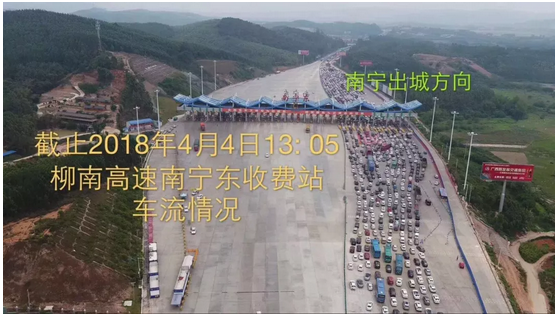
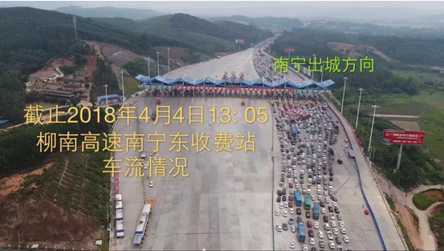

# 公路的彻底收费化 \#F1640

yevon\_ou [水库论坛](/) 2018-04-06

公路的彻底收费化 ~\#F1640~

本篇为经济学

 

听说马云爸爸刚搞出了"车牌付"。

 

 

一）       经济学

 

大概二年之前，水库写了《高速公路免费是极恶之事》\#F340。

正好昨天又有网友，在知识星球问了我一个"公路"的问题，不免联想起来。

 

这一篇\#F340，是黑色的（未群发）。

二年之前，还是"微信"的鼎盛时期。网络舆情远远比现在宽松。

放在今天，那是任何批评都不敢写的。

水库写"经济学"，吃力不讨好，行走在刀尖上。

但"科学尚未普及"实在是我们的信仰。

在整个社会科学中，对"大义""正义"的追求，才是至高信仰。一个错误政策造成的破坏，远远超过十炉钢铁。

捍卫真理，普及文明，传播正确的"经济学"。才是我们前仆后继的献身。

 

推荐文章：张是之《[[从来就没有什么政治经济学]](https://mp.weixin.qq.com/s?__biz=MzA3MzQxNTE4Ng==&mid=2651567780&idx=1&sn=0473e2cccebc7fd4f5db4abea9d1b1b4&chksm=84f079d9b387f0cf92b14597e2d5e83d700a0751befd35e1d949d7ab8d5ba983c295caf66499&mpshare=1&scene=21&srcid=0404eF8vjYN7vKQki8h7gS6b&pass_ticket=TmtMv#wechat_redirect)》

 

韦林志 提问：上图，是从我的微信朋友圈截图下来的。

假如我是司机，我遇到同样的情况，有人跟我说，前方有个出口，出了这个出口，你可以从门可罗雀的另一半边马路，占用临近的车道回家，前提是你需要为此支付80元买路钱。我是愿意为此支付的。

就是把原来的3+3车道，变成了4+2车道，以利于道路的顺畅通行。同样的，清明祭祖完成后的回程，也可以变成2+4车道。

从逻辑的角度，我觉得是可以实现的。如果逻辑的角度可以实现，那么具体如何操作，如何实现道路车道的潮汐变更剩下的就是技术的问题了。

欧大，您是我崇敬的人，我恳请您指点我的困惑:既然路的产权人是确定的，那么为什么产权人不能根据市场的需求，来决定中间那个车道的行进方向呢？

说回对于"公路"的概念，奥派的观点十分清晰；

不仅高速公路应该收费化，所有的普通公路，都应该收费化。

 

为此，我们首先回顾一下，"高速公路收费"当年的历史争议。

 

 

 

二）       高速公路收费

 

秀相十年，是"白左"的十年。

整个社会，陷入了一种癫狂。不知道在追求什么。

就好像今天欧美西方社会，整天追求"LGBT女权化"，纯粹吃饱了撑的。不知所谓。

 

秀相十年，"公蜘""小粉红"们追求的，是"高速公路免费"。

他们振振有词，从广州发一车货到北京，光高速公路费就要一万多元。

"物流成本太过高昂"

"高速公路免费利国利民"

"降低自驾游出行负担"。

 

奥派冷眼旁边，五个字："你脑子有病"。

或者按照铅笔社的说法：

 

小粉红以为，高速公路天生存在于地球上。

只不过投胎不好，在中国居然要收费。

 

 

经济学的一条铁律，也是很基本的定律："世上没有白吃的午餐"。

无论高速公路收费不收费，他的成本永远在的。

 

一条高速公路，从他最初的拆迁，土地平整，路基，硬化，桥隧，防护栏，绿化。

再到后期的保养，维护，清扫和事故急救。

这些都是有费用的。无论你视而不见，费用永远存在。

 

在德国瑞士等一些国家，号称叫"永久免费"。其实这一笔费用并没有消失。绝大多数情况下，是"财政兜底"了。

数万亿Hwy的建设费用，由政府出钱，由纳税人买单。

 

-   德国模式：政府兜底，公路免费

-   中国模式：商家修路，收费还债

 

至于这二个模式，谁更先进，谁更高明。自然是：

中国制度优越性远远合理呀！！

社会主义的先进性，优越性，难道是白叫的么。中国目前发展这么快，就是因为我们的制度自信！

目前的行情是，全世界高速公路收费：学中国。

 

为什么，因为中国符合了经济学的二个逻辑；

1）           用者付费

2）           产权人收费

 

 

 

三）       用者付费

 

啥叫"用者付费"。它其实就是大锅饭"公共食堂"的反义词。

 

以德国为例，德国的高速公路，是联邦政府基金建设的。耗费的是纳税人的金钱，平摊到每一个人头上，人人都出钱出力。

可是高速公路的"收益人"，是绝地不对等的。

 

每个人的"公路里程"，差别天差地远。

-   有的人是"驴客"，整天开了一辆破车到处跑。一年行程100000公里

-   有的人是"宅男"，他甚至可以整整一周不出门，不下楼。最多去镇电影院。

 

你说，让这二个人"平摊"高速公路费用。合理嘛。

中国的大学生，常常喜欢去陕西太白山玩。动不动坠落悬崖，然后发动几万人去搜山寻找。恬不知耻。这是一种"外部性"效应。

 

瑞士联邦政府，允诺无论居民住得多远。只要盖了房子，联邦政府就造一条公路，连到他的住所。

这导致无数居民"滥用资源"，在悬崖峭壁处盖房子，滥用政府的道路资源。往往几十公里，为他一家独有，浪费纳税人金钱。这公平嘛。

 

只要公路免费，就一定发生浪费现象。

 

在经济学中，真正的正义，从来都是"谁使用，谁付费"。

一个真正有经济学素养的人，[从来不会指望，不会祈求，也不会发动]民众"爱心泛滥"地要求"免费/降价"。

一个真正有经济学素养的人，只会呼吁"谁使用，谁付费"，账单清晰。

 

中国模式，才是全世界最先进的模式。

 

 

 

四）       ETC

 

\#F340是一篇旧文。讲的也是二年前的科技。

把这个思路再进一步延伸出去：

"普通公路"可不可以收费，

从而使得我们整个社会更公平，更平等。

譬如说，俺们这些不上班的，应该比上班的人更省钱。

 

曾经一度，我以为这事是做不了的。因为普通公路，不具备高速公路一般"二端计费，中间封闭"的特征。

而且普通公路，每一个红绿灯都很短。最长不过三五百米，如果要计费的话，就是几分钱。

 

 

北京的PE/VC圈，从来都出怪人。前几年，我见了一个中年长毛"油腻"男。这家伙正准备砸锅卖铁，把所有的资产房子卖了，投身于"创业"的狂潮中。

创业方向：ETC

 

他当时的设想，他卖的ETC设备，象一个拱门一般。每一个收费一万多。

目前的"国营"高速公路，ETC设备可以贵到二三万/个。当然，里面有回扣，但总体而言还是有利润空间的。

 

当时这家伙和哥哥聊天，正烦恼如何打入国企"腐败"的采购网。对事业摩拳擦掌。

哥哥中二病发作，直接拉住他：别做。

 

 

手机正在废掉我们一项又一项功能。

譬如以前哥哥睡到11:00，在万达广场吃个午饭，然后再看场爆米花电影。

我需要随身携带塑料停车卡，万达影城会员储值卡。

 

而现在呢，有了手机有了微信。

你直接到B1的扫码支付，输入车牌号扣停车费，开出去即可。

"影城"会员卡，也几万年积灰了。

 

ETC这么"重"的资产，客户端和服务端都需要专用硬件。我是不看好的。

说不定高速出入口，关注某个微信公众号，就可以支付了。

 

 

事情比我想象的还要快。马云爸爸，搞出了"车牌付"。

具体的做法，是先在"支付宝/微信"里面，绑定你的车牌号码。

 

然后你进高速前，用现在早已烂大街，完全不值钱的电子枪"扫一扫"车牌。

出口处，再"扫一扫"。

直接链到你的支付宝账户，自动扣款。根本不需要减速、停车。

彻底淘汰ETC这种大型而且又昂贵的设备。

 

马云爸爸终于可以刷脸了。

 

 

 

五）       普通公路收费

 

顺着这个思路，再想一下，其实技术上，我们已经具备了"普通公路"收费的方法。

南京路，淮海路，每一个红绿灯的入口，你就隔壁再装几支电子枪。

连通着大数据入口，车辆进入，开始计费。

 

一拥堵就1.3倍，上下班高峰期三倍，五一国庆五倍，周杰伦演唱会十倍。

上海居民九折，买月票套餐，每人每月前50元免费。

 

 

你车开在路上，每一米，每一秒拥堵，滴滴答答，咪表都在计费。

虽然每段费用都很便宜，几分几厘。

零零碎碎，从徐家汇开到陆家嘴，也可以收你六七元。过海嘛。

 

您如果连"公路费"都付不起，您就象《头号玩家》里的一样，无人机送外卖吧。

穷人没事就别出门了。

 

"公"路作为一项二百年寿命的单词，公字彻底退出历史舞台。

 

 

 

六）       公路收费的意义

 

"市政养护"的成本，以每年+20%的速度在递增。

而路网成本，又再是城市维护的大头。

 

"地方政府"普遍地喊缺钱，没钱。

[[他们是真没钱]](https://mp.weixin.qq.com/s?__biz=MzA4ODQ1MTM1Mg==&mid=2651403225&idx=1&sn=8a1b86901d265922879db1d4c54f65c7&chksm=8bd463aebca3eab8e7cce389e90eb98dccc7ee9241d06321a50cd32ec84de08b2ef0ab6519a4&mpshare=1&scene=21&srcid=0405Nzs0ziQgizfXSTPXYyi2&pass_ticket=TmtMv#wechat_redirect)。

因为"城市"本身就是一个Cost Center.

 

作为一个几十万，数百万人口的"特大城市"本身。

庞大的公路，路灯，警察，消防，这些都属于政府提供给民众的"免费"福利。

哪怕你这辈子一分钱"所得税"都不交，你依然是享受着"城市的基本福利"。

 

-   一打开水龙头，就有清洁消毒的自来水。

-   煤气灶有稳定的LNG供应。

-   按下开关就有电。

这是什么，这是奇迹啊！人类文明奋斗了5000年，才有50%的城市化率。

 

 

而你以为这一切都是免费的么。不，经济学的一条基石般的铁律"天下没有白吃的午餐"。

你以为自来水的生活，水龙头打开，幸福哗哗就来。

其实这背后，无数革命烈士抛头颅洒热血，blablabla......

 

 

因为"城市"本身是不收费的。地方政府不堪重负。

"路网"建设得越好，负担就越重，地方财政无以为继。

 

一个最理想的办法，就是改"免费公路"为"收费私路"。

以后每个人走在马路上，随时根据你的手机定位，从你微信账户里扣费。看你还整天逛街。 

变Cost Center为Profit Center

我知道很多人看到此处，已经快要气疯了。"公路"怎么可以收费。

那我就问问你，为什么"营改增"之后，

那么多的SB专家，念念不忘房地产税？

 

 

 

（yevon\_ou\@163.com，2018年4月5日晚）

 

芸姨说，以后我管工作日，她管周末。
