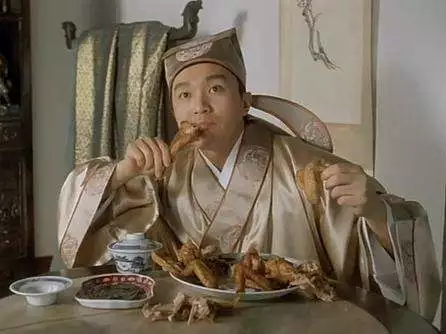
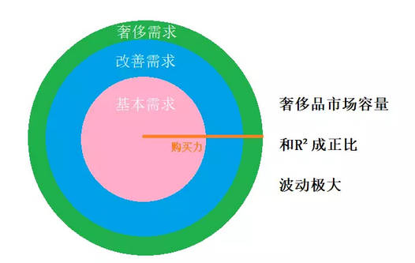

# 海草，海草 \#F1660

原创： yevon\_ou [水库论坛](/) 2018-04-11

海草，海草 ~\#F1660~
====================

 

昨天晚上没有写文章。新装了一个"抖音"。

一口气看了八个小时，一直到天快亮才放下。

一边看，一边哭。

哥哥的青春啊，都被狗吃了

 

 

 

一）       口红效应

 

为了解释整件事，我们先举一个简单例子。

假设经济不景气，你的收入，被"降薪"-20%，年终奖泡汤。请问，你的消费，会发生怎样的变化。

 

这个问题的答案，绝对不是"削减消费-20%"。如果这样回答，多半是心智不成熟的小孩子。

从Marketing的眼里，世界从来不是铁板一块的。永远是"结构化"行情。

 

 

如果你的收入降低-20%，我们把消费分为：

-   基本需求：吃饭，保暖

-   舒适需求：上馆子，当季流行

-   奢侈需求：珠宝，私家司机，豪门宴会

 

当你的收入回撤之时，你的"吃饭"变化不大，人总是需要固定卡路里的。

而你第一步砍掉的，肯定是"奢侈性"消费。

 

例如手表，钻石，限量版，这些东西，并不是生活所必需的。没有，影响也不大。因此你遇见手头"吃紧"，第一步砍掉的，肯定是这些"奢侈品"购买机会。

 

于是，收入下降-20%。

-   基本需求：变化0%

-   舒适需求：-20%

-   奢侈需求：-40%

 

在学术上，我们称之为"光圈效应"。奢侈品这种东西，就好比图中的绿色。

和半径R²成正比。

购买力稍有萎缩，"非必需消费品"立刻完蛋。

哦，你听了这套理论，若有所悟。"珠宝，洋酒，大钻石"都是劣质产业。

是不是要专注于卖馒头，大饼，才是"稳妥保险"的生意啊。

Nonono，划重点，经济景气时，光圈产品呈指数增长。

 

你在枯水期，销售额萎缩为1/100倍。

这句话反过来说，撒哈拉的雨季，销量就会翻100倍。

鎏金岁月，挥金如土的年代，非必需"奢侈品"是最大的受益者。

 

 

香港人炒股票，大家都知道买"地产股"。

香港百业，搞了几十年，搞到最后，还是"地产佬"发财。

恒生指数1/4是地产股。

 

但是，真正熟悉香港金融市场的人还知道，有一只"地产权证"股。

那是什么，是"美联中介"（0120.HK）

 

当地产市道好的时候，"中介"（包括管家）这个行业，收入是呈3次方，指数增长的。

1）           行情好时，房价较高。业绩+20%

2）           行情好时，交易量较高。业绩+20%

3）           行情好时，佣金比例较高。业绩+20%

 

地产只要稍微有点"牛市"行情，房价涨+20%，美联中介的收入，可以增长+120%的三次方。

同理，如果地产跌入熊市，美联的业绩，也会呈现如雪崩般的下跌。

 

你与其投机于房价，博"地产股"的涨跌。

你还不如下注在中介股，人称"地产权证"，更是大起大落。

 

ps. 顺便说一句。目前上海"管家公司"颇为拥挤，新进者越来越多。

表面上看不赚钱。但其实大家都在博"春天复苏"。一旦进入牛市，管家公司就会翻倍赚钱。

 

 

 

二）       楼市类比

 

把"口红效应"推演到楼市，楼市对应的物资是什么。

Bingo，是"大面积，老破大"。

 

譬如今天的上海楼市，上海市场，行情真心不算好。

限购限贷搞得太严格，成交冰冻，客源稀少。

你本来买家就少，一旦上了200㎡，总价区段上去，买家就更为稀少。

如果房价再高，甚至社会老化，堕入"老破大"领域，几乎完全无人问津了。

 

 

是不是听起来很令人泄气，完全无可救药。

呃，现在是严重枯水期，你再想想"非洲的雨季"。

几乎任何一套大户型，都是当年一手房\~开盘中最贵的一套。都是当年的局长，土豪才能买的。

 

在市场旺盛，"总价约束"不明显，梯次换房税费较低，社会攀比心理严重的阶段，大户型的价格，是远远高于小户型的。

也就是说，当地产"松绑"，限得没这么死，奢侈性消费被激发。

压抑四房的反弹，是远远优于刚需二房的。

 

 

 

三）       社会科学

 

我们把思路再延伸出去一段，进入到"社会科学"领域。

抖音我看了整整一晚上，一边看一边哭，你知道我看到了什么，我看到了"幸福"。

他们怎么可以这么滴幸福！

 

不管是"海草，海草"。

还是"少女心G，L.O.V.E"。

还是李宇春的"嘀嘀嘀，滴滴答"。

他们怎么可以这么开心。

 

每一个人，不管是梳着丸子头的小姑娘。还是满满苹果肌的少男少女。还是花痴一般，拗成S型的一字马。

他们的脸上，没有皱纹，没有烦恼，没有苦难，没有拼搏，没有压力。

 

中产阶级的生活，至如此幸福。

他们只需要右脚踮起，左脚飘移，跳"蝴蝶步"，跳踢脚舞。没心没肺地玩就可以了。

 

https://www.iesdouyin.com/share/video/6539505085951511815

让我想想，哥哥18岁的时候，在干什么。哦，那时候我好像在拼命看书。一共72册的白话版《资治通鉴》，我花了整整一年半才看完。后来又再看了第二遍。

 

当你到了20岁，就是"抖音"里面，大派狗粮，少男少女互视，画出同心圆的时候，哥哥好像还在看书。

中国计算机最高认证"系统分析员"，每年全国通过8\~10人。存量不超过100人。俺廿岁那年考出来的。

 

时光再往上拨，到了25岁，就是"抖音"里面气质御姐，穿着旗袍，跳古装"离人愁"，江湖悠悠\~饮一壶浊酒。

这年，哥哥已经背了几百万房贷。每天抬头天都是黑的，完全不见曙光，陌路负重前行。

 

 

 

我们时常谈论A8，A9，给你一千万你要不要，"想不想成为千万富翁"。

绝大多数人，都是眼睛发光。要的，要的！

 

但其实这是一个伪命题。

 

甚至可以说，整句话都是错的。

因为绝大多数人，对于1000W的理解，都是"我现在的生活不变，你再给我1000W"。

我现在吃着火锅，唱着抖音，玩得好开心，你再给我1000W。

当然要的！

而我们的现实世界，并不是这样的。

我们的现实世界，称之为"神魔皆以血饲"。

 

你想要1000W，5000W，几个亿，不是让你坐在家里，继续Happy，然后平白多给你的。

经济学的精髓，就是代价，就是放弃。

 

 

为了这5000W，你可能要象《红海行动》里的杨队长，去索马里战场，出生入死，九死一生。

你可能要象《国家赔偿》里面，坐25年冤狱。受够了苦难。

 

如果你要向哥哥学习，走楼市这条路，也是可以通的。但是20年完全没有"快乐"。

-   前10年，你几乎都在学习。你要在混沌迷惘的世界中，找出一条路径，找出赚钱的走法。别人在玩，在抖抖抖，你永远都在图书馆。

-   后10年，是刻苦的"修行"。无论是多背房贷，信用卡，信用贷，都是严重地"反人性"。负债的岁月，滋味和存款完全不能比。且严重损伤了哥哥的健康。

 

-   你以为是保留所有的快乐，再给你1000W。

-   其实是失去所有的快乐，换取1000W。

克勤克苦"司马懿式奋斗"，熬上20年，换取5000W\~1亿的财富。你愿意么。

我认为是不肯的。

 

 

 

四）       被厌弃的财富

 

我认为是不肯的。

我们这个社会，哪怕你明白告知"艰苦20年，换取5000W\~1亿"，对方还是不肯的。

哪怕70后，80后肯。

00后，10后也是不肯的。

 

 

因为"追求卓越"这种东西，也是一种严重的"光圈产品"。

随着和平的不断深入，要人民追求极致、优秀，将[越来越难]。

 

和平是"勇气"的枯水期。

将"追求卓越"的意义，贬值到了1：100以下。

 

 

 

在古代，"当皇帝"是任何一个男人的梦想。

因为古代生产力十分低下，老百姓生活在饿死的边缘。而"皇帝"意味着无穷的资源和繁殖优势。

流寇马匪，千刀万剐，值得一搏。

 

而在现代，如果你去"西方社会"深入生活过一段时间的话，你立刻会体会到，有些人真的已经"给你皇帝都不愿意做了"。

 

因为工业社会，生产力极大富余。人类只要简单劳动，就可以过上衣食无忧的生活。

每天上班6小时，多出来的时间，还可以拍拍抖音。跳跳双人舞。

干嘛要承担生命危险，追求权力呢。

 

 

现代社会，如此富足。有什么理由，让人每周工作70个小时呢。

你奋斗的结果，未必可以让你的"生活质量"获得巨大的，质变的提高。

部分A9，甚至活得比普通人还要节俭。哪怕想花，也没有专门针对A9的服务业啊。

 

在遇见狐狸精之前，从财产到生活质量的转化是低效的。

 

 

大家都听说过，沙滩上晒太阳。过来一个富翁，问"你为什么不去辛勤工作"的故事。

 

有一个富商在海边散步，见一个渔夫躺在沙滩上晒太阳，旁边放着他的渔网。

富商问他为什么不去打鱼，他说我为什么要打鱼，

富商说这样你就可以赚钱了。渔夫说我为什么要赚多点钱，

富商说那样你就可以买艘渔船了，渔夫又问我为什么要买渔船，

富商说那你就可以赚大钱了，渔夫说为什么我要赚大钱，

富商说那样你就可以和我一样在海边散步晒太阳了。

渔夫说，可是我现在就可以晒太阳啊。

 

可是，如果你把这个故事修改一下。假设生产力如此发达，渔夫只要稍微劳动，家里就能有7辆跑车，8幢别墅。

而不是7碗白粥，8包咸菜。

这样情况下，富翁再想要"忽悠"渔夫每天工作13个小时，一口气奋斗到A13，恐怕是非常非常困难的了。

 

 

从"社会科学"的角度看，"和平\-\--战乱"类似于"枯水\-\--丰水期"。

长期的和平，会抹去一切追求极致的努力。

 

任何追求勤奋，追求卓越，追求极致的BT级自制力，都是在"生存竞争"极度残酷的环境中，保证最优秀的人才可以活下来。

可是在"和平"环境中，"卓越"的价值极度缩水。就是1：100的比例。

 

 

"抖音"看得多了，哥哥极度悲观。

再过几代人，到了10后，20后手里，哪怕你告诉他"水库"的全套手法。告诉他只要照做，吃苦二十年能成富人。

他懒洋洋翻了一个身，"不要挡住我刷手机"。

（yevon\_ou\@163.com，2018年4月10日暮）
