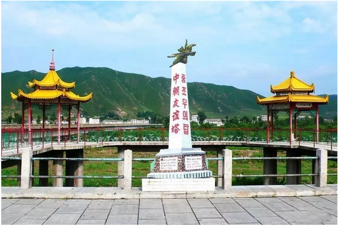

# 增长在哪里 \#F1670
------------------

原创： yevon\_ou [[水库论坛]](/) 2018-04-13

增长在哪里 ~\#F1670~
================================================================================================================

 

 

一）       消费欲望

 

前二天，哥哥被抖音虐惨了。

这二天出差，去二三线城市。朋友请吃小龙虾，餐馆里宴开一百桌，一路排出去直到江边。

蒸虾，蒜虾，靓虾，群众们吃得兴高采烈。

 

一个象哥哥这么欠扁的人，长期以来，一直困扰于一个问题："产业还可以如何升级"。

在我看来，产业是没法升级的。

譬如说吧，你坐三小时的飞机，入住五星级酒店。出入都有朋友开着破驰车来接送，包一个院子吃饭，四个服务员，餐后大家一起拿出了手机刷抖音。

你说让我怎么升级，我很满足呀。

 

 

所谓的"消费升级"，指的是让人更快乐，或者消费更多。

可是你们已经超级无敌快乐了啊。

你在二三线，白天喝茶，晚上泡汤。每天工作不足4个小时，没有房贷压力。房子超便宜，汽车也买好了，生活得象个土豪。

 

那么多人民兴高采烈地吃小龙虾，虾壳堆得象小山。你说让我还能怎么升级。

鱼翅难道真的比蒸虾好吃么。

 

经济还能怎么增长。难道要靠把房价炒高么。

单纯的高房价，并不是幸福。

 

 

 

二）       图们

 

朋友听了，哈哈大笑。

他说我给你讲个故事吧，你知道图们么。

 

图们是一个地名。东北铁路的终点站。

跨过图们江，对面就是朝鲜人民民珠共和国。

远望金色的油菜花田，还可以看见50年代的蒸汽火车喷头，迄今仍在使用。

朋友有一次去图们，面对这种异国情调，当然是要拍照的。

于是他调好了光圈，请身边路过的一位中年男士，穿着风衣戴毡帽，面容消瘦，一看就是知识份子，帮他拍照。

对方说了一句，他终身，终身都难以忘怀的话语：

"难道，这个就是传说中的照相机么"！

 

 

哐当，哥哥手里的小龙虾掉落在地。

"我读书少，你不要编段子骗我"。

 

是真的事情，这一位40岁左右，温文儒雅，明显处于中产阶级，且受过一定教育的男士，真的从来没有见过照相机。

不仅单反，微单没见过，连普通的数码相机也没见过。

因为他问的第一句话是，"可以直接对着人么"。

 

然后朋友耐心地教他，这里按一下按钮就可以，手不要抖。

该男士拍了照片，兴高采烈，手舞足蹈地走了。

 

 

朋友撕了一只蒸虾，再嚼了二个虾球。

"美国参议员，可能是全世界权力最大的人"。

"可是你知道，100名参议员之中，没有护照，从来没有出过国的人，占多少"。

"大概是90名左右，占90%"

 

 

这个世界，并不如同你想象的一样。

你这家伙，见抬头二个蓝字。高亮"欠扁"。

 

等吃完这顿小龙虾，你跟我们到后巷走走。

中国那么大，十三亿人口。有多少人吃过小龙虾。20%，还是50%

错，因为"盱眙"小龙虾产量有限。你觉得热火朝天，家常便饭，其实全中国吃过小龙虾的人，不足1%

现在涨价这么贵，178元/盆，以后这个比例，可能不足0.5%

 

你到后巷去看看，有厨娘，有洗碗的，倒泔脚的，还有每天早上4:00送菜的。

你以为"不认识照相机"是一个笑话么。你错了。

你问问这些人，我随随便便抓一大把人，这些人没见过照相机，没见过智能手机。这还是在城里，不是在乡下。

 

 

你所以为"习以为常"的生活，其实根本不习以为常。

你以为没事随便飞，出入SPG酒店，买车不看价格，小龙虾算低档消费，iPhone
X算低档手机，国际学校算低档教育。

其实这些事，对于中产阶级来说，都已经是"奢侈性消费"了。

而对于真正的穷人来说，那是"传说性消费"。

 

真正的穷人是什么。妈妈打工一年，带回去给儿子补身体的生日礼物。

是什么，是一瓶可口可乐！

 

 

 

三）       消费升级

 

消费升级是什么，消费升级就是每一个中国人，都可以象水库一样生活。

 

你没事坐着喷气式飞机看鸽子，去香格里拉闻香水，手机一年换一个，日料韩餐牛排法式泰餐燕翅鲍轻车熟路。

当曾经"富人"的生活，全国人民普遍可以享受到了，中国就强大了。

 

 

普通人容易犯一个错误，人类很容易高估"新"的东西，而低估"普及"的东西。

譬如辉瑞公司一款新药，导致股价暴涨翻倍。而其实占销售额还不到10%

马斯克回收火箭，被吹为经营之神。但其实Tesla严重亏损，已经到了无以为继的地步。

 

对于"经济增长"，绝大多数人犯的是同样的错误。

几乎任何一个上海人，都有过小时候"赴酒宴，吃大餐"的记忆。

五星级酒店，高档消费，见过猪走路的样子，知道西餐三把刀叉的先后顺序。

 

因此当我们评估"酒店业""餐饮业"的时候，非常容易低估他们的成长。

"这些东西我们小时候就有了，几十年没有变化"。

 

 

而事实情况呢，上海一直到1988年，才出现第一家外资五星级酒店"静安希尔顿"。静安饭店的清炒虾仁，一度曾经是上流社会的接头暗语。

在当时，"五星级"酒店，是极度稀少，仅属于少数有钱人，和少数时间去的地方。

 

而到了2017年，上海的五星级酒店超过70家，客房翻了100倍。

"豪华酒店"普及面超过几十万人，普通人也可以轻松负担。

"酒店"虽然没有进化，可是"酒店业"的GDP却翻了几十倍。

 

科学的大规模普及，和科学一样重要。

 

民用航空领域，波音737面世于1964年，迄今已有超过50年的历史。

作为一名"diss-man"你当然可以说，当你很小时就坐过飞机了。到现在消费也没有升级。

 

可事实情况是，中国的民航业，每年都维持着二位数的增长。现在全年已超过5亿客流。

消费虽然没有升级。消费者的"渗透度"却在不断增加。

 

 

以前麦肯锡曾有一个笑话，"每个中国人，每周多吃一只鸡，中国的GDP会增长多少"。

会增长多少，你算呀。

 

上个月我写了一篇文章《[[为什么滨州那么穷，为什么香港那么富]](http://mp.weixin.qq.com/s?__biz=MzAxNTMxMTc0MA==&mid=2651016977&idx=1&sn=3a55bc5f752ec26d49e51ce2969dbb77&chksm=80721902b705901471bfa265b21daf60549c7db835c3ba5fa2f0b7971fb271f077648d9d7eb4&scene=21#wechat_redirect)》，里面引用一个数据，"月收入超过3500元，就会开始情感化的追求"

下面一群SB，纷纷留言，"是不是少打一个零"。

 

没有少打啊。你自己算算，3500 \* 12 /6.28 = USD 6680

"人均GDP"7000美金，我们从小就听着的"中等发达国家门槛""中等收入陷阱"，原来就是每月3500元啊！

 

 

 

四）       第三次工业革命

 

我们设想一下，一个上海"白领"的生活。

他偶尔吃鸡，每个月消费10000元，家庭消费每月30000元（含房贷）。

不是很频繁地，可以出国旅行。积攒一年，买个包包。

日子过得苦哈哈的，很多人都要抱怨含辛茹苦。

 

这样一种生活，如果换算成美元。其实他的消费是：30000\* 12 / 6.28 =
USD57300.

你已经超过了70%的美国家庭。

 

哪怕完全没有任何新的科技。

只要全中国人民，都可以象京沪白领一样活着，中国的GDP会是美国四倍。

 

 

那么，可不可以每一个中国人，都象京沪白领一样地活着呢。答案是可以的。

人类的生产力，迄今大约是第四次工业革命。

 

-   第一次工业革命：煤炭，纺织

-   第二次工业革命：电力，钢铁，GDP　\$10000

-   第三次工业革命：电子，汽车，GDP　\$30000\~50000

-   第四次工业革命：材料，生物

 

前三次工业革命，中国已处于"完全掌握""严重供大于求"的状态。

如果把中国一个个省，视为独立经济体的话。

则各省仅仅凭"吃透工业3.0"，就可以达到人均GDP二三万美金的地步。

 

而中国是一个"均一市场"的大国，资源可以在国内自由地调度。dT\>0

这意味着中国比"小国分立"还要更富一点。人均只会更高。

 

人均10000元工资，就二万GDP了。

很高么，不难的。美团外卖的"三星骑士"，也有六七千。

 

 

 

五）       席卷

 

中国目前的状态，是一部推土机。

我们只要把越来越多的人口，越来越多的地级市，捆绑到"现代化"这辆战车上，国力自会增长，GDP自会增长。

 

西学东渐，始发于英伦三岛的"工业革命"，诞生于英国。

逐渐传递到西欧法国

逐渐传递到中欧德国

逐渐传递到斯拉夫俄国

再传递到了远东，中国

再传递到了非洲和中亚国家。

 

对于中国也是一样，改革开放最早到了沿海地区，广东江浙北京。

第二波，南京合肥武汉郑州。

第三波，西部和内陆山区。

中国正迅速地迈出中古化，迈入现代化。

 

从某些意义上，我对于中国成为一个超级大国，并没有太多疑窦。

你甚至都不需要创新。

你只需要普及科学即可。

 

 

 

（yevon\_ou\@163.com，2018年4月12日晚）
