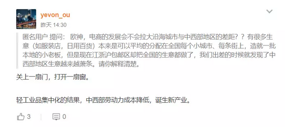

# 同化在哪里 \#F1680
------------------

yevon\_ou [[水库论坛]](/) 2018-04-17

同化在哪里 ~\#F1680~

 

延续上篇《[[增长在哪里]](http://mp.weixin.qq.com/s?__biz=MzAxNTMxMTc0MA==&mid=2651017290&idx=1&sn=c398a1588317d6253bbdfe9a0c2729c8&chksm=80720659b7058f4f7a2c16f9c1e78cb0d77dfc05ba50a223f8932c85f631d76d95457f8f650a&scene=21#wechat_redirect)》

 

消费普及，而非消费升级。

 

 

一）       容量

 

上一篇中，我们讲了月薪3500，就是年化GDP \$7000.

中国只要象美国一样，每天能吃三只鸡。中国就能成长成超级大国，世界第一。

 

关于"增长"这种事，很多人总难免心里嘀咕。

例如京沪白领，就总是头疼"内需"不足。几乎所有开工厂的人，都在喊"销售难卖"。

增长十倍，实在很难想象啊。

 

 

在"老派"人士的脑海里，他们长期囿于一种教科书式的写法："帝国主义生产过剩，为了争夺倾销市场，占领海外殖民地。并因此爆发世界大战"。

 

在老派人士眼里，他们是有一个"市场"的概念。而市场的容量，总是"计划"的。例如中国的女装市场，洗发水市场，冰淇淋市场。

市场的"容量"是有限的。各大商家，现在已经打得你死我活。份额增加1%都非常困难。

"京沪"想要获取进一步的增长幅度，绝无可能。

 

 

另一种常规错误的观点，则是"吸血观"。

吸血观认为，沿海的崛起，是建立在对内陆"吸血"基础上的。

是内陆廉价的矿产，人力，被沿海深度加工之后，再"倾销"回内陆市场。这是一种"帝国主义\-\--殖民地"经济关系。

 

门户打开以后，沿海廉价的商品蜂拥而入。淘宝发达之后，全国的轻工业小商品市场，集中到了浙江。

内陆连塑料桶都没得做了。岂不是全线扑街。

"中国崩溃论"悲观学者眼中，目前的"掠夺式经济"。也达到了尽头，不可能获得进一步的增长。

崩溃也是必然的。

 

在奥派眼里，计划销量和商品倾销，都是以上全错。

 

我们的教科书，长期以来，乱七八糟的东西太多。

凡是帝国主义，必然痛斥英法的罪恶。凡是南北贸易，必然是发达国家剥削殖民地。

 

中国古代史上，传统的"中央\-\--地方"关系又是不对等的。

在封建王朝中，每征服一个省，就意味着多一个省的税负。对于内陆省份，是完全剥削君临关系的。

 

因此中国人在"经济学"的理解上，很容易犯错误。他们想不懂"经济发展"从何而来。

 

 

 

二）       生产

 

谬误在哪里呢。他们没有看清楚问题的实质。

"现代化推土机"。工业革命由英伦发芽，从沿海省份向内陆扩散的过程中，到底带过去了什么。

 

带过去的是"科学"。

免费的是"科学"。

 

全套的煤炭挖掘技术。以前人类不知道煤的作用，让它在地底沉睡几亿年。

而挖煤以后，煤炭可以炼钢，可以做化肥。生产力迅速地增长了起来。

 

你如果观察"剥削"。整个非洲，最富裕的"首都"全部都位于沿海城市，而内陆依然生活在原始社会。

白人"剥削"了非洲人四百年，不停剥削的结果，是和文明世界接触的沿海口岸，全部都富裕了。

从来没有"剥削"的内陆国家，例如蒙古，土库曼斯坦，依然贫困无比。

 

 

对于中国的内陆省份，原理相同。"西风东渐"，真正带领内陆腾飞的，其实是"科学"。

设想一下，把中国内陆18省，视为一个个独立的经济体。

先完全封闭交通，断绝"省际贸易"。

 

那么，只要科学"完全让渡"。每一个省份都充分掌握了煤炭，炼钢，汽车等第二，第三代工业科技，则这个省份不会太穷的。最差也是个捷克，斯洛伐克。

一个省份哪怕完全隔绝贸易，也可以活到人均RMB 2000的水准。

 

 

然后，在"小省林立"的基础上，我们有一个全国性的"十亿统一大市场"。

资源，可以在全国的范围内，重新流动，重新调配。dT\>0

中国的未来，一定是比欧洲更富的。

大国重器。

 

在真正的经济学中，根本不需要担心"市场不足""内需不足"。

我们跑到内陆省份，并不是倾销商品去的。并不是要把廉价的轻工业产品，卖给内陆省，并逼得他们无路可走。

 

我们到内陆省份，是"传播科学"去的。

无私地，无藏的，尽量地把沿海省掌握的"工业革命"2.0，3.0科技倾囊相授。

 

等内陆省份，也充分掌握了制造"华晨宝马"的技术。

他们自然有很多GDP，自然有很多营业收入，自然有居民购买力。

 

 

 

三）       交通

 

听起来十分美丽的故事，也很感人，充满了善意的"忽悠"。

怀疑论者会说，这么好的事情，为什么以前没有听说过。

 

中国从90年代开始，进入了"工业化·现代化"进程，在向内陆"传播科学"的过程中，它主要面临三个困难。

1）  物理困难

2）  人力困难

3）  忠诚困难

 

首先第一个，是物理困难。

这二年高铁造得有口皆碑。最早的时候，从黑龙江坐火车到上海，需要五天六夜。

而现在全国任何一个省会（除拉萨）去北京，最多不超过24小时。

 

高铁是干线，毛细血管方面，有"村村通公路"。

支线方面，地级市个个通"高速公路"，还差一点完成。

 

 

1937年，抗日战争爆发。日军暴行，中国是全世界战死最惨重的国家。

国民政府倾尽全力抵抗，一寸山河一寸血。

可是战后统计，中国的动员率呢，仅仅只有3%

（德意志20%，日本15%）四万万人口，潜力完全没有被调动开来。

 

因为中国名义上，是一个国家。但其实是数以十万计，散落在华夏各地的各个乡村。

名义上有四万万国民，但是大城市没几个。

国民政府可以征粮，征税，征兵的据点，也并没有深入到毛细血管。

 

当"工业革命"来临时，这些人口其实是"无效"的。1991年时，西方分析师认为，中国的"市场消费力"还不如一个荷兰。

 

在90年代初，中国的"工业化"是点状的。能进入"现代社会"，仅仅只有深圳，东莞，上海，苏州等少数几个工业"特区"。

 

 

2000年以后，中国进入了"二位数"的强劲增长阶段。

一个原因，是中国的钢产量上去了。

钢产量上去以后，就可以造铁路，造高速公路，村村通公路。

再加上汽车业的大发展，终于可以有几亿人口，被纳入到"现代化推土车"之中。

 

 

 

四）       人口

 

内陆"开化"的第二个决定性因素，是"人口"，或者说"人力资源"。

 

有时候我们一条公路拉过去，一条高速公路建设，就可以迅速地拉动GDP，就可以迅猛地发展经济。

有时候，却不可以。

区别何在。

区别在于，在山的那边，有没有一群高素质勤奋的但却受阻于交流的人口。

 

 

你譬如说吧，水库最近在招人。生意越来越大，靠谱人才难觅。

水库最需要的，其实是"天资聪明苦大仇深坚毅刻苦因为家境贫困不得不中断学业放牛种菜身残志坚"的"高中"生。

 

我不需要你"大学生"，尤其不需要博士海归。大学生心理期望太高，眼高手低不配位。

我只要你高中生就够。非常聪明的人，仅仅因为"家里贫寒"，不得不缀学放牛。

我把你从老家带出来，你一辈子感激我。

 

这种人有么，越来越难找了啊。

90年代"拉过一条公路，解锁一窝凤凰"这种情形是越来越难找了。中国的人力资源潜矿，正在枯竭。

 

 

有一些地级市，他其实非常非常容易发展。

发展的真谛，既然是"传播科学"。你自然是要有这个能力，承接科学。

 

部分省份（或东南亚国家），他们拥有大量的，年轻的，勤奋刻苦的年轻人，积极向上，渴望出人头地。

这种地方，只要职场教育+投资扔下去，很快就成为了发达地区。

 

例如，你花几百亿造个汽车厂。在当地招聘大量的年轻工程师，加以培训。

沿海地区，经济迅速发展。

20年后，甚至打得老东家外资企业，找不着牙。

 

 

五）       同化

 

你传授内陆以科学，内陆经济腾飞。

交通+人口+忠诚，第三个因素，是"民族国民性"。

 

 

中国之所以可以强劲发展，中国的"现代化推土机"拥有广袤无垠的腹地。模式一旦确立，只要一圈一圈向前推进。

一点没有欧洲小国的"天然边界"困扰。

因为我们是单一民族国家！！

 

中国现代化，说来说去，绕不过去的一个梗，我们是"单一民族，单一国家"。

中国内陆廿六省，我们讲的是同一个语言，同一个血统，同一个文化。

 

大家看的是一样的春晚，一样的"起点中文网"，一样的杨幂杨颖范冰冰。

一样的三皇五帝，一样的驴肉火烧，一样的同仇敌忾。

 

这使得中国在生产力"内延"阶段，成本非常非常低。

我们既不需要处理八国语言的沟通问题，也不需要规避各种种族的宗教忌讳。

 

哪怕连"勤奋程度"，各省也是差不多的。国民性相同。

这意味着生产企业，只需要小幅地改动流程技术。

消费品，同一台小米手机可以卖遍全国。

 

（后面还有1500字，咖啡危浓，请回复\#F1685获取）

 

 

（yevon\_ou\@163.com，2018年4月16日暮）
