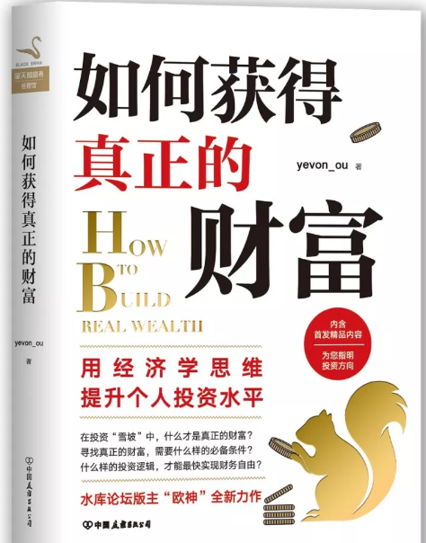

# 读书时代的消亡 \#F1690
----------------------

原创： yevon\_ou [[水库论坛]](/) 2018-04-25

读书时代的消亡 ~\#F1690~
========================

落后的教育模式

 

 

一）       前言

 

大约一年之前，也就是去年的这个时候，水库写过一篇文章《[[书籍时代的消亡]](https://mp.weixin.qq.com/s?__biz=MzAxNTMxMTc0MA==&mid=2651015799&idx=1&sn=e8078b24a04e9bf1a526a2f7f838618c&chksm=80721c64b70595728c720106f1f7fc508fd5f704412fdc1bb98be42ed39db439104f5e172b72&scene=21#wechat_redirect)》。

该文啰啰嗦嗦，痛斥了一顿"书籍"这种不合时宜的，中古时期的产物。并预言"读书"最终会被时代淘汰。

 

但[[\#F1060]](http://mp.weixin.qq.com/s?__biz=MzAxNTMxMTc0MA==&mid=2651015799&idx=1&sn=e8078b24a04e9bf1a526a2f7f838618c&chksm=80721c64b70595728c720106f1f7fc508fd5f704412fdc1bb98be42ed39db439104f5e172b72&scene=21#wechat_redirect)，其实却是一篇广告。卖的是水库第一本书《[[中产阶级如何保护自己的财富]](http://mp.weixin.qq.com/s?__biz=MzAxNTMxMTc0MA==&mid=2651015300&idx=1&sn=b33d804f1c0495327b3e899e83574930&chksm=80721e97b70597819a2451d5eefffa736cb7a0c4929e067e9b239df0c6edd1883315ab658744&scene=21#wechat_redirect)》。

狂印了九次，去年中国"财经类"销量No.X。遥遥领先第二名。

 

今年这篇\#F1690《读书时代的消亡》，其实也是广告。

猜对了，卖的是第二本书:《如何获得真正的财富》

 

题目取得很夸张，很耸人听闻。其实就是yevon\_ou的"2017年文集"。

2017年水库发了123篇文章，精选60篇出书。

 

干货有没有呢，有的。

 

这次出版社小编，抱着我的大腿。让我无论如何提供几篇"独家文章"。

"大哥，微信公众号都有的话，谁还买书呀"。

 

我抱着出版社老总的大腿说，"给你10000字独家。魏姐，我只有一个要求"。

"把我那篇《[[拜金女郎]](http://mp.weixin.qq.com/s?__biz=MzAxNTMxMTc0MA==&mid=2651014809&idx=1&sn=5f6aadb6fb4c54249fbe9f4d087728aa&scene=21#wechat_redirect)》单独印一本小册子"。

"难保有女高中生，寝室间传阅呢"。

"能救一个是一个"。

"滚"

 

好了，购书链接在这里：

京东：item.jd.com/12348516.html

当当：product.dangdang.com/25261641.html

 

在深圳还有一个新书签售会。

时间：2018.04.29 13:30（本周日）

地址：深圳中心书城

费用：免费

 

 

 

二）       读书时代的消亡

 

"书籍"是一种即将被淘汰的商品，人类未来的文明，外星人拍摄的镜头，应该是完全没有"书"的。

延伸出去，其实"读书"，也是一种即将被淘汰的产品。

 

 

你设想一下，孩子"读书"的主要模式是什么。

在中国，"读书"的主要模式，往往意味着有一位教师在讲台上讲课。几十位学生，在台下乖乖听课。

 

可是，你不觉得这是一件非常荒谬的事么。

为什么你需要一位老头子，在讲台上念诵呢。录一段视频岂不是更好。

 

 

"教育"从远古走来，孔子被誉为中国最伟大，最杰出的教育家。

在孔子时代，那是没办法。

当时甚至都没有书，"学富五车"指的是竹简装满五辆车，每次出行都让佣人推着，炫富。

知识含金量，还不如今天一部Kindle。

 

中国一直到明代，出版业都不发达。

当时的物价，一本《论语》，就可以卖到数两银子。集齐全套《四书》，怕要卖了你爹的良田。

因此古代的学堂，只能去学政那里，听老师念诵。"图书馆"都成了高档设施，全国只有天一阁，玉海楼，五桂楼等寥寥几处藏书阁。

 

 

但是工业革命之后，人类文明急剧发展。

德国人海德堡改良了印刷机，"书籍"的价格，以肉眼可见的速度在下降。

 

中国进入工业革命的时间虽然晚，哥哥读小学时，老师们还在鼓励用高年级学生留下的旧书。

可是等哥哥读初中时，所有的教材，课本，已经廉价到十几元一本。早早地，你就可以把所有课本买齐。

 

 

等你上初二时，你已经早早地把初二，初三，高一二三，所有的数学物理都看了一遍。

老师讲什么东西，你早就知道了。

你觉得很无聊啊。为什么老师要把已知的知识，全部再念一遍呢。

 

我初三考高三，就可以考全市一等奖了。

 

 

 

三）       教育视频

 

在我看来，"上大课"或者几百人坐在那里听老师讲，是一件完全没有意义的事情。

电子科技如此发达，为什么你不能把"老教授"的音频，录成录像呢。

 

全国几千几万所高等院校，为什么要请人力教师，口干舌燥地再讲一遍呢。

你完全可以买个投影仪，大家排排坐。

 

我每次去南苑机场坐飞机，候机楼永远在放马云爸爸的"成功学"演讲。

录像技术，远远比现场"讲课"更先进。

因为你可以穿插很多特技效果，可以旁征博引，可以有音乐有煽情。

一篇"马云讲座"可以拍得象Discovery大片一样。

 

既然视频技术已如此发达，我们为什么还需要人力去"念诵"课本呢。

你完全可以在"中央厨房"烤好一份，然后分发给各地。

 

这个趋势，就象是电影出台了以后，迅速地淘汰法国戏剧一样。

因为再好的戏剧，始终都是小剧场，预算经费，观众有限。

只有电影，才能拍得出气势磅礴的大型场面。才能有飞车，华服，爆炸场面。

这在Art History上，是无可挽回的里程碑。

 

我们只需要数家公司中央服务器，定时更新视频即可。

所有学生下载，观看视频。

学校也不需要了。回家都能看。在山村，聚在电线杆下蹭Wifi的杀马特们，也能看。

 

 

 

四）       学校

 

那么，"学校"还有什么用呢。除了体育课，社交课等"武课"之外。

文课，在我看来，主要是三大功能：

 

1）           考试

2）           答疑

3）           战略

 

如果让我来主持教育改革，

我会把所有的课时，

全部都改成考试。

 

对的，一个学期20周。20周全部都是考试。一堂课也不上。

孩子，我知道你委屈。

别哭，别哭。

 

家对面新开了一家教育机构，举行砸蛋抽奖活动。

有个小孩砸了一个特等奖，主持人大声的说出特等奖的奖品，一年的免费课程。

 

本来好开心的孩子当场就哭了，底下的孩子拉着家长就走，没一分钟，一半人都走没了。

 

 

在我看来，"教+授"这种事，是根本没有必要的。

演讲如果不能结合新闻，基础学科永读旧稿，看录像即可。

每个孩子，都乖乖地给我回家看录像。别来这里，耗费老子时间。

 

然后呢，重点是"考试"。

一个学期20周，我宁可只要一半的课时。10周，就是10次考试。

考试的结果，可以甄别你有没有"用心在听"。

 

 

我准备N份试卷ABCDEFGH，难度依次递增。

我看你能做到哪一级。哪一卷恰好考到80分。就在那卷停下来。

回到至关重要的环节，增值服务的重点：

"问答"

 

-   "这份卷你80%懂了，20%不懂"。

-   "哪些问题不懂，为什么不懂"。

-   "当时你做这道习题时，你是怎样想的。你为什么判断AC和BD是平行线"。

 

问答才是"手把手教"的环节。"问答"是一个1对1的服务。

收费很贵的，几百元一个小时。

老师完全针对着学生的弱点，针对着学生的掌握程度，度身定做地解决他的思维盲点。

 

 

 

按照这样的"教育模式"。其实我们的教师，不是太多，而是太少。

这种"考试\-\--问答"消耗的教师人力资源，远远大于传统的"授大课"方法。

 

"授大课"是在低资源时代，当时的人力资源，知识份子都很少。

所以才采取粗放式的方式，培养"低质量"的苗子。

 

目前的教育改革，有识之士都在喊"小班化"，很多国际学校，已经缩减到12\~14人一个班级。

但是再小的班级，又哪里小得过一对一呢。

 

"导师\--学徒"式的辅导，才是真精华。

 

 

 

五）       名师的价值

 

教师不是让你来"念稿"的。

《围城》里的克莱登大学方鸿渐，肚子里面没货，因此上课的时候，就拼命地抄板书。往往二页黑板写完，撑了半堂课。

这样的教学质量，可想而知。

 

"教学内容"完全可以靠视频解决。古语说，教师的职责是"传道，授业，解惑"。

放到今天，就是：

1）           考试

2）           问答

3）           战略

 

其中，"考试\-\--问题"是一个循环。老师不断试探你的深浅，补齐你的短板。

而"战略"是什么呢。

战略，是你的"未来"。

 

老师只能带你到这里，后面的路，得靠你自己走下去了。

但是我可以大致告诉你，路径在哪里。

 

好比现在的"知识付费"，很多教育界的人士，对此不屑一顾。并蔑称叫做"碎片化阅读"。

在知乎Live中，也是吐槽一地。你花钱买了无数知识，似乎每一条都有用。合在一起，却没有任何帮助。

 

这里面的关键是什么呢，关键是"战略"。

你缺乏一个框架，赤橙黄绿青蓝紫，七种色彩拼成一股白光。

 

而不是赤橙赤橙赤橙，弄得乱七八糟。

高等级的框架，就需要导师帮你设计了。类似于"博导"。

 

 

 

六）       互联网时代的教育

 

这次大伙捧场，让我出版第二本《如何获得真正的财富》 

就我个人而言，我认为这本书是一点价值都没有的。（出版社小编虎扑过来，抱住大腿）

 

任何静态的知识，都是没有价值的。

文章，我们都是发在微信公众号的。一鸭三吃，同一份资料，你通过纸媒，音频，剪辑，反反复复重复卖，这种事一点意思都没有。

 

在我看来，真正有价值的，永远都是"问答"。

赚钱本身就是一场考试。随着你买第一，二，三，四，五六七八套房子，难度越来越大。考试越来越难。

你永远会有大量新的疑问，大量没掌握的技术，是书本上"没有"写到的。

 

因此我很高兴地，在书的末页，加上了"知识星球"的二维码。

您掌握了书本知识，但在实战中还有很多困惑。

付费来问啊。

 

 

长远看，水库还会增加"配置咨询"的产品线。目前扔在筹备中。

好了，下单买书吧。

 

 

（yevon\_ou\@163.com，2018年4月24日晚）
