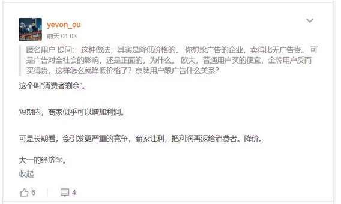

# 携程提价，该不该谴责 \#F1700

原创： yevon\_ou [水库论坛](/) 2018-04-30

携程提价，该不该谴责 ~\#F1700~
==========================================================================================================================

 

本篇为纯经济学

                 

经济学太复杂，政治学太复杂。

你不懂的啦。

 

 

 

一）       大数据

 

这二天一个新闻，是携程，滴滴，京东等IT公司。

利用"大数据"杀熟。

 

好比你订一家酒店，你是钻石金牌客户，信誉良好。

你打开App一看，400元。

转手换你老娘的手机，从来没有装过携程，从来没有信用账号。银牌客户一看，300元。

 

"大数据"交给科技公司的结果，并没有因为你的忠诚，长期使用而受益。

反而因为你的直爽，信任，高额积分，被狠狠宰了一刀，鲜血淋漓。

 

事情一经披露，媒体哗然，舆论哗然。

口诛笔伐，当然是应有之意。屌丝订单，多了一个心眼，货比三家，互相交流哪家公司更为诚信，煞是热闹。

 

更有"仗义执言"的媒体，大声呼吁，"政府要管管了"。

一定要遏止商家的不良行为，为市民监督，守护价格中的漏洞。

 

 

我们要说的，就是这些"仗义执言"的文科生小编。

他们是人渣。

是SB

是以上全错。

 

 

 

二）       竞争

 

我们要说的是，携程的偷偷加价行为，其实是降低票价的。

这是一条非常重要的结论。

经济太复杂，政治太复杂。太复杂的社会科学，根本就不应该让外行人品头论足。尤其不能让一腔热血的"社会新青年"卷入进来。

 

 

对于这个结论，很多人表示非常非常地难以理解。

假设社会上有一个A，一个顾客B。

-   A非常谨慎，货比三家。

-   B大大咧咧

 

最初的时候，携程公司给A和B的定价，都是100元。公司收入200元。

可是在"大数据"的加成之下，携程可以偷偷地给B涨价。B很粗心。

-   A定价100元

-   B定价104元。

 

 

在这样的算法下，"携程"公司的总收入是204元。

从消费者的身上，狠狠又搜刮了一笔走，发了大财。是不是这个道理？

 

如果你这样回答的话，你小学政治课没及格。

初中语文没及格

高中数学没及格。

 

 

让我们再想一想，小学政治课，开篇第一课是怎么讲的，"各行各业都有平均利润率。利润太高，会导致竞争对手加入，并摊薄利润"。

 

携程的确是可以在"价格"上面做手脚。消费者是无知的。就好比哥哥在狗东上面买东西，1000元以下胡乱买，从来分不清楚实惠和价格。

有时候买个很酷的加湿器，过二天"买一送一"了。搞得我很崩溃，一度怀疑消费观。

 

天下商品那么多，十万件商品货架。消费者是肯定斗不过商家的。

 

 

但是，"有人"可以算得清楚。"有人"是谁：

-   竞争对手

-   华尔街报表

-   自己企业内部高管

 

全世界最了解Carrefour的，一定是Walmart。

货架拼货架，采购拼采购，刺刀见红。每一个Walmart货管，都可以清楚地说出五公里内其他超市价格。

 

华尔街的基金经理们，鼻子比狗还灵敏。毛利率的轻微波动，都躲不过他们眼睛。

 

另一个高度了解你的，是你企业内部的自己人高管。

 

 

如果携程可以通过"大数据"偷偷加客户的价。

第一个发现bug的，一定是阿里飞猪，腾讯的程序员，美团旅游。

 

事实也的确如此。当媒体还在懵懂打听时，业内"心照不宣"的技巧，早已经不是携程一家。而是京东，滴滴纷纷跟上。

 

能克制奸商的，只能是另一个奸商

 

 

同行才是最懂同行的。手下人的高管独立背叛，才是最懂你业务的。

奸商们竞争的结果。马克思主义小学课文再背诵一遍："竞争加剧，利润摊薄"。

 

-   你以为，大数据之后A=100，B=104，公司共收入204元。

-   实际的情况是，A=98，B=102，公司的收入还是200元。

 

竞争会把价格打下来，暴利并不能持续太久。

  

一个推论，一定会产生负利润行为。

 

三）       竞争的结果

 

集装箱是人类文明的天才智慧。集装箱极大地促进了海运，国际贸易普惠全人类。

发明集装箱的那个人\-\--他破产了。

 

 

你以为大数据，可以甄别出"懒散"的B。公司可以问B收104元。

但实际情况是，阿里+腾讯+美团+携程+京东，会打价格战。

价格战的结果，把利润又返回给了消费者。

 

公司最终的稳定收入，绝不会是204元。

大概率还是200元。

这个值是锁死的。永远不会增加的。

 

消费者剩余，是属于消费者的。

奥派的入门课啊。

 

"大数据"真正结果是：

-   之前，A付100元，B付100元

-   之后，A付98元，B付102元，总和200不变

 

携程的价格歧视，其实是消费者之间的"利益再分配"。

A剥削了B

 

屌丝剥削了土豪。

免费网游玩家，剥削了付费网游玩家

 

 

 

四）       生产力

 

而这件事情，是大好事。dT\>0

 

奥派喜欢举"你有一个苹果，我有一个梨"的故事。

蘋果换梨，物质并没有增长。而幸福和社会总福祉却增加了。

 

 

同样道理，对于企业，企业的收入永远是200元。企业不能多收，多收会被竞争打回来。

但是同样的收费，A=100，B=100和A=98，B=102，二者的效果是不同的。

 

 

一个最典型的例子，最初的网络游戏，例如"魔兽"，走的都是"月卡"制度。

你买一个月的会员35元，买半年好像是180元。

无论你是初级菜鸟，还是死忠骨灰。二者的收费是一样的。

 

但是渐渐地，游戏公司学聪明了。现在的"网游"，几乎清一色的都是"免费"的。

99%是免费的，1%的付费用户。

靠这1%的用户，撑起了全部的成本。

 

 

这是一个再伟大不过的创举，所有的人，都玩得很开心。

整个游戏市场，扩大了10倍都不止。

 

因为同样游戏公司1000W元的收入。你问屌丝收，和问土豪收，其消费感受是不同的。

屌丝只能负担3元的网吧费用。一个月拿35元出来吃鸡，感觉就很痛苦了。你看Steam上，无数吐槽游戏太贵的知乎。

 

但是土豪不在乎。买一把屠龙刀，土豪可以充值好几万进去。

只要玩得"爽"，关键是游戏里，一个打100个的快感啊。

 

 

同样道理，我们目前的很多价格平台，它是无法维系的。

例如"文峰"洗发店。剪吹洗一个小时，他才收你30元。

上海的人力如此高昂，再算上店租，无论如何活不下来。

 

但是店里可以卖"美发套餐""养护套餐"，哪怕只有1/10的客户会升级。

靠这些高利润的升级产品，才能让平民30元理一次发。

 

 

如果我们仔细观察，有一个很有趣的规律。

凡是可以"撸羊毛"，动辄提供"低于成本价"服务的，绝大多数都是"新"产业高科技公司。

而传统企业，依然一笔糊涂账。

 

因为高科技公司，往往也是数字化公司。

IT公司，他可以"大数据"，可以区别歧视。可以把客户分为A=98，B=102.

 

98这个数字，是低于100的。也就是公司服务你，低于"正常社会"平均成本利润的。

网游里的免费客户，让你挂着，还浪费服务器带宽，还浪费云计算资源。一分钱从不付。

 

 

这些"免费撸"羊毛，不要钱的精彩网游，之所以能够存在。

因为公司可以"歧视性"收费，可以卖掉屠龙刀，可以在重度消费者身上，收几倍的费用回来。

 

如果政府强行禁止"歧视化涨价"，法律禁止掉这些精细结构。

这简直就是让所有的游戏公司，统统退回到卖月卡的年代。

是生产力的大倒退。

 

98+102和100+100，很大很大不同的。

屌丝少掏2元，换土豪多掏2元，是很大很大不同的！

 

 

 

五）       结语

 

你以为网络公司"大数据"分析你的时候，重点分析你的收入，教育背景，年龄，支付能力么。

全错。

"大数据"分析，最重要的一项指标，是你打开一项页面的时间。

 

 

如果你买个水杯，只用了三秒钟，匆匆忙忙就下定。必属直男癌B无疑。

 

如果你买个杯子，要把六张图片都看一遍，偶尔还要放大。

研究了八家店铺，再跳回来。

再仔细阅读留言评论，

那你就是A类客户。价格必需给你最优。

 

 

天底下的事，很公平的。

你多花时间，少花钱。

你多花钱，少花时间。

 

如果政府强行禁止携程对"漫不经心"的顾客，涨价加价行为；

则携程的基础房费，就会由300元上涨到320元。

屌丝们的痛苦生活，大部分是他们自己呼吁争取来的。

 

亲，你知道我为什么从来不在网上，阻止愚蠢的网友去炒股票么。

 

 

 

（yevon\_ou\@163.com，2018年4月28日晚）
