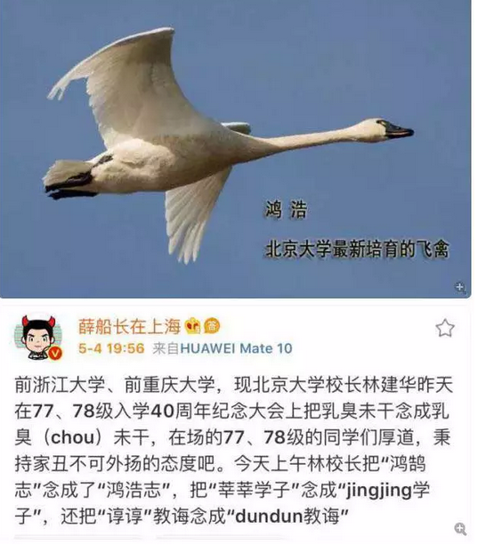
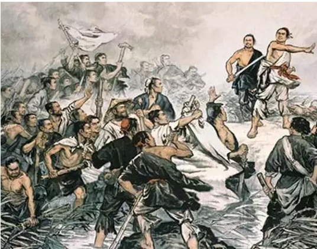
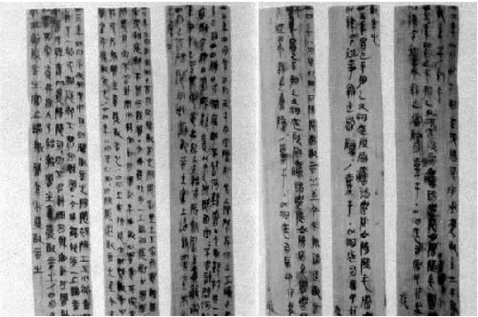
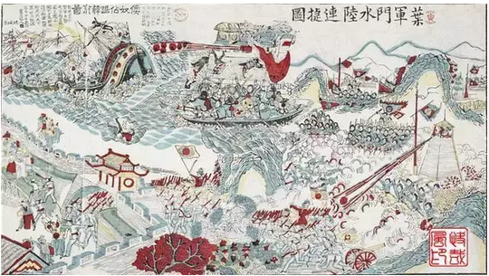

# 

一）       陈涉

 

看到这张图片，哥哥心都凉了。

我摸摸左脑勺，再摸摸右脑勺，因为俺突然发现，"鸿鹄"这二个字，我也不会念。

你如果给我这样一份发言稿，俺也非出丑不可。  

陈涉少时，尝与人佣耕，辍耕之垄上，怅恨久之，曰："苟富贵，勿相忘。"佣者笑而应曰："若为佣耕，何富贵也？"陈涉叹息曰："嗟乎，燕雀安知鸿鹄之志哉！"

 

"鸿鹄之志"这个典故，出自于陈胜吴广。据说是初中三年级的语文课本。

如果你不会念这个"鹄"，当年语文课想必没有认真。成绩不灵，学渣来的。

 

哥哥古文文学的确学得不好，"家族的败类"，家学治辞治韵诗词歌赋，在我手里没剩下二成。浓浓的铜臭味，只略懂房地产。

每次家族聚会，都被堂兄弟看不起。快开除班籍了。

 

 

但是我知道，"陈胜吴广"他们的阶级，并不是农民。

陈涉最有可能的阶级划份，应该是楚国的退伍军人。

 

你要知道，陈胜是有"字"的。陈胜，字涉。

"礼不下庶人"，春秋时期，野人连国也没有。国人连姓也没有。

 

中国人最初的时候，"姓"和"氏"是分开的。

"姓"指的是君王血缘部落。好比"姬"姓，就全部都是周文王的子孙。

 

部落大了以后，再分裂成各个封国。著名的"赢姓十四氏"，瞿、廉、徐、江、秦、赵、黄、梁、马、葛、谷、缪、钟、费。

今天这十四个"钟先生，费先生"，其实都是秦襄公的子孙。皇族后裔。

 

 

而陈胜是有"字"的。陈胜不仅有姓，有名，还有字。

那他就绝对不会是"泥腿子上岸"的底层农民。

"天子诸侯公卿士"，至少应该是"士"的一员。贵族阶层。

 

 

看陈胜的"朋友圈"，结论也同样明显。

陈胜显贵之后，旧友们纷纷投靠。但是陈胜并不能善待他们，导致离心离德。

这里面的"旧友"，虽然都是楚人，但明显不是阳城老乡。不是大泽乡团体的。

 

如果陈涉是一个足不出户的泥腿子，他又哪认识这些三教九流的朋友。

最大的可能，陈胜是退伍老兵，这些人都是旧楚战友。

 

再进一步，陈胜大泽乡起事之后，显露了惊人的军事化，组织能力。

 

筑坛盟誓，按事先谋划，诈以公子扶苏、楚将项燕之名，宣布起义。 \[17\] 
陈胜自立为将军，以吴广为都尉，一举攻下大泽乡，接着又迅速攻下蕲县县城。

 

继攻取蕲县后，不到一个月又连克铚县（今安徽省濉溪县）、酂县（今永城西）、苦县（今鹿邑县）、柘县（今柘城县）、谯县（治所在今安徽省亳州市谯城区）等五县

即决定进攻战略要地陈县（楚国旧都）

 

你说，如果你是一个耕种老实的农民，你说得出"项燕，扶苏"的名字么。如此政治智慧，哪怕官场中阶都不懂。

 

陈胜用兵，如疾风烈火。起事不到一个月，已经五次出征。随即围攻郡治大城。这样的手笔，是一个农民做得出的么。

 

 

相比之下，"战五渣"洪秀全，在打下郴州大城之后，在城内逗留七十八天。

清军逐渐缓过神来，四处云集。由完全懵懂，形成包围之势。

洪秀全在干什么，花天酒地玩啊。

 

"正宗"的农民起义军，为什么不成气候。

因为农民目光短浅，行事没有计划。因压迫而反抗，一旦打下一个县城，很容易耽于娱乐，毫无战略眼光。

然后静等大军云集，束手就擒。

 

 

陈涉真正的"阶级成分"是什么呢。史学界基本已有公论："退伍老兵"。

楚国的精锐退伍军人。

从大泽乡800人规模来看，级别还很高。

 

按照古代军制，一个"军团"大约是3000人。

历史上赫赫有名的，例如张辽，张郃，夏侯惇，甘宁，赵云，他们头衔是"领军将军"。终其一生，也不过带兵3000人而已。

 

陈胜相当于"赵云"下一级的校尉部下，统领1/3个军团的兵力。

如果放到《三国志》里面，绝对是有名有姓，能拿到一次出场名字机会的。

周仓马岱向朗侯成。

 

 

写这么多，意味着什么呢。

中国教科书，把Broad Wu，Victor Chan称为"伟大的农民起义领袖"。

这是彻头彻尾的谎言和欺骗。

 

农民在任何时候，真实都是上不得台面的。"秦失其鹿，天下共逐之"，老百姓就是那头鹿。

教科书告诉了你"陈胜吴广"反抗，一群SB动辄说穷人要早饭了。

你也配，你什么东西，你哪有资格。

 

 

哪怕"陈胜吴广"，真实的阶级身份，也是"退伍老兵"。属于"士"的阶层。

800戎卒，大多是同乡旧部。这样一个团结群体，才能焕发出巨大的力量。

退伍职业军人，和农民能比么。

 

屌丝洗洗睡吧，论Broad，你真不配。

 

 

 

二）       大泽乡

 

我不仅知道"陈涉吴广"的故事，我还知道，整个"大泽乡"全部都是编的。

秦律虽然繁琐，但并不苛刻。

 

www.zhihu.com/question/20965049/answer/126982223

 

"御中發徵，乏弗行，貲二甲。失期三日到五日，誶；六日到旬，貲一盾；過旬，貲一甲。水雨，除興。"

 

【注解】国家征发徭役，如耽搁不加征发，应罚二甲。迟到三天到五天，斥责；六天到十天，罚一盾；超过十天，罚一甲。降雨不能动工，可免除本次征发。

 

从后世出台的"秦简"来看，对于"下雨延迟"有着明确的说法。惩罚上限，赔罚"一部铠甲"。

天要下雨，属于不可抗力。秦律袭自商鞅，怎么会犯低级错误。

 

而大泽乡"集体斩首"呢。这很有可能是一场阴谋。

其实并没有危险，造谣，煽动和捆绑群众，把人民大众拉到野心家的战车上。

吴广，是最大的嫌疑人。

 

 

你看，我知道了这么多的事。然后哥哥再拿出这张图看一下。

一边看，一边哭。

各位，我是真不知道"鸿鹄之志"的"鹄"字念hu啊。 

每一个人的知识结构，都是不同的。

譬如背诵《南京条约》，教科书的要求，是从头到尾，一个字不差背诵下来。

 

-   是中国历史上第一个不平等条约。

-   是西方列强入侵中国，中国逐渐沦为半封建半殖民地的开始。

 

 

可是在哥哥的记忆方式中，并不是这样的。

南京条约的真正起因，是林则徐抢劫英国人的财产。而且是冲到商馆里面，把正当商人的寄存货物全部没收。

 

沿边海战，显示了集权君主和文官系统的斗争。

"鸦片战争I"前后烧掉了2400W两白银。相当于清政府二年的财政收入。而地方长官报上来的，始终是"边境匪患""官军大胜""官军又又又大大大胜"。

 

《[[看完这些宣传画，你才知道甲午战争其实是中国狂胜]](https://mp.weixin.qq.com/s?__biz=MjM5NzgwOTIxMA==&mid=2650843814&idx=1&sn=76c7f8ae9e9db1bd4bc2cf5f980ac2d9&chksm=bd2057f38a57dee521bab4dd1b4be5ca5504e574b1158495b25e6a1c463e7346473560114097&mpshare=1&scene=21&srcid=0407VHMnSwjky7W1UXTK4bEA&pass_ticket=RjlL3#wechat_redirect)》 

如果研究一下当时各地官员的"亏空"做账水准。一定是非常有趣的。这么大一个窟窿，居然也能盖住。

 

 

而最后清政府怎么会突然改主意"谈判"呢。因为英军攻克了镇江。

镇江是南北枢纽。最致命是"漕运"的关键节点。

镇江一经攻克，漕运就断了。于是清政府就慌了，于是就立即和谈了。

 

而镇江是怎么被攻克的呢，当时英国"坚船大炮"全部都是海船。吃水很深。

清国官员有恃无恐，你反正进不了长江航道。沿海的小城镇都不重要，哪怕你全部轰完了都不要紧。

 

但是英国逐渐进入了蒸汽时代。可以造平底船，而使用蒸汽动力。

英国找了一些平底船，装上蒸汽动力，"拖着"Frigate进入长江，小心翼翼，一步步挪进了内河200KM。

 

这才是真正的历史，才是真正有趣和精彩之处。

 

然后你和我说，《南京条约》是1842年8月29日，道光二十二年。

8.28和8.29，早一天晚一天，有区别么。

 

如果某个学生，熟读了《南京条约》，然后他隆重地指出，年份写错了。写错一个错别字。

你觉得这事有意义么。

 

亲，我是真不懂"鸿鹄之志"应该念hu，还是hao啊。

 

 

 

三）       鸿鹄之志

 

第三步，我还要告诉你的，哪怕"鹄"hu字的读音，也是错误的。

至少在BC208，陈涉嘴里念出的，肯定不是"hu"音。

 

楚辞有九声，而现代普通话语，只有"平上去入"四声。

古代发音的研究，一直是一个难点。语音无法录音，谁也不知道二千年前的古人，是怎样发声的。

 

一个研究的方法，是"诗歌"。

古词是极度优美的，象唱歌一样。每一首楚辞，都是吟唱。

但是《离骚》用现代普通话来念，却并不是太好听。怎样变调押韵，就是一个学问。

 

另一个研习方向，则是到深山老林中。

在人迹罕至的地方，有一些方言留存。他们数千年来，变化十分缓慢。还保留着周礼春秋的遗韵。

 

如果按照严格的BC208口音，则鸿鹄的发音，大致应该是："咕噜咕噜，咕力咕力，咕噜咕噜咕力咕力............"

 

《[[万万想不到：古代中国人发音竟然是这样的！听完差点崩溃！]](https://mp.weixin.qq.com/s?__biz=MjM5OTcyMTQyMg==&mid=2649580049&idx=3&sn=5594f5fe6f94080419b1723c0c9775d4&chksm=bf2ee2b088596ba6c8ef260c151b51cc744186e513b65b2751dda503d066c9cfcfadaa133f94&mpshare=1&scene=21&srcid=0505vUecnrfTbTNyzGT8iQaL&pass_ticket=RjlL3#wechat_redirect)》

 

那么，引发北大学子耻笑的，"鹄"字的读音，是怎么来的呢。

是1950年《现代语文读音》由普通话委员会推广的。

是不知道哪一个知识份子，一拍脑袋想出来的。

 

 

也就是说，"北大学子"其实并没有接触真理。

他们仅仅是在填鸭教育下，由一个人按照平空捏造的课本，来给他们灌输的知识。

 

然后他们自以为是，哈哈大笑，固步自封。

把所有和他们"预设"知识不一致的，全都否定蔑视。

自己却没有任何探索真理的能力，哪怕走跨出去一步都无能。

 

我要是北大校长，我也故意不念hu

面对这样一群"精致的废虫"，我倒要送你们一句。

 

燕雀安知鸿鹄之志

 

 

 

（yevon\_ou\@163.com，2018年5月5日晨）
