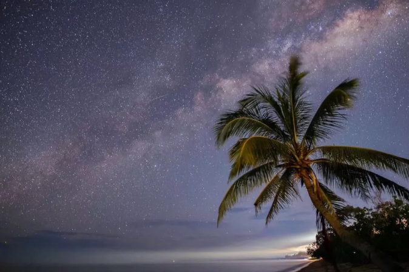
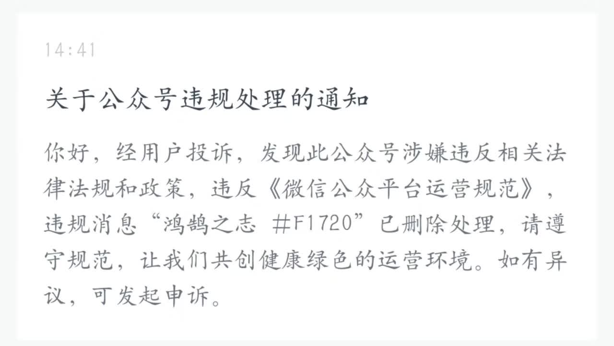
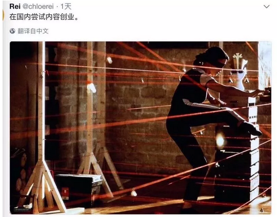
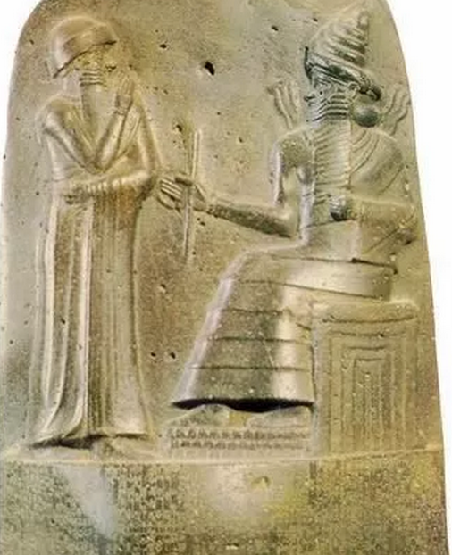
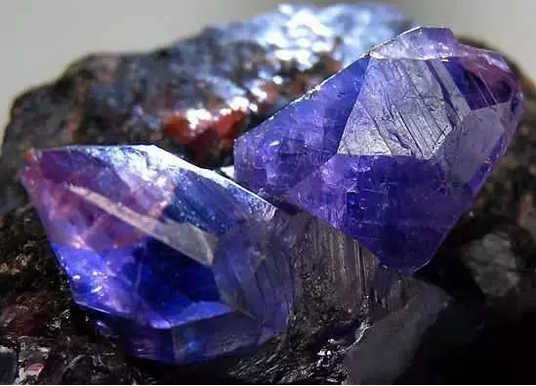
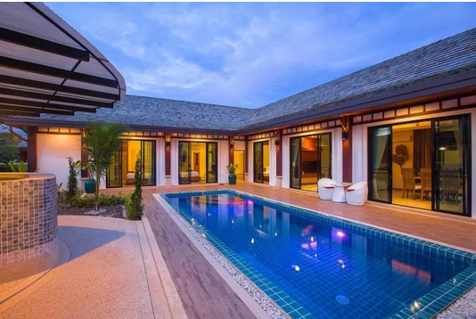
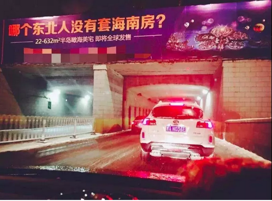

# 刑名不具 \#F1730
----------------

yevon\_ou [[水库论坛]](/) 2018-05-07

刑名不具 ~\#F1730~
===============================================================================================================

 

法制

 

 

一）       吐槽

 

首先是吐槽。周一这篇，本来准备好写题目《海南楼市的大胜利》。

文章都准备好了，然后哥哥就看见了这消息。
心泼凉泼凉的，这日子没法活了。

 

前二天，有人嘲笑哥哥说，"最新五篇删了三篇"。

事实也的确如此，赔广告费，都快赔得我当裤子了。

 

水库向来爱国爱D，反对资产阶级自由化。劳动勤奋，诚实可信。

大家出来，写写文稿赚点吃鸡钱。何苦如此呢。相煎太急啊。

 

 

这二天，一篇《[[腾讯没有梦想]](https://mp.weixin.qq.com/s?__biz=MjM5MDczODM3Mw==&mid=2653028142&idx=1&sn=0dd174c676138016803af3d9ac77e919&chksm=bd956d848ae2e4928315a6b80e903a1bc267c18612d63063d3d2c2a26604a1552d03b0239e78&mpshare=1&scene=21&srcid=0506USMhxyi7fUz0QGgEyt7d&pass_ticket=dZ%20#wechat_redirect)》文章刷爆朋友圈。

其实真正身在第一线的人都知道：微信大船已沉。

 

Wechat这款超级航空母舰，永不沉没的流量大岛，其衰退的序幕，是从2017.06就开始了。

而它的标志性事件，是六月份的"大规模删帖封号"事件。毒舌电影，金融八卦女等等。 

在此之前，"微信"的尺度是非常非常松的。这也是它可以"崛起"的核心竞争力。

 

 

五年之前，业界最强的是"微博"。当时的口号是，"微博没什么好，就是有二亿用户"。

微博是怎么"衰退"的。来源于"强监管"。 

薛蛮子，任志强。

此后微博一蹶不振，风声鹤吠，很快被微信超越。

 

因为大家觉得微博不好玩了。虽然微博仍在持续地产出海量内容，可是"说不到"心里话了。

微博变得越来越干净，也越来越象45岁的教导主任（女）。食之乏味。

 

 

微信的崛起，兴衰，几乎和"微博"是一模一样的故事。

2017.06之后，人们逐渐觉得微信"不好玩"了。

 

第一个败退的产品，是朋友圈。

朋友圈从最初的精灵古怪吐槽，各种心事和树洞。

随着你妈妈，你婆婆，你公司上级领导，纷纷进入朋友圈。朋友圈变得越来越"纯净水"，只剩下美食和晒娃了。

 

象我们奋战在"公众号"第一线的，你猜一个朋友圈的"打开数"是多少。

一篇爆款文，如果有1000个人转朋友圈，那基本上是刷屏了。每个角落都看得见。

而朋友圈的"打开数"平均是：18人。

 

一般的普通人，通讯录总在2000人数量级。也就是说，只有1%的人，才会阅读你的朋友圈文章。

一篇刷屏1000转的文章，最后可能就加了2W阅读。

 

 

微信的第二步，就是我越来越写不出好的文章了。

大家都知道，水库文章不如以前"犀利"了，匕首锐刀。

政治和历史，很久很久都没有写了。

反穆和邪教，也胆颤未触及了。

 

哪怕写国内某些题材，都要绞尽脑汁"合规"。

我还真不明白，吐槽金融管制《[[金融政策为什么失效]](http://mp.weixin.qq.com/s?__biz=MzAxNTMxMTc0MA==&mid=2651017397&idx=1&sn=91e2059e359a9c31382d53926c225d7c&chksm=807206a6b7058fb047fa38d79df3b5cba9b185e40e019fb799a637437b2004b02a1820b3188f&scene=21#wechat_redirect)》\#1750哪里不合规了。这也碰不得，那也碰不得。全部都是伪光正。

 

现在的水库文章，选题越来越困难。虽然我每一个题材，都可以写出绝世文章。

但我真心不知道，"闽赣词"的网在哪里。

 

\* 哪位主管腾讯MCN的，请联系我。求收养

 

二）       刑名不具

 

水库资料库\#X02里，我留了一段点评："上古时期，法律是不公开的。为了明令典刑，引发了巨大的争议"。

 

那一篇文稿，我选了一张封面。封面是"汉谟拉比法典"。人类最早的，明文记载的法律。被誉为"法制"的开始。

 

 

和一般教科书的教育不一样，在春秋时期，"法律"是不公开的。

这并不是说，当时的春秋姬姓各国，没有法律。

 

具体的说法是，有法律，但是法律的"条文"是保密的。

奇怪哉也，法律"保密"。那老百姓怎样才能守法呢。

 

老百姓永远也不知道，哪条违法了，哪条没有违法。

老百姓只隐隐约约知道，杀人是不对的，盗窃是不对的。剩下的，你猜？

 

 

于是这样的春秋百姓，就非常非常容易"祸从天降"。

哪一天贵族老爷冲到你家里来，把你所有的田产没收。你想抗议，贵族老爷掏出一个卷轴"昨天是3月3日，而你没有放屁，因此你违法了"。

百口莫辩，申冤无门啊。

 

 

而对于这样"老子就是法"的现象，贵族老爷也是有一套自己说法的。

最重要一点，只要法律写出来了，就一定会有漏洞。

 

春秋的诸侯，讲究"德性"。而且他们都自认为"德性"都是非常高的人。

身为国君，上等人，我是一定仁爱为民的。

 

[国君们最恐惧的是：]

-   假如我颁布了法律；

-   你哪天把佃农李四打死了，抢他的田宅妻子。而呈上来一个小黄毛顶罪。一切手续齐全。

-   老爷我心里气啊。你说我还要不要主持正义了，还要不要捍卫国家了。

 

 

所以你看，在法学上，这是一个"程序正义"和"实质正义"的争执。

一直到BC536，鲁昭公六年之前，整个"春秋诸国"，全部都实行的"实质正义"。

 

当时的春秋各国，默认国君是捍卫正义的，是一心为善的。

当判决官司时，以国君内心的"实质正义"为准。

 

地主打死李四，就应该让地主抵命。让小黄毛顶罪没用。

只要我法律"文字"写出来，就一定有漏洞。就一定有土豪劣绅可以钻法律漏洞。因此，刑名不具。 汉谟拉比法典颁布于BC1792年，他的伟大意义何在呢。

意味着人类进入了"程序正义"时代。

 

在Code of Law文明发明之前，人类不是没有"法律"。而是奉行"实质正义"法律。

汉谟拉比法典一经问世，鲁昭公六年法律一问世，那是石破天惊！

人类开始有"程序正义"了。

 

 

法制，法制，法制的核心在于，"法无明禁即为可"。

法制是一件"负面清单"的事。

没做坏事，就是一等良民。

 

"实质正义"听起来好听，其实极度黑暗，是一个大粪缸。

"国王爱民"听起来好听，但天下哪一个国王，不是先维护王室的利益，其次维护贵族的利益，再次维护手下官员的利益。

哪一个国王，不曾犯过偏听昏庸？

 

就因为"国王说了算"实在太黑暗了。老百姓不胜其苦。所以才进化出了"程序正义"。

大家约定一套游戏规则，你只能在规则的范围内做。社会契约论。

 

这套思想，进一步深化，到了近代，则有一个更响亮的名字"宪制"。

晚清到了末年，搞君主立宪。

宪法是根本大法，从流程角度，宪法\>皇帝。

 

 

为什么要这么做。

-   成文法是约束统治者的。而不是约束屁民。

-   "公开条文"是约束统治者的，而不是约束屁民。

 

刻在石头上的法律，是约束统治者的。

确立了一个明确的边际，没触及就不违法。

国王不再拥有无限的"解释权"和"毁约权"。

 

虽然"刻在石头上的法律"有这样那样的缺点。美国不念完"你有权保持沉默......"甚至无法定罪。

历年来，逃走了无数钻洞大老鼠。

 

但"程序正义"相比于"实质正义"，依然是一个巨大的飞跃。

也是目前全世界"法制"的主流。

 

\* 精神分裂的是，本人反对宪制。

 

 

 

三）       瑞典人

 

近期，"瑞典第四省"搞出了一个回马枪。

一夜之间宣布，"投资环境"发生巨大改变，五年社保，七成首付，五年限售。

 

有部分"上古人士"得意洋洋，宣布是伟大胜利，关门打狗。据称圈进来三千亿资金。

更进一步，这么好的政策，要不要推广到广东省呢。要不要全国铺开呢。

 

 

我和大家讲个故事啊，在遥远的一万公里之外，有一个国家，名叫"坦桑尼亚"。

坦桑尼亚的国君，还生活在"春秋时代"。因为他非常欣赏于自己的"实质正义"。并且为自己的狡诈多智洋洋得意。

 

坦桑尼亚是一个资源富饶的国家，盛产"蓝宝石"。此外还有咖啡，剑麻，镍矿，金矿，铁矿。

最初的时候，坦国国君宣布"国有化"。强迫性的把欧洲白人留下的公司，全部都没收国有。

然后坦桑尼亚再宣布"招商"，放开矿产，欢迎外资开发。

 

等到外资又来了，钱投进去了，坦国国君再宣布"国有化"。非洲是非洲人的非洲，外国矿山统统没收。

 

等没收完了，坦国又宣布"招商"，

再没收，再招商............

 

 

 

几轮之后，坦国富裕了没有，坦桑尼亚有没有成为非洲的明珠。

没有。坦桑尼亚迄今仍是非洲最贫困的国家之一。虽然他有大量的金矿，镍矿，铁矿，可是完全没有人开发。委内瑞拉甚至穷到停电。

 

当坦国国君还想玩"我说了算"时，外商们不答应了。

外商们纷纷要求"刑名刻具"。你把法律刻在石头上，象山岳一样古老。

法律是约束统治者的，不是约束屁民的。

如果你做不到，我们就不来。

 

 

"瑞典人第四省"迄今仍是中国最落后，收入最低，最没有工业化的地区之一。

他们真不知道，他们的"狡诈狡猾"这件事有多蠢。

商业文明倒退二十年。

 

商业需要的，是"刻在石头上的法律"。

对商业的服务，要象山岳般永固。这个国家和地区才能发达兴旺起来，要让别人赚钱，要保护别人赚钱。

 

 

海南的洋流纬度，终究还是差了这么几度。这导致海南的"海水"不够暖和。

在冬天，海口的水温是不可以下水游泳的。

三亚作为唯一的亚热带城市，一月气温21度。终究还是差了口气，再暖三度多好。

 

在和亚热带同纬度城市的竞争中，海南并不具备优势。

真正的有钱人，现在都流行去菲律宾，Phuket，胡志明市。

 

在菲律宾，服务远远好于老大国企的三亚。不仅酒店便宜，吃大虾也不用被宰。

买一个巨型鲍鱼20元，菲律宾伏波妹把你当财神侍候。

不限购，不限贷，更没有国内种种狗屁管制。

 

《[[水库线下·赠送普吉岛酒店游]](https://mp.weixin.qq.com/s?__biz=MzI2MzAyMjAxMQ==&mid=2462106430&idx=1&sn=5676f8df17e3fb2becf3a5c9baa98400&chksm=fd7657eaca01defc7031f6c1f427c2f9684a5d1b625a17e4a4f044657d6532d963127a014024&mpshare=1&scene=21&srcid=05066mM2fQJDTxseDJHuckia&pass_ticket=dZ%20#wechat_redirect)》\#G10（已结束） 

综观海南的过去三十年，其历史记录可称"坦桑尼亚"。关门打狗也不止一次二次三次五次了。

这样的口碑，这样的经营环境，也就海南人自己YY可以宰到"职业炒房团"了。

 

 

而实际情况呢，真正的圈子，记性都是非常好的。

"投资环境不好"的地级市，不会有人投钱，您赤贫去吧。最多圈一点"东北第四省"苦哈哈的老人家。 

你的一切落后贫穷。

都是因为你的小心眼自找的，私心太重。

 

 

 

（yevon\_ou\@163.com，2018年5月6日晚）
